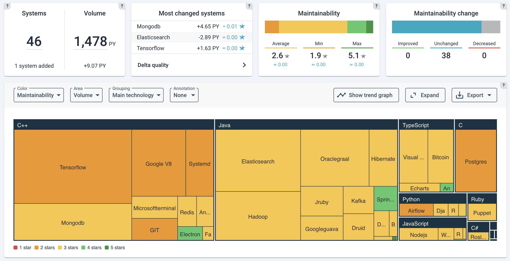

## Sigrid | Software Assurance Platform

[Sigrid](https://www.softwareimprovementgroup.com/solutions/sigrid-software-assurance-platform/) helps you to improve your software by measuring your system's code quality, and then compares the results against a benchmark of 10,000 industry systems to give you concrete advice on areas where you can improve.

Sigrid performs code quality checks that have been designed by the [Software Improvement Group](https://www.softwareimprovementgroup.com/), which have been used by thousands of development teams over the past 20 years to help improve their software. SIG's approach is based on the ISO 25010 standard for software quality, and has been accredited to ensure alignment with the standard.

Integrating Sigrid's feedback into your development pipeline enables you to fix quality issues right away during your code reviews, instead of having to spot and fix them after the fact. You can access Sigrid's feedback through [sigrid-says.com](https://sigrid-says.com), or directly within your Continuous Integration environment.

Compared to other tools that perform code quality checks, i.e. linters, using Sigrid has a number of advantages:

- **Quality guard:** Sigrid ensures both the quality of your code and the quality of the system as a whole.
- **Pragmatic:** Other tools block changes if even a single issue is found. This is not cost-effective. Sigrid CI allows some minor issues as long as the overall quality is acceptable. Code quality should be good, but it doesn't have to be perfect.
- **Benchmarked:** We rate quality against thousands of other systems, not against theoretical perfection or a subjective target.

## Integrating Sigrid CI into your development pipeline

- [Integrating Sigrid CI with GitHub Actions](docs/sigridci-integration/github-actions.md)
- [Integrating Sigrid CI with GitLab](docs/sigridci-integration/gitlab.md)
- [Integrating Sigrid CI with Bitbucket Pipelines](docs/sigridci-integration/bitbucket-pipelines.md)
- [Integrating Sigrid CI with Jenkins](docs/sigridci-integration/jenkins.md)
- [Integrating Sigrid CI with Azure DevOps](docs/sigridci-integration/azure-devops.md)
- [Integrating Sigrid CI with TeamCity](docs/sigridci-integration/teamcity.md)
- [Integrating Sigrid CI with Mendix QSM on a Mendix Team Server](docs/sigridci-integration/mendix-teamserver-api.md)
- [Integrating Sigrid CI with Mendix QSM on a GitHub server](docs/sigridci-integration/mendix-github-actions.md)
- [Integrating Sigrid CI with Mendix QSM on a GitLab server](docs/sigridci-integration/mendix-gitlab.md)
- [Integrating Sigrid CI with Siemens Polarion](docs/sigridci-integration/polarion.md)
- [Integrating Sigrid CI with other/custom CI environments](docs/sigridci-integration/integration.md)

## Usage documentation

- [Creating authentication tokens for Sigrid CI](docs/authentication-tokens.md)
- [Client script option reference](docs/reference/client-script-usage.md)
- [Mapping repositories to Sigrid systems](docs/systems.md)
- [Changing the analysis scope configuration](docs/reference/analysis-scope-configuration.md)
- [Adding business context to a system using metadata](docs/metadata.md)
- [Using Sigrid CI as part of your development workflow](docs/workflows.md)
- [Frequently asked questions](docs/faq.md)
- [Supported technologies](docs/reference/technology-support.md)
- [Sigrid CI demo recording](https://www.youtube.com/watch?v=1QWWtFlB6cQ) 

## Sigrid API

Most of this documentation refers to our recommended way to integrate Sigrid into your development process: add Sigrid to your pipeline, for both pull requests and publishing code. However, in some cases you might need a more flexible type of integration. The [Sigrid API documentation](docs/reference/sigrid-api-documentation.md) contains an overview of the available data that you can obtain from Sigrid's API and integrate into your workflow.

## Contact and support

Feel free to contact [SIG's support department](mailto:support@softwareimprovementgroup.com) for any questions or issues you may have after reading this document, or when using Sigrid or Sigrid CI. Users in Europe can also contact us by phone at +31 20 314 0953.

## License

Copyright Software Improvement Group

    Licensed under the Apache License, Version 2.0 (the "License");
    you may not use this file except in compliance with the License.
    You may obtain a copy of the License at

        http://www.apache.org/licenses/LICENSE-2.0

    Unless required by applicable law or agreed to in writing, software
    distributed under the License is distributed on an "AS IS" BASIS,
    WITHOUT WARRANTIES OR CONDITIONS OF ANY KIND, either express or implied.
    See the License for the specific language governing permissions and
    limitations under the License.
    
