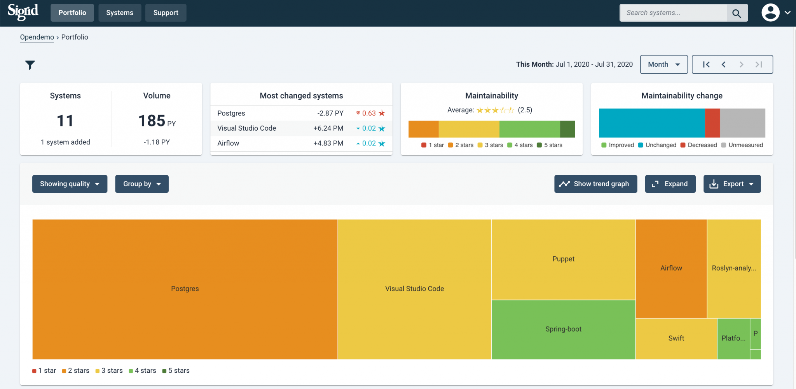

Sigrid CI
=========

## Table of contents

- [Sigrid](#sigrid-your-software-quality-made-measurable)
- [Integrating Sigrid CI into your development pipeline](#integrating-sigrid-ci-into-your-development-pipeline)
- [Frequently asked questions](#frequently-asked-questions)
- [Contact and support](#contact-and-support)

## Sigrid: your software quality made measurable

[Sigrid](https://www.softwareimprovementgroup.com/solutions/sigrid-software-assurance-platform/) helps you to improve your software by measuring your system's code quality, and then compares the results against a benchmark of 5,000 industry systems to give you concrete advice on areas where you can improve.

Sigrid performs code quality checks that have been designed by the [Software Improvement Group](https://www.softwareimprovementgroup.com/), which have been used by thousands of development teams over the past 20 years to help improve their software. SIG's approach is based on the ISO 25010 standard for software quality, and has been accredited to ensure alignment with the standard.

Sigrid CI allows you to integrate Sigrid's feedback into your development pipeline. This enables you to fix quality issues right away as part of your code reviews, instead of having to spot and fix them after the fact.

Compared to other tools that perform code quality checks, i.e. linters, using Sigrid has a number of advantages:

- **Quality guard:** Sigrid ensures both the quality of your code and the quality of the system as a whole.
- **Pragmatic:** Other tools block changes if even a single issue is found. This is not cost-effective. Sigrid CI allows to set a target quality level based on a benchmark, so it allows *some* minor issues as long as the overall quality is acceptable. Code quality should be good, but it doesn't have to be perfect.
- **Benchmarked:** We rate quality against thousands of other systems, not against theoretical perfection or a subjective target.

You can find more information about Sigrid on its [product page](https://www.softwareimprovementgroup.com/solutions/sigrid-software-assurance-platform/). If you're not currently a Sigrid user but still have questions, feel free to ask via our [contact page](https://www.softwareimprovementgroup.com/contact/).

## Integrating Sigrid CI into your development pipeline

This document describes how to integrate Sigrid into your continuous integration pipeline, so that you can use it as input for your code reviews during merge requests. 

Using Sigrid CI requires a Sigrid account. If you do not have an account yet, [contact SIG](https://www.softwareimprovementgroup.com/contact/) to obtain it. Note that your credentials for personally signing in to Sigrid are different from the account you'll to submit code from your CI environment.

There are two ways to integrate Sigrid CI into your pipeline. The first is a set of generic instructions that should work for every modern Continuous Integration environment:

- [Integrating Sigrid CI into your continuous integration pipeline](integration.md)

In addition to the generic instructions, we have also prepared specific instructions for integrating Sigrid CI with popular development platforms:

- [Integrating Sigrid CI with GitHub Actions](github-actions.md)
- [Integrating Sigrid CI with GitLab](gitlab.md)
- [Integrating Sigrid CI with Bitbucket Pipelines](bitbucket-pipelines.md)
- [Integrating Sigrid CI with Jenkins](jenkins.md)
- [Integrating Sigrid CI with Azure DevOps](azure-devops.md)

## More information

- [Frequently asked questions](faq.md)

## Contact and support

Feel free to contact [SIG's support department](mailto:support@softwareimprovementgroup.com) for any questions or issues you may have after reading this document, or when using Sigrid or Sigrid CI. Users in Europe can also contact us by phone at +31 20 314 0953.

## License

Copyright Software Improvement Group

    Licensed under the Apache License, Version 2.0 (the "License");
    you may not use this file except in compliance with the License.
    You may obtain a copy of the License at

        http://www.apache.org/licenses/LICENSE-2.0

    Unless required by applicable law or agreed to in writing, software
    distributed under the License is distributed on an "AS IS" BASIS,
    WITHOUT WARRANTIES OR CONDITIONS OF ANY KIND, either express or implied.
    See the License for the specific language governing permissions and
    limitations under the License.
    
