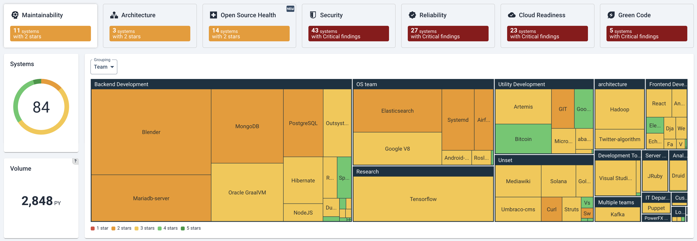
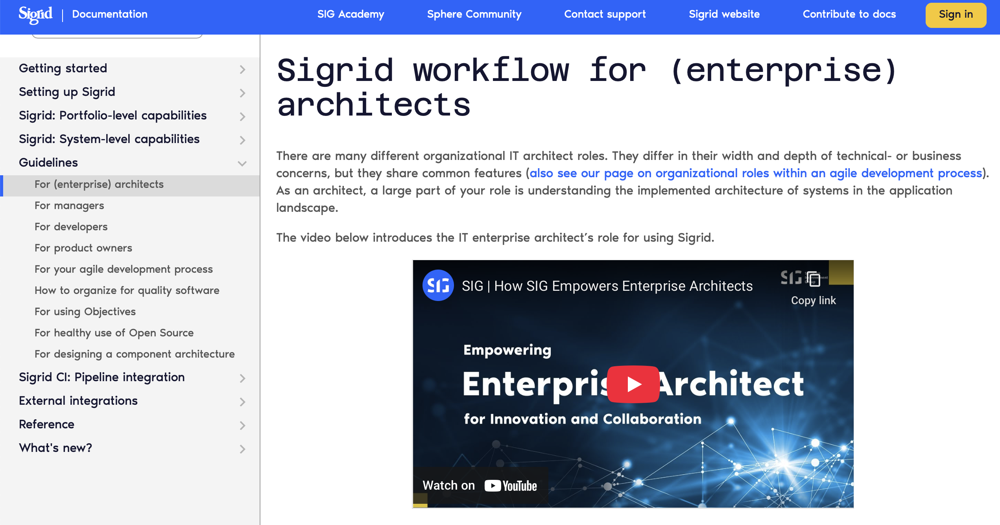
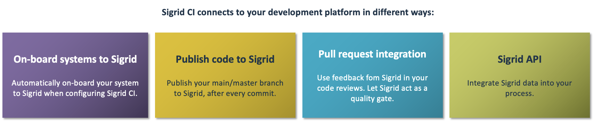

# Sigrid | Software Assurance Platform

[Sigrid](https://www.softwareimprovementgroup.com/solutions/sigrid-software-assurance-platform/) helps you to improve your software by measuring your system's code quality, and then compares the results against a benchmark of 15,000 industry systems to give you concrete advice on areas where you can improve.

Sigrid performs code quality checks that have been designed by the [Software Improvement Group](https://www.softwareimprovementgroup.com/), which have been used by thousands of development teams over the past 20 years to help improve their software. SIG's approach is based on the [ISO 25010 standard for software quality](https://www.iso.org/standard/35733.html), and has been accredited to ensure alignment with the standard.

## Sigrid documentation

This repository hosts the Sigrid documentation, which you can access via [docs.sigrid-says.com](https://docs.sigrid-says.com). 

We encourage collaboration, so you are welcome to use GitHib features like issues or pull requests if you want to request additions or changes to the documentation.

## Sigrid CI: Development process integration

Sigrid integrates directly into your development workflow. This integration consists of several aspects:

Sigrid integrates with many development platforms, including [GitHub](https://docs.sigrid-says.com/sigridci-integration/github-actions.html), [Azure DevOps](https://docs.sigrid-says.com/sigridci-integration/azure-devops.html), [GitLab](https://docs.sigrid-says.com/sigridci-integration/gitlab.html), [Bitbucket](https://docs.sigrid-says.com/sigridci-integration/bitbucket-pipelines.html), and [Jenkins](https://docs.sigrid-says.com/sigridci-integration/jenkins.html).

You can find more information on how to set up this development process integration in the [Sigrid documentation](https://docs.sigrid-says.com/sigridci-integration/development-workflows.html).

## Sigrid REST API

In addition to the [Sigrid user interface at sigrid-says.com](https://sigrid-says.com), you can also consume Sigrid's data via the Sigrid REST API. 
You can find more information on how to use this API in the [Sigrid documentation](https://docs.sigrid-says.com/reference/sigrid-api-documentation.html). 

## Contact and support

Feel free to contact [SIG's support team](mailto:support@softwareimprovementgroup.com) for any questions or issues you may have after reading this document, or when using Sigrid or Sigrid CI. Users in Europe can also contact us by phone at +31 20 314 0953.

## License

Copyright Software Improvement Group

    Licensed under the Apache License, Version 2.0 (the "License");
    you may not use this file except in compliance with the License.
    You may obtain a copy of the License at

        http://www.apache.org/licenses/LICENSE-2.0

    Unless required by applicable law or agreed to in writing, software
    distributed under the License is distributed on an "AS IS" BASIS,
    WITHOUT WARRANTIES OR CONDITIONS OF ANY KIND, either express or implied.
    See the License for the specific language governing permissions and
    limitations under the License.
    
    
