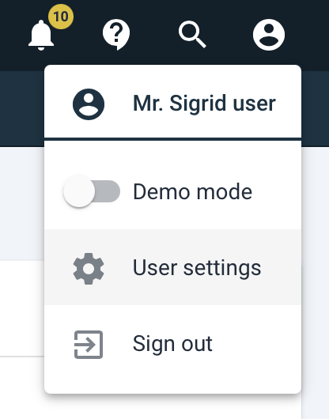
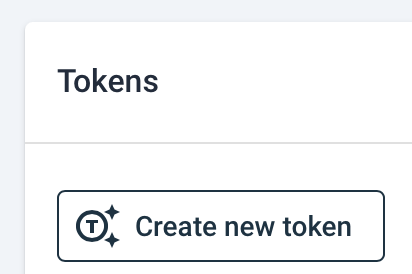
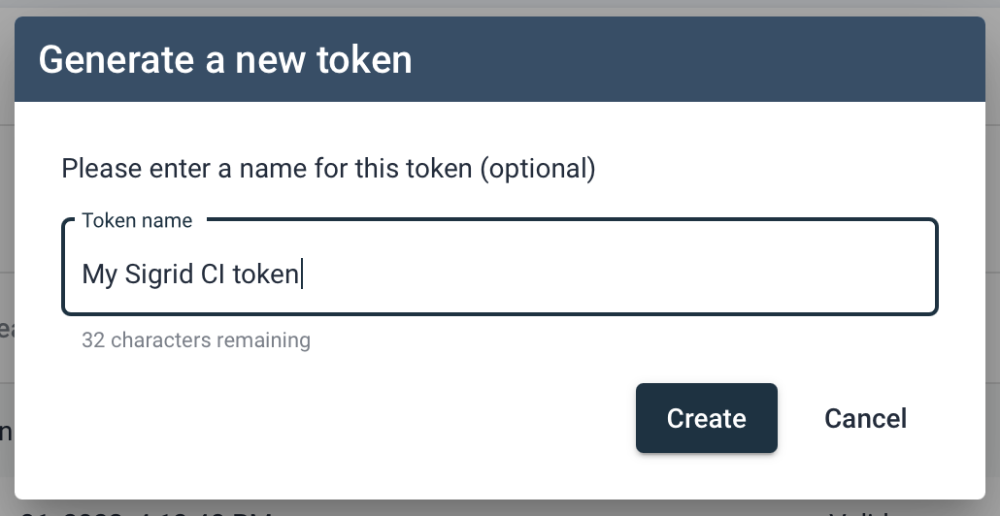
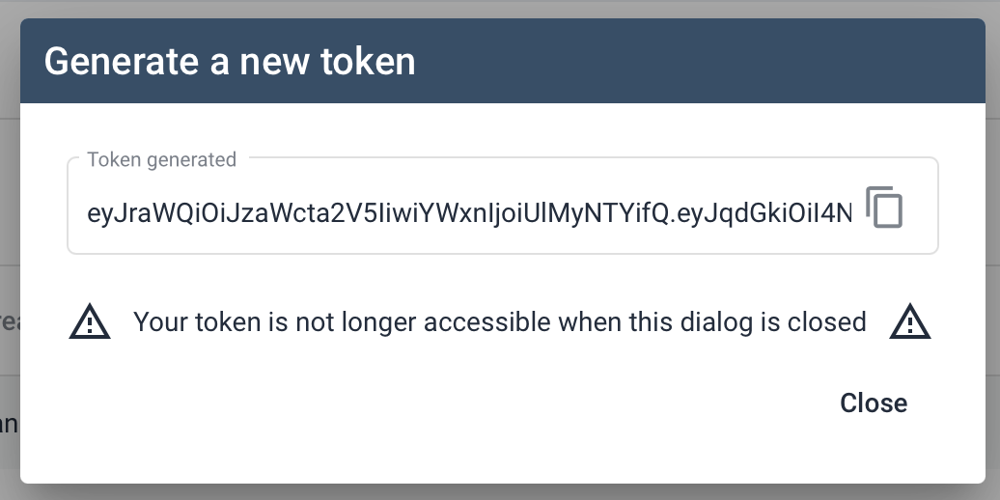
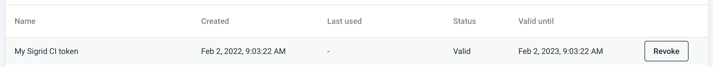

# Sigrid CI authentication tokens

Using Sigrid CI requires an *authentication token*. You can create and manage these tokens from your Sigrid account, using the instructions provided below.

## Creating a new authentication token

First, sign into [sigrid-says.com](https://sigrid-says.com) using your regular Sigrid user account. If you do not have a Sigrid user account, contact your organization's Sigrid administrator, or contact SIG support at [support@softwareimprovementgroup.com](mailto:support@softwareimprovementgroup.com).

After signing in, navigate to your user settings page using the menu in the top-right corner.

This page will list all authentication tokens for your Sigrid account. If you're creating an authentication token for the first time, the list will be empty. You can create a new token using the "create" button.

The dialog requires you to enter a name for the token. This name acts as a textual description for your token, which is helpful when managing multiple tokens. The name is only for information purposes, it does not influence what the token can or cannot do. After entering a name, use the "create" button.

The next dialog will now show the created token. For security reasons, the token is only shown once, so you need to copy/paste or save it right away. If you lose the token after this point, you need to create a new one. Again, this is done for security reasons, and is similar to how e.g. GitHub API tokens are managed.

After you've created the token it will be shown in the user settings page. 

## Revoking a token

Sign in to Sigrid and navigate to the user settings page as explained above. The list of tokens contains a "revoke" button that will immediately revoke the token's access to Sigrid.

Also note that tokens are automatically revoked after one year. 

## Token permissions

The systems your tokens can access are inherited from your Sigrid account's permissions. That means that your permissions can be configured by your Sigrid administrator, from the user management page.

These permissions also control whether your tokens are allowed to on-board new systems to Sigrid. If your user account is authorized to access the entire portfolio, your tokens will be able to on-board more systems. If your account is restricted to only accessing a specific set of systems, your tokens can only access those systems and will not be allowed to on-board new ones.

## Contact and support

Feel free to contact [SIG's support department](mailto:support@softwareimprovementgroup.com) for any questions or issues you may have after reading this document, or when using Sigrid or Sigrid CI. Users in Europe can also contact us by phone at +31 20 314 0953.
