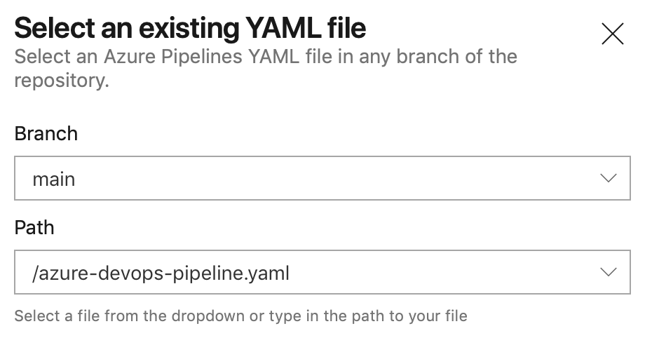
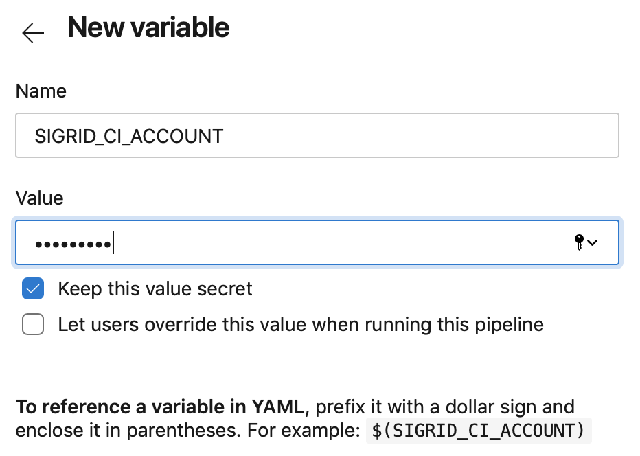
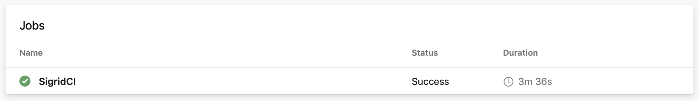

Integrating Sigrid CI with Azure DevOps
=======================================

This guide explains how to integrate Sigrid into your Azure DevOps continuous integration pipeline, using GitHub Actions. Make sure you have also read the [general Sigrid CI documentation](README.md) before starting this guide.

## Prerequisites

- You have a Sigrid user account. Sigrid CI requires Sigrid, it is currently not supported to *only* use the CI integration without using Sigrid itself.
- You have on-boarded your system, i.e. your system is available in Sigrid. [Request your system to be added](mailto:support@softwareimprovementgroup.com) if this is not yet the case.
- [Python 3](https://www.python.org) needs to be available in the CI environment. The client scripts for Sigrid CI are based on Python.

## Request a Sigrid CI account

The account you use to submit code to Sigrid CI is different from your normal Sigrid user account. The account consists of an account name and a token, which you add to your CI environment's configuration in the next step. 

You can obtain a Sigrid CI account by requesting one from [support@softwareimprovementgroup.com](mailto:support@softwareimprovementgroup.com). Support for creating Sigrid CI accounts yourself will be added in a future version.

Once the account has been created, you can use Sigrid's user management feature to control which systems it is allowed to access. Similar to normal Sigrid user accounts, Sigrid CI accounts can either serve a specific system, a group of systems, or all systems in your portfolio.

## Configuration

**Step 1: Create pipeline configuration file**

In the root of your repository, create a file `azure-devops-pipeline.yaml` and add the following contents:

```
stages:
  - stage: Report
    jobs:
    - job: SigridCI
      container: python:3.9-buster
      continueOnError: true
      steps:
      - bash: "git clone https://github.com/Software-Improvement-Group/sigridci.git sigridci"
      - bash: "./sigridci/sigridci/sigridci.py --customer examplecustomername --system examplesystemname --source . --targetquality 3.5"
        env:
          SIGRID_CI_ACCOUNT: $(SIGRID_CI_ACCOUNT)
          SIGRID_CI_TOKEN: $(SIGRID_CI_TOKEN)
        continueOnError: true
      - publish: sigrid-ci-output
        artifact: sigrid-ci-output
```

The relevant command that starts Sigrid CI is the call to the `sigridci.py` script, which will call Sigrid CI. The script takes the following arguments:

| Argument        | Required | Example value | Description                                                                                         |
|-----------------|----------|---------------|-----------------------------------------------------------------------------------------------------|
| --customer      | Yes      | examplecustomername     | Name of your organization's Sigrid account. Contact SIG support if you're not sure on this. Value should be lowercase.         |
| --system        | Yes      | examplesystemname         | Name of your system in Sigrid. Contact SIG support if you're not sure on this. Value should be lowercase.                      |
| --source        | Yes      | .             | Path of your project's source code. Use "." for current directory.                                  |
| --targetquality | No       | 3.5           | Target quality level, not meeting this target will cause the CI step to fail. Default is 3.5 stars. |
| --exclude       | No       | /build/,.png  | Comma-separated list of file and/or directory names that should be excluded from the upload. This is on top of the existing scope file in Sigrid        |

Finally, note that you need to perform this step for every project where you wish to use Sigrid CI. Be aware that you can set a project-specific target quality, you don't necessarily have to use the same target for every project.

**Security note:** This example downloads the Sigrid CI client scripts directly from GitHub. That might be acceptable for some projects, and is in fact increasingly common. However, some projects might not allow this as part of their security policy. In those cases, you can simply download the `sigridci` directory in this repository, and make it available to your runners (either by placing the scripts in a known location, or packaging them into a Docker container). 

Commit and push this file to the repository, so that Azure DevOps can use this configuration file for your pipeline. If you already have an existing pipeline configuration, simply add these steps to it.

**Step 2: Create your Azure DevOps pipeline**

In Azure DevOps, access the section "Pipelines" from the main menu. In this example we assume you are using a YAML file to configure your pipeline:


Select the YAML file you created in the previous step:



This will display the contents of the YAML file in the next screen. The final step is to add your account credentials to the pipeline. Click "Variables" in the top right corner. Create a secret named `SIGRID_CI_ACCOUNT` with the account name you have received:



When done, add another variables named `SIGRID_CI_TOKEN` with the authentication token you have received.

From this point, Sigrid CI will run as part of the pipeline. When the pipeline is triggered depends on the configuration: by default it will run after every commit, but you can also trigger it periodically or run it manually.



# Usage

To obtain feedback on your commit, click on the "Sigrid CI" step in the pipeline results screen shown above. 


The check will succeed if the code quality meets the specified target, and will fail otherwise. In addition to the simple success/failure indicator, Sigrid CI provides multiple levels of feedback. The first and fastest type of feedback is directly produced in the CI output, as shown in the following screenshot:


The output consists of the following:

- A list of refactoring candidates that were introduced in your merge request. This allows you to understand what quality issues you caused, which in turn allows you to fix them quickly. Note that quality is obviously important, but you are not expected to always fix every single issue. As long as you meet the target, it's fine.
- An overview of all ratings, compared against the system as a whole. This allows you to check if your changes improved the system, or accidentally made things worse.
- The final conclusion on whether your changes and merge request meet the quality target.

In addition to the textual output, Sigrid CI also generates a static HTML file that shows the results in a more graphical form. This is similar to test coverage tools, which also tend to produce a HTML report. The pipeline does publish this report, but the Azure DevOps web interface does not currently support viewing published artifacts directly in the web interface itself. To obtain the published HTML report, refer to the [Azure DevOps documentation for downloading artifacts](https://docs.microsoft.com/en-us/azure/devops/pipelines/artifacts/artifacts-overview?view=azure-devops).

The information in the HTML report is based on the aforementioned list, though it includes slightly more detail.


Finally, if you want to have more information on the system as a whole, you can also access [Sigrid](http://sigrid-says.com/), which gives you more information on the overall quality of the system, its architecture, and more.

## Contact and support

Feel free to contact [SIG's support department](mailto:support@softwareimprovementgroup.com) for any questions or issues you may have after reading this document, or when using Sigrid or Sigrid CI. Users in Europe can also contact us by phone at +31 20 314 0953.
