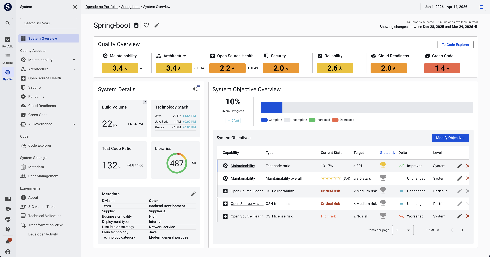

# Sigrid | Software Assurance Platform

[Sigrid](https://www.softwareimprovementgroup.com/solutions/sigrid-software-assurance-platform/) helps you to improve your software by measuring your system's code quality, and then compares the results against a benchmark of 25,000 industry systems to give you concrete advice on areas where you can improve.

Sigrid performs code quality checks that have been designed by the [Software Improvement Group](https://www.softwareimprovementgroup.com/), which have been used by thousands of development teams over the past 20 years to help improve their software. SIG's approach is based on the [ISO 25010 standard for software quality](https://www.iso.org/standard/35733.html), and has been accredited to ensure alignment with the standard.

## About this documentation

This documentation acts as a user guide for Sigrid. This covers:

- **Context and background:** This page dedicates some words to our vision developing and offering Sigrid. A high-level overview of its goals and functionality.  
- [Roles and usage](getting-started/roles.md): The main roles/typical users that Sigrid supports. These range from management and (enterprise) architects to product owners and developers. Different roles typically have different needs for views/detail, roughly from portfolio/trend to code detail view. 
- **Analysis scenarios:** We discuss typical analysis needs or use cases and the steps can you take to get there.
  
## Sigrid, why you need it

<iframe width="560" height="315" src="https://www.youtube.com/embed/7xvcN9S5zY8" title="YouTube video player" frameborder="0" allow="accelerometer; autoplay; clipboard-write; encrypted-media; gyroscope; picture-in-picture; web-share" allowfullscreen></iframe>

Sigrid is a fact-supported cost-saver, risk-management aid and a technical-debt prioritization tool that can be used to improve quality at all system levels. 

It does that by providing you the data to steer business decisions and make technical improvements.

## Sigrid, how we see it 

We know that most organizations rely on software to run their business. Software, and taking control of it, is therefore at the center of business decisions.

- To make confident business decisions in this context, you need to be confident about the internals (the health) of your software landscape. We will provide you with the data to get that insight, and make informed decisions. The type of data accommodates the organizational context. Therefore, functionality focuses on:
  - Seeing trends of the portfolio of software as a whole.
  - Bringing together many types of technical health (such as maintainability, security, architecture).
  - Offering transparency on IT quality, which evokes accountability and makes code contributors proud of their work.

## What can you use Sigrid for?

As SIG’s software quality assurance platform, Sigrid provides a *single source of truth* of software health. This helps you steer decision-making while you buy, build, maintain and modernize your software. We call this ‘bit to boardroom insights’. These decisions will range from high-level system lifecycle decisions (e.g., renewal, decommissioning) to code-level recommendations (e.g., what to refactor and upgrade) to improve and smoothen out patterns that may slow down or endanger your business.

Sigrid visualizes your software landscape according to various technical quality aspects, into a single solution. *Quality* here is understood as characteristics of technical health (or technical debt). This includes terms defined and understood in the ISO 25010 standard, such as maintainability and security. Bringing these aspects together broadens your overview of your software landscape, which helps you expose possible technical risks. 

The screenshot above shows an example on how Sigrid can help you to define and track objectives for various quality aspects. You can do this for every system in your portfolio. For more context on the relation between systems and their repositories, see [systems](organization-integration/systems.md).

## How does Sigrid work?

Essentially, Sigrid’s insights are based on source code analysis. Analyses are run on the code "as is", so without actually running the system. This is known as *static analysis*, as opposed to *dynamic analysis*. Dynamic analysis of software is more typically done by the developers themselves, because it requires a simulation of how a system will behave in operation.

Sigrid recognizes, calculates and prioritizes code characteristics that indicate software health. Such as whether the code contains design anti-patterns (undesirable constructs), whether the code contains security flaws (or imported, external code contains those).  

Sigrid communicates results as benchmarked star ratings. You can find more information about [our approach](getting-started/approach.md) later in this documentation.

## Contact and support

Feel free to contact [SIG's support department](mailto:support@softwareimprovementgroup.com) for any questions or issues you may have after reading this document, or when using Sigrid or Sigrid CI. Users in Europe can also contact us by phone at +31 20 314 0953.
