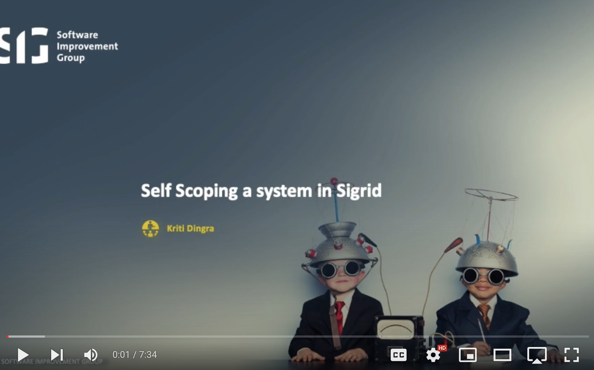

Changing the analysis scope configuration
=========================================

You can change Sigrid's configuration for your project, to make Sigrid's feedback as useful and actionable as possible. We call this configuration "the scope".

<a href="https://www.youtube.com/watch?v=Uomc7hUbRTw" target="_blank">
  
</a>

By default, Sigrid will try to automatically detect the technologies you use, the component structure, and files/directories that should be excluded from the analysis. However, you can override this standard configuration with your project-specific configuration. To do this, create a file called `sigrid.yaml` and add it to the root of your repository. When you merge changes to `sigrid.yaml`, Sigrid will pick up the new configuration and apply it to subsequent scans.

The following example shows a typical example of the `sigrid.yaml` configuration file:

```
component_depth: 1
exclude:
  - ".*/simulator/.*"
languages:
  - name: java
  - name: python
  - name: typescript
```

## General configuration

| Field              | Required | Description                                                                                                    |
|--------------------|----------|----------------------------------------------------------------------------------------------------------------|
| `model`            | No       | Version of the SIG quality model that should be used to analyze your project. Default is latest model version. |

## Excluding files and directories

Sigrid will exclude common patterns by default. For example, directories like `build`, `dist`, and `target` typically contain build output and are not part of the source code. Directories like `node_modules` contain open source libraries and are not part of the application's own source code. Those directories are therefore ignored during the analysis.

It is possible to extend this list with project-specific files and directories that should also be excluded. The `exclude` section in the YAML file contains a list of regular expressions for paths to ignore. For example, `.*[.]out[.]js` will exclude all files with a name ending in `.out.js` from the analysis. Adding `.*/simulator/.*` will exclude everything in the directory `simulator`.

Note that it is not necessary to exclude files and directories that would not be analyzed anyway. 

## Technology support

See the [list of supported technologies](technology-support.md) for the names that can be used inside the `languages` section of the YAML file.

### Overriding automatic technology and test code detection

When you add a technology to your scope file, Sigrid will try to locate the corresponding files based on file and directory name conventions. This includes automatic detection of test code. For example, Java-based projects typically use `src/main/java` for production code and `src/test/java` for test code.

This automatic detection is usually sufficient for the majority of projects. However, if you are using less common frameworks or a custom naming convention, you will need to tell Sigrid where it can find the test code. Like other parts of the scope file, this is done using regular expressions:

```
languages:
  - name: Java
    production:
    test:
      include:
        - ".*/our-smoke-tests/.*[.]java"
```

This example will classify all Java code in the `our-smoke-tests` directory as test code.

## Defining components

Component detection is based on the project's directory structure. What "components" mean depends on the technology. In Java, components are usually based on Maven modules. In C, components are often simply the project's top-level directories.

Components can be defined in two ways. The simple option is to simply base the components on directory depth. The following example will use the project's top-level directories as components.

    component_depth: 1
    
In some projects, using directory depth will not accurately reflect the actual component structure. The more advanced option allows you to define components explicitly:

    components:
      - name: "Back-end"
        include:
          - ".*[.]java"
      - name: "Log"
        include:
          - ".*/cs/findbugs/log/.*"
          
In this example, regular expressions are used to define what files and directories belong to each component. The syntax is identical to the patterns used in the `exclude` section.

## Open Source Health

**Note: This requires a [Sigrid license for Open Source Health](https://www.softwareimprovementgroup.com/capabilities/sigrid-open-source-health/). Without this license, you will not be able to see security results in Sigrid.**

Open Source Health allows you to scan all open sources libraries used by your system, and identify risks such as security vulnerabilities or heavily outdated libraries.

    dependencychecker:
      enabled: true
      blacklist: []
      transitive: true
      exclude:
        - ".*/scripts/.*"
        
The `dependencychecker` section supports the following options:

| Option name  | Required? | Description                                                                                    |
|--------------|-----------|------------------------------------------------------------------------------------------------|
| `enabled`    | Yes       | Set to `true` to enable Open Source Health analysis.                                           |
| `blacklist`  | Yes       | List of library names that should not be scanned. Typically used to ignore internal libraries. |
| `transitive` | No        | When true, also scans the dependencies of your dependencies. Defaults to false.                |
| `exclude`    | No        | List of file/directory patterns that should be excluded from the Open Source Health analysis.  |

## Security

**Note: This requires a [Sigrid license for Software Security](https://www.softwareimprovementgroup.com/solutions/sigrid-software-security/). Without this license, you will not be able to see security results in Sigrid.**

Sigrid uses a combination of its own security checks and security checks performed by third party tools. It then combines the results, benchmarks them, and reports on the overall results.

    thirdpartyfindings:
      enabled: true
      exclude:
        - ".*/scripts/.*[.]sh"
          
The `thirdpartyfindings` section supports the following options:

| Option name | Required? | Description                                                                         |
|-------------|-----------|-------------------------------------------------------------------------------------|
| `enabled`   | Yes       | Set to `true` to enable security analysis.                                          |
| `exclude`   | No        | List of file/directory patterns that should be excluded from the security analysis. |

## Architecture Quality

**Note: This requires an Architecture Quality license, which is currently restricted to a limited customer beta. Without this license, you will not be able to see security results in Sigrid.**

    architecture:
      enabled: true
      
The `architecture` section supports the following options:

| Option name | Required? | Description                                                                       |
|-------------|-----------|-----------------------------------------------------------------------------------|
| `enabled`   | Yes       | Set to `true` to enable architecture quality analysis.                            |
| `model`     | No        | Version of the SIG Architecture Quality Model to use. Defaults to latest version. |

Architecture Quality also requires the repository history to be included in the upload. This requires the `--include-history` option to be enabled in the [Sigrid CI client script](client-script-usage.md).

## Sigrid metadata

`sigrid.yaml` is used for *analysis* configuration. It is also possible to configure Sigrid *metadata*. See the [Sigrid metadata](metadata.md) section for the various ways you can update this metadata.

## Contact and support

Feel free to contact [SIG's support department](mailto:support@softwareimprovementgroup.com) for any questions or issues you may have after reading this document, or when using Sigrid or Sigrid CI. Users in Europe can also contact us by phone at +31 20 314 0953.
