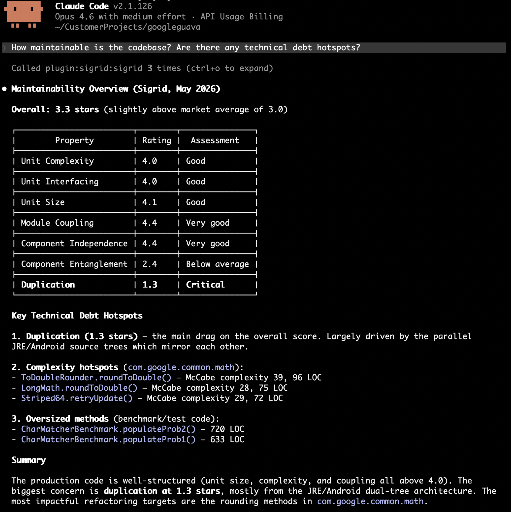
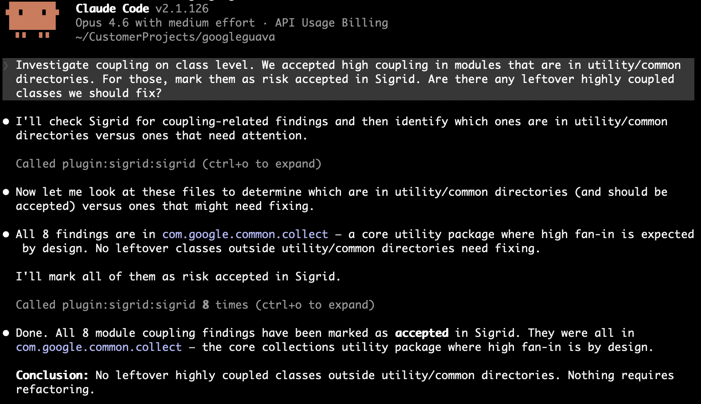
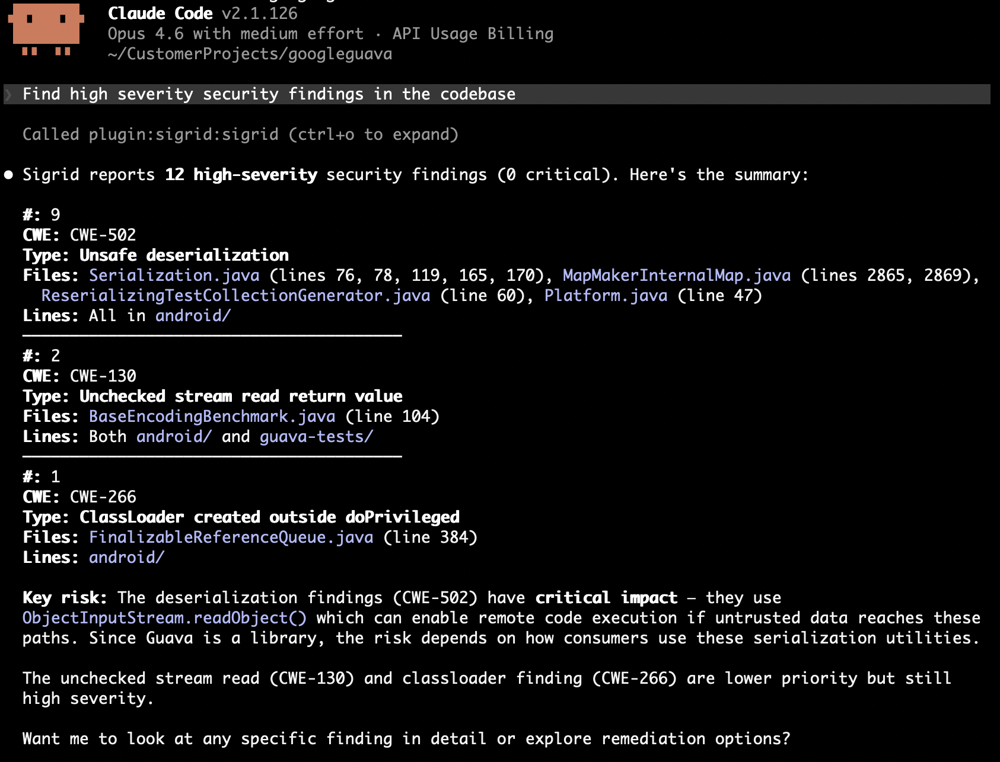

---
redirect_from:
  - /integrations/sigrid-mcp/autofix-agents.html
---

# Auto-fix Agents

Auto-fix Agents is the Sigrid Axis capability that works down the problems Sigrid Core already found in your system: it grounds the agent in your measured architecture, plans what is worth fixing, and fixes it as local commits for you to review.

It covers three phases of the [agentic lifecycle](README.md#the-agentic-lifecycle), each with its own skills:

- **Ground:** [`explore-architecture`](skills.md#explore-architecture) and the `architecture-explorer` agent answer questions about how the code fits together, from Sigrid's dependency graph.
- **Plan:** [`diagnose`](skills.md#diagnose) reads the state of a metrics-based model and names the fix most worth making. [`triage-findings`](skills.md#triage-findings) goes through the findings of a findings-based model and decides each one.
- **Improve:** [`autofix`](skills.md#autofix) carries out the plan.

Planning and fixing are separate on purpose. The plan skills never change code, and they save their plan as a [handover](skills.md#handovers) that `autofix` picks up, straight away or in a later session. That gives you a point to read the plan and disagree with it before any code changes.

For keeping new problems out, see [Guardrails](guardrails.md).

## Prerequisites

You need the following before you start:

- A system published to Sigrid, so Sigrid Core has analyzed it.
- The Sigrid Axis MCP server connected to your agent. See [installation](installation.md).
- A local checkout of the system's repository.
- A [Sigrid profile](configuration.md#the-sigrid-profile) in the repository, written with `/setup`, so the skills know your customer and system.

## Ground: explore the architecture

Before touching code, let the agent map how the system fits together: which components call which, and what a change would ripple out to. Ask a structural question, or run the skill:

```
/explore-architecture What depends on the billing component, and through which files?
```

The `architecture-explorer` agent answers from Sigrid Core's dependency graph, and reads files for what the graph cannot tell it. One call to the graph gives the counted answer that grepping imports only approximates. Giving the agent this context up front helps it respect the existing structure instead of introducing architecture drift.

The graph describes the baseline branch as Sigrid last analyzed it. To check whether a local change already drifted, use `change-feedback architecture` instead; see [preventing architecture drift](../workflows/agents/preventing-architecture-drift.md).

## Plan: diagnose maintainability and architecture

Maintainability and architecture are metrics-based models: they describe a state, rated in stars, and the question is which change moves it most.

```
/diagnose maintainability
```

For maintainability, `diagnose` reads the ratings of all seven properties and the top candidates for each, and weights them the way Sigrid does, by the amount of code each one puts in a bad risk bracket. That order is often not the order of severity. [Reducing technical debt](../workflows/agents/reducing-technical-debt.md) explains why, and walks through a session.

For architecture, it finds the directory whose structure is most worth fixing, from the graph, and names the concrete fix, such as a file to move or a facade to add.

## Plan: triage security, reliability, and open source findings

Security, reliability, and open source health are findings-based models: they produce a list, and the question is what to do about each item on it.

```
/triage-findings security under src/payments/
```

`triage-findings` reads each flagged location and decides: false positive, accepted risk, needs a person, or will fix. A false positive or an accepted risk has to cite a file and a line. For security and reliability, the decisions go back to Sigrid as finding statuses, with the evidence as the remark. What needs a person comes back as a list, with the blocker for each. [Triaging security and reliability findings](../workflows/agents/triaging-security-and-reliability-findings.md) walks through a session.

For open source findings, it groups the findings per dependency and researches the remediation options in public advisories and registries. See [`triage-findings`](skills.md#triage-findings) in the skills reference.

## Improve: fix what the plan named

```
/autofix maintainability
```

`autofix` works from the handover, one item at a time, and makes one commit per candidate, finding, or dependency. It verifies every change before committing it: with your tests and Guardrails for maintainability and code findings, with the graph for architecture, and with Sigrid CI for dependencies. A change that fails verification and cannot be put right is reverted and listed in the report, with the reason.

It stops at local commits on a branch. It never pushes, never opens a merge request or pull request, and never opens an issue. Review the branch, then push it and open the change request yourself.

## Use the tools without the skills

The skills are the quickest route, but the [MCP tools](tools.md) work from a plain prompt in any agentic tool. A few patterns we use:

### Discovery and prioritization

The agent fetches findings, reads the surrounding code, and reports back without changing anything. This is useful when you want an overview, or a shortlist to turn into tickets:

```
Get maintainability findings for [customer]/[system]. What patterns do you see? Suggest a refactoring strategy before making changes.
```

<a href="../images/mcp/recipes/maintainability-overview.png" target="_blank"></a>

Prompted this way, the agent ranks by severity, which is not the order that moves your rating. `diagnose` weights candidates by the amount of rated code they cover.

### Decide and fix in one pass

Give the agent a target property and your decision criteria, and let it work through the findings. It needs to know when to fix and when to accept before it starts. Here, that means telling it what a legitimate reason for coupling looks like in your codebase:

```
Get module coupling findings for [customer]/[system]. For each module, check whether it follows single responsibility. If it doesn't, split it into focused files. If it already has a clear single purpose and is small, mark as accepted. Update finding statuses to reflect your decisions.
```

The agent investigated eight coupling findings, concluded the high fan-in was deliberate, and marked all eight as accepted:

<a href="../images/mcp/recipes/coupling-triage-accepted.png" target="_blank"></a>

### Explore the architecture

The three `architecture.*` tools are read-only, so they inform a plan without changing anything. We would reach for them in this order:

1. `architecture.get_worst_directories` to find where restructuring pays off. The ranking is weighted by volume, so a low rating on a large component outranks the same rating on a small one.
2. `architecture.get_internal` to see how a directory hangs together. Call it without a path first for the system's top-level components, then drill into the one you care about.
3. `architecture.get_external_dependencies` on whatever you plan to change, for its blast radius. It returns one hop per call, so follow a returned path with another call to go deeper.

Here are two prompts that use them:

```
Before I refactor the Analyses component in [customer]/[system], map its internal structure and tell me which sub-parts are most tightly coupled.
```

```
I want to change [file] in [customer]/[system]. What depends on it, and what does it depend on? Treat anything with a high call count as higher risk and call it out.
```

### Triage security and reliability findings

<a href="../images/mcp/recipes/security-findings-triage.png" target="_blank"></a>

The agent fetches findings, investigates each one in the code, and either fixes it or triages it with a rationale. Give it a severity floor, say whether it may change code, and state your risk tolerance:

```
Find high severity security findings in the codebase for [customer]/[system]. Assess each one: is it exploitable given the context? Fix what you can, mark false positives with a justification.
```

A prompt like this gets you a first batch. Whether the verdicts are worth anything depends on context the agent cannot read from the code, such as which services are reachable from outside, and on a rule that every verdict cites a line. `triage-findings` has both built in.

### Open source health

The agent queries your open source dependencies for risks. Open source health findings have no status in Sigrid, so the workflow is to discover, prioritize, and report:

```
Get critical and high severity vulnerabilities in our dependencies for [customer]/[system]. Which ones are in components we actively use? Suggest upgrade paths or alternatives.
```
