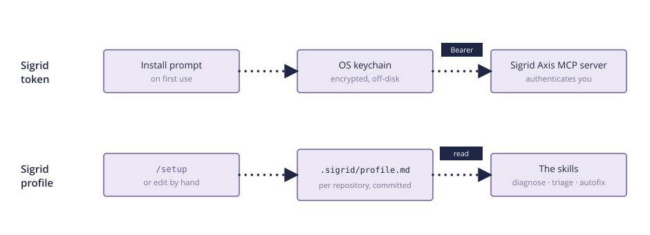

---
redirect_from:
  - /integrations/sigrid-mcp/configuration.html
---

# Configuring Sigrid Axis

Sigrid Axis reads two kinds of configuration: a token that authenticates you to the Sigrid Axis MCP server, and a profile that tells the skills which Sigrid system a repository belongs to and how your team works. The Claude Code plugin adds a third: two options that control its nudge hook.

| Configuration | What it holds | Stored in | Scope |
| --- | --- | --- | --- |
| **Token** | Your Sigrid API token | Operating system keychain | You |
| **Profile** | Your Sigrid system and team conventions | `.sigrid/profile.md` | The repository, committed |
| **Plugin options** | Whether the nudge hook runs | Claude Code plugin settings | You |



Your token never goes in the profile, and the profile never contains a secret. You can safely read, edit, commit, and share the profile.
{: .attention }

## The Sigrid token

The Sigrid Axis MCP server authenticates every call with your Sigrid API token. When you first use the plugin, Claude Code asks for the token and stores it in your operating system's keychain. It is never written to a file in your repository.

To get a token, see [authentication tokens](../organization-integration/authentication-tokens.md). To change it, or to enter it if the installer never asked, run `/plugin`, open **Installed**, select **axis**, choose **Configure options**, type the token, and run `/reload-plugins`.

One skill needs a second copy of the token. The [`change-feedback`](skills.md#change-feedback) skill runs Sigrid CI on your machine, and Sigrid CI cannot read the keychain, so it reads a `SIGRID_CI_TOKEN` or `SIGRID_TOKEN` environment variable that you export yourself.

## The Sigrid profile

The profile gives the skills the context they need to answer for your repository instead of in general terms: the Sigrid customer and system, the branch Sigrid analyzes, where the source code starts, and how your team works. Every skill reads it at the start of a run.

It lives at `.sigrid/profile.md` in the root of your repository, and you commit it, so everyone working in the repository shares the same profile. It is a Markdown file that the skills read as context, not a configuration format with a schema, so nothing validates it and plain language is fine. Here is an example:

```markdown
# Sigrid profile

- **Customer**: acme
- **System**: backend-api
- **Baseline branch**: main
- **Source root**: .
- **Branch naming**: fix/<area>
- **Security model**: sigsec
- **Reliability model**: 5055rel

## Customizing behavior

- Never touch `generated/`.
```

The fields are:

- **Customer** and **System**: the names in your Sigrid URL, `sigrid-says.com/<customer>/<system>`.
- **Baseline branch**: the branch Sigrid analyzes. The skills compare your changes against it, and `autofix` branches off it.
- **Source root**: the directory Sigrid CI analyzes, relative to the repository root.
- **Branch naming**: the pattern `autofix` uses for the branches it creates.
- **Security model** and **Reliability model**: only needed when you triage against a model other than the default, which is OWASP Top 10 for security and SIG Code Reliability Top 10 for reliability.

### Create it with setup

Run `/setup` in the repository. It reads what it can from the repository first. The customer, system, baseline branch, and source root come from a `sigrid.yaml` file or from a pipeline that runs Sigrid CI, with `main` or `master` as the baseline branch and the repository root as the source root when nothing says otherwise. The branch naming comes from your existing branches, if they share a pattern. Then it asks for whatever is still missing, shows what it recorded and where each value came from, and reminds you to commit the file.

Setup never guesses the customer or system from your company or repository name. If nothing in the repository names them, it asks.

Run `/setup` again to change a value. It shows what is recorded and asks what to change, and it never silently overwrites a field you filled in. You can also edit the file by hand.

You do not have to fill in everything up front. When a skill needs a value the profile does not have, it asks you and writes your answer back to the profile, so the next run does not ask again.

### Customize how the skills behave

The **Customizing behavior** section takes plain-language instructions that apply to every skill in this repository. We find it is the right place for the rules you would otherwise repeat in every prompt, for example:

- Code the skills must never change, such as generated sources or a vendored library.
- Your commit message conventions.
- Whether `autofix` should set fixed security findings to `FIXED` in Sigrid without asking.
- The constraints a refactoring has to respect, such as asking before changing a serialization format.

`setup` asks whether you want to add any of these, and you can add more by hand at any time.

### Handovers

The skills that plan work write their plan to `.sigrid/handovers/`, next to the profile. Handovers are personal, so that directory gets its own `.gitignore` and is never committed. See [handovers](skills.md#handovers) in the skills reference.

## Plugin options

The Claude Code plugin has a `UserPromptSubmit` hook that adds a short nudge to every prompt you send. It has two options, both on by default:

**Nudge to run guardrails** gives the agent three code principles, and tells it to run the Guardrails check on the production code it changed before it reports a task done, then fix what it finds. It adds the text shown in [add the Guardrails instruction](installation.md#add-the-guardrails-instruction). Turn it off and the agent stops running Guardrails on its own, unless you put that text in `CLAUDE.md`.

**Nudge to use architecture-explorer** points the agent to the `architecture-explorer` agent instead of the generic Explore subagent for questions about code structure.

To turn one off, run `/plugin`, open **Installed**, select **axis**, and choose **Configure options**. Other agentic tools have no equivalent of this hook, so on those you [add the instruction yourself](installation.md#add-the-guardrails-instruction).
