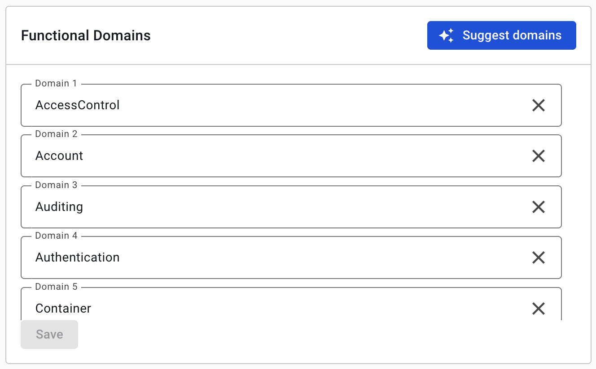
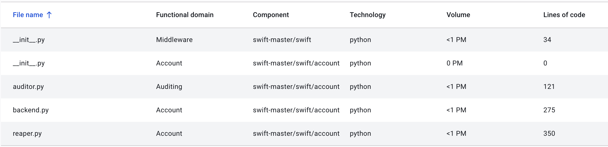

# AI Transformation View (experimental)
Transform and understand your legacy systems at a strategic level. The AI Transformation View empowers business leaders,
architects, and development teams to analyze functional domains through the lens of business value and evolution,
enabling smarter, data-driven modernization decisions.

## Strategic insights through functional domain analysis

Understanding which parts of your system truly matter and why they change is critical for successful modernization.
Through Sigrid's AI Transformation View, you can support the decision-making process in your modernization project by
identifying the core functional areas of your system, measuring their scale, and tracking how much they change over time.

Why is this important? Change can be seen as a proxy for business value. The functional areas of your codebase represent
the business priorities of your organization. When a functional area changes, it can be for multiple reasons:
the optimal situation would the that change within is the result of business needs. But in reality, change could be also
due to instability or error-prone areas. These things might not be immediately apparent from the codebase, and you need
to look at the change patterns of your codebase to understand where and why the system is actually changing.

In this way, the AI Transformation View helps you understand the business priorities of your system and identify areas
that are actively evolving, getting actionable answers to strategic questions:

- **Which functional areas drive real business value?** Not all system components warrant equal investment or migration effort.
- **Where is engineering effort actually concentrated?** Align team capacity with business priorities.
- **What should we modernize first?** Make prioritization decisions based on actual data, not intuition.
- **How stable is each functional domain?** Distinguish between healthy evolution and drift-prone areas.

Legacy systems often obscure their true structure beneath years of accumulated code. The AI Transformation View cuts
through this complexity, revealing the functional architecture your business actually depends on.

## How It Works
The AI Transformation View combines large language models with Sigrid's software analytics to systematically analyze and
categorize the functional areas of your codebase.

### Step 1: Define your functional domains
Start by establishing the business-aligned domains that represent your system's architecture and functionality. You have two approaches:

**Manual definition:** directly specify in the "Functional Domains" section of the page the domains that reflect your business priorities.

**AI-generated definition:** use Sigrid's AI to suggest domains automatically by clicking on the "Suggest Domains" button . Sigrid's AI language model will use your codebase structure, file naming conventions, and organization structure to suggest domains that are likely to be relevant to your business.

Even if you use AI, you maintain complete control: review, refine, rename, merge, or split domains to align with your business terminology and organizational structure.

### Step 2: Your codebase is mapped to your functional domains
Once your domains are defined, Sigrid uses its AI model to automatically map each file in your codebase to its appropriate domain. By looking at the files names, files organizations, and naming conventions, the AI model is able to map each file to the domain that best includes it.

Results of the mapping are presented in a structured table with relevant metadata:

### 3. Visualize domain change rate

The final view presents a strategic scatterplot showing each domain's:
- **Size:** measured in estimated person-months of development effort
- **Change rate:** an estimate of how frequently the domain changed in the past 12 months

This two-dimensional view enables you to identify the core functional areas of your system, and measure how frequently they change: high-value domains are likely to be actively developed, while low-value domains are likely to be stable.

**Understanding change rate:** The 12-month change metric is a proxy for the Business Value of a functional area and reveals where your organization is actively investing. A high change rate can indicate areas that are adapting to business needs and evolutions. However, sustained high volatility without a corresponding business value can also indicate instability or error-prone areas.

## Who is this for
This functionality is for users that are involved in preparing a Legacy Modernization project and have a good understanding of the business context and enterprise architecture of the system.

## When to use this functionality
Functional domain analysis is a step that belongs in the planning phase of modernization projects. It improves the functional understanding and evolutionary perspective of functional domains.

The output of a functional domain analysis can aid in determining the order in which functional domains should be migrated, decoupled, carved out, or rebuilt in a new architecture paradigm.

## Prerequisites

The AI Transformation View requires the following:

- **AI Addendum** - Your Sigrid contract must include a signed AI Addendum.
- **AI_EXPLANATIONS License enabled** - As we need to send
- **Historical Data** - Minimum 2 snapshots from different months within the past 12 months. Older snapshots are excluded to ensure that the analysis reflects current business priorities.

## Data Security and Privacy

### Does Sigrid share my data with external AI models or providers?

Yes, and we do so responsibly. Your data is transmitted securely to AI models for explanation generation, following SIG's enterprise-grade security and data sovereignty policies.
This functionality shares with an external AI model only:
- The names of your files and their locations (i.e., the path to the file within your codebase)
- The names of your functional domains

### Is the use of GenAI in this feature safe?

Absolutely. Multi-layered safeguards protect your intellectual property and data throughout the explanation generation process.

### Which AI models does the Sigrid's AI Transformation View use?

The AI Transformation View currently leverages Anthropic's Sonnet model for suggesting functional domains and mapping your codebase's files to the domains.
We use **AWS Bedrock** as our infrastructure provider. AWS Bedrock ensures:
- No data storage or caching of generated explanations
- Zero use of your data for model training
- No sharing of data with third parties

### How is my data handled by the model provider?

Your data is safely sent to our models provider, AWS Bedrock. The models use your data temporarily only to generate the functional domains and to map your files to the domains.

- Functional domains are generated on-demand only: when you click the "Suggest domains" button, only the strictly necessary information is sent to our model provider
- AWS Bedrock does not retain any generated content beyond the time it takes to generate a response
- AWS Bedrock does not share your data with any third parties
- AWS Bedrock does not use your data for model training
- Your data remains ephemeral throughout the process

---

## Feedback and Support
**This is an experimental feature, and we'd love to hear from you.** Your feedback directly shapes how this capability evolves. As we continue development, please share your experiences, suggestions, and ideas for improvement.

Have questions about the AI Transformation View, or encountered unexpected behavior? **[Contact our support team](mailto:support@softwareimprovementgroup.com)**. Your insights help us build better tools.

---

## Disclaimer
The AI Transformation View is an experimental capability in active development that makes use of AI. While we strive to deliver accurate and reliable information, AI-generated content may contain inaccuracies or errors. **Always verify critical information with authoritative sources**.