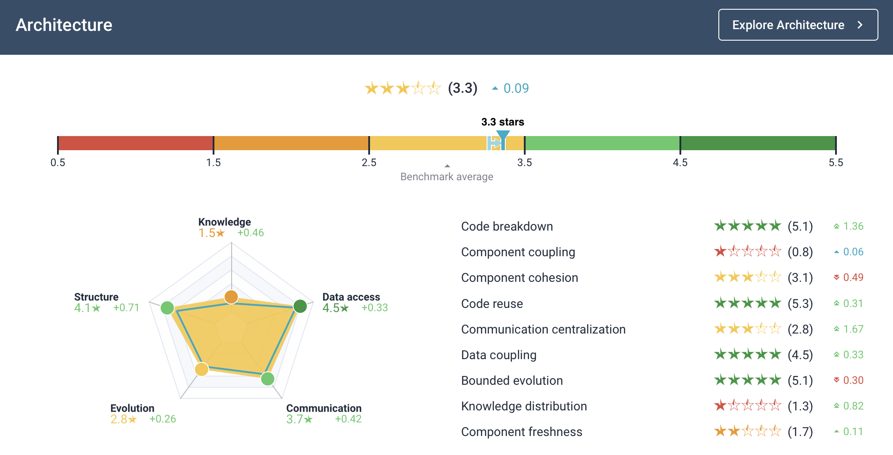
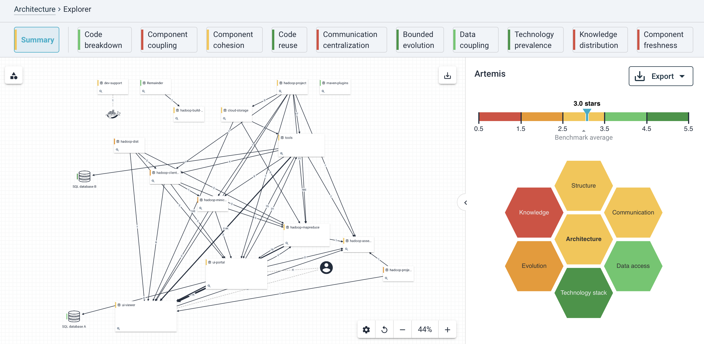
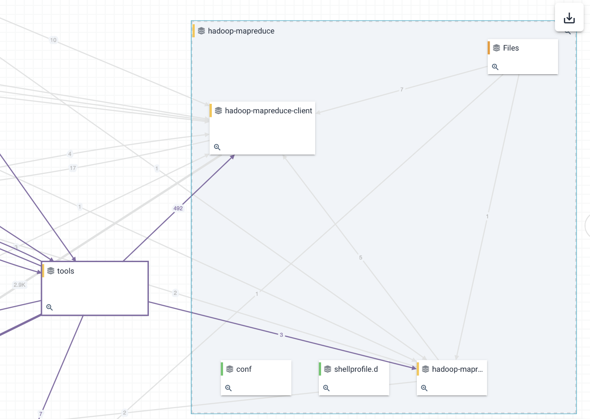
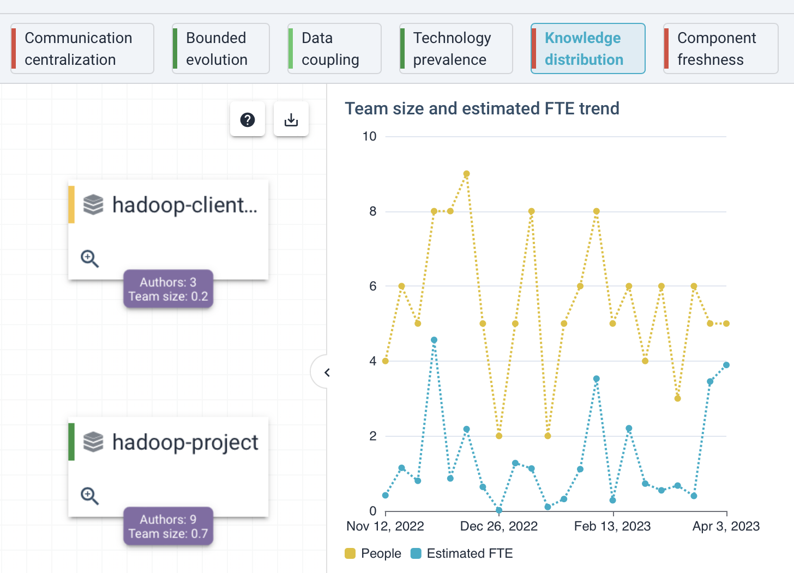
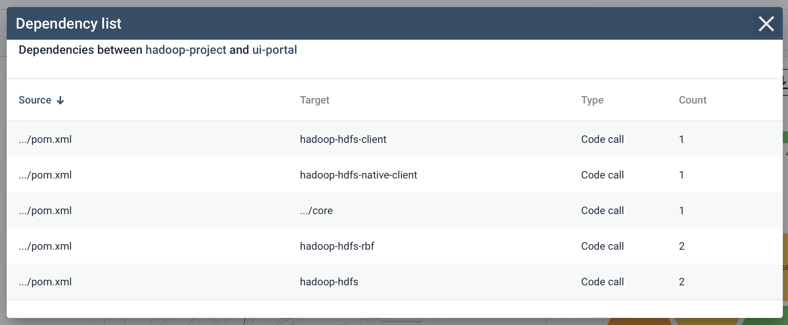
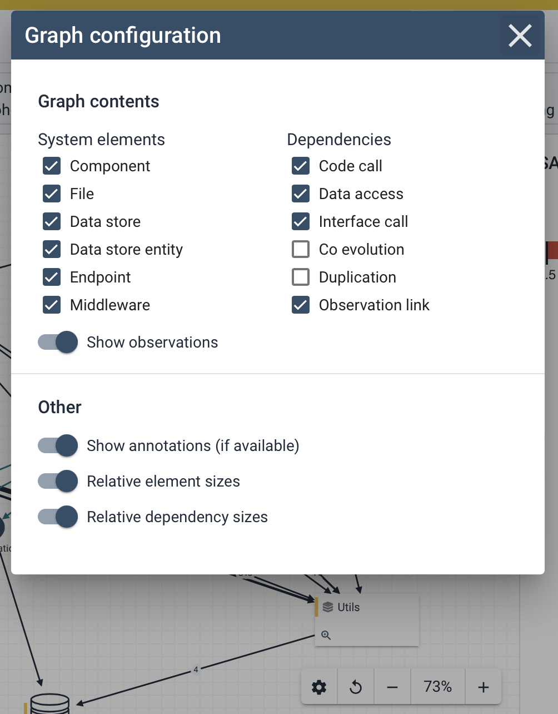

# Architecture Quality

Software engineering is a socio-technical activity. Software is built by teams of people, working together to produce a joint product. High performers in socio-technical architecture quality show faster issue resolution times. Sigrid measures Architecture Quality Model to quantify these aspects of socio-technical software architecture, covering both technical and social aspects and then compares the results against [SIG’s benchmark](../getting-started/approach.md). 

<iframe width="560" height="315" src="https://www.youtube.com/embed/BejJ9sHeUOQ" title="YouTube video player" frameborder="0" allow="accelerometer; autoplay; clipboard-write; encrypted-media; gyroscope; picture-in-picture; web-share" allowfullscreen></iframe>

When people talk about "legacy" or "monoliths", they often mean much more than just outdated technology. Rather, it refers to any pre-existing software solution that has become too fragile for changes to be timely, predictable, and reliable, usually due to poor architecture, or team knowledge loss. 

Software architecture can seem abstract, but it's ultimately how the structure of your software facilitates the people working on it. The code will not care that it's highly coupled, but the people working on that code certainly do care about having dependencies on other people and teams. Sigrid can help you to both *communicate* the as-is architecture as it's actually implemented, and also help to find opportunities on how it can be improved. 

## Architecture Quality overview

The overview page provides a summary of your system's current architecture, relative to the other systems in SIG's benchmark. The structure of this page is comparable to Sigrid's [maintainability summary](system-maintainability.md): you have an overall rating, which is then split into a number of underlying system properties and associated ratings. Hovering your cursor over the system properties on the right provides you with a short description of each metric.

This page provides you with a summary, but you may decide that further investigation into the actual architecture is needed. You can use the "explore architecture" button to navigate to Sigrid's architecture explorer page. Clicking on one of the system properties on the right will *also* take you to the architecture explorer page, but will then immediately jump to the system property you just clicked on.

## Exploring your system's as-is architecture

The architecture explorer page visualizes your architecture. Not the architecture that was initially planned, not the to-be architecture, but the actual as-is architecture that was implemented. The information used to provide this view is extracted from your source code, your repository history, and your configuration. 

In this visualization, every "block" is a *system element* in your code. Depending on the terminology you use, this could be called a subsystem or a component. Arrows between the system elements indicate *dependencies*. Depending on your system, the view might show different types of dependencies in different colors:

- Code dependencies, for example Java calls.
- Interface dependencies, for example a REST API that is provided by one component and used by another component.
- Database dependencies, for example SQL queries.
- Hidden dependencies, for example duplication between two components.

You can use the "show legend" button in the top left to get more information on what each element in the visualization means.

Each system element also includes a magnifying glass icon. Clicking this icon will "expand" the system element, which allows you to see its internal architecture. In many cases this low-level architecture is more actionable, as this is usually the responsibility of the team working on that system element. In other words: you need many people to discuss changes to your top-level architecture, but you can usually address issues in your internal architecture with your own team.

The different tabs across the top of the page represent the system properties in SIG's Architecture Quality Model. Selecting a different tab will also change the architecture view, to provide more specific information relevant to that system property. It will also change the detail panel on the right, to expose more detailed charts and data relevant to the selected system property.

Clicking on a dependency will provide you with a list of where those dependencies originate in your code. If a dependency is connected to a file, clicking on that file will navigate you to Sigrid's code explorer page where you can inspect the file and it's source code in more detail.

Finally, the buttons around the page allow you to manipulate the architecture view:

- The settings icon allows you to customize what is displayed, as depicted above.
- The "reset layout" button resets the architecture visualization to its original state, which can help to restore readability.
- The zoom buttons are an alternative way to zoom the architecture visualization, in addition to using your trackpad or mouse wheel to zoom.

## Frequently asked questions

See [Architecture Quality: frequently asked questions](faq-architecture.md) for more detailed information on operational details regarding Architecture Quality. This includes questions regarding uploading code, technology support, and configuration.

## Contact and support

Feel free to contact [SIG's support department](mailto:support@softwareimprovementgroup.com) for any questions or issues you may have after reading this document, or when using Sigrid or Sigrid CI. Users in Europe can also contact us by phone at +31 20 314 0953.
