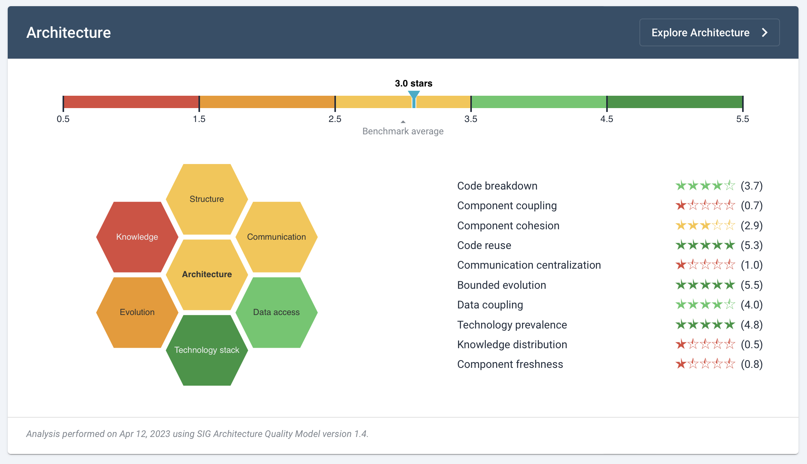

# Architecture Quality

High quality application development requires software architecture. On paper, it describes your technical choices, constraints, and is a reflection of business decisions. But the architecture may look very different once it is implemented in code. Objectively, badly implemented architecture is easy to see (like incoherence). To assess what is well-implemented architecture, we have to look broader. 

Software architecture can seem abstract, but it is ultimately how the structure of your software facilitates the people working on it. The code will not care that it is highly coupled, but the people working on that code certainly do care about having dependencies on other people and teams. Sigrid can help you to both *communicate* the as-is architecture as it is actually implemented, and also help to find opportunities on how it can be improved. 

<iframe width="560" height="315" src="https://www.youtube.com/embed/K5BbtWxFJYk" title="YouTube video player" frameborder="0" allow="accelerometer; autoplay; clipboard-write; encrypted-media; gyroscope; picture-in-picture; web-share" allowfullscreen></iframe>

## A wide measure of Architecture Quality

When people talk about "legacy" or "monoliths", they often mean much more than just outdated technology. What people usually mean is software that has become too fragile for changes to be timely, predictable, and reliable. Usually due to poor architecture or team knowledge loss. An architecture should be able to adapt to those changing circumstances. Therefore, we define *architecture quality* as the degree to which an architecture is flexible and adaptable to change. 

So to make an assessment of architectural/future flexibility, we measure widely. Next to measuring the technical fundamentals, we also look at (code) evolution over time. For example the spread of code contributions over developers. We then compare your results against [SIG's benchmark](../getting-started/approach.md) to clarify what is going well and where improvement is needed.

## Navigating to Architecture Quality

If Architecture Quality is available for your system, you can reach this view via the top menu, or by clicking an a capability on the System or Portfolio *Overview* pages. See the [system-level Overview page](system-overview.md#navigating-to-capabilities) or [portfolio-level Overview page](portfolio-overview.md#navigating-to-capabilities).

## Architecture Quality overview

<iframe width="560" height="315" src="https://www.youtube.com/embed/00EqRufzg5w?si=G6Jx4zrkiovHtknp" title="YouTube video player" frameborder="0" allow="accelerometer; autoplay; clipboard-write; encrypted-media; gyroscope; picture-in-picture; web-share" allowfullscreen></iframe>

The overview page provides a summary of your system's current architecture, relative to the other systems in SIG's benchmark. The structure of this page is comparable to Sigrid's [maintainability summary](system-maintainability.md): you have an overall rating, which is then split into a number of underlying system properties and associated ratings. Hovering your cursor over the system properties on the right provides you with a short description of each metric.

This page provides you with a summary, but you may decide that further investigation into your system's current architecture is needed. You can use the "explore architecture" button to navigate to Sigrid's architecture explorer page. Clicking on one of the system properties on the right will *also* take you to the architecture explorer page, but will then immediately jump to the system property you just clicked on.

## Exploring your system's as-is architecture

<iframe width="560" height="315" src="https://www.youtube.com/embed/BejJ9sHeUOQ" title="YouTube video player" frameborder="0" allow="accelerometer; autoplay; clipboard-write; encrypted-media; gyroscope; picture-in-picture; web-share" allowfullscreen></iframe>

The architecture explorer page visualizes your architecture. Not the architecture that was initially planned, not the to-be architecture, but the implemented as-is architecture. The information used to provide this view is extracted from your source code, your repository history, and your configuration. 

In this visualization, every "block" is a *system element* in your code. Depending on the terminology you use, this could be called a subsystem or a component. Arrows between the system elements indicate *dependencies*. Depending on your system, the view might show different types of dependencies in different colors:

- Code dependencies, for example Java calls.
- Interface dependencies, for example a REST API that is provided by one component and used by another component.
- Database dependencies, for example SQL queries.
- Hidden dependencies, for example duplication between two components.

You can use the "show legend" button in the top left to get more information on what each element in the visualization means.

Each system element also includes a magnifying glass icon. Clicking this icon will "expand" the system element, which allows you to see its internal architecture. In many cases this low-level architecture is more actionable, as this is usually the responsibility of the team working on that system element. In other words: you need many people to discuss changes to your top-level architecture, but you can usually address issues in your internal architecture with your own team.

The different tabs across the top of the page represent the system properties in SIG's Architecture Quality Model. Selecting a different tab will also change the architecture view, to provide more specific information relevant to that system property. It will also change the detail panel on the right, to expose more detailed charts and data relevant to the selected system property.

Clicking on a dependency will provide you with a list of where those dependencies originate in your code. If a dependency is connected to a file, clicking on that file will navigate you to Sigrid's code explorer page where you can inspect the file and its source code in more detail.

If your architecture contains a large number of components, it can be tricky to quickly identify a certain component in the architecture visualization. You can use the "folder" icon in the top left of the page to open the tree view. This provides you with a secondary way of navigating your architecture. Using the tree view is quicker in some scenarios, for example if you want to quickly check what files are located within a certain component. The tree view and the main architecture visualization are linked, so selecting a subcomponent in the tree view will also navigate to that same subcomponent in the architecture visualization.

The tree view also includes a search option. You can use this to locate a specific system element within your architecture, such as a component, file, end point, or database. This is also linked to the main architecture visualization, so clicking on the search results will also navigate the main architecture visualization to that same system element.

Finally, the buttons around the page allow you to manipulate the architecture view:

- The settings icon allows you to customize what is displayed, as depicted above.
- The "reset layout" button resets the architecture visualization to its original state, which can help to restore readability.
- The zoom buttons are an alternative way to zoom the architecture visualization, in addition to using your trackpad or mouse wheel to zoom.

### Highlighting undesirable dependencies

You might have noticed that some dependencies are shown in red. These dependencies are considered undesirable, either because they violate a known architectural anti-pattern (for example cyclic dependencies), or because they have been marked as undesirable in [your configuration](../reference/analysis-scope-configuration.md#architecture-quality).

### Grouping and annotating components

In some cases, you might want to communicate additional information through Sigrid's architecture view. Such information does not directly originate from the source code, but adds some context that makes the architecture easier to find and interpret. 

You can define *groups* and *annotations* in [your configuration](../reference/analysis-scope-configuration.md#architecture-quality). This information will then be depicted as an overlay on top of the architecture visualization in Sigrid.

## Frequently asked questions

See [Architecture Quality: frequently asked questions](faq-architecture.md) for more detailed information on operational details regarding Architecture Quality. This includes questions regarding uploading code, technology support, and configuration.

## Contact and support

Feel free to contact [SIG's support department](mailto:support@softwareimprovementgroup.com) for any questions or issues you may have after reading this document, or when using Sigrid or Sigrid CI. Users in Europe can also contact us by phone at +31 20 314 0953.
