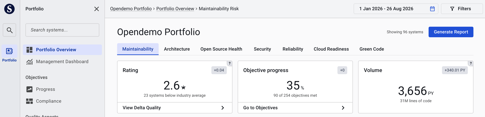
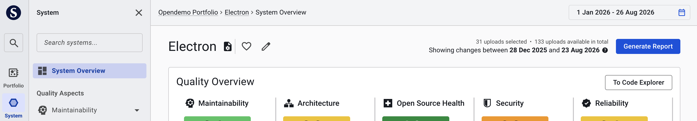
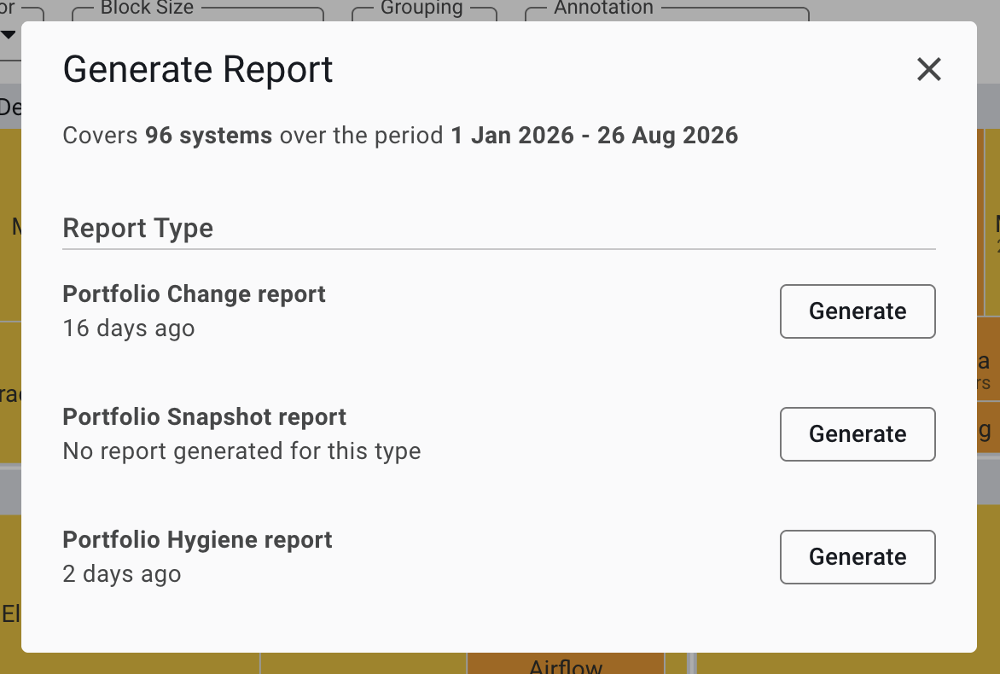

# Generated Offline Reports

Generated offline reports are PowerPoint documents that you can create from Sigrid to share insights about your portfolio or system's quality. These reports enable stakeholders to consume quality information through traditional reporting channels, integrate Sigrid insights into existing reporting cycles, and access information that may not yet be available in the Sigrid interface.

Reports can focus on snapshot information (current state), changes across a time period, or process and metadata insights. All generated reports are PowerPoint documents that can be easily shared and archived offline.

## Report types and focuses

Different types of generated reports are available, each with a specific focus:

- **Snapshot reports**: Current state of quality metrics and insights
- **Change reports**: How quality metrics have evolved over a selected time period
- **Process and metadata reports**: Process-level and metadata insights

## Portfolio-level reports

To generate a portfolio-level report, navigate to the [Portfolio Overview](portfolio-overview.md) and click the "Generate Report" button in the top right corner.

## System-level reports

To generate a system-level report, navigate to the [System Overview](system-overview.md) and click the "Generate Report" button in the top right corner.

## Generating a report

When you click the "Generate Report" button, a dialog opens showing the available report types for your current scope:

*Note: Report types may be updated over time. The report types and focuses shown in your Sigrid instance may differ from the examples in this documentation.*

The dialog displays:

- **Current scope**: The scope of the generated report is always set to the full system or portfolio for which the report is generated
- **Report types**: Different report types available for your portfolio or system
- **Last generated**: When each report type was last generated for the current scope (portfolio/system)
- **Generate button**: Click to initiate report generation

After you click the "Generate" button, report generation begins. Processing may take some time depending on the report complexity and current processing queue. If you don't want to perform any other actions in Sigrid, you can close Sigrid after you have clicked the "Generate" button.

**Once your report is ready, you will receive an email with a download link.** Click the link to open the download page. The download page for the generated report is only accessible to the user who initiated the report generation.

Report download links do not currently have an expiration date, but this may change in the future. If you need to retain reports for long-term use, we recommend archiving them offline after downloading.
{: .attention }

## Related pages

- [Portfolio Overview](portfolio-overview.md) - For portfolio-level reporting
- [System Overview](system-overview.md) - For system-level reporting
