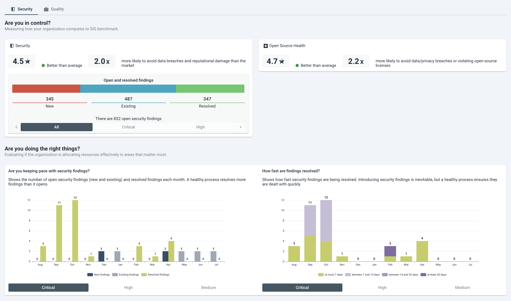
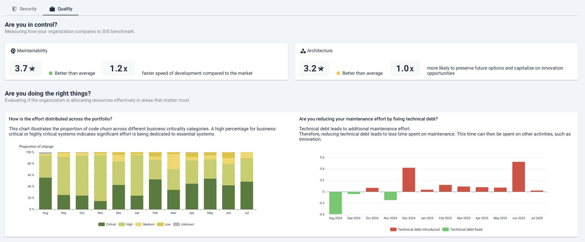

# Management dashboard

Sigrid provides different landing pages for different audiences. The Sigrid management dashboard focuses on,
as the name implies, IT management. It focuses on answering three clear questions:

- Are you in control?
- Are you doing the right things?
- Are you moving in the right direction?

It answers these questions for two different areas: Security, which is more about operational process; 
and quality, which is more about long-term concerns.

## Using the security tab

- **Are you in control:** The top of the security tab covers your overall security compared to the SIG benchmark.
  It also quantifies the impact, i.e. does your security make you more or less likely to encounter data breaches.
- **Are you doing the right things:** A mature security process means your organization is actively dicovering,
  triaging, and resolving security findings. These charts display process information on *how fast* security
  findings are being addressed. [Effective security management](../workflows/best-practices-security.md) will lead
  to a process that is both consistent and predictable.
- **Are you moving in the right direction:** This chart tracks your organization's progress towards your security
  objectives. [Defining and tracking objectives](../capabilities/portfolio-objectives.md) gives clear targets to
  your teams in terms of what is expected from them.

## Using the quality tab

- **Are you in control:** The top of the tab depicts your maintainability and architecture, compared to the
  SIG benchmark. It also quantifies the impact, i.e. what is the impact of the technical debt on your development
  speed.
- **Are you doing the right things:** These charts look at development activity per month. It is expected that the
  majority of capacity is spent on business critical systems. If you find teams spending the majority of their
  time on legacy systems month after month, it can be a sign that your technical debt in that system has become
  unmanageable. In such cases, action is needed to avoid those systems becoming a time sink. This chart can 
  therefore act as a trigger for starting this discussion with the team. 
- **Are you moving in the right direction:** This chart tracks your organization's progress towards your quality
  objectives. [Defining and tracking objectives](../capabilities/portfolio-objectives.md) gives clear targets to
  your teams in terms of what is expected from them.
