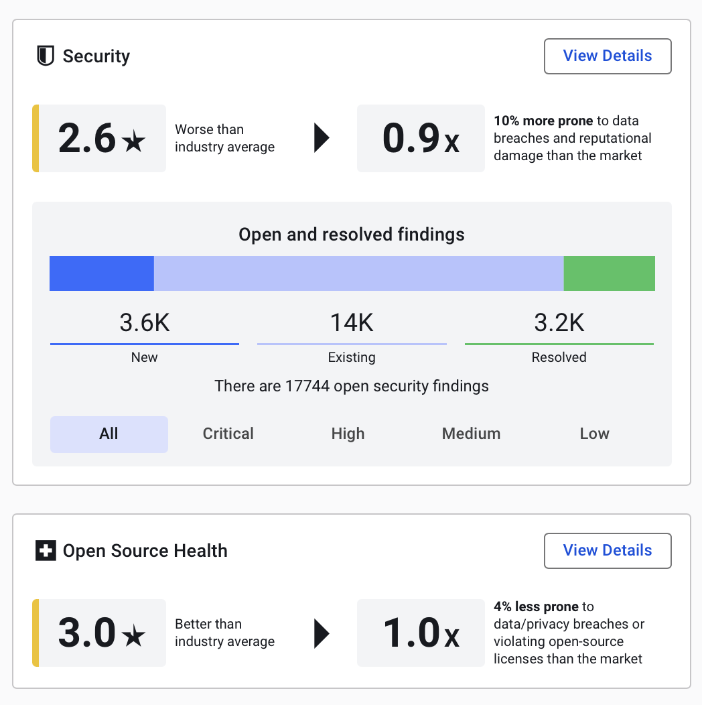
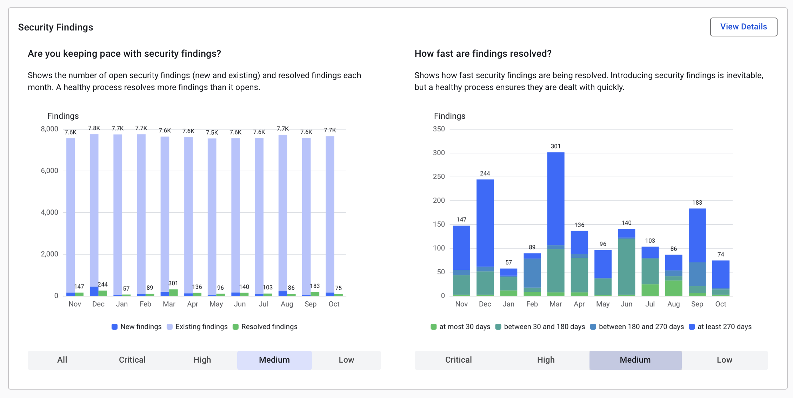
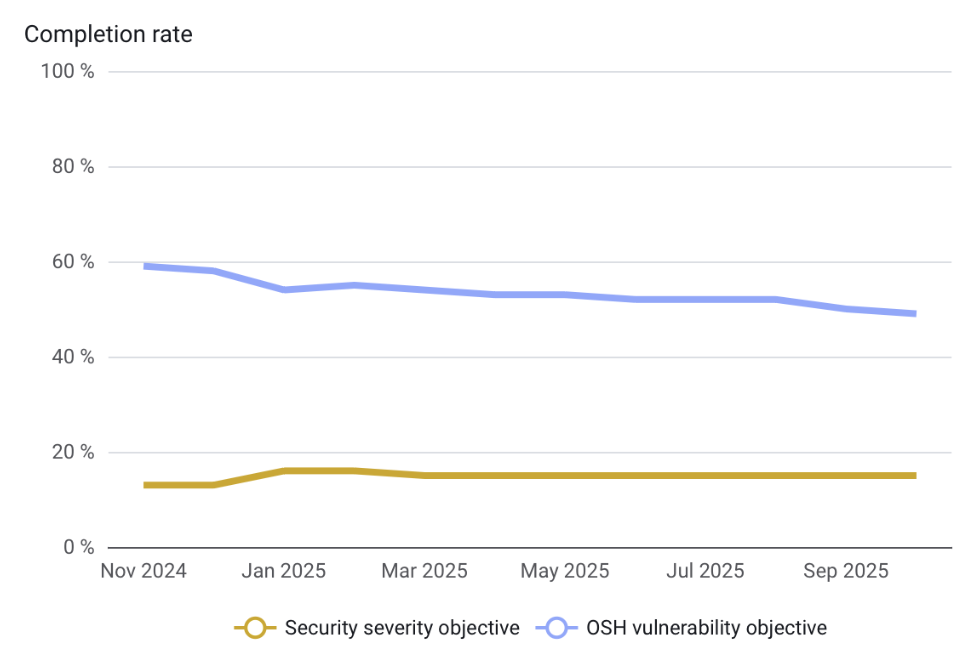
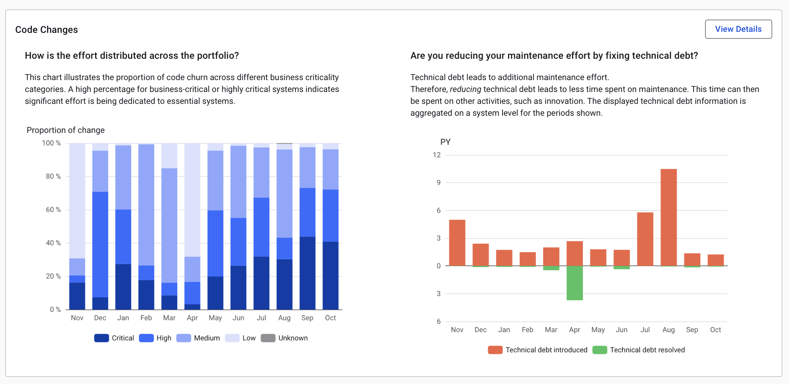
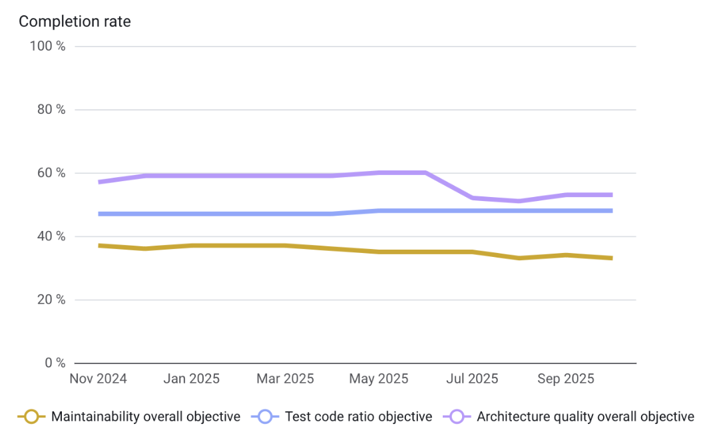

# Management dashboard

Sigrid provides different landing pages for different audiences. Technical people and business leadership often 
speak a different language, making it hard to understand each other's concerns. Sigrid bridges this gap.

As IT management, you need clear insights into your software portfolio's health and security. The Sigrid management
dashboard compiles all that complex technical data into actionable insights, and focuses on answering three clear
questions on your software portfolio governance:

- Are you in control?
- Are you doing the right things?
- Are you moving in the right direction?

This empowers you to make strategic decisions with confidence, optimize your development resources, and 
drive continuous improvement across your software portfolio.

The dashboard has two main tabs:

- **Security** covers the operational process.
- **Quality** handles long-term concerns.

## Using the security tab

### Effectiveness and control

This section helps you answer the first questions: **Are you in control?**

The security tab gives you an instant view of your portfolio's security posture. At the top, you'll see your overall
security rating compared to the SIG benchmark. This helps quantify your risk of potential data breaches.

The bar below shows the security findings details of your software portfolio, compiling all applications in scope. 
If you are only interested in the critical or high severity findings, then click on the respective bar.

The same data is also provided for the open source code used by your teams. This holistic view helps identify
management level of your software supply chain alongside custom code analysis. The open source health score is 
based on the related dashboard that provides a summary of risks of third-party dependencies used in your systems, 
examining key areas such as known vulnerabilities, dependency freshness, license compliance, and community activity.

### Effort focus and optimization

This section helps you answer the question: **Are you doing the right things?**

Below that, we have charts showing how status of security findings (new, existing, and resolved) and how quickly 
your teams are addressing them per severity.

A mature security process should show consistent and predictable patterns, and it does align with general best 
practices regarding the time to resolve security issues. Compare that with your chart per risk category. 
For a deep dive, you can always check the security page.

### Long-term trend and progress

Benchmarking is important, but you also need to track progress of your defined objectives. Setting and monitoring 
these objectives helps align your teams on clear security targets. The last chart in this tab focusses on your own 
security objectives compliance, this view compares the progress with the set security objectives in Sigrid.

## Using the quality tab

Switching to the quality tab, we see a similar layout to the security tab, but here the focus is on 
maintainability and architecture. The top section compares your portfolio to benchmarks and estimates the impact 
of technical debt on your teams' development speed.

### Effort focus and optimization

The charts break down development activity by month. The chart on the left illustrates how development effort was 
allocated based on the business-criticality of your systems.

The char on the right illustrates the amount of technical debt introduced and resolved per month, measured in 
Person Years of development. To understand how technical debt is measured please consult this paper.

### Long term trend and progress

Like in the security tab, we also track progress towards quality objectives you've defined for your portfolio.

## What’s next?

As we look to the future, our management dashboard will continue to evolve to meet your changing needs. 
Here's a glimpse of how we're going to extend the management dashboard throughout the coming months.

We're working on deeper integration with risk models and quality capabilities, allowing you to better align 
technical risks with business priorities. This will help you make more business-aligned decisions about where to 
focus your technical improvement efforts.

We're also exploring ways to incorporate business metrics alongside technical data, giving you a more holistic 
view of your software portfolio's performance and impact.

Lastly, we're continuously refining our data visualization and reporting capabilities to make insights even more 
accessible and actionable. We're committed to being your trusted partner in driving strategic IT decisions that 
shape the future of your technology landscape.
