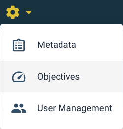
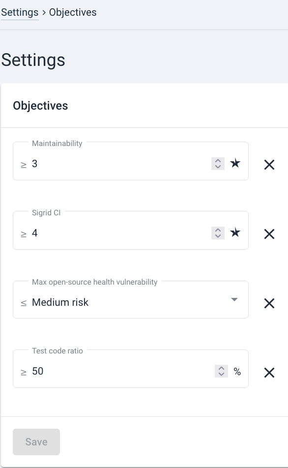

# Setting and using Sigrid Objectives

## Objectives help you set direction and compare them with current state 

**Objectives** are targets that can be set in Sigrid, to compare against system status and quality trends. In this context, objectives are understood as being *non-functional requirements*. It is considered separate from metadata (see [metadata page](../organization-integration/metadata.md)), since *Objectives* do not describe characteristics of systems themselves, but where you want them to be.

Objectives can be set per different quality characteristics and levels of detail. Examples are: a range of desired *Maintainability*, desired *New code quality*, minimum *Test code ratio*, or the maximum number of *Medium risk vulnerabilities* in libraries (*Open Source Health*). 

## Setting Objectives
 You can set *Objectives* by using the settings gear button, in the menu under *Objectives*. 

They can be set as such:

## Comparing status and objectives in the System Overview page

When set, the status of a system against its goals is shown in the *System Overview* tab, as shown below. 

Objectives show the evolution of the system quality over time. Thereby they are useful for [roles](../getting-started/roles.md) such as Enterprise Architects to see where technical debt is moving. It also has a signaling function to make explicit what goals teams should be working towards, and therefore, how the portfolio ought to be moving. This is, of course, only meaningful if these targets/thresholds have been agreed upon beforehand with teams/Product Owners/Development managers, etc. 

## Understanding Objectives in detail: System Overview page

Objectives can be set as below in the *System Overview* page:

The different columns mean the following:

1. *Status* column (1): The *Status* tells you whether the target for an objective is being met in the currently analyzed snapshot.
The green checkmark shows that the test code ratio is at least 50%.
2. *Capability* column (2): A *Capability* can be understood as a desirable code quality characteristic where an objective falls into. 
3. *Target* column (3): The *Target* is the desired measurable value of the objective. It is important to revisit this periodically, because targets will likely vary over time. A likely cause for a target change is the system's *Lifecycle*. Similarly, *Business criticality* typically also is a determinant. 
4. *Delta* column (4): The delta on the image above now shows an "=" sign, but it could also show an upwards arrow or a downwards arrow. This shows the difference with the previously analyzed snapshot.
