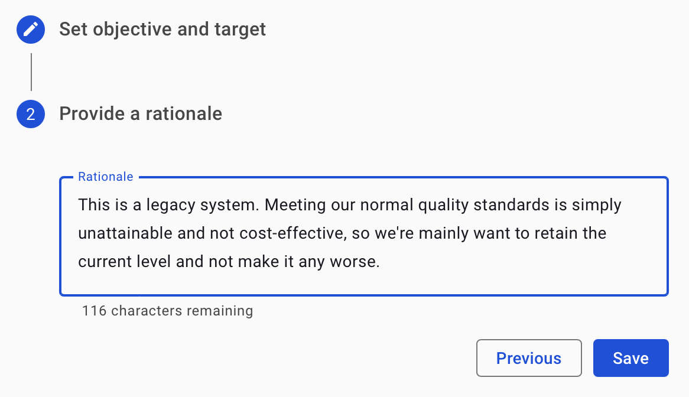
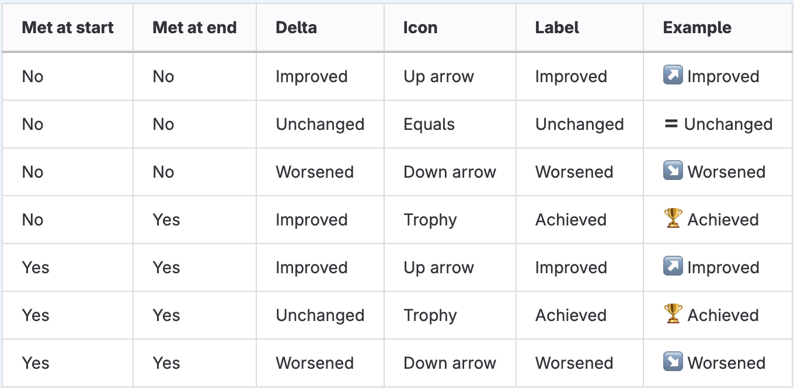

# System Objectives

## About Objectives 

**Objectives** are targets that can be set in Sigrid, to compare against system status and quality trends. In this context, objectives are understood as being *non-functional requirements*. They are considered separate from metadata (see [metadata page](../organization-integration/metadata.md)), since *Objectives* do not describe characteristics of systems themselves, but where you want them to be.

Objectives can be set per different quality characteristics and levels of detail. Examples are: a range of desired *Maintainability*, desired *New code quality*, minimum *Test code ratio*, or the maximum number of *Medium risk vulnerabilities* in libraries (*Open Source Health*).

Our [Guidelines for using Objectives](../workflows/best-practices-objectives.md) provides more background on the thinking behind objectives and how to make them work in your organization. This section focusses on the action needed in Sigrid.

Two types of objectives exist:

**Portfolio Objective**:  A type of objective that targets a group of systems based on similar metadata, aiming to provide an efficient and user-friendly experience that removes the need to set objectives individually for each system and better prioritization. (General rule). Find out more in the section [how to define portofolio objectives](../capabilities/portfolio-objectives.md).

**System Objective**: A type of objective specific to an individual system within a portfolio that does not follow the general rule. When an objective is set at the system level, the system no longer follows the objective defined at the portfolio level.

## Setting System Objectives

If you want to add or modify system objectives, first navigate to your system's [system overview page](system-overview.md), and click on *Modify Objectives*.

When you're adding a new objective, you have the option to add a rationale for it. You can use this rationale to communicate *why* your objective exists.
This is especially important in situations where your system's objectives deviate from your "normal" portfolio objectives. You can see your portfolio objective as policies, meaning system objectives are exceptions to those policies.
In those situations, it's helpful to add a rationale to explain *why* your system is an exception. 
Usually, there is a perfectly good reason for making an exception, but that makes it even more important that you communicate those reasons.

## Comparing status and objectives in the System Overview page

When set, the status of a system against its goals is shown in the *System Overview* tab, as shown below. 

Objectives show the evolution of the system quality over time. Thereby they are useful for [roles](../getting-started/roles.md) such as Enterprise Architects to see where technical debt is moving. It also has a signaling function to make explicit what goals teams should be working towards, and therefore, how the portfolio ought to be moving. This is, of course, only meaningful if these targets/thresholds have been agreed upon beforehand with teams/Product Owners/Development managers, etc. 

## Understanding Objectives in detail: System Overview page

Objectives can be set as below on the *System Overview* page:

There are six different columns which mean the following:

1. *Status* checkmark: The leftmost checkmark is a visual indicator that tells you whether the target for an objective is being met in the currently analyzed snapshot.
The green checkmark shows that the test code ratio is at least 80% and that the maintainability rating target is also being met.
2. *Capability* column: A *Capability* can be understood as a desirable code quality characteristic where an objective falls into.
3. *Type* column: The *Type* indicates the type of the objective which is dependent on the capability. Examples of types of objectives include: Maintainability, Dependency Upgrade Period, Test Code Ratio, etc. 
4. *Target* column: The *Target* is the desired measurable value of the objective. It is important to revisit this periodically, because targets will likely vary over time. A likely cause for a target change is the system's *Lifecycle*. Similarly, *Business criticality* typically also is a determinant. 
5. *Delta* column: The delta can have several values: Achieved, Improved, Unchanged, Unknown and Worsened.
6. *Level* column: The level at which an objective is being applied: it can either be a specific system-level objective override, that only applies to a specific system (System in the table) or it can be a portfolio-level objective that applies to all systems in a portfolio.

### Detailed information about the Delta column

Objectives are measured for a specific code snapshot, which will typically fall within the selected period in the UI. The delta column attempts to present a comprehensive overview of the relationship between the delta and the state of an objective at the start and the end of the period.
The relationship between these three values is what defines the value that gets displayed in the column, according to the table below:

 
