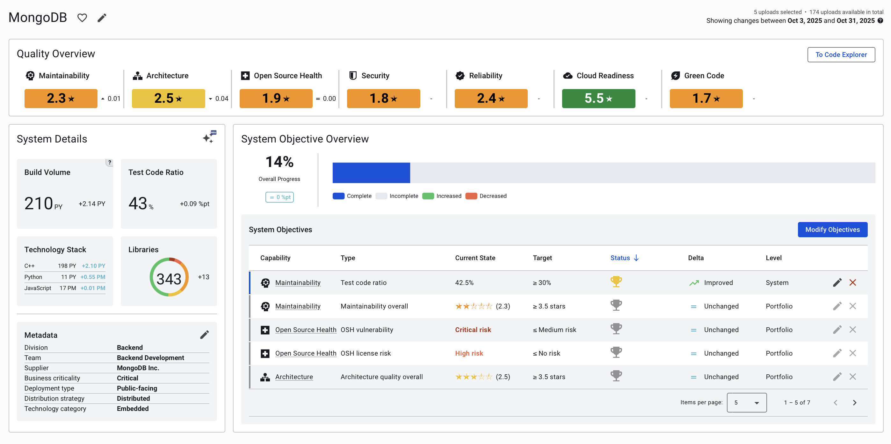

# Why we're changing the Sigrid dashboard

If you've been using Sigrid for a while, you're probably very used to seeing this dashboard right after you sign in:

The dashboard's headline calls it "portfolio overview", but it's more commonly referred to as "the risk dashboard".
Sigrid is moving into a direction where we provide different dashboards for different roles.

- The **management dashboard**, which was introduced earlier this year, focuses on a perspective suitable for
  IT management concerns. It has a strong focus on process and trend, and less focus on individual systems.
- The **risk dashboard** will remain, and will have a stronger focus on the needs of tech leads and architects.
  In this page, we'll take you through our plans for this dashboard.

## 

As we've [learned in interviewing 70+ enterprise architects](https://www.youtube.com/watch?v=TZZ-J2H5wJ8),
these people mainly want to coach their teams, which requires them to keep track of what's happening in their
software landscape. 

The current risk dashboard is not a perfect fit for that use case:

- The dashboard focuses on assessment, it only shows the current state. People indicate they're more interested in
  the trend

@@@

## Contact and support

Feel free to contact [SIG's support department](mailto:support@softwareimprovementgroup.com) for any questions or
issues you may have after reading this document, or when using Sigrid or Sigrid CI. Users in Europe can also contact
us by phone at +31 20 314 0953.
