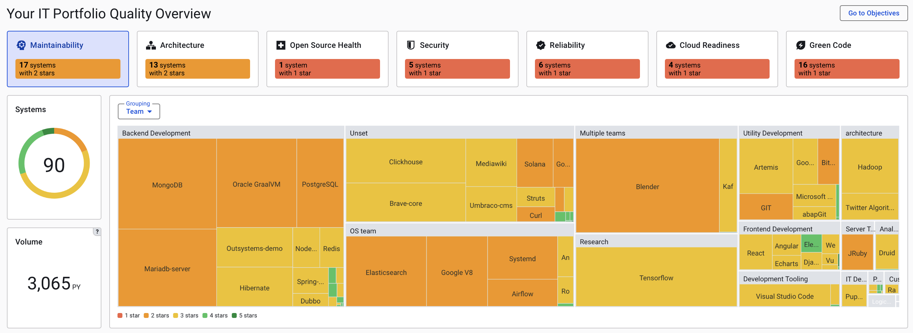
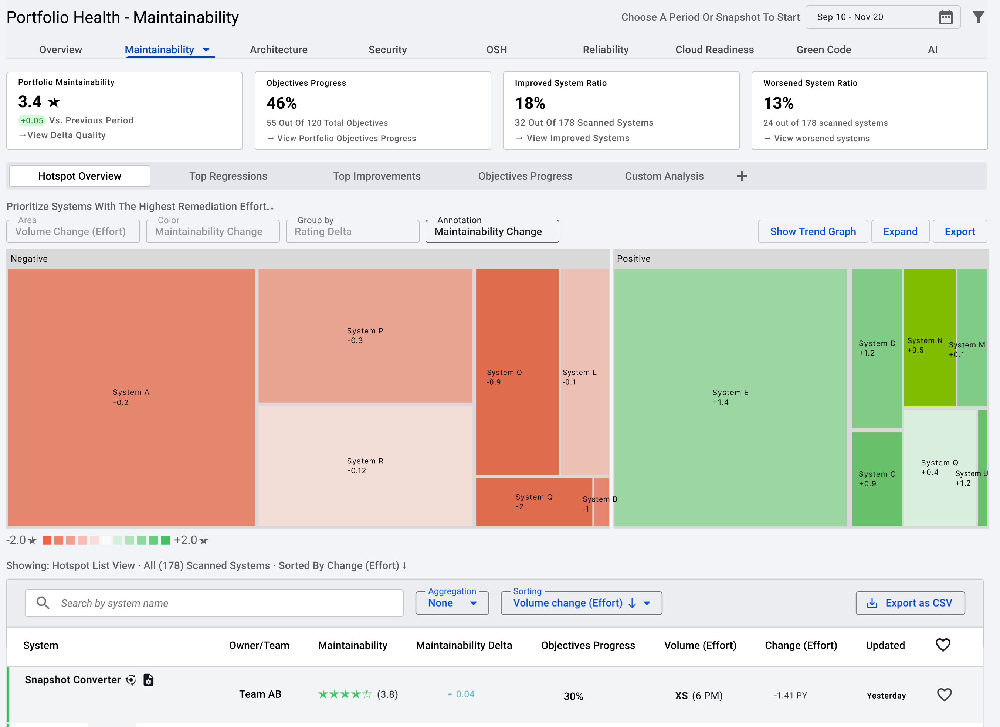

# Why we're changing the Sigrid dashboard

If you've been using Sigrid for a while, you're probably very used to seeing this dashboard right after you sign in:

The dashboard's headline calls it "portfolio overview", but it's more commonly referred to as "the risk dashboard".
Sigrid is moving into a direction where we provide different dashboards for different roles.

- The **management dashboard**, which was introduced earlier this year, focuses on a perspective suitable for
  IT management concerns. It has a strong focus on process and trend, and less focus on individual systems.
- The **risk dashboard** will remain, and will have a stronger focus on the needs of tech leads and architects.
  In this page, we'll take you through our plans for this dashboard.

## Risk dashboard goals

As we've [learned in interviewing 70+ enterprise architects](https://www.youtube.com/watch?v=TZZ-J2H5wJ8),
these people mainly want to coach their teams and work towards shared goals. This requires them to track what's
happening across their software landscape, both in terms of activity and in terms of progress towards those goals. 

The current risk dashboard is very much an assessment view, it only shows the current state of each system. That's
not a great fit if you're mainly interested in recent changes. Over the coming months, we're going to slowly expand
the risk dashboard. It's good to know that *no existing functionality will be removed from the dashboard*. These 
changes are all about *extending* the risk dashboard, but if you're happy with the current version of the dashboard,
you'll still have access to that information.

### Phase 1: Focus on trend

Adding the trend information will affect both the tree map visualization and the list of systems. Selecting the 
time period works the same as any other page in Sigrid that contains trend information: You can select the period
using the time picker in the top-right of the page.

The list of systems is similar to what you see today, with the main difference of trend information being added
for the metrics. The list now also contains information about [objectives](portfolio-objectives.md), instead of 
requiring you to visit a separate dashboard to get that information.

The most prominent visual change is in the tree map. Currently, the tree map emphasizes your largest systems, and
it emphasizes the systems with the worst quality. This makes perfect sense for an assessment, but if you're using 
Sigrid on a regular basis you probably *already know* this information, as it doesn't really change on a regular 
basis.

Therefore, the tabs displayed directly above the tree map will control what is depicted. The new default tab is
called "hotspots", and focus on systems that improved the most versus worsened the most within your selected time
period. This makes it easier to find out what happened within that period. 

### Phase 2: Overall tab

Phase 1 makes the risk dashboard a lot more dynamic, but it retains one issue: It only shows one quality aspect
at a time. That means you'll still need to check multiple tabs if you want to have a full overview of how every
team and every system is doing. 

Therefore, the risk dashboard will gain an "overall" tab, similar to how the
[system overview dashboard](system-overview.md) also provides an overall perspective. This overall tab is currently
in the design process. We'd love to have you involved in this process, so feel free to
[reach out](mailto:support@softwareimprovementgroup.com) if you're reading this would like to share your thoughts.

## Contact and support

Feel free to contact [SIG's support department](mailto:support@softwareimprovementgroup.com) for any questions or
issues you may have after reading this document, or when using Sigrid or Sigrid CI. Users in Europe can also contact
us by phone at +31 20 314 0953.
