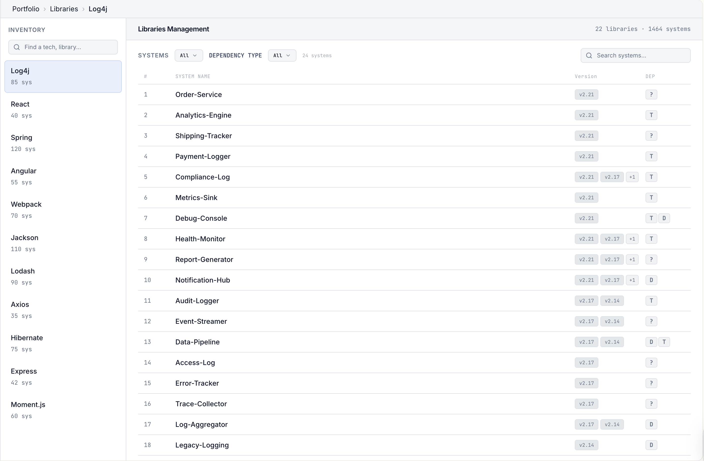

Library management overview
===========================

The **library management overview page** is a portfolio management feature that provides a centralized view to
track, analyze, and manage open source libraries (such as Log4j, React, or Spring) across your entire software
portfolio.

In summary, this view helps you maintain secure and standardized open source policies by answering:

- Which open source libraries are currently used across our portfolio?
- Which systems are running versions with known security vulnerabilities (CVEs)?
- Are certain systems lagging behind our organization's version policies?
- If a specific library is compromised, which systems are affected?

## When to use the library management overview

- **Rapid incident response:** When a new vulnerability (like Log4Shell) is announced, use this page
  to immediately identify every system in your organization that is at risk.
- **Tech stack standardization:** Monitor open source usage to identify systems lagging behind or not adhering to
  your organization’s open source usage policies.
- **Audit readiness:** Export the information, either from the dashboard or
  [using the API](../integrations/sigrid-api-documentation.md#open-source-health-findings-and-ratings), to provide
  evidence of dependency tracking and licensing oversight.

## Information displayed in the library overview

- The **inventory** column lists all identified technologies (such as Log4j, React, Spring, Angular).
  - Use the **search bar** to quickly locate a specific open source library.
  - The **system count** indicates how many systems currently use a specific open source library
    (for example, 85 systems in your portfolio use Log4j).
- The **system management table** is based on the currently selected open source library, and shows where and how
  this library is used in your portfolio. It displays the following information:
  - The **system name** where the library is found.
  - The **version(s)** of the library detected in that system. Multiple versions may appear if the system has
    nested dependencies.
  - The **dependency type**, indicating if the library is direct ("D") or transitive ("T").

## Contact and support

Feel free to contact [SIG's support team](mailto:support@softwareimprovementgroup.com) for any questions or issues
you may have after reading this documentation or when using Sigrid.
