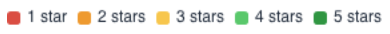

# Portfolio-level maintainability

## Navigating to the portfolio Maintainability view
If you have a portfolio of systems in Sigrid, maintainability is always available as a capability. You can navigate to the maintainability view via the top bar:

Another way to arrive here is clicking on the top capability tiles on the *Portfolio Overview* page. See the [portfolio overview page](portfolio-overview.md#navigating-between-portfolio-and-system-level-views).

Your URL will be of the convention https://sigrid-says.com/*[CLIENTNAME]*/-/maintainability/.

## Moving from portfolio-level to system-level view
Since the portfolio view is a summary of system level findings, please refer to the [system-level view of maintainability](system-maintainability.md). For example, clicking on a system name in the portfolio overview will bring you to the system's details. 

## Portfolio-level Maintainability overview

The maintainability section on the portfolio level has two main views: *Overview* and *Delta quality*. Both views include all the systems of your portfolio in one place. 

The *Overview* tab brings the main metrics together. 

The *Delta quality* view shows the impact of new code changes on the entire portfolio for the selected period. By default it is grouped per system. 
For elaboration, see [Delta quality](system-delta-quality.md). 

<iframe width="560" height="315" src="https://www.youtube.com/embed/O9ARAQV7v1w" title="YouTube video player" frameborder="0" allow="accelerometer; autoplay; clipboard-write; encrypted-media; gyroscope; picture-in-picture; web-share" allowfullscreen></iframe>

 The information can be filtered and sorted by metadata (such as supplier, team, or division) by using the filter button. By default the filters shows (2) active filters: "Hide excluded systems" and "Hide deactivated systems". 

Please see [the system-level overview page](system-overview.md) under *Maintainability:4* for elaboration. 

## Analysis questions for portfolio/trend views
To gauge portfolio health and portfolio trends, example analysis questions are:
* Is the portfolio balanced with business objectives and (enterprise) architecture roadmaps? 
* Do some systems appear to be in trouble while they should have a long life ahead of them? Are quality trends heading in the right direction? 
* Which direction is technical debt moving? Does this impede developers to support the business with sufficient speed and quality?

## Portfolio view by system lifecycle phase
Below, systems are grouped by lifecycle phase. A lifecycle phase is an indication of a system’s maturity and “adaptability needs”, their expected path of continuation. They range from: Initial development > Evolution > Servicing & maintenance > End-of-life. You will generally expect to see a higher maintainability for younger systems (Initial development and Evolution), because they have a long time of changes ahead of them. Lower code quality early on in a system’s life will hurt more over the long term than it would for a system that is already considered “end-of-life”. 
Setting this lifecycle metadata is discussed in the [metadata page](../organization-integration/metadata.md). 

 The "?" help buttons explain the meaning of the different types of settings.

The maintainability ratings expressed in (rounded) stars are distinguished by "traffic light colors", ranging from red (1 star) to green (5 stars). 

Note that the snapshots dates in the top-right corner always imply a period, but it will assume the last date as a state, unless you select a viewing option that shows change, such as "Maintainability change". 

## Portfolio view menus
You can create different views by system characteristics. The characteristics under **Grouping** and **Area** will change the ordering and size of the systems within the treemap. **Color** and **Annotation** will add extra information on top, as a color scheme or annotation. A complete menu of viewing options is shown below.

Here, "*Maintainability change*" is chosen as the meaning of the color scheme. The relative changes are colored as white (neutral) up to green (improving) and red (deteriorating), based on the period selected above (in this example, Year-To-Date/YTD). This can be useful as trend analysis, comparing to expectations. Generally, you would expect public-facing systems to be more actively maintained because outside users tend to come up with new requests, bug reports, and requirements for e.g. stability. As a simplification, you would expect actively maintained systems to not (or very little) deteriorate in code quality. Switching between views of "*Maintainability change*" in different grouping will give you an idea of the balance between expected- and actual trends.  

You can filter per division/team/supplier on different quality aspects, and track the trends of each. 

## Trends in the context of and objectives
Whether quality trends are heading in the right direction does depend on context/goals. The expected quality direction is not necessarily only upwards, but could be: restrict deterioration, stabilization, or cutting volume as a priority. This is why [quality objectives](objectives.md) are important. System-/portfolio quality overviews and their standing on helps getting a shared understanding and commitment towards quality of systems and the portfolio.

## Using quality trend lines 
On a trend line, quality trends can help you see movements over time, possibly fuelled by specific (renovation/development) events. In the below example, a portfolio's code quality over time is shown per system. 

Systems can be (un)selected on the bottom of the graph. 

