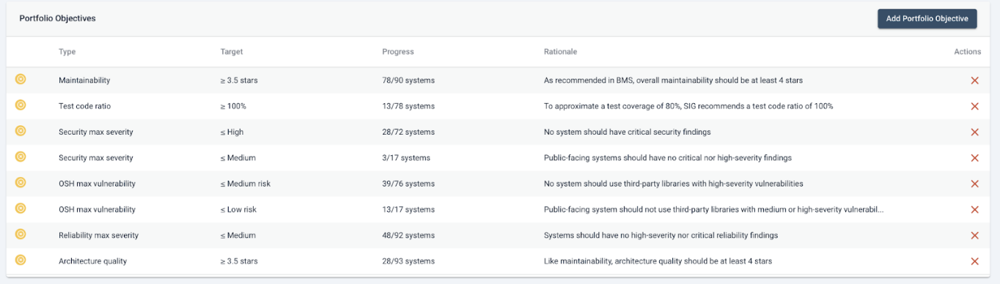
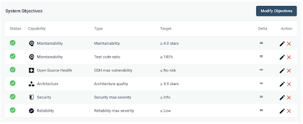
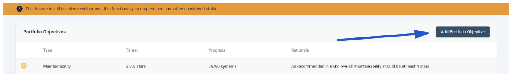
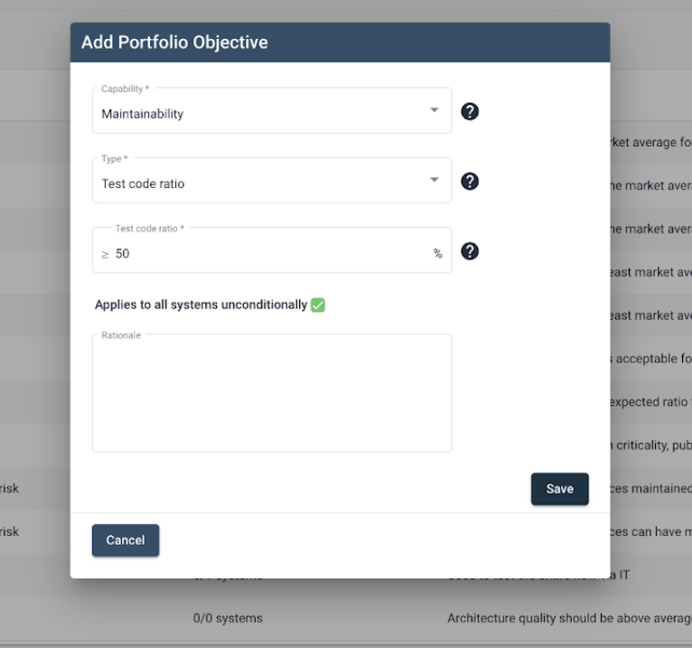

# Portfolio Objectives 

Being able to set system-specific objectives can help you evaluate your system realistically based on your business context, as well as its current lifecycle phase. However, when you have many systems, setting objectives individually for each of them becomes impractical. It's important to prioritize and set stronger or weaker targets for certain systems, according to their importance for your business. Therefore, it is critical to be able to set objectives for a group of systems. This can be done via portfolio objectives. 

**Portfolio Objective**:  A type of objective that targets a group of systems based on similar metadata, aiming to provide an efficient and user-friendly experience that removes the need to set objectives individually for each system and better prioritization. (General rule) 

**System Objective**: A type of objective specific to an individual system within a portfolio that does not follow the general rule. When an objective is set at the system level, the system no longer follows the objective defined at the portfolio level.

## How to define portfolio objectives? 

<iframe width="560" height="315" src="https://www.youtube.com/embed/giNCbqQ9pnI?si=ktrKsYsx2uJmOL5Q" title="YouTube video player" frameborder="0" allow="accelerometer; autoplay; clipboard-write; encrypted-media; gyroscope; picture-in-picture; web-share" allowfullscreen></iframe>

To define a portfolio objective, you can click on the "Add Portfolio Objective" button on the top right of the screen:

Upon clicking the button, a pop-up will appear to guide you during the creation of a portfolio objective.

The pop-up will guide you toward configuring the portfolio objective:

There are several dropdown menus available in the pop-up.

1. A Capability dropdown, that allows you to select the specific capability for which the portfolio objective will be defined.

2. Then, the Type dropdown, allows you to select a given objective type that is part of the capability selected in the previous step. In the example, we see that Test Code Ratio is set as a type. This is due to the fact that the "Test Code Ratio" objective is a type of objective that belongs to the Maintainability capability.

3. Finally, the last step allows for defining the actual value that we want our portfolio objective to be. 
This final field can be of two distinct types: either a free-text field, in the case of numeric objectives, or a dropdown containing a series of pre-defined values, that will be the allowed values for the given objective type.

Note also the indicator that the objective will apply to all systems in your portfolio.

4. Finally, we have a free-text field called Rationale. This field can be used to add any additional details on why a given objective was set and add extra details regarding the values for ensuring full clarity to all involved stakeholders.

## Importance of the Rationale field

One of the main goals of portfolio objectives is that they allow you to codify business objectives in Sigrid. 
A portfolio objective is not, exclusively a technical objective, but, it’s also a business objective for your portfolio.

The idea behind the "Rationale" field, is that it opens up communication between development teams and the management side, in a two-way fashion: when technical goals are linked to business goals, that creates a storyline that resonates well with management, since business goals are their priority. Simultaneously, when  business goals are linked to technical goals, from the lens of the developers, that gives them the perspective on what business goal the technical work they are doing will eventually contribute to.
An example can be as follows: consider a legacy modernization scenario, where older systems are being rewritten in a more modern version of a given technology. And, let’s assume, that in order to guide that process, a quality standard is agreed upon by all stakeholders: a maintainability rating of 4.0 stars is enforced for all systems, to ensure that the re-write doesn’t degrade the existing quality.
That is an important business goal for you and, with portfolio objectives, that business expectation can be seen and monitored through Sigrid.

## Relation between system-level objectives and portfolio-level objectives

The system level and portfolio level objectives are closely related to each other, but, there are several important details to be aware of:

1. Portfolio-level objectives are like policies. Every policy can have exceptions, but, simultaneously, it's important that there is a more general policy to fall back on. These objectives are intended to be used across a wide range of systems, and, are meant to be defined based on the metadata for these systems.

In other words: the effectiveness and usefulness of portfolio-level objectives will be directly related to the quality and level of granularity of the metadata.
In order for you to define effective portfolio-level objectives, you first need to define the "corresponding" metadata. Metadata is, just like the name indicates, data about your systems. An example, which we described at the beginning of this text, can be categorizing a system based on its business criticality and its lifecycle phase. Not all systems will be equally critical nor will all of them be greenfield projects backed by the most modern technologies. 
The ability to tell Sigrid exactly how each of your systems fits into your business, as well as your software landscape, is what the metadata is about.

2. The portfolio-level objectives will act as a fallback in case no system-level objectives are defined, but, if they are, they will override the portfolio-level ones.

### Practical scenario

As an admin, you target a subset of your systems, for which you set a high test code ratio percentage, such as 90%. 

Then, during the day-to-day work, since one of these systems is being completely revamped, a system-level override is defined, that sets the test code ratio to only 70%, to be less strict.

From this point onwards, the system-level override will be the only one in effect, and this particular system will not be affected by the portfolio-level target.
Once the developers finish their work, they no longer require the objective to be there, so, they remove it.
Upon removing it, the system-level override disappears, and, simultaneously, the portfolio-level objective comes into effect again, making the newly revamped system subjected to the higher quality standard set by the portfolio-level objective.

