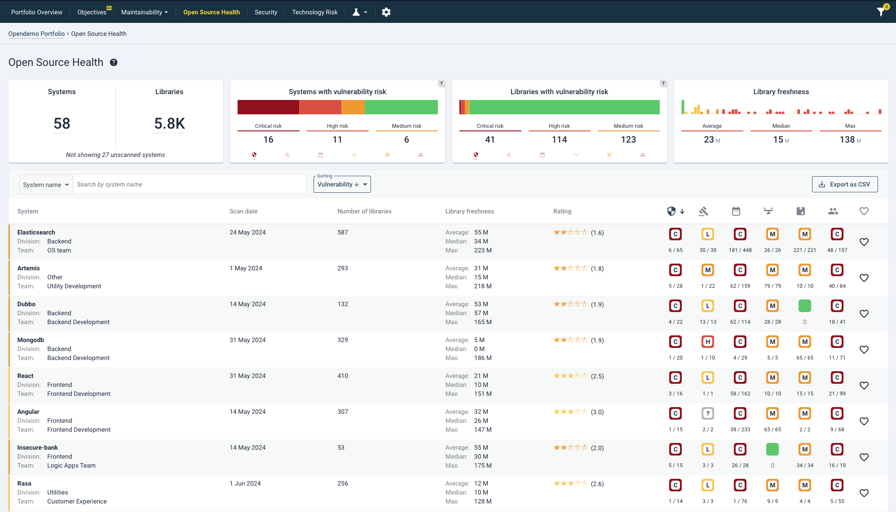
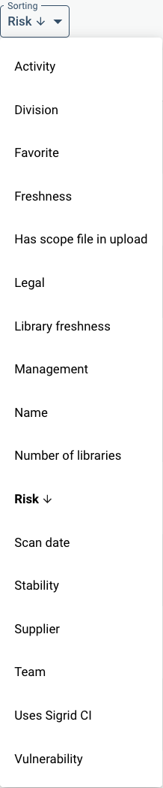
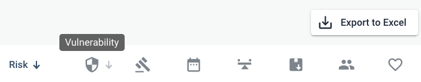

# Portfolio-level Open Source Health
If you have a portfolio of systems in Sigrid and licenses enabled for Security or Open Source Health, they will be visible in the top bar.

Your URL will be of the convention https://sigrid-says.com/*[clientname]*/-/open-source-health, whereas system details will follow https://sigrid-says.com/*[clientname]*/*systemname*/-/open-source-health.

Another way to arrive here is clicking on the top capability tiles on the *Portfolio overview* page. See the [portfolio overview page](portfolio-overview.md#navigating-between-portfolio-and-system-level-views).

## Moving from portfolio level to system level
Since the portfolio view is a summary of system level findings, please refer to the [system-level view of Open Source Health](system-open-source-health.md). For example, clicking on a system name in the portfolio overview will bring you to the system's details. 

## 6 different risk areas
It is important to know how Open Source Health groups its findings. Open Source Health scans for 6 different risk areas. For an elaboration, please [see the relevant paragraph in the page describing system-level view of Open Source Health](system-open-source-health.md#open-source-health-scans-for-6-different-risk-areas). Risks are then classified and colored as  *low*,  *medium*,  *high*, or  *critical* based on their *CVSS score*. See also [our elaboration on how CVSS works](system-security.md#context-and-meaning-of-cvss-security-metrics-from-asset-to-risk) and on [how risks are visualized in Sigrid](system-security.md#cvss-scores-in-sigrid).

## Portfolio-level Open Source Health overview
The Open Source Health overview page shows a summary of findings and estimated severity.  

From left to right, the tiles read as follows:
* *Systems and libraries*: the totals of systems being scanned and the sum of identified (third party) libraries.
* *Systems with vulnerability/legal/freshness/.. risk*: the count of systems with at least 1 identified risk, ordered by risk category (e.g. *low*, *medium*, *high* or *critical*).
* *Libraries with vulnerability/legal/freshness/..risk*: the total count of libraries in each risk category, transcending systems. 

The aforementioned 6 categories are present on the bottom of the tiles that show the sum of number of risks.

 The help button in the tile's upper right corner shows mouseovers for each category that you select.

In the bottom part of the screen, each system is shown with a summary of its counts: number of libraries and findings per category. For larger portfolios it may be useful to sort these on different characteristics. Its menu, by default set on sorting order by "*Risk*", is as follows:

 

Sorting can also be done per columns (here, "*Vulnerability*" as an example). The top right bottom for exporting the data as a spreadsheet may be useful for further analysis. 

 

## Filtering internal dependencies
Internal dependencies can be filtered manually, such that they will not be resolved with the Open Source Health APIs that Sigrid uses.
[Please see the Open Source Health paragraph in our scope configuration document](../reference/analysis-scope-configuration.md#open-source-health) or [this related question in the FAQ](../capabilities/faq-security.md#does-sig-filter-when-resolving-our-systems-dependencies).

