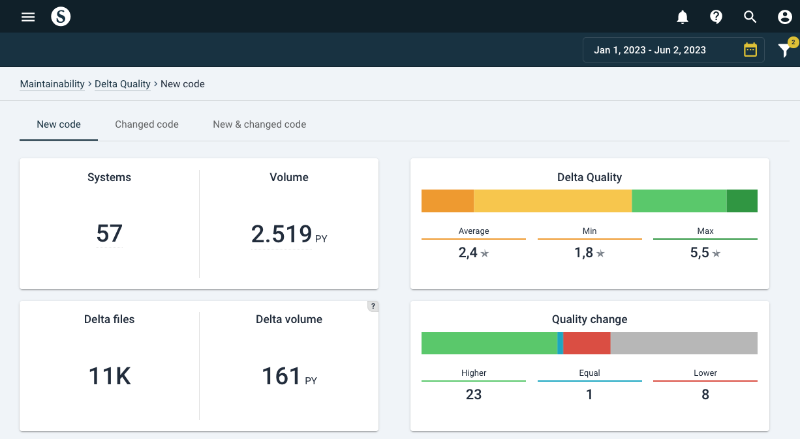
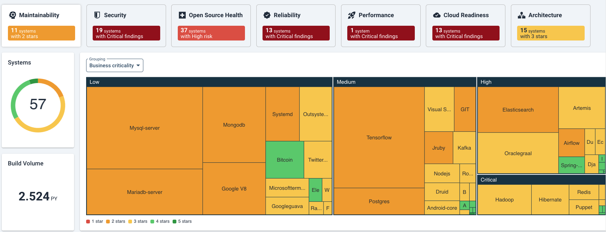
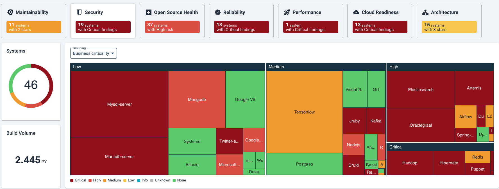

# Portfolio-level overview

This section describes the main functionalities and typical uses/analysis questions on portfolio level. 

For the system-level page, see [system level](system-overview.md).

## Main capabilities

This section describes the quality aspects / tabs that you will encounter in Sigrid.

### Maintainability
The maintainability section on the portfolio level has two main views: *Overview* and *Delta quality*. Both views include all the systems of your portfolio in one place. . 
1. The *Overview* tab brings the main metrics together. 
2. The *Delta quality* view shows the impact of new code changes on the entire portfolio for the selected period. By default it is grouped per system. 

Please see [uses-system](../getting-started/uses-system.md) under *Maintainability:4* for elaboration. 

## Analysis questions for portfolio/trend views
To gauge portfolio health and portfolio trends, example analysis questions are:
* Is the portfolio balanced with business objectives and (enterprise) architecture roadmaps? 
* Do some systems appear to be in trouble while they should have a long life ahead of them? Are quality trends heading in the right direction? 
* Which direction is technical debt moving? Does this impede developers to support the business with sufficient speed and quality?

### Using the portfolio overview
To answer questions such as the above, start in the portfolio view > tab *Overview*. Sigrid shows a dashboard with a quality overview of your entire portfolio, combining all quality characteristics. Based on the systems’ information, you can filter/zoom your portfolio into views that help you understand the details. 

You land on the maintainability overview in this page. 

To see details on different quality aspects you can click on the tiles next to Maintainability. The dashboard colors, their legends, and systems’ data will change accordingly.  

The portfolio overview page can be an entry point to the system level. If you click on a system block in the treemap, Sigrid will direct you to system page with the quality aspect you were viewing. Alternatively you can select the system form the list below the treemap. 

For more detailed information and overviews on each of the quality aspects, you can use the tab of that specific aspect in the top menu. A similar tree map with detailed information will be shown. See the following sections for further explanation. 

### Portfolio view by system lifecycle phase
Below, systems are grouped by lifecycle phase. A lifecycle phase is an indication of a system’s maturity and “adaptability needs”, their expected path of continuation. They range from: Initial development > Evolution > Servicing & maintenance > End-of-life. You will generally expect to see a higher maintainability for younger systems (Initial development and Evolution), because they have a long time of changes ahead of them. Lower code quality early on in a system’s life will hurt more over the long term than it would for a system that is already considered “end-of-life”. 
Setting this lifecycle metadata is discussed in the [metadata page](../organization-integration/metadata.md). The help buttons  explain the meaning of the different types of settings.

The maintainability ratings expressed in (rounded) stars are distinguished by "traffic light colors", ranging from red (1 star) to green (5 stars). 

Note that the snapshots dates in the top-right corner always imply a period, but it will assume the last date as a state, unless you select a viewing option that shows change, such as "Maintainability change". 

### Portfolio view menus
You can create different views by system characteristics. The characteristics under **Grouping** and **Area** will change the ordering and size of the systems within the treemap. **Color** and **Annotation** will add extra information on top, as a color scheme or annotation. A complete menu of viewing options is shown below.

Here, "Maintainability change" is chosen as the meaning of the color scheme. The relative changes are colored as white (neutral) up to green (improving) and red (deteriorating), based on the period selected above (in this example, Year-To-Date/YTD). This can be useful as trend analysis, comparing to expectations. Generally, you would expect public-facing systems to be more actively maintained because outside users tend to come up with new requests, bug reports, and requirements for e.g. stability. As a simplification, you would expect actively maintained systems to not (or very little) deteriorate in code quality. Switching between views of "maintainability change" in different grouping will give you an idea of the balance between expected- and actual trends.  

You can filter per division/team/supplier on different quality aspects, and track the trends of each. 

### Trends in the context of and objectives
Whether quality trends are heading in the right direction does depend on context/goals. The expected quality direction is not necessarily only upwards, but could be: restrict deterioration, stabilization, or cutting volume as a priority. This is why [quality objectives](../getting-started/objectives.md) are important. System-/portfolio quality overviews and their standing on helps getting a shared understanding and commitment towards quality of systems and the portfolio.

## Using quality trend lines 
On a trend line, quality trends can help you see movements over time, possibly fuelled by specific (renovation/development) events. In the below example, a portfolio's code quality over time is shown per system. 

Systems can be (un)selected on the bottom of the graph. 

For more extensive filters, use the filter button . This can help you filter certain divisions, teams, technologies, etc. By default the filters shows (2) active filters: "Hide excluded systems" and "Hide deactivated systems". 

