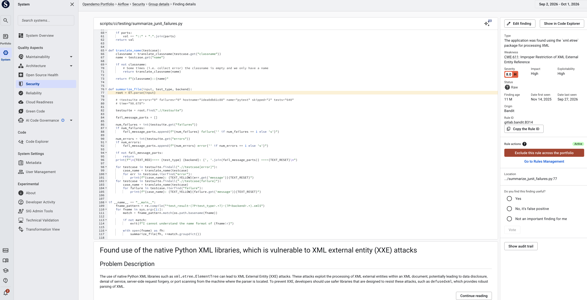
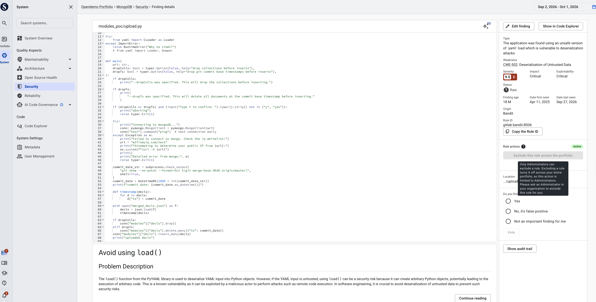
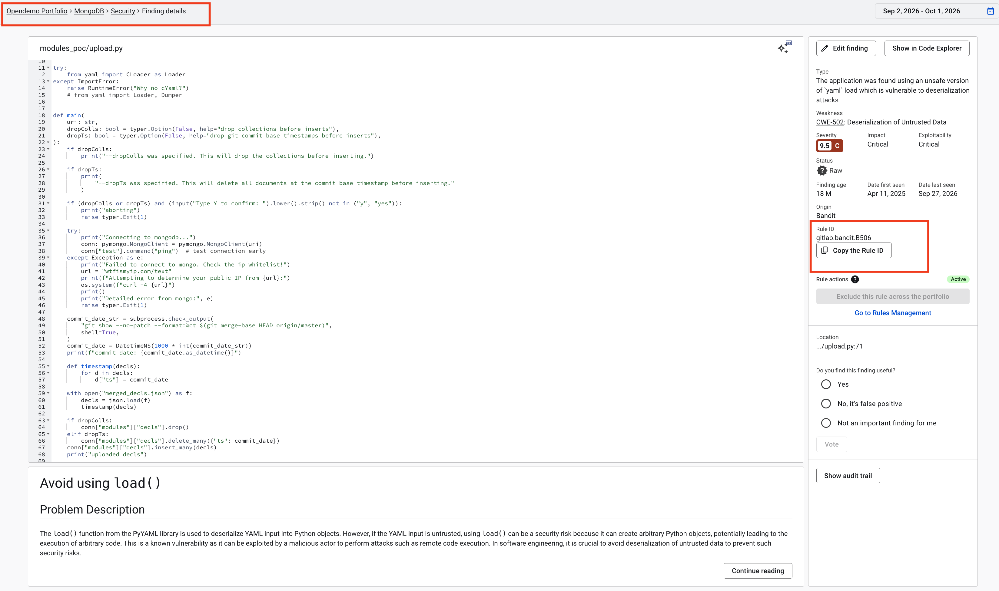
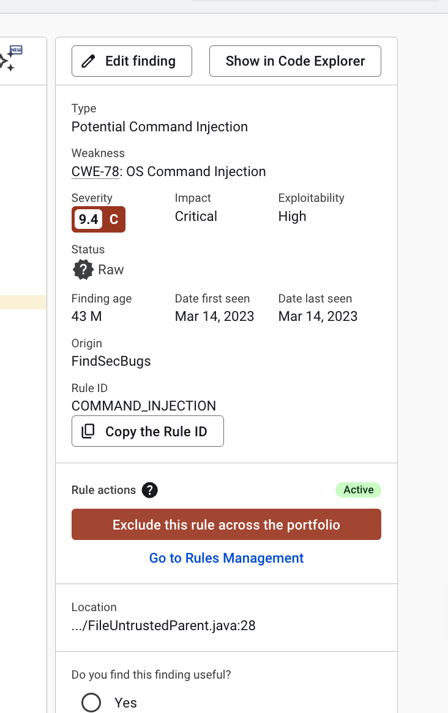
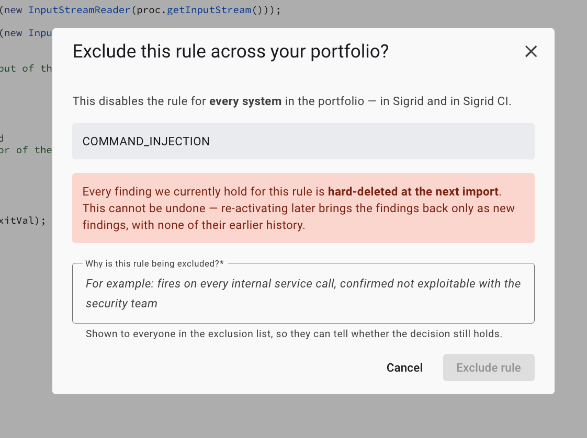
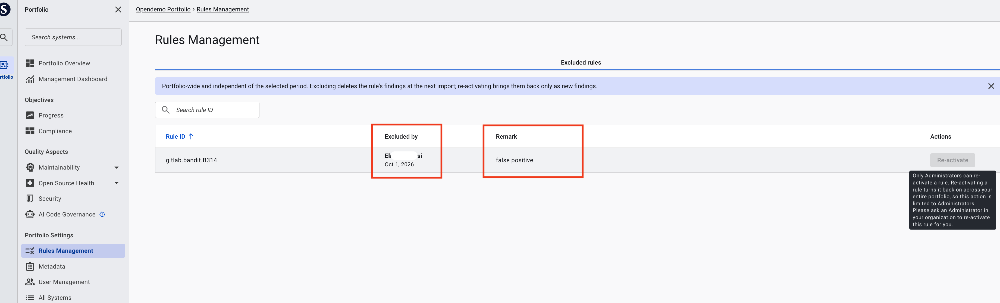
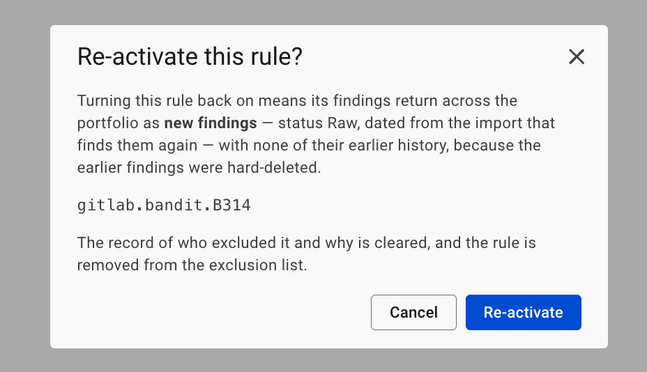

# Rules management

With rules management, an Administrator can turn off a noisy security rule for
your entire portfolio at once, and everyone can see which rules are currently
excluded, by whom, and why.

Sigrid combines its own checks with those of third-party analysis tools. Some of
these rules don't fit your organization. For example, a rule might keep producing
false positives, or it might check for something your platform already handles.

You can already disable a rule for a single system using the `disabled_rules`
option in the [scope configuration file](../reference/analysis-scope-configuration.md#excluding-security-rules).
In a large portfolio, that means every team has to spot the same noisy rule and
exclude it separately in its own scope file.

Portfolio-level rule exclusion lets you make that decision once, centrally.
When an Administrator excludes a rule, Sigrid stops reporting findings for that
rule in every system in your portfolio, including in Sigrid CI feedback.

### When to use this

Exclude a rule across your portfolio when:

- The rule keeps producing findings that your teams mark as false positive, in
  more than one system.
- The rule does not apply to your organization. For example, a rule for security headers that your API gateway already adds.

If a rule is only a problem in one system, use the scope configuration file
instead. If only a few findings are incorrect, mark them as *False positive*
rather than excluding the whole rule, so the rule can still catch real issues
elsewhere.

{: .warning }
Excluding a rule turns it off everywhere. It also stops any genuine finding the
rule would have caught in other systems. Only exclude a rule when you are
confident it is not useful for your portfolio.

You exclude rules from Security findings. If a finding also counts under
Reliability, excluding its rule removes it there too.

## Who can exclude rules

Because excluding a rule affects every system in your portfolio, only users with
the **Administrator** [user type](../organization-integration/usermanagement.md)
can exclude or re-activate a rule.

| Action | Administrator | Maintainer | Normal user |
|---|---|---|---|
| See the *Exclude this rule across the portfolio* action on a finding | ✓ | ✓ | ✓ |
| Exclude a rule across the portfolio | ✓ | – | – |
| View the list of excluded rules | ✓ | ✓ | ✓ |
| Re-activate an excluded rule | ✓ | – | – |

If you are not an Administrator and you select *Exclude this rule across the
portfolio*, Sigrid shows a
message that asks you to contact an Administrator in your organization. Nothing
changes in your portfolio.

If a rule keeps cluttering your findings or your Sigrid CI feedback, share the
rule ID and the reason it should be excluded with your Administrator. You can
find the rule ID on the finding details page.

## Finding the rule behind your findings

Every Security finding is produced by a **rule**: a check that
an analysis tool runs on your code. When the same kind of finding keeps coming
back, for example the same false positive in several files or systems, it
usually comes from one rule.

Each rule has a **rule ID**, for example `Java/Java_Medium_Threat/SSRF`. You
don't need to know rule IDs in advance. Sigrid shows the rule ID on every
finding:

1. Go to the **Security** page of a system where the finding appears.
2. Select the finding to open **Finding details**.
3. In the panel on the right, look for **Rule ID**. This is the rule that
   produced the finding.
4. To share the rule ID, for example with your Administrator, select
   **Copy the Rule ID**.

Below the rule ID, the **Rule actions** section shows whether the rule is
**Active** or excluded, and lets an Administrator exclude it. See
[Excluding a rule](#excluding-a-rule).

## Excluding a rule

You exclude a rule from a finding that the rule produced. This way you don't
need to look up the rule among Sigrid's thousands of rule IDs, because the rule
is already in front of you.

1. Open the **Finding details** of a finding produced by the rule, as described
   in [Finding the rule behind your findings](#finding-the-rule-behind-your-findings).
   You can also reach Finding details from **Code Explorer**, by selecting
   *View full details* on a finding.
2. In the **Rule actions** section, select **Exclude this rule across the portfolio**.
3. In the confirmation dialog, enter a **Remark** that explains why the rule is
   being excluded. The remark is required. It is stored with the exclusion and
   shown in the list of excluded rules, so others understand the decision later.
4. Confirm.

The rule is added to the [list of excluded rules](#reviewing-excluded-rules)
straight away, and the **Rule actions** section shows that the rule is excluded.
To go to the list directly, select **Go to Rules Management**.
Existing findings for the rule do not disappear immediately. See
[What happens when you exclude a rule](#what-happens-when-you-exclude-a-rule).

Findings that don't have a rule ID can't be excluded this way.

## What happens when you exclude a rule

### Findings are removed at each system's next analysis

Excluding a rule does not remove its findings right away. Sigrid removes them
from each system the next time that system is analyzed. Systems are analyzed on
their own schedules, so the rule's findings disappear system by system, usually
over a few days. Until a system is analyzed again, its findings for that rule
are still visible and still counted.

From then on, the rule's findings are not added to any system in your portfolio
in future analyses.

### Findings are deleted, not marked as resolved

Findings for an excluded rule are deleted. They are not marked as *Fixed*,
*False positive*, or *Risk accepted*, and they don't show up as resolved
findings. Any status, remarks, or audit trail those findings had are deleted
with them.

### Trend lines change retroactively

Sigrid calculates trend lines from the findings that currently exist. When a
rule's findings are deleted, they are also removed from historical data points.
Your trend lines won't show a drop at the moment of exclusion. Instead, they
will look as if those findings never existed.

### Sigrid CI stops reporting the rule

Sigrid CI no longer reports findings for excluded rules, so developers only get
feedback on the rules that still apply. This works the same way as rules
excluded with `disabled_rules` in the scope configuration file.

### Objectives and finding counts change

Excluding a rule does not change a star rating, but it does change your finding counts. Security objectives, such as "no critical or high security
findings", are based on those counts. If the excluded rule produced findings with a high severity, systems may start meeting their objectives once the
findings are removed. Finding totals on the Security pages and dashboards go down accordingly.

## Reviewing excluded rules

You can see all rules that are currently excluded across your portfolio in one
place. Go to **Portfolio Settings** → **Rules Management**. You can also get
there from a finding, by selecting **Go to Rules Management** in the
**Rule actions** section.

The **Excluded rules** tab shows one row per excluded rule:

| Column | Description |
|---|---|
| Rule ID | The ID of the excluded rule. Select the column header to sort the list. |
| Excluded by | The Administrator who excluded the rule, and the date. |
| Remark | The reason the Administrator gave when excluding the rule. |
| Actions | Lets an Administrator [re-activate](#re-activating-a-rule) the rule. |

To find a specific excluded rule, type (part of) its rule ID in **Search rule ID**.

You can't find and add rules from this page. To exclude a rule, start from a finding, as
described in [Excluding a rule](#excluding-a-rule).

Sigrid only keeps the current exclusion for each rule. When a rule is
re-activated, its row and remark are removed, and there is no history of
earlier exclusions.

## Re-activating a rule

If an exclusion turns out to be a mistake, or the rule becomes relevant again,
an Administrator can re-activate it.

1. Go to **Portfolio Settings** → **Rules Management**.
2. Find the rule in the **Excluded rules** list, and select **Re-activate** in
   its row.
3. Read the confirmation message, and confirm.

The rule is removed from the list of excluded rules, and the record of who
excluded it and why is deleted.

### What happens to the rule's findings

The rule's findings return at each system's next analysis, the same way they
disappeared. They come back as **new** findings:

- Their status is *Raw*, even if they were marked *False positive* or *Risk
  accepted* before the exclusion.
- Earlier remarks and audit trail entries are not restored.
- They are dated from the analysis that finds them again, not from the day you
  re-activated the rule.

## Limitations

- **Portfolio-wide only.** An exclusion always applies to every system in your
  portfolio. You can't exclude a rule for a group of systems, or make an
  exception for specific systems. To exclude a rule for one system only, use
  the scope configuration file.
- **Security findings only.** You exclude rules from Security findings. Some
  findings count under both Security and Reliability. When you exclude the rule
  behind such a finding, it is removed from both. Other capabilities, such as
  Maintainability, Architecture Quality, and Open Source Health, are not
  supported.
- **Open Source Health vulnerabilities are not excluded per rule.** They are
  excluded per library or per CVE instead. Use the `dependencychecker` `exclude`
  option in the
  [scope configuration file](../reference/analysis-scope-configuration.md#exclude-open-source-health-risks).

## Portfolio exclusion and the scope configuration file

Both ways of excluding rules work together. A rule is excluded for a system if
it is excluded in the portfolio, in that system's scope configuration file, or
in both.

| | Portfolio exclusion | Scope configuration file (`disabled_rules`) |
|---|---|---|
| Applies to | All systems in the portfolio | One system |
| Who can change it | Administrators, in Sigrid | Anyone who can edit the system's `sigrid.yaml` |
| Where you see it | Portfolio Settings → Rules management | The system's `sigrid.yaml` |
| Effect on findings | Deleted at the next analysis | Deleted at the next analysis |
| Sigrid CI | Rule not reported | Rule not reported |

## Contact and support

Feel free to contact SIG's support team for any questions or issues you may have after reading this documentation or when using Sigrid.
