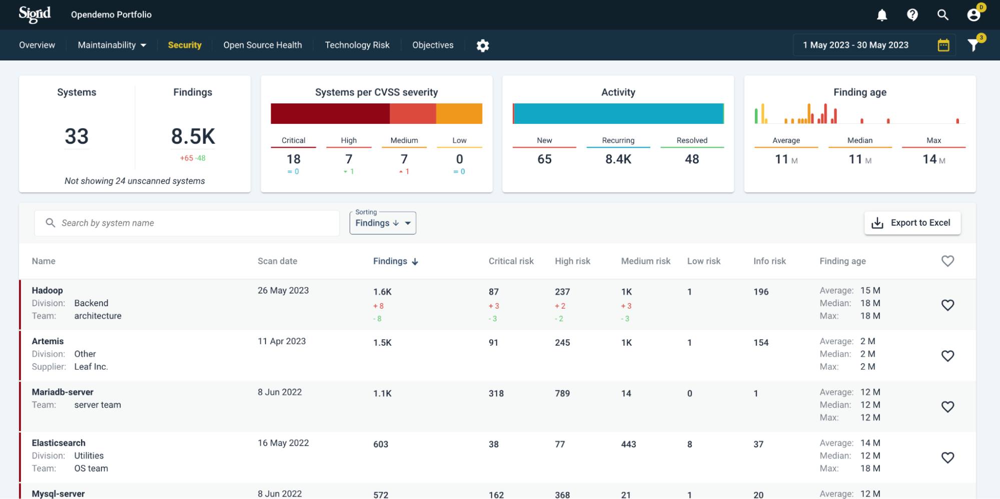
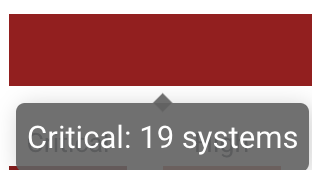
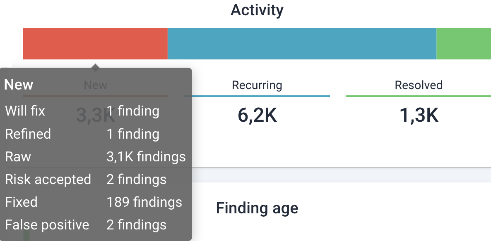
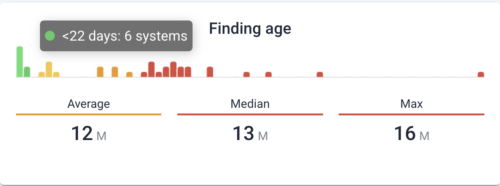
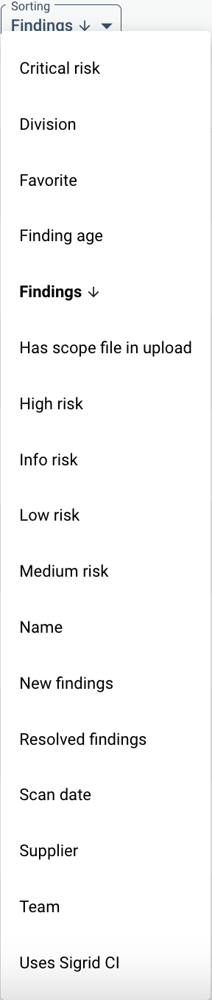
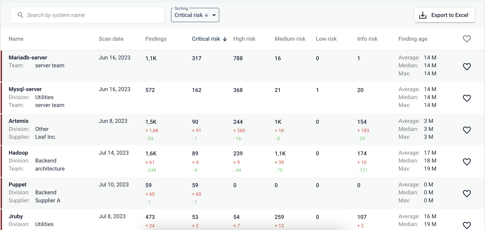

# Portfolio-level security
If you have a portfolio of systems in Sigrid and licenses enabled for Security, Security will be visible in the top bar.

Your URL will be of the convention https://sigrid-says.com/*[CLIENTNAME]*/-/open-source-health, whereas system details will follow https://sigrid-says.com/*[CLIENT-NAME]*/*SYSTEM-NAME*/-/open-source-health.

Another way to arrive here is clicking on the top capability tiles on the *Portfolio overview* page. See the [portfolio overview page](portfolio-overview.md#navigating-between-portfolio-and-system-level-views).

## Moving from portfolio level to system level
Since the portfolio view is a summary of system level findings, please refer to the [system-level view of Open Source Health](system-open-source-health.md). For example, clicking on a system name in the portfolio overview will bring you to the system's details. 

## Portfolio-level Security overview
The security overview page shows a summary of findings and estimated severity. From left to right, the tiles read as follows:

* *Systems and Findings*: the totals of systems being scanned and the sum of identified Findings. Below those counts, it shows the total changes over the selected time period. A mouseover shows an elaboration:

* *Systems per CVSS severity*: the count of systems where their highest-risk finding is in these risk categories, i.e.  *Low*,  *Medium*,  *High*, or  *Critical*. A mouseover on the colored bar shows the exact count:

* *Activity*: the count of *New*, *Recurring* and *Resolved* findings over the selected time period in the top right corner data selector. Note that the sums for *New* and *Resolved* are the same totals as shown in the *Findings* tile on the left. A mouseover on the colored bar shows the exact count:

* *Finding age*: the distribution (*Average*, *Medium*, or *Max*) of how old *unresolved* findings are, as number of systems. The mouseover shows the exact counts, as below.

In the bottom part of the screen, each system is shown with a summary of its counts: number of findings per *CVSS* risk category and *Finding age* counts. For larger portfolios it may be useful to sort these on different characteristics. Its menu, by default set on sorting order by total number of "*Finding*", is as follows:

 

Sorting can also be done per columns (here, the total number of "*Critical risk*" findings as an example). The top right bottom for exporting the data as a spreadsheet may be useful for further analysis. 

 

