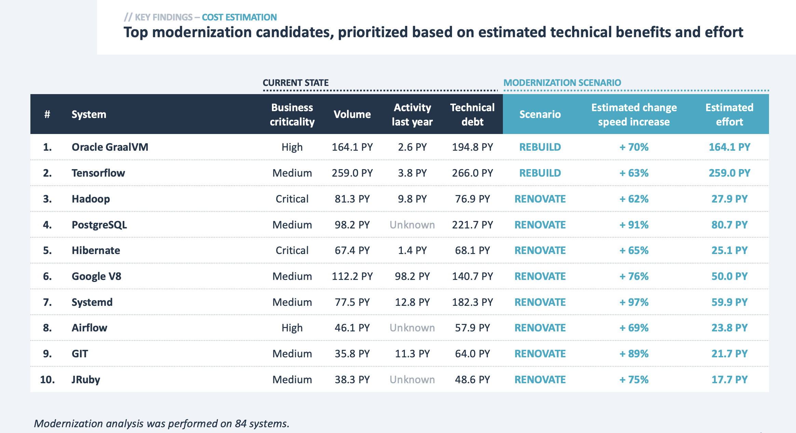

# Modernization report

Modernizing your software landscape is often a hard sell.

From the perspective of management there are many modernization initiatives, and the benefits of these initiatives are
often vague, while the costs are extremely clear and often significant. This means that, even though management
generally does agree that modernization is necessary, it won't be possible to execute every single initiative, as this
is simply not feasible from a cost perspective. Quantifying the expected effort versus expected benefits makes it 
easier for management to assess the return-on-investment for modernization initiatives.

From the perspective of architects, continuously evolving and modernizing the software landscape is essential to
ensure the landscape remains flexible and future-proof. In large landscapes, there are often areas that are outdated
in terms of technology, and other areas that suffer from excessive technical debt. Addressing these problems requires
significant investment, and it can be hard to convince management to prioritize modernization initiatives since those
investments will come, in the short term, at the expense of the functional roadmap. In the long term, modernization
initiatives are ultimately to the benefit of the organization, but it can be hard to "translate" these long-term
benefits into the language spoken by management. Having this shared languages will allow youto move forward by
balancing functional progress with modernization initiatives.

## The Sigrid modernization report

The [Sigrid Report Generator](https://github.com/Software-Improvement-Group/sigrid-integrations/tree/main/report-generator)
allows you to export a management report that contains information that can be used to discuss and prioritize
modernization initiatives. 

The modernization analysis considers both business context and technical aspects for each system in your landscape.
This results in the following report:

This table shows the top 10 "modernization candidates" in your landscape, which are systems that would benefit the
most from modernizat ion. This is obviously not the *only* information you would typically use for deciding your
modernization plan, but having concrete information on the technical impact is generally helpful for prioritization.

In this table, the black columns contain information that was used as input for the modernization plan:

- **Business criticality:** Taken from your [Sigrid metadata](../../organization-integration/metadata.md) for the
  system. Modernizing business critical systems will be given higher priority.
- **Volume:** Code volume in person years. Modernizing larger systems is generally more risky, but also potentially
  carries bigger benefits if the system is actively maintained.
- **Activity last year:** Shows how much code was changed during the last year. This gives you an indication on
  whether a system is actively maintained. Systems with a lot of development will benefit more modernization, since
  improving change speed is more relevant if there are many changes.
- **Technical debt:** The total amount of technical debt in the system, expressed in person years. Note that
  eliminating *all* technical debt in the system is often impossible and usually not cost-effective. Instead, the
  goal is to reduce technical debt to a manageable level.

The blue columns contain information on the chosen modernization scenario and the associated estimates:

- **Scenario:** The chosen modernization scenario, i.e. whether you choose to leave the system as-is, or to
  renovate/modernize it, or to rebuild the system entirely. See the section on
  [deciding on a modernization scenario](#deciding-on-a-modernization-scenario) for more information.
- **Estimated change speed increase:** The estimated increase in change speed after completion of the scenario.
  Estimated based on the SIG benchmark. You can see this as the scenario's "technical benefits". There are obviously
  other types of benefits, but this gives you concrete data in an area that is often abstract and hard to quantify. 
- **Estimated effort:** The estimated development effort, based on the SIG benchmark, that would be required to
  complete the scenario. You can see this as the scenario's "technical cost".

## Deciding on a modernization scenario

Defining your overall modernization plan depends on more factors than just technical debt. You can therefore define
your expected modernization scenario for each system using Sigrid's
[metadata](../../organization-integration/metadata.md).

The modernization report will consider each system's life cycle phase when proposing a scenario. For example, 
if a system is in initial development, Sigrid will never propose to rebuild it, since the system is already 
being (re)built. Similarly, if a system has been marked as end-of-life, Sigrid will never propose to renovate that
system. 

In other words, Sigrid will not propose a plan to your from scratch. It will use the existing information, that
you have likely based on criteria and factors that Sigrid cannot even see. You can then use Sigrid to give you
estimates based on SIG's benchmark, which then act as a second opinion on what executing this plan is going to bring.

## Tracking modernization scenarios

After deciding on a modernization plan, you obviously want to track the execution of the scenario. Modernizing large
software landscapes can often take several years. You ultimately want modernization initiative to ensure they
produce results that are useful to the business.

However, discusion about the usefulness of each initiative tends to be mostly up-front. Once people have actually 
started their modernization plan, it becomes hard to track if the expected benefits actually materialize. Also, the 
situation can change while the modernization is in progress, meaning some assumptions that were orginally made are 
no longer true. This is why it's important to track whether you are still on target to actually achieve the expected
benefits. If not, you might want to pivot into a new direction, or choose to abandon your original plans entirely.

Once you've decided on your modernization plan, you can configure the desired outcomes as Sigrid
[objectives](../../capabilities/objectives.md) across your portfolio. You can then track these objectives
using Sigrid's [objectives dashboard](../../capabilities/portfolio-objectives.md). 

## References

Effort estimation is a sensitive topic, which is why many people want to know more about how these estimates are
produced. Sigrid uses SIG's benchmarking and cost estimation approach to produce these estimates. 
This methodology is derived from prior work by SIG's research department, most of which has been previously published
in research papers:

- An empirical model of technical debt and interest (Proceedings of the 2nd workshop on managing technical debt)
- What is the value of your software? (Third International Workshop on managing technical debt)
- Faster issue resolution with higher technical quality of software (Software Quality Journal)
- Benchmarking technical quality of software products. 15th working conference on reverse engineering, IEEE)
