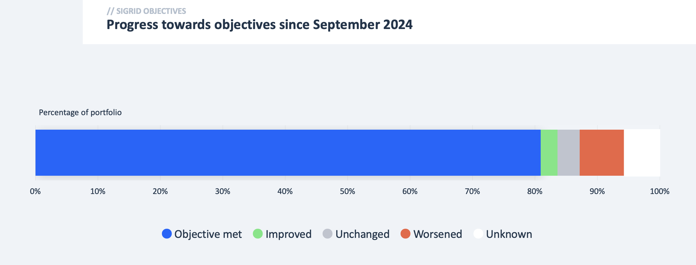
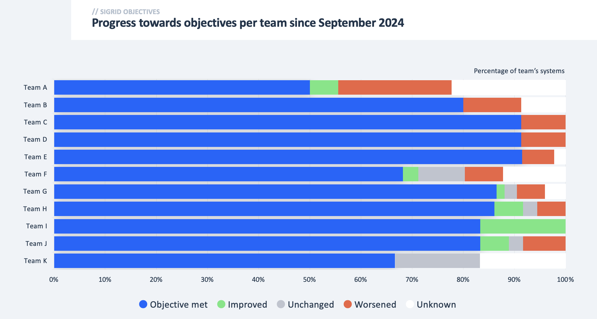
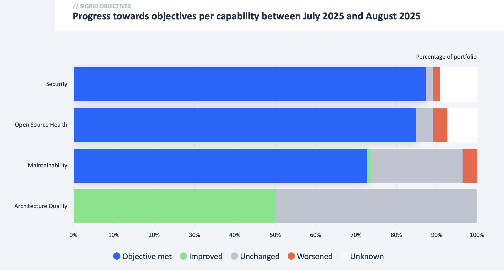
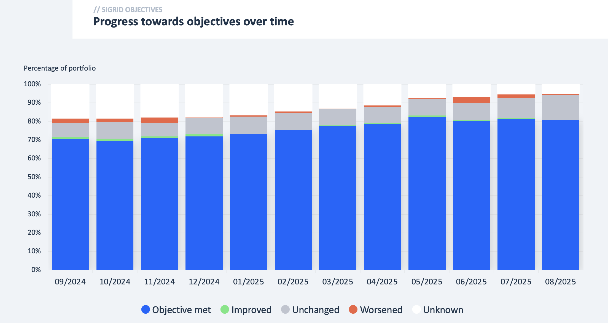

# Objectives report

The objectives report reports on progress towards your [Sigrid objectives](../portfolio-objectives.md) over a certain
time period. The contents of this report are similar to what you can find in Sigrid's objectives dashboard, and can
be used in a reporting scenario where the recipients of the report don't use Sigrid.

You can create this report using the
[Sigrid Report Generator](https://github.com/Software-Improvement-Group/sigrid-integrations/tree/main/report-generator).

## Report contents

The report starts with a very simple overview that displays which part of the portfolio meets the objectives.
In addition to the current state, it also focuses on what changed within the reporting period: What part of the
portfolio is improving towards the objectives, and what part of the portfolio is getting worse? Note the reporting
period for these comparisons is configurable.

The overall summary is then followed by three breakdown sides:

- The first breakdown focuses on *teams*: Which teams have improved, and which teams are struggling?
- The second breakdown focuses on *capabilities:* How are the various objectives progressing on a content level?
- The third breakdown focuses on the *long-term trend*: How are things progressing structurally? This can help to
  differentiate between incidents and structural problems.

The report concludes with a section on more detailed insights. This section generally uses the same visualizations
as described above, but with a more detailed scope.
