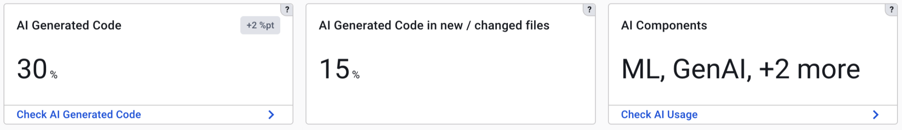
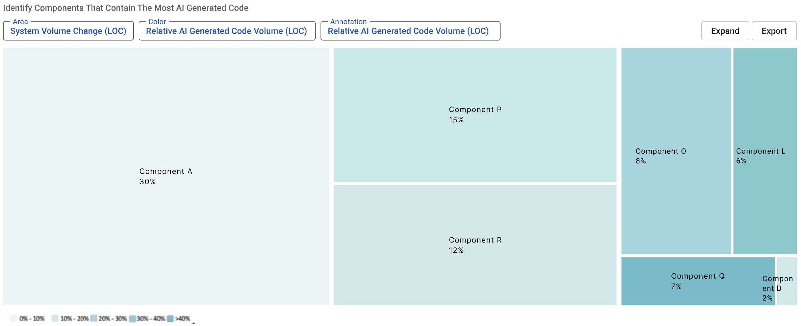
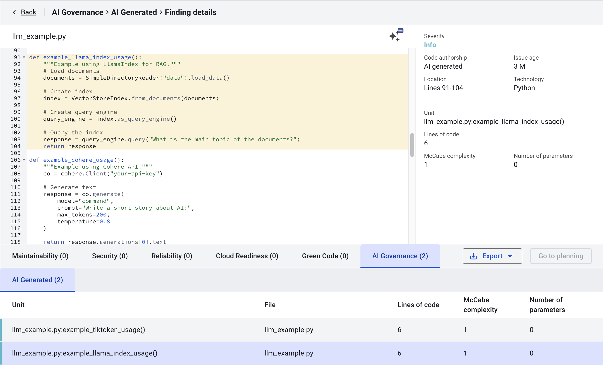
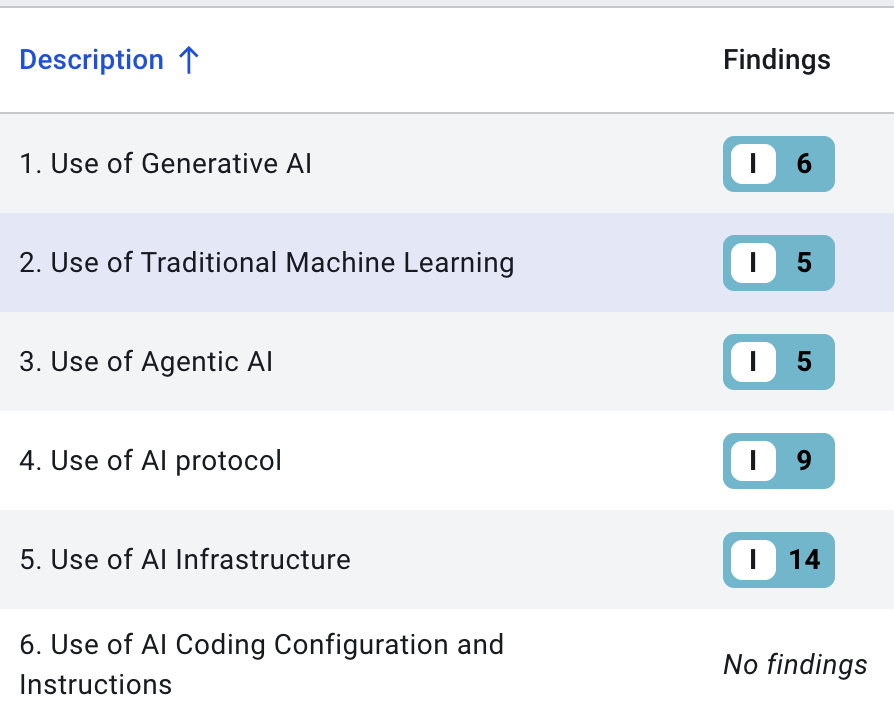
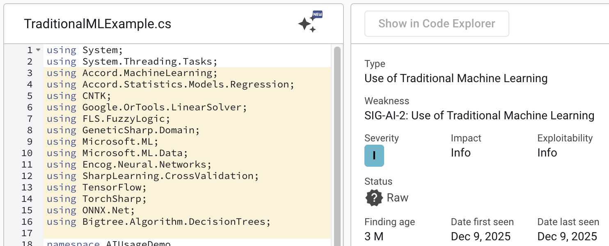

# AI Governance

Enterprises are rapidly adopting AI technologies and AI Coding Assistants to build new generations of software products.
The AI ecosystem is rapidly evolving, with new models, tools and frameworks becoming available on almost a daily basis.
One of the challenges large enterprises face while adopting AI technologies is the lack of visibility into where AI is used within the Software Landscape.
Sigrid's AI Governance module helps with identifying the use of AI across the portfolio.

## Use Cases

### Visibility and Adoption

**Track AI generated code across the portfolio**

- Which of our teams are already using AI-assisted coding?
- How much of our new code is AI-generated?

**Track AI technologies across the portfolio**

- In which systems are we using AI technologies, such as Machine Learning models, Large Language Models, AI Cloud Services, etc?
- What kind of AI technologies are we using in our portfolio? Identify AI technologies ranging from Traditional Machine Learning to AI Agents that perform autonomous tasks.
- Which libraries and frameworks are we using for building AI systems? Helps AI Architecture teams with the visibility they need to prevent AI sprawl across the portfolio.
- Have we identified all systems subject to the AI Act?

### Technical Risks

- Are we in control of technical risks in AI generated code, such as Maintainability and Security?
- Do we introduce technical debt by integrating AI generated code?
- How does the quality of AI generated code compare to manually written code?

## Navigating the AI Governance

If AI Governance is available for your system, you can reach this view via the top menu, or by clicking on a capability on the System or Portfolio Overview pages. See the [system-level Overview page](system-overview.md#navigating-to-capabilities) or [portfolio-level Overview page](portfolio-overview.md#navigating-to-capabilities).

### AI Governance overview

The overview page provides an overview of key AI Governance metrics for a given system:

**AI Generated Code**

Provides an estimate on the relative amount of AI generated code currently in a system. In addition, it provides 
trend information indicating if the use of AI Coding Assistants is increasing or decreasing.
From this tile it is possible to navigate to the Code Explorer to inspect the detected AI generated code in the system.

The treemap visualizes the amount of AI generated code in architecture components within the system. This helps 
with understanding AI Code hotspots at the architecture level.
Clicking on an architecture component in the treemap navigates the user to the Code Explorer for inspecting any identified AI generated code in an architecture component.

Code Explorer contains an AI Governance tab where identified AI generated code can be inspected.

**AI Generated Code in New / Changed files**

Provides an estimate on the relative amount of AI generated code in files that were changed or newly added in the 
selected timeframe. This metric provides insights into the extent to which AI Coding Assistants were used to produce new code or to make code changes in the selected timeframe.

**AI Technologies**

Provides a quick summary indicating what kind of AI technologies are used in this system. Examples of AI Technologies that would be reported are the use (or training) of a Machine Learning model, invocations of Large Language Models or use of AI Cloud Infrastructure (such as Google Vertex, Azure AI Foundry, AWS Bedrock).
From this tile it is possible to navigate to the AI Technologies page that allows for drilling down to the code level to inspect the use of AI in a system.

The AI Technologies page categorizes AI according to the following classification:

- Use of Generative AI: Where in our code are we invoking LLMs or using related technology?
- Use of Traditional Machine Learning: Where in our code are we using or training ML models?
- Use of Agentic AI: Are we using technology for building autonomous AI Agents?
- Use of AI Protocol: Are we using AI Protocols such as Model Context Protocol, Agent 2 Agent or Agent Communication Protocol?
- Use of AI Infrastructure: Are we using AI-related infrastructure, such as for example AI Cloud platforms or related technology such as Vector Stores?
- Use of AI Coding Configuration and Instructions (coming soon): Do we store artifacts in our code base related to instructions, policies and rules for AI Coding Assistants?

From the category overview it is possible to navigate to the code level to inspect the use of AI technologies in a system:

## Technology Support

**AI Generated Code Detection**

Sigrid detects AI-generated code based on the unique stylometric features of code generated by LLMs and code written 
by humans.
Detection happens at the level of units of code (typically methods or functions).
Units of code that contain less than 5 lines of code are not evaluated, as they do not contain enough signal to perform reliable classification.

Current detection accuracy ranges from 95% - 99%, which means that approximately 19 out of 20 code snippets are correctly classified.
In a large system it is not unusual to have a number of incorrectly identified code snippets.
The goal of Sigrid's AI Governance is not to identify every single AI-generated code snippet correctly, but to 
provide high level insights at portfolio level with enough accuracy (>95%) to perform AI Governance activities.
Below are the currently supported Programming Languages and Large Language Models.

Programming Languages:
- Java
- Python
- C#
- TypeScript (coming soon)

Supported Large Language Models:
- OpenAI GPT-4o
- OpenAI GPT-4.1
- OpenAI GPT-5
- OpenAI GPT-5.2
- Claude Sonnet 3.5
- Claude Sonnet 4
- Claude Sonnet 4.5
- Claude Opus 4.5

Support for new models happens quarterly.

**AI Technology Detection**

Sigrid supports over 300 checks to identify AI technologies in Python, Java and C#.
