# The Code Explorer and Technical Monitor
This page describes the functionality of the "*Code Explorer*" and the *Technical Monitor*". Both  can be used for deeper code analysis regarding code quality. The "*Technical Monitor*" may be considered Sigrid's predecessor and as such is not actively being maintained, but still offers a powerful view different from the "*Code Explorer*" that can help you in your analysis. 

For a general approach analyzing maintainability metrics, see the section for [investigating system maintainability rating state and -changes](system-maintainability.md#investigating-system-maintainability-rating-state-and--changes). 

## Use the code Explorer if you suspect specific maintenance hotspots and want to understand the details
The Code Explorer view lets you explore a system’s codebase and maintainability findings that are associated with it. It is visible by default for all systems. 

In a way, it is the reverse of all the finding views, such as [maintainability](system-maintainability.md) and [security](system-security.md). There you start with lists of findings, ordered by the findings' severity. Then you can investigate where they occur in the code. So these views answer different questions: *"Where are my highest quality risks in the code?"* (*Findings* and *Maintainability* tabs) or *"Given a certain file, what are all the risks that could be assessed/refactored?"* (*Code Explorer*). 

You can reach this view in different ways: Via the top menu, or clicking an a capability on the System or Portfolio *Overview* pages. See the [system-level Overview page](system-overview.md#navigating-to-capabilities) or [portfolio-level Overview page](portfolio-overview.md#navigating-to-capabilities). Also, you may be referred to the Code Explorer page by clicking its icon , e.g. on a *Delta quality* detail page ([see elaboration on the Delta Quality page](system-delta-quality.md#navigating-to-the-code-explorer)) or the detail view of a *Refactoring candidate* [see the Refactoring candidate elaboration in the system maintainability page](system-maintainability.md#refactoring-candidates). 

### Different views: directory or component structure
The default view lets you choose between a directory structure. It represents the structure as the source is unpacked at our (SIG's) side.   

By default the structure is collapsed. It can be expanded (or be undone) with the top right icons:

The directory view and component view in most cases are (almost) the same. This can be a matter of how the system is defined or scoped. Scoping choices may allow for specific filtering and componentization, e.g. a component division that does not follow the directory structure or [when you are working with multiple repositories](faq.md#we-have-a-multi-repo-project-can-i-still-use-sigrid-ci). For details on scoping, see the [scope configuration page](../reference/analysis-scope-configuration.md).

### Navigating a directory or component in the Code Explorer
Clicking on a *directory* or *component* will make 2 panels appear to the right: sources (on top) and findings (on bottom). The panels will change dynamically, depending on e.g. which file and finding you select. By default, a treemap represents the collection of files. The size of the squares/quadrilaterals represents code volume. A mouseover on a file shows volume- and finding counts. In the lower right panel, *Maintainability* and its metric *Duplication* are shown by default. They can be changed according to interest. 

### Navigating a file in the Code Explorer
Clicking on a *file* will show its source in the top panels. By default, focus in the top panel will jump to the first duplication finding. Findings are highlighted on a yellow/orange spectrum. If 2 or more findings overlap, the overlapping space will be accented with a darker shade. By default (when not clicking a specific finding in the bottom panel), a colored slide on the left of the code lines will reflect where findings are present. A mouseover shows the findings:

If you click on one specific finding in the bottom panel, only the shade will remain, highlighting that one finding. Sigrid assumes that if you choose a specific finding, you are only interested in that finding at the moment, so it filters the other findings from view. 

Clicking on one of the finding characteristics again (e.g. *Duplication*) will bring back the afore mentioned slide/indication of multiple findings.

If desired, you can fold code blocks - based on curly brackets *{* and *}* - by clicking the downwards pointing triangle.

### Assisting in planning with issue tracker text 
Findings that you wish to solve later on can be exported as text with static links for your issue tracker.

## The Technical monitor
As mentioned in [the system maintainability page](system-maintainability.md#technical-monitor-and-code-explorer), the "*Technical Monitor*" may be considered Sigrid's predecessor and as such is not actively being maintained. Its functionality and views will eventually be moved to Sigrid, notably in [the Maintainability overview page (doc page)](system-maintainability.md#maintainability-overview) and *Code Explorer*. It does have distinguishing features that are helpful for your analysis.

The "*Technical Monitor*" can be accessed from the Maintainability Overview page [see our system Maintainability page](system-maintainability.md#technical-monitor-and-code-explorer). 

The top menu is as follows:

To simplify explanations of the contents of the "*Technical Monitor*", the differences or resemblances with Sigrid are emphasized below. 

### Landing page: Home

The landing page shows a dashboard of which most elements are emulated in Sigrid, mostly in the Maintainability Overview page ([see the respective section on its documentation page](system-maintainability.md#maintainability-overview)).

* The metrics overview and "*Rating changes*" bar chart are part of the Maintainability Overview in Sigrid. 
* The graphs for "*Maintainability trend*", "*Changes*" and "*Volume*" can be created in the same Sigrid page by switching from the default treemap to "*Trend graph*" or "*Bar chart*". As in Sigrid, individual metrics can be turned on and off by clicking on their colored icons.
* In the bottom right corner, the largest duplicates are shown. In Sigrid, these will be visible under "*Refactoring candidates*" [see documentation section](system-maintainability.md#refactoring-candidates). Note that normally test files will be excluded from maintainability scope, in accordance with [Sigrid's system definitions](../organization-integration/systems.md) and [analysis scope configuration documentation page](../reference/analysis-scope-configuration.md).

### Maintainability dashboard

The dashboard lands on the system level metrics with doughnut charts. The other visualizations are all bar charts or area charts (under "*Trends*") that can be recreated in Sigrid by changing the treemap in the "*Maintainability Overview*" into a bar chart.  

In the sidebar, different views can be selected. In this example, "*Rating changes*". 

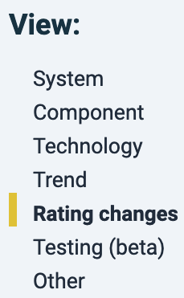

Under *"Other"*, the chart for a distribution of different duplication categories cannot yet be created in Sigrid, but its detailed information is available under "*Refactoring candidates*" under "*Duplication*". 

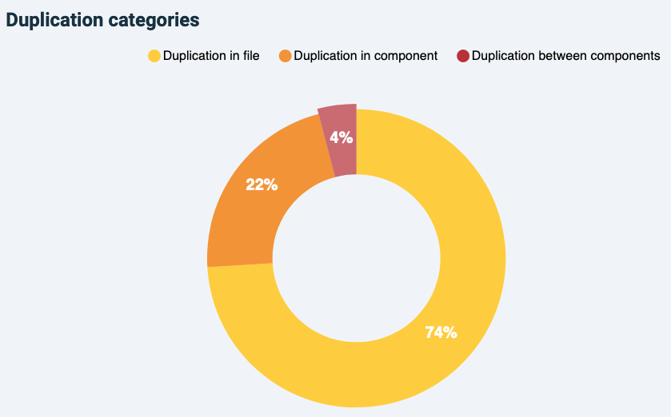

### Metrics

The "*Metrics*" tab shows the metrics per snapshot one-by-one. Following the left-hand menu from top to bottom, by default this page lands on "*Production code*", "*System level*" and "*Overview*". With this left-side menu, you can take different routes to navigate to steer your analysis. Note that code in the categories of "*Test code*" and "*Generated code*" do not count for a system's maintainability rating. They are configured as such in the system's scoping ([see scoping documentation](../reference/analysis-scope-configuration.md)).

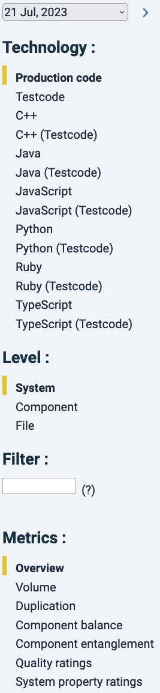

**Every click in this menu acts as a filter and the assumed order is from top to bottom**. For example, you could keep "*Production code*" untouched, click on "*Component level*", and see main metrics for all technologies combined per component. But if you are interested only in one particular technology, you could click "*Java*" first, and then move to "*Component*" level, "*File*" level or "*Unit*" level. 

Note that with the Production code filter as a default, only a select number of metrics are shown, i.e. those that can be calculated on a system level. That list changes dynamically based on the technology and analysis level that you have selected. This is because not all metrics are available for each technology, because e.g. for XML-based languages "*Module coupling*" cannot meaningfully be calculated. 

In the top of this filter menu there is a date selector. Date changes in the "*Metrics*", "*Compare Snapshots*" or "*Dependency graph*" tabs need to be confirmed by clicking on the forward arrow .

The "*Filter*" text box allows simple text search for file or unit names in the results (i.e. no regular expressions or "\*" wildcards).

Every column can be sorted by clicking on its name. Arrows will appear next the column name pointing to the sorting order ( *descending* and  *ascending*). Clicking the column again will reverse the order. In combination with a relevant technology/analysis level/metric filter, sorting code a powerful way to find hotspots, especially when comparing different risk categories. 

As an example, sorting files by "*Duplication*" percentage would show which files relatively have most duplicated code. Note that "redundant code" is a function of that duplication and is >=50% of duplication: if a piece of 10 lines of code appear 2 times, 10 lines are theoretically redundant. If it appears 3 times, 20 lines would be redundant.

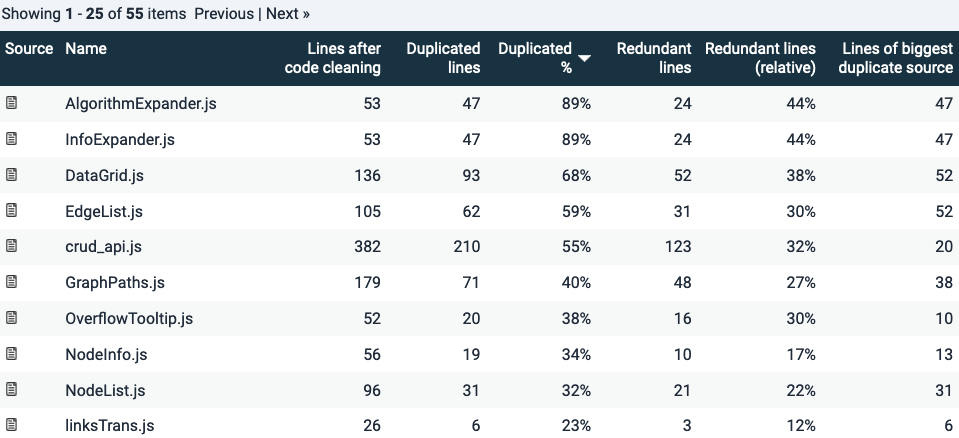

Duplication is a simple example because it has a binary quality: code is either duplicated or it is not. Other metrics (*Volume* excluded, clearly) have different risk categories. Therefore code can be sorted according to those categories. 

In the example below for "*Unit size*", since we are looking at File level Java code. Here files are ordered by the number of Lines Of Code (LOC) in the 61+ LOC category. Since a file generally has multiple units (not necessarily so), looking at the volume numbers in each column will tell you how the metric distributes over the file. This is summarized as percentages (the next 4 columns), that add up to ~100% (because of rounding errors). The percentual distribution of certain metric risk categories may be useful because it says something about the relative risk within a file. That may suggest a maintenance difficulty hotspot.

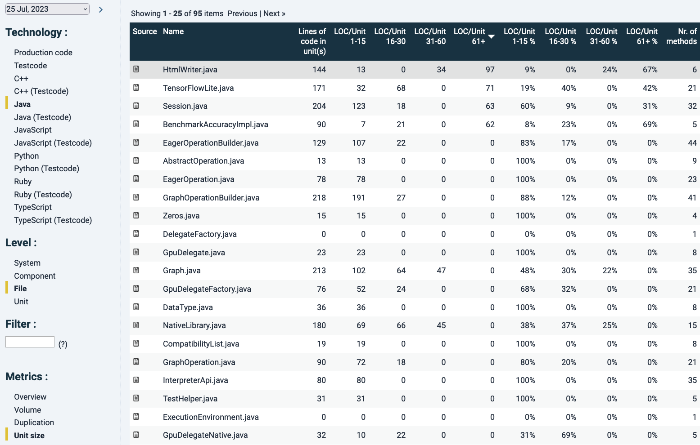

Note that in the column "*Lines of code per unit(s)*" here a unit means a file, since we are now looking at file level. It is the sum of the LOC in units. In this case the top result is highlighted in grey because of hovering aver with the mouse.

The  icon in the most-left "*Source*" column will bring you to its source code. If you do this while looking on file-level, it will show you the source code of the whole file, without distinguishing between units within the file, see below:

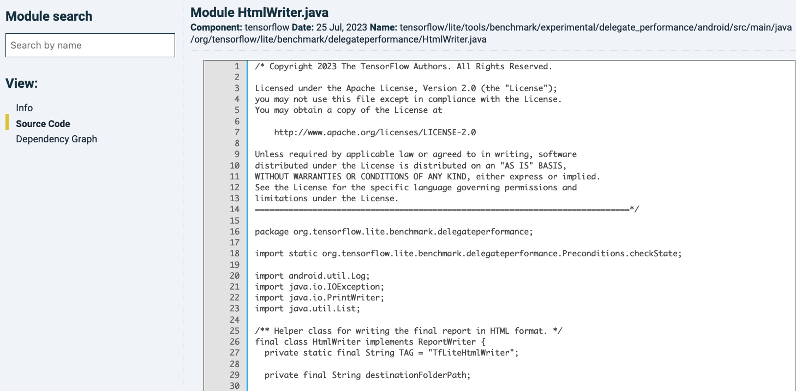

The left-hand menu offers extra views. Clicking "*Info*", you see a summary of metrics that can be calculated on file-level. You can click on the metrics (excluding "*Volume*" and "*Duplication*"), which offer metric details. For the unit metrics, those are summary tables divided into the file's units. You would get the same information by analyzing the same file in the former step and clicking the file-name. That is a different path to also bring you to these unit-level details.  

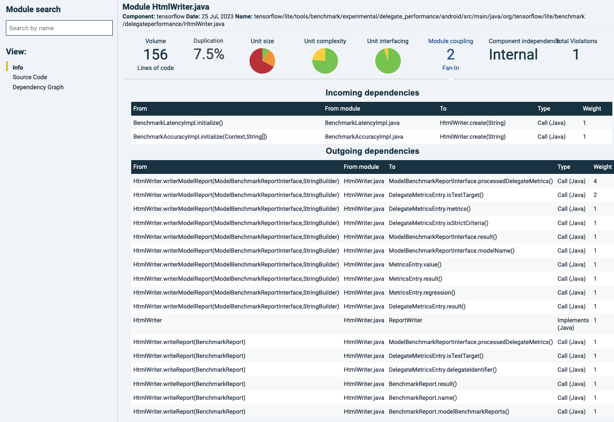

As an example, "*Module coupling*" is chosen here in the main panel by clicking on its name. Since this metric is concerned with a combination of the number of incoming calls (*"fan-in"*) and file/module size, below, the connections and their directions are shown per file, type and destination. *"Weight"* refers to the number of calls. 

As a general note, keep in mind that "*Module coupling*" as a metric tends to need some deeper analysis to understand what the source of metric changes are. Because the file's "*fan-in*" is central in its estimation of coupling, the calls can originate from anywhere else in the code. That means that when a file's "*Module coupling*" rating drops, the main code change has almost certainly occurred elsewhere (a removal in the receiving file would require removals in its callers as well).

Choosing *"Dependency graph"* in the left-side menu, the dependencies around this file are highlighted. Numbers on the dependency lines represent the total number of calls.

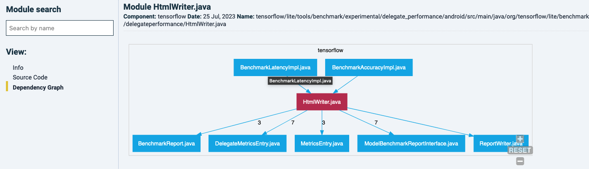

You can navigate to other files in this graph by clicking on it, and it will show it owns dependency graph. For example, one of the files that is calling the latter one:

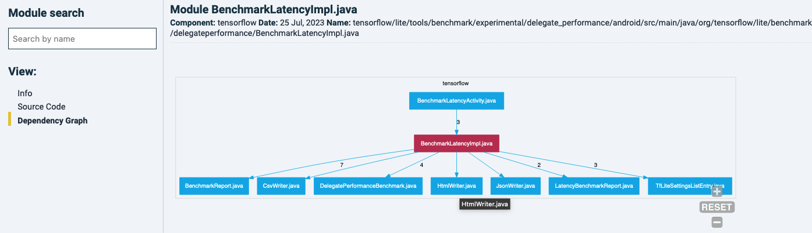

Coming back to the unit size example with the file overview, sorted by LOCs in units with 61+ LOC. Clicking on the filename will bring you its constitution into units. Also notice how the left-hand menu has moved from File-level to Unit-level. 

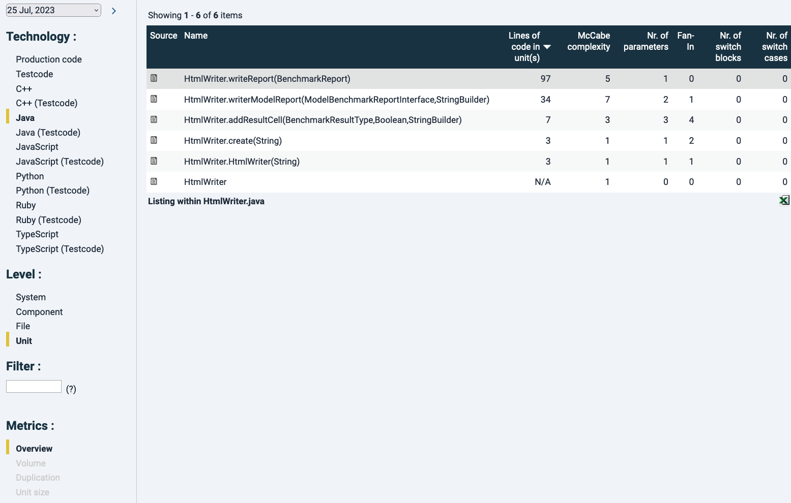

By choosing a particular unit in the list, you will land at the source code where the respective unit has been highlighted in yellow, see below:

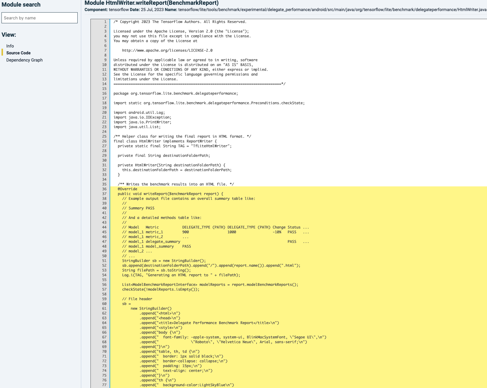

The information that can be shown by changing view in the left menu is the same as in the file-level view, because that data is calculated on file-level.

### Compare snapshots

Compare snapshots offers the same functionality as the Metrics tab, plus it focuses on differences between snapshots. In that way, you can analyze further which & how files have changed and how they have influenced maintainability ratings.

### Change quality
This tab will directly link to the "*Delta quality*" tab in Sigrid. See the [Delta quality documentation page](system-delta-quality.md).

### Violations
The Violations tab will show, per technology, its maintainability violations (like risky constructs) and extra information where these can be traced back. This dependes on the technology chosen. Similar to other finding detail pages in the Technical monitor, each finding will be highlighted by yellow marking. As an example, for Java, next to maintainability metrics, there is a category of "*severe violations*" that includes exception handling with empty catch-blocks (see below).

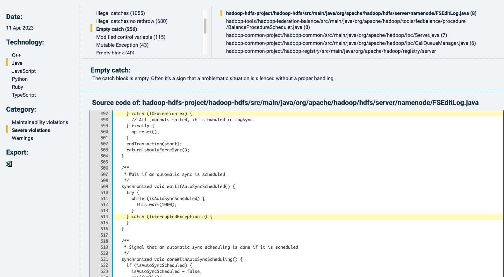

The "Warnings" category lists, if available, undesirable code contents such as TODOs or commented-out code, for example:

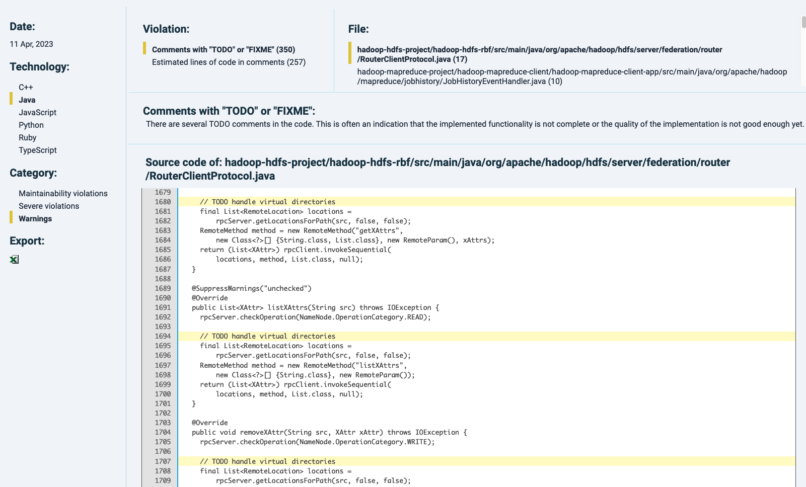

### Duplication
This tab is dedicated to showing ad filtering code duplicates. 

In Sigrid, different duplicate instances are shown next to each other in the "*Duplication*" section of "*Refactoring candidates*" (i.e. at https://sigrid-says.com/[Client]/[System]/-/maintainability/refactoring-candidates/duplication).

In the sidebar, filters can be applied to e.g. only show duplicates of a defined minimum length, or exclude certain components.

The  icon in the "*Source*" column will bring you to its source code, anchoring at the top of the duplicate and highlighted in a dark shade of yellow). Other duplicates in the same file are also highlighted, in a lighter yellow shade.

### Dependency graph

In the Dependency graph view, you can filter on technology and type of calls, as shown in the menu on the left:

Clicking on a number related to a dependency line will bring you to the dependency details, similar to Sigrid's detail page of the *Component Dependencies* tab ([see the relevant paragraph in the system maintainability documentation](system-maintainability.md#component-dependencies)). The position of components cannot be changed visually. It is possible though to recalculate the dependency graph of an earlier date. This can be powerful to trace back architectural changes over time.

### Documentation
Explanations relevant for the Technical monitor are in Chapter 4. However that document is not being maintained. The current state of functionality will be on this page. 
