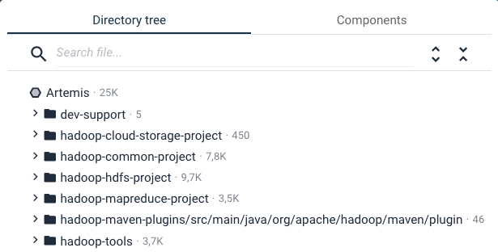
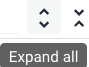
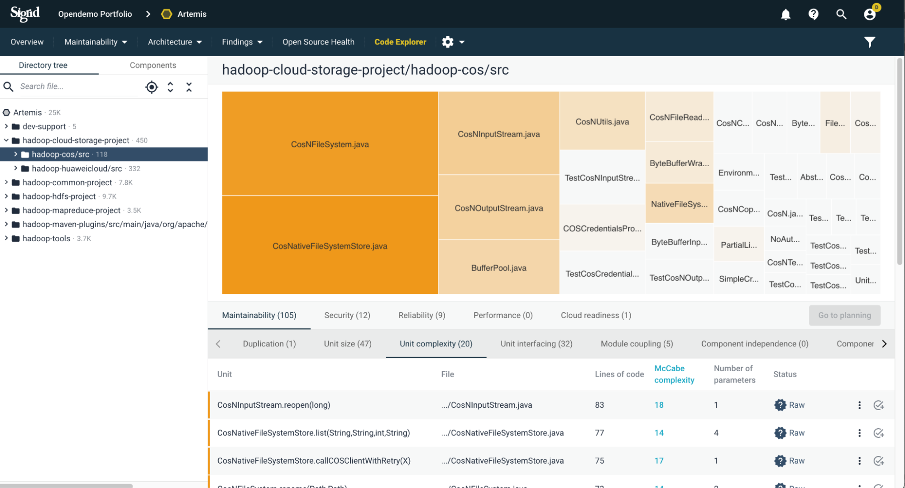
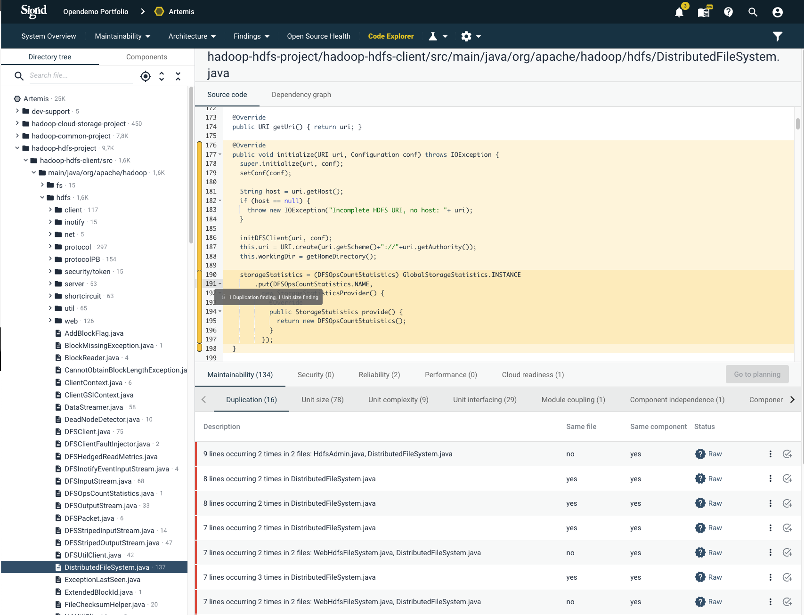
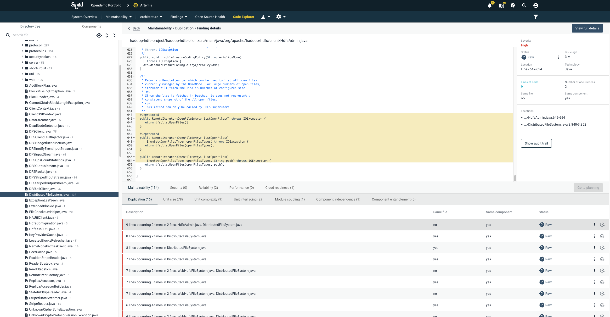
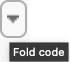
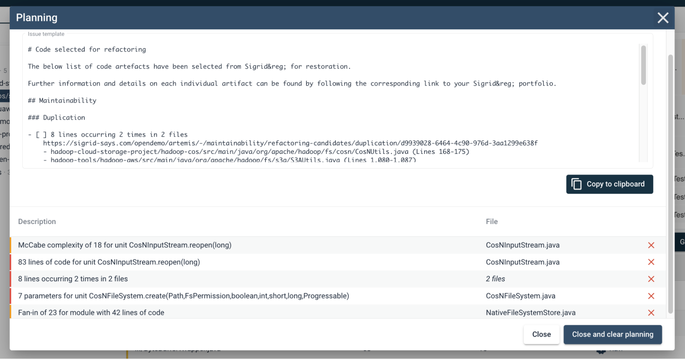
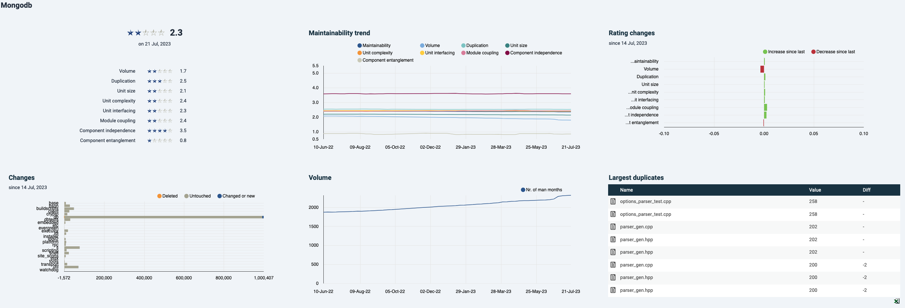
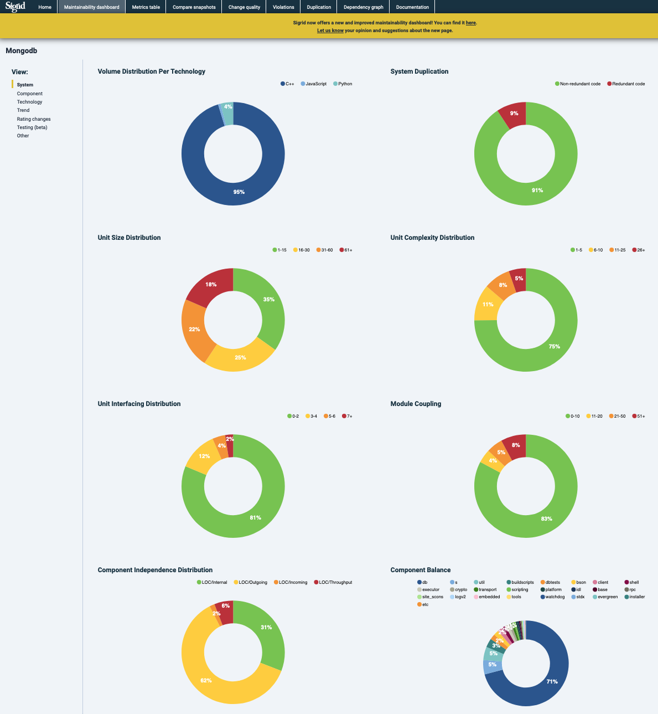
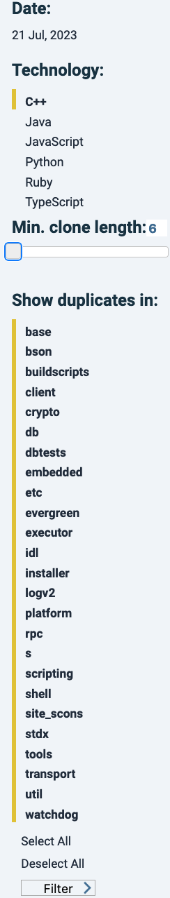

# The Code Explorer

This page describes the functionality of the Code Explorer, which can be used for deeper code analysis regarding code quality. For a general approach analyzing maintainability metrics, see the section for [investigating system maintainability rating state and -changes](system-maintainability.md#investigating-system-maintainability-rating-state-and--changes). 

## Use the code Explorer if you suspect specific maintenance hotspots and want to understand the details
The Code Explorer view lets you explore a system’s codebase and maintainability findings that are associated with it. It is visible by default for all systems. 

In a way, it is the reverse of all the finding views, such as [maintainability](system-maintainability.md) and [security](system-security.md). There you start with lists of findings, ordered by the findings' severity. Then you can investigate where they occur in the code. So these views answer different questions: *"Where are my highest quality risks in the code?"* (*Findings* and *Maintainability* tabs) or *"Given a certain file, what are all the risks that could be assessed/refactored?"* (*Code Explorer*). 

You can reach this view in different ways: Via the top menu, or clicking an a capability on the System or Portfolio *Overview* pages. See the [system-level Overview page](system-overview.md#navigating-to-capabilities) or [portfolio-level Overview page](portfolio-overview.md#navigating-to-capabilities). Also, you may be referred to the Code Explorer page by clicking its icon , e.g. on a *Delta quality* detail page ([see elaboration on the Delta Quality page](system-delta-quality.md#navigating-to-the-code-explorer)) or the detail view of a *Refactoring candidate* [see the Refactoring candidate elaboration in the system maintainability page](system-maintainability.md#refactoring-candidates). 

### Different views: directory or component structure
The default view lets you choose between a directory structure. It represents the structure as the source is unpacked at our (SIG's) side.   

By default the structure is collapsed. It can be expanded (or be undone) with the top right icons:

The directory view and component view in most cases are (almost) the same. This can be a matter of how the system is defined or scoped. Scoping choices may allow for specific filtering and componentization, e.g. a component division that does not follow the directory structure or [when you are working with multiple repositories](faq.md#we-have-a-multi-repo-project-can-i-still-use-sigrid-ci). For details on scoping, see the [scope configuration page](../reference/analysis-scope-configuration.md).

### Navigating a directory or component in the Code Explorer
Clicking on a *directory* or *component* will make 2 panels appear to the right: sources (on top) and findings (on bottom). The panels will change dynamically, depending on e.g. which file and finding you select. By default, a treemap represents the collection of files. The size of the squares/quadrilaterals represents code volume. A mouseover on a file shows volume- and finding counts. In the lower right panel, *Maintainability* and its metric *Duplication* are shown by default. They can be changed according to interest. 

### Navigating a file in the Code Explorer
Clicking on a *file* will show its source in the top panels. By default, focus in the top panel will jump to the first duplication finding. Findings are highlighted on a yellow/orange spectrum. If 2 or more findings overlap, the overlapping space will be accented with a darker shade. By default (when not clicking a specific finding in the bottom panel), a colored slide on the left of the code lines will reflect where findings are present. A mouseover shows the findings:

If you click on one specific finding in the bottom panel, only the shade will remain, highlighting that one finding. Sigrid assumes that if you choose a specific finding, you are only interested in that finding at the moment, so it filters the other findings from view. 

Clicking on one of the finding characteristics again (e.g. *Duplication*) will bring back the afore mentioned slide/indication of multiple findings.

If desired, you can fold code blocks - based on curly brackets *{* and *}* - by clicking the downwards pointing triangle.

### Assisting in planning with issue tracker text 
Findings that you wish to solve later on can be exported as text with static links for your issue tracker.

## The Technical monitor
As mentioned in [the system maintainability page](system-maintainability.md#technical-monitor-and-code-explorer), the "*Technical Monitor*" may be considered Sigrid's predecessor and as such is not actively being maintained. Its functionality and views will eventually be moved to Sigrid, notably in [the Maintainability overview page (doc page)](system-maintainability.md#maintainability-overview) and *Code Explorer*. It does have distinguishing features that are helpful for your analysis.

The "*Technical Monitor*" can be accessed from the Maintainability Overview page [see our system Maintainability page](system-maintainability.md#technical-monitor-and-code-explorer). 

### Landing page: Home

Landing page dashboard:

In the bottom right corner, the largest duplicates are shown. Note that normally test files will be excluded from maintainability scope, in accordance with [Sigrid's system definitions](../organization-integration/systems.md) and [analysis scope configuration documentation page](../reference/analysis-scope-configuration.md).

Top menu:

### Maintainability overview

Doughnut charts system level metrics

Area chart:
@@

Sidebar, example "*Rating changes*"

### Metrics

Date changes in the "*Metrics*", "*Compare Snapshots*" or "*Dependency graph*" tabs need to be confirmed by clicking on the forward arrow .

### Compare snapshots

### Change quality
This tab will directly link to the "*Delta quality*" tab in Sigrid. See the [Delta quality documentation page](system-delta-quality.md).

### Violations

### Duplication
This tab is dedicated to showing ad filtering code duplicates. 

In Sigrid, different duplicate instances are shown next to each other in the "*Duplication*" section of "*Refactoring candidates*" (i.e. at https://sigrid-says.com/[Client]/[System]/-/maintainability/refactoring-candidates/duplication).

In the sidebar, filters can be applied to e.g. only show duplicates of a defined minimum length, or exclude certain components.

The  icon in the "*Source*" column will bring you to its source code, anchoring at the top of the duplicate and highlighted in a dark shade of yellow). Other duplicates in the same file are also highlighted, in a lighter yellow shade.

### Dependency graph

You can filter on technology and type of calls, as shown in the menu on the right:

Clicking on a number related to a dependency line will bring you to the dependency details, similar to Sigrid's detail page of the *Component Dependencies* tab ([see the relevant paragraph in the system maintainability documentation](system-maintainability.md#component-dependencies)). The position of components cannot be changed. It is possible to recalculate the dependency graph of an earlier date . 

### Documentation
Explanations relevant for the Technical monitor are in Chapter 4. However that document is not being maintained. The current state of functionality will be on this page. 
