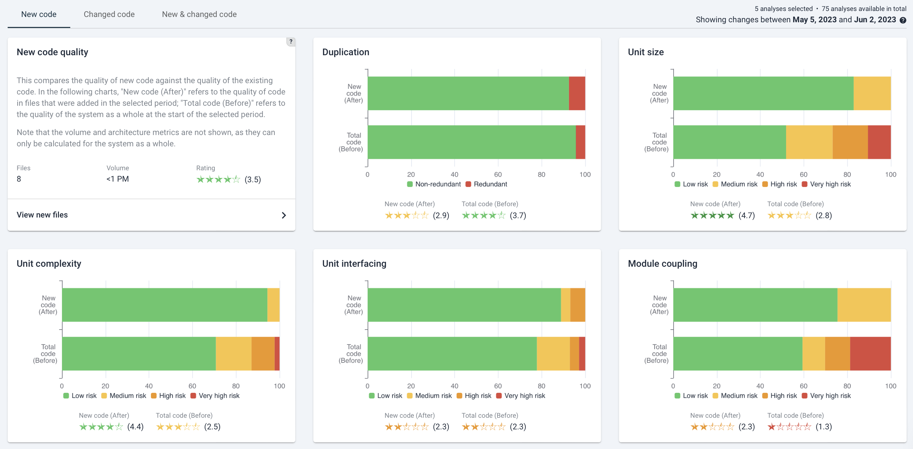
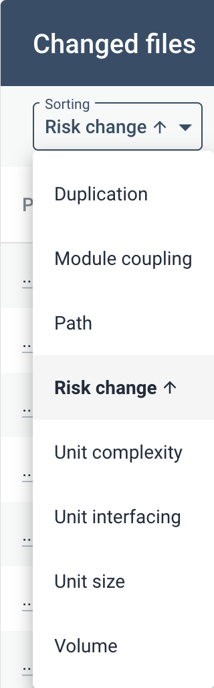
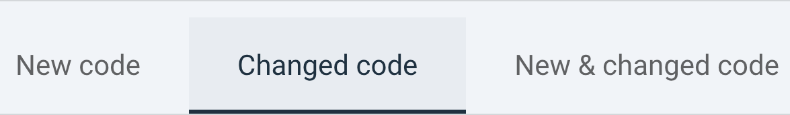
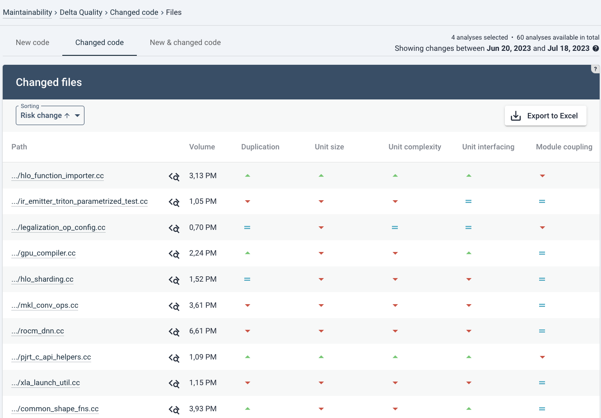

# System-level Delta quality
Delta quality is a part of the system maintainability analysis. As such it is default for all systems. It requires more than 1 snapshot to make a comparison. Delta quality tells you 

## Navigating to Delta quality view
You can reach this view in different ways: Via the top menu, or clicking an a capability on the System or Portfolio *Overview* pages. See the [system-level Overview page](system-overview.md#navigating-to-capabilities) or [portfolio-level Overview page](portfolio-overview.md#navigating-to-capabilities).

If you have a portfolio, you can assess these trends and changes on portfolio level  

## Delta quality overview
The *Delta quality* view shows the impact of code changes on the system for the selected period. By default it shows you "*New code*", the first of three tabs. 

Within *Delta quality*, there are three tabs available :
* **New code**: this shows the code quality of newly added files. In the "*New code quality*" tile, you can click "*View new files*" to see a list of new files and a sorting on the metrics that can be calculated per file (e.g. file volume, duplication system-wide, all unit metrics and module coupling).
* **Changed code**:this shows the quality of existing files in which a change has been made. It compares quality both to the quality of the changed file before it was changed, and the quality within the system as a whole. Clicking on "*View changed files*" has a similar overview of data as for "*View new files*" as mentioned above.
* **New & changed code**: this shows the balance of all changed- and added code quality. Clicking "*View new & changed files*" in the top-left tile has a similar overview as the overviews above.

## Interpreting new- and changed code quality on the Delta Quality page
*New code* tends to give you the best indication of whether new development is creating high quality software (assuming that code change heuristics picked up those files correctly as being new, as opposed to moved or renamed). 

For *Changed code*, quality effects may be limited unless deliberate refactoring/renovation has been done.The impact of "*Changed code quality*" really depends on the size of the change. If 1 line of code has been changed, the code quality will probably stay the same. If that happens to be (older) code with lower quality, it is not necessarily alarming. 

A more balanced view will be visible in the "*New & changed code*" tab, which averages out changes to new and existing code. 

A sanity check is to see whether the system metrics have actually changed (in the [Maintainability Overview tab, see](system-maintainability.md#overview)).

 

## Example: Delta Quality for changed code

As an example below is a partial screenshot for the "*Changed code*" tab. The layout and type of information is generally the same as for the two other tabs: the left tile shows the number of changed files, their total volume and average maintainability rating in stars. The *Changed code* tab shows an extra comparison. For each maintainability rating tile, next to the comparison of the system as a whole (whether, as a trend, code quality of existing code is improving), it also shows the difference between the maintainability rating of the file *before and after the change*. This gives an indication of whether, *on average*, code quality of modified existing code has been improved. Note that "*on average*" is significant. 

In the tabs for "*New code*" and "*New & changed code*", metrics are only compared to the system quality as it was before.  

The filtering menu (here, for *Changed files*) shows next to the calculated metrics, the file path and *Risk change*.  
* *File path* may be helpful to recognize maintenance hotspots.
* *Risk change* is an estimation of code quality impact, combining file volume with the level of quality change. 

You can achieve the same filtering by clicking on the respective column names.

## Navigating the New/Changed files overviews
The overview page here is focused on "*Changed code*". You can also move to "*New code*" or "*Changed & new code*" in the tabs in the top.  

The overview shows the different metrics and impact per file. It shows per file whether a certain code quality metric rating (such as "*Duplication*") went  up,  down, or  remained equal. 

In the top right you can export the metrics for the visible filter to a spreadsheet (*.xlsx*) by clicking "*Export to Excel*". It includes for each file the full file paths and exact rating change (up to 2 decimals). In this case, the export will only contain the changed files. A complete list can be exported if you select the "*New & changed code*" tab first, since the export adjusts to current viewing filters.

## Navigating to the Code Explorer
 Note the Code Explorer icon next to each file. This will bring you to the Code Explorer tab. [This is explained in more detail on the Code Explorer page](system-code-explorer.md).

