# System-level maintainability
The maintainability view is available for all systems by default. 
You can reach this view in different ways: Via the top menu, or clicking an a capability on the System or Portfolio *Overview* pages. See the [system-level Overview page](system-overview.md#navigating-to-capabilities) or [portfolio-level Overview page](portfolio-overview.md#navigating-to-capabilities).

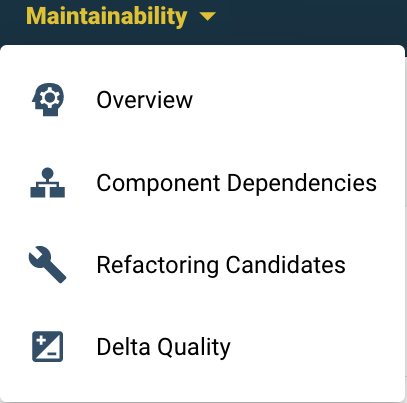

## 4 different views in the Maintainability tab 
The maintainability section on the system level has 4 views: 
1. The *Overview* tab brings the main metrics together. 
2. The *Component Dependencies* tab visualizes architectural layering and connections.
3. The *Refactoring Candidates* tab groups and prioritizes code that does not meet 4 star quality. 
4. The [*Delta quality*](system-delta-quality.md) view shows the impact of new code changes on the system for the selected period.

## Investigating system maintainability rating state and -changes 
* **Overview:** the [Maintainability Overview (see below)](#maintainability-overview) is the place to start. The different metrics give a quick breakdown of system characteristics (such as Volume or Duplication). For a background on maintainability, [see "*Our approach*" section under "*Getting Started*"](../getting-started/approach.md). 
You can find the [technical details of maintainability metrics under "*References*"](../reference/sig-quality-models.md).
* **System architecture**: Details can be analyzed in the [Component Dependencies view](#component-dependencies). For more details, [see the Architecture Quality page](architecture-quality.md) or [see "*References*" for its separate technical document](../reference/sig-quality-models.md). *Architecture Quality* does not count towards the maintainability rating.  
  * You may be triggered by an architecture-level rating change or have suspicions of architectural problems based on experience. You might experience that certain components or files are hard to maintain because they are inter-related or (tightly) coupled in complex ways. For example, when design-level changes have unpredictable effects, when small changes propagate errors/faults, when a change in one component makes integration tests fail in another part of the system. 
* **Triggered by a maintainability rating change** you may be interested in understanding its cause. In case code steps over certain risk thresholds ("*a violation*"), it will show up in the *Refactoring Candidates*.
  * An exception may occur for "*Component Entanglement*" in case there are no architectural violations to resolve, but when the number of components and their connections are higher than the benchmark. This would be visible in the [Component Dependencies view](#component-dependencies) (but **not** in the *Architecture Quality* view, since they are not directly related). 
* Use the ***Code Explorer*** if you suspect specific maintenance hotspots and want to understand the details ([see the *Code Explorer* page](system-code-explorer.md)).

The next sections elaborate on the aforementioned four Maintainability views.

## Maintainability overview
The overview page is shown below. 
* The system’s (configured) architecture is visible in the top right. This is based on the system’s scope configuration (see [the page on scope configuration](../reference/analysis-scope-configuration.md)). 
* The main code changes are visible at the bottom.
* The (change in) system metrics are in the top left. 

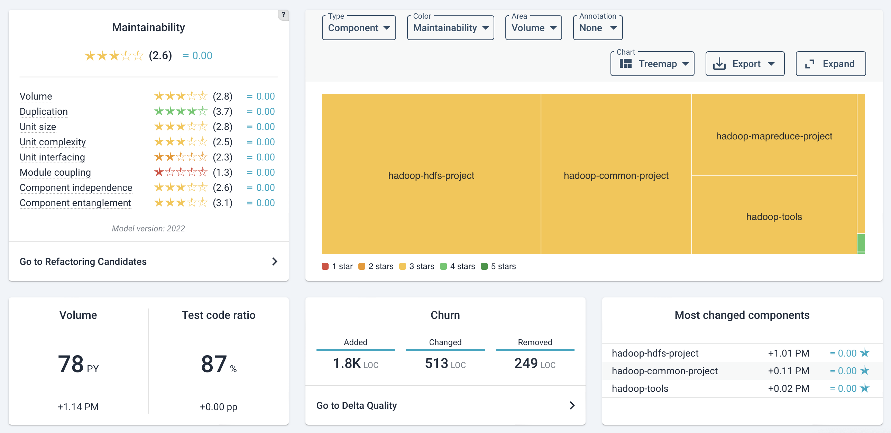

Below a detailed view of the metrics. 
 A mouse-over on the "?" help icon explains what constitutes the overall maintainability rating. The maintainability score consists of several sub-metrics that range from 1 to 5 stars, with the range 0.5 to 5.5.Please be aware that the overall score is not an average of the submetrics. For a general introduction on these metrics, see the section on [our approach](../getting-started/approach.md).

For technical details on maintainability metrics, see [Maintainability Evaluation Criteria](https://www.softwareimprovementgroup.com/wp-content/uploads/SIG-TUViT-Evaluation-Criteria-Trusted-Product-Maintainability.pdf) on our website. Or a broader overview on our [Reference page on our quality models](../reference/sig-quality-models.md).

Below the metrics overview, there is a shortcut to the *Refactoring candidates* [link on this page](system-maintainability.md#refactoring-candidates). This can also be reached by the Maintainability tab. 

### Technical Monitor and Code Explorer
 
The “*Technical monitor*” button above the system rating brings you to an alternative (one might say, “legacy”) view of all the maintainability metrics and underlying source code. Its functionality and views will eventually be moved to Sigrid. Generally, its source code-level view is available in Sigrid in the [Code Explorer](system-code-explorer.md). 

Because the views, filters and sorting abilities between the "*Technical monitor*" and "*Code Explorer*" are different, please see [a deserved elaboration on the Technical monitor on the Code Explorer page](system-code-explorer.md#the-technical-monitor). 

## Component Dependencies
The *Component Dependency* view visualizes the dependencies between your application’s main components. The components follow from the system’s configuration.
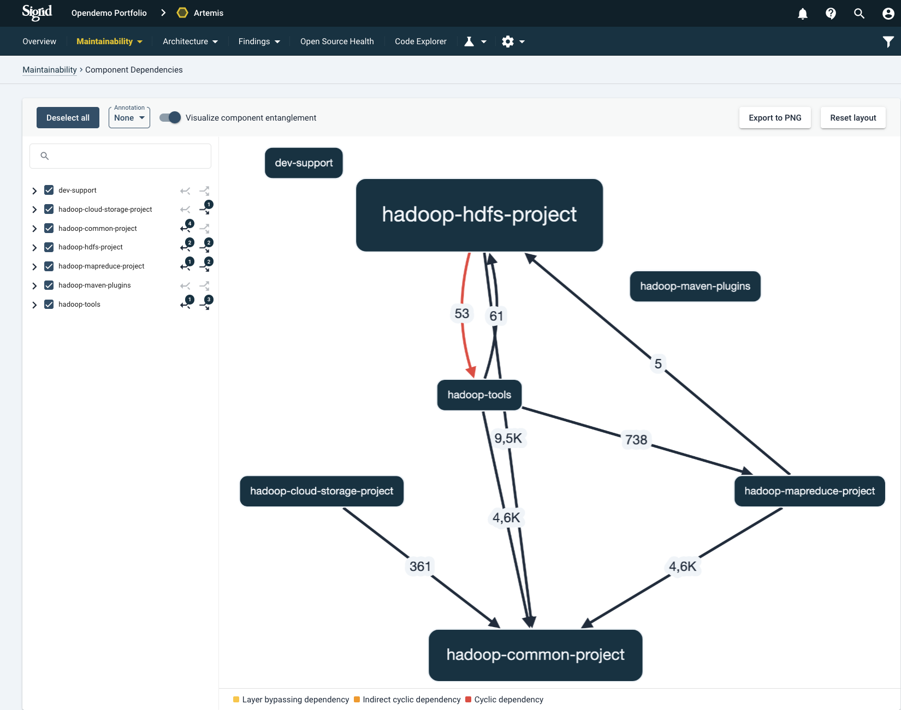

### Meaning of the dependencies
The arrows denote call direction within the code; a number on top of an arrow indicates the count of dependencies (that is, >1). Note that only calls will be shown that are identifiable as code dependencies (“static”). This excludes dependencies that may occur in production because of communication to frameworks or resources that are not explicitly defined in the source code. 

### Visualization options and filters
Different types of dependency antipatterns can be shown by toggling *”Visualize component entanglement”*. 

Once activated, a legend will appear at the bottom describing the different types. 

The legend’s colors denotes the severity of the antipattern: 

* **Layer bypassing dependency:** an architectural layer appears to be bypassed; a component has both a direct and indirect (“transitive”) dependency to another component.
* **Indirect cyclic dependency:** a set of components (>2) does not have direct cyclic dependencies, but the communication lines between the involved components form a cycle.
* **Cyclic dependency:** code within 2 components appear to “depend on each other”.

For details on their specifics, see the [Reference page on our quality models](../reference/sig-quality-models.md), specifically the [Maintainability Guidance for Producers](https://softwareimprovementgroup.com/wp-content/uploads/SIG-TUViT-Evaluation-Criteria-Trusted-Product-Maintainability-Guidance-for-producers.pdf).

If you click on an arrow in the graph, a page will appear where you can inspect the individual dependencies from- and to the selected components.

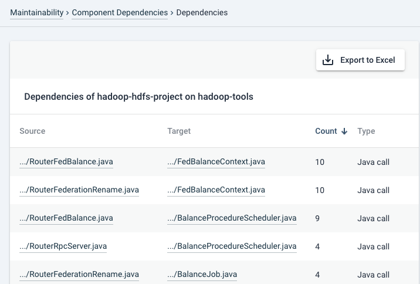

Note that the calls are shown for the direction of the arrow that you clicked at. If you want to inspect cyclic dependencies, also inspect the dependencies in the other direction.

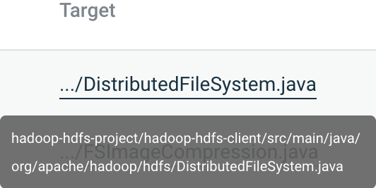

A filename mouseover shows you the full path. Clicking on the file name will bring you to its source code.

### Annotations
The annotation menu can present different data on top of the components. 

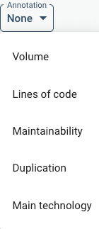

This may include e.g. code volume in PM/PY (person-month or person-year equivalent).

### Filtering
On the left-hand side column, you can filter dependencies per component and/or file level. This will show you a more detailed view of dependencies.

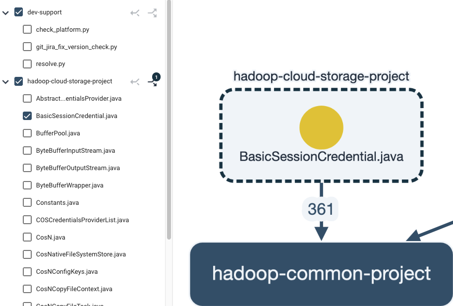

## Refactoring candidates
This view lists the top 100 findings per metric. 

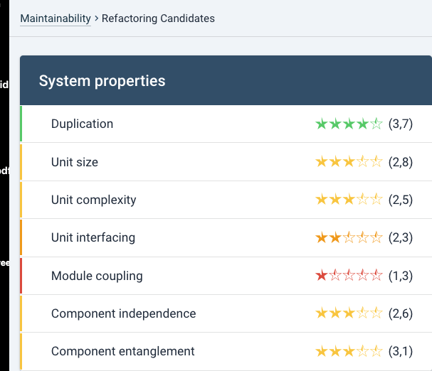

Clicking on a metric will expand the list, prioritized by the “severity” of the violation. This is a good approximation of technical risk. The order/prioritization of the findings cannot be changed, but their status can be. The default status is *“Raw”*. This is meant in the sense of “not yet curated by hand”. Setting another status may help you to filter findings. A finding can be set to *“Prioritize”* or *“Accept risk”*.  

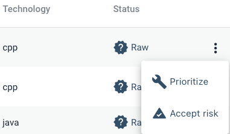

Setting a finding to *“Prioritize”* will show as *“Will fix”*
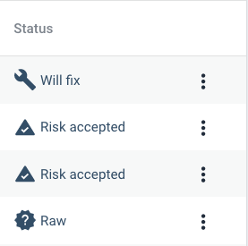

When you set a finding to *“Accept Risk”*, its status will change to *“Risk accepted”* and the finding will be hidden by default. 

 Findings with *“Risk accepted”* can still be viewed by using the filter. By default the filter is set to *“Will fix”* and *“Raw"* only. 

The relevant filter is shown below.
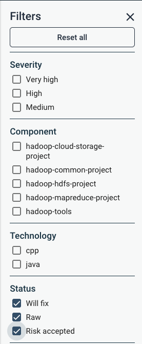

