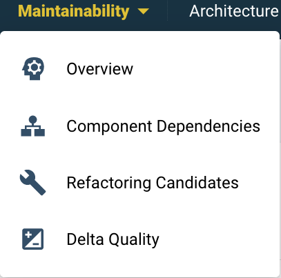

# System-level maintainability

The maintainability section on the system level has 4 views: 
1. The *Overview* tab brings the main metrics together. 
2. The *Component Dependencies* tab visualizes architectural layering and connections.
3. The *Refactoring Candidates* tab groups and prioritizes code that does not meet 4 star quality. 
4. The *Delta quality* view shows the impact of new code changes on the system for the selected period.
## Overview
The overview page is shown below. 
- The system’s (configured) architecture is visible in the top right. This is based on the system’s scope configuration (see [the page on scope configuration](../reference/analysis-scope-configuration.md)). 
- The main code changes are visible at the bottom.
- The (change in) system metrics are in the top left. 

Below a detailed view of the metrics. 
 A mouse-over on the "?" help icon explains what constitutes the overall maintainability rating. The maintainability score consists of several sub-metrics that range from 1 to 5 stars, with the range 0.5 to 5.5.Please be aware that the overall score is not an average of the submetrics. For a general introduction on these metrics, see the section on [our approach](../getting-started/approach.md).

For technical details on maintainability metrics, see [Maintainability Evaluation Criteria](https://www.softwareimprovementgroup.com/wp-content/uploads/SIG-TUViT-Evaluation-Criteria-Trusted-Product-Maintainability.pdf) on our website. Or a broader overview on our [Reference page on our quality models](../reference/sig-quality-models.md).

Below the metrics overview there is a shortcut to the Refactoring candidates [link on this page](system-maintainability.md#refactoring-candidates). This can also be reached by the Maintainability tab. 

### Note on the Technical Monitor
The “Technical monitor” button above the rating brings you to an alternative (one might say, “legacy”) view of all the maintainability metrics and underlying source code. Its functionality and views will eventually be moved to Sigrid. Its source code-level view is available in Sigrid in the [Code Explorer](system-code-explorer.md).

## Component Dependencies

## Refactoring candidates

## Delta quality
See the page on [system-level delta quality](system-delta-quality.md).

