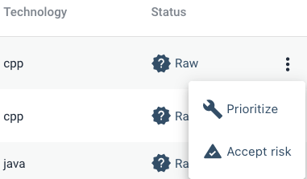
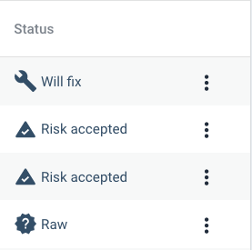
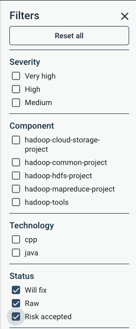
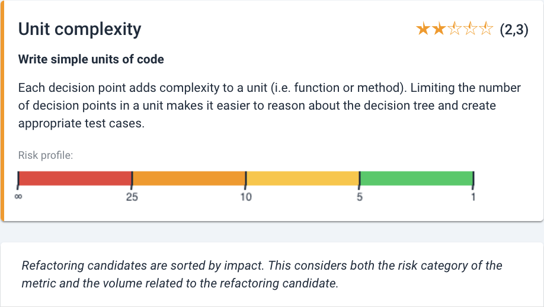
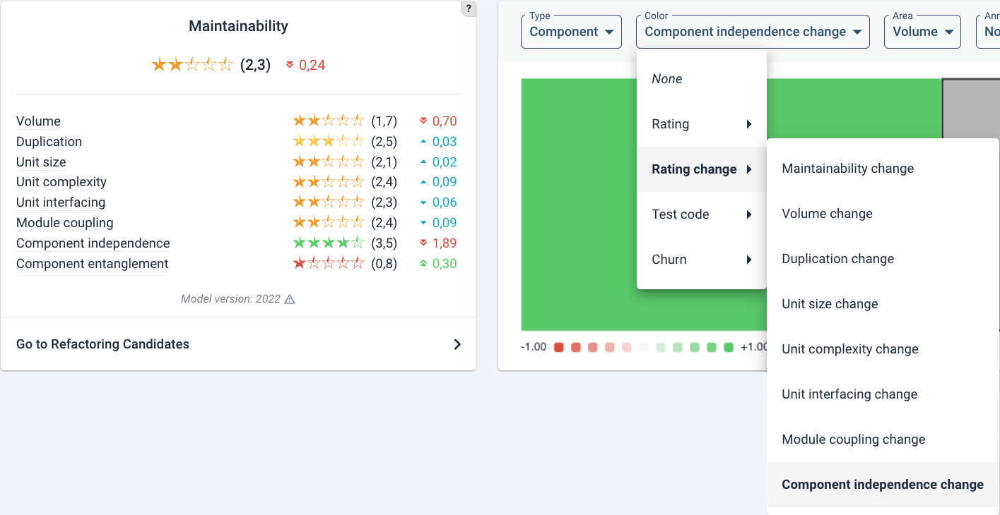
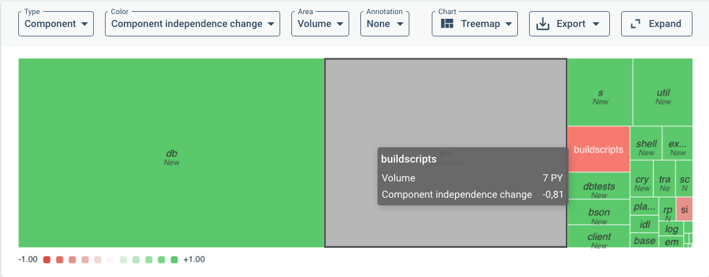
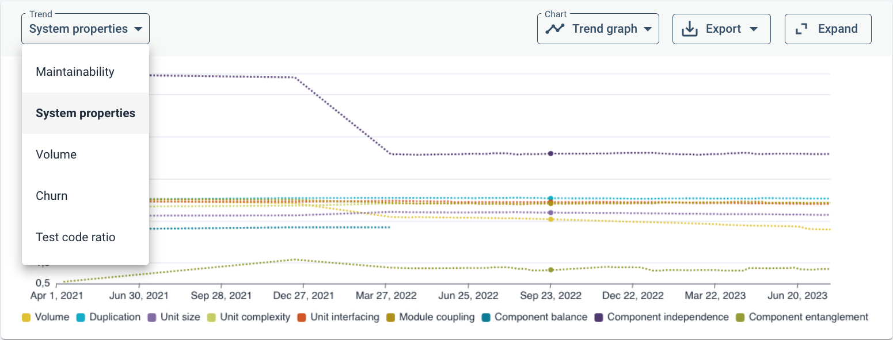

# System-level maintainability

You can reach this view via the left menu on system level > quaity aspects > maintainability. See the [system-level Overview page](system-overview.md#navigating-to-capabilities).

The definition of what a system is, what it is comprised of, and how it is configured, are detailed in the pages on [systems within Sigrid](../organization-integration/systems.md) and the [analysis scope configuration documentation page](../reference/analysis-scope-configuration.md).

## 3 different views in the Maintainability tab 
The maintainability section on the system level has 3 views: 
1. The *Overview* tab brings the main metrics together. 
2. The *Refactoring Candidates* tab groups and prioritizes code that does not meet 4 star quality. 
3. The [*Delta quality*](system-delta-quality.md) view shows the impact of new code changes on the system for the selected period.

## Maintainability overview
The overview page is shown below. 
* The system’s (configured) architecture is visible in the top right. This is based on the system’s scope configuration (see [the page on scope configuration](../reference/analysis-scope-configuration.md)). 
* The main code changes are visible at the bottom.
* The (change in) system metrics are in the top left. 

In the above picture, the test code ratio might not be obvious at a glance, the displayed percentage is calculated as the ratio of "test code lines" to "production code lines". 
As an example, if there are 120 lines of test code and 100 lines of production code, the test code ratio would be:

(Number of test code lines / Number of production code lines)*100 = (120/100)*100 = 120%.

Note that this number is not the same as "test coverage", as it measures exclusively the size of the unit tests corresponding to the production code units that were present in the code upload. Our experience indicates that having a 100% test code ratio roughly translates to having 80% test coverage which is an empirical benchmark seen in practice that offers the best balance between practicality and assurance of code correctness.

The maintainability score consists of several sub-metrics that range from 1 to 5 stars, with the range 0.5 to 5.5.Please be aware that the overall score is not an average of the submetrics. A mouse-over on the individual metrics explains what they measure in short. For a general introduction on these metrics, see the section on [our approach](../getting-started/approach.md).

For technical details on maintainability metrics, see [Maintainability Evaluation Criteria](https://www.softwareimprovementgroup.com/wp-content/uploads/SIG-TUViT-Evaluation-Criteria-Trusted-Product-Maintainability.pdf) on our website, or [Maintainability Guidance for Producers (on the SIG website)](https://softwareimprovementgroup.com/wp-content/uploads/SIG-TUViT-Evaluation-Criteria-Trusted-Product-Maintainability-Guidance-for-producers.pdf).

Below the metrics overview, there is a shortcut to the *Refactoring candidates* [link on this page](system-maintainability.md#refactoring-candidates). This can also be reached by the Maintainability tab. 

## Refactoring Candidates
This view lists the top 100 findings per metric.  

Clicking on a metric will expand the list, prioritized by the "severity" of the violation. This is a good approximation of technical risk. The order/prioritization of the findings cannot be changed, but their status can be. The default status is *Raw*. This is meant in the sense of "not yet curated by hand". Setting another status may help you to filter findings. A finding can be set to *Prioritize* or *Accept risk*.  

Setting a finding to *Prioritize* will show as *Will fix*

When you set a finding to *Accept Risk*, its status will change to *Risk accepted* and the finding will be hidden by default. 

 Findings with *Risk accepted* can still be viewed by using the filter. By default the filter is set to *Will fix* and *Raw* only. 

The relevant filter is shown below.

### Ordering of Refactoring Candidates

Refactoring candidates are sorted by risk impact. This is shown as maintainability risk categories, color coded as green-yellow-orange-red from lowest- to highest risk. Within each category, code is sorted by code volume (since volume is the common denominator for the maintainability metrics). [See for more details the technical documentation](../reference/sig-quality-models.md).

As an example, the risk categories for *Unit complexity* as shown at the top of the page:

The exception in this ordering is *Duplication*, where no different degrees of risks are used for the rating calculation. They are ordered by *duplicate size*, where a duplicate may appear more than 3 times, in 1 or multiple files. This is visible next to the file names in the columns *Same file* and *Same component*.

The risk impact ordering is a good indication for prioritization of findings, but it may need a case-by-case analysis. Context is a defining factor, which is discussed below. 

### Dealing with Refactoring Candidates

Being refactoring *candidates* should be taken literally. It is not to say that every candidate *needs* to be resolved. No system is technically perfect (or it is not for long). Every metric has tolerances for violations of the risk categories, and these violations may be defendable. 

The decision to refactor is essentially a cost-benefit trade-off. As a simplification this is determined by:
* The size of the **problem**
* The amount of **effort** to resolve that
* Expected **benefits** (like its *future value*)

Questions to ask yourself dealing with refactoring candidates include:

**Problem** 
* Does this piece of code cause trouble to me or other developers? E.g. is this a long `switch` statement scoring badly for unit complexity, but it is perfectly readable in context?
  * How likely is it that this code will need (frequent) modification in the future?
  * Is this problem likely to grow? A *mistake waiting to happen*? For example, could this maintainability *tarnish* evolve into a security flaw?   
* How important/critical is this code in context of the system? Do we value its stability more than technical elegance?
  * To what extent is this code guarded against undesirable behavior (being well tested and contained)? And is this in sufficient proportion to the code's importance?

**Effort**
* How difficult is this to refactor? Am I confident in its unit-/integration tests?
  * Are there technical limitations, or design choices, that limit our ability to change code into a more maintainable form? Can a case be made that consistency trumps technical cleanliness? 
  * Is it efficient to change this code right now when I am already looking at it?
* Can it even be placed outside of the source code (this may be true for e.g. static referennce lists)?

**Benefits**
* What is the "*opportunity cost*" of refactoring this as opposed to "the next best thing" you could spend your time on (such as bugfixing/building new functionality)? 
* Could I gain an extra advantage by refactoring now, e.g. by improving unit tests? 

### Sigrid as part of the Agile development process
For an elaboration of using and prioritizing maintainability findings within the development process, [see the elaboration in the Agile development process document](../workflows/agile-development-process.md#for-maintainability-focus-on-technical-debt-that-is-affecting-you-right-now)

## Investigating system maintainability rating state and -changes 

A typical approach and different options to investigate what is going on in terms of maintainability metrics are described below. Getting an initial overview is discussed here in most detail. The options to further analyze have their own respective pages and paragraphs and are referred in the text. 

* **Getting an overview:** the [Maintainability Overview (see above)](#maintainability-overview) is the place to start. The different metrics give a quick breakdown of system characteristics (such as Volume or Duplication). For a background on maintainability, [see "*Our approach*" section under "*Getting Started*"](../getting-started/approach.md). 
You can find the [technical details of maintainability metrics under "*References*"](../reference/sig-quality-models.md).

With the default treemap view, as an example, a large drop in *Component independence* may lead you to filter on change in that metric specifically over the chosen time period. With the following menu:

This results in the following overview colored by rating change impact on a green-to-red color scale:

To get an insight into the point of time of large changes, it may be useful to turn the default treemap into a trendline (change in the *Chart* drop-down menu) to see approximate when large changes have taken place. As an example, distinguishing between different metrics (*System properties*):

Assuming that this has been your first step into maintainability analysis, you can do several things next:

* **System architecture**: Architectural details can be analyzed in the [Component Dependencies view](#component-dependencies). For more details, [see the Architecture Quality page](architecture-quality.md) or [see the "*References*" page for its separate technical document](../reference/sig-quality-models.md). *Architecture Quality* does not count towards the maintainability rating.  
  * You may be triggered by an architecture-level rating change or have suspicions of architectural problems based on experience. You might experience that certain components or files are hard to maintain because they are inter-related or (tightly) coupled in complex ways. For example, when design-level changes have unpredictable effects, when small changes propagate errors/faults, when a change in one component makes integration tests fail in another part of the system. 
* **Triggered by a specific maintainability rating change**: you may be interested in understanding the cause of a specific change. There are several ways to analyze this deeper: 
  * **Delta quality**: In case of a recent change, the *Delta quality* view shows you how and where recent code modifications/additions have affected the maintainabilty rating. 
  * **Refactoring candidates**: In case code steps over certain risk thresholds ("*a violation*"), it will show up in the *Refactoring Candidates* ([see the Refactoring Candidates paragraph above](#refactoring-candidates)). There may be several trade-offs in deciding whether and when to refactor ([see the relevant paragraph above on dealing with refactoring candidates](#dealing-with-refactoring-candidates)). 
    * As an exception, there might be no *Component Entanglement* violations visible while its rating is below 4-star rating. That can be the case if there are no architectural violations to resolve, but when the number of components and their connections are higher than the benchmark. This would be visible in the [Component Dependencies view](#component-dependencies) (but **not** in the *Architecture Quality* view, since they are not directly related). 
    * For *Duplication* and unit metrics, clicking on a *Refactoring candidate* will show the affected code highlighted in context of this one file. 
  * **Code Explorer**: You may reach the *Code Explorer* from a finding in the *Refactoring candidates* list or the detailed file list from the *Delta quality* view. there you can go to the *Code Explorer* to see the unit/file/component in context of the codebase. The Code Explorer is also a good place to start if you suspect specific maintenance hotspots and want to understand the details. [See the *Code Explorer* page](system-code-explorer.md). An advantage of the Code Explorer is that it can also show per file/unit whether it contains other risky constructs, e.g. regarding security. 

