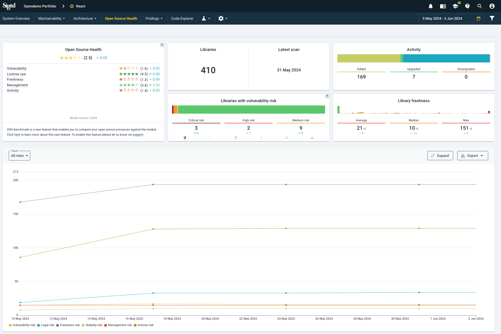
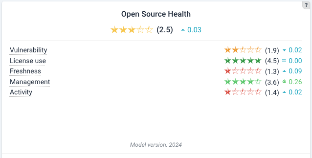
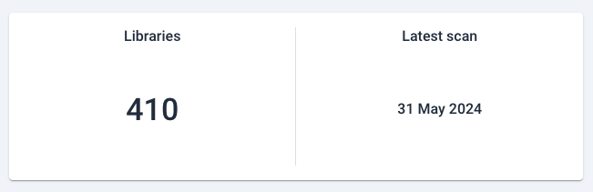
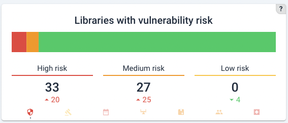
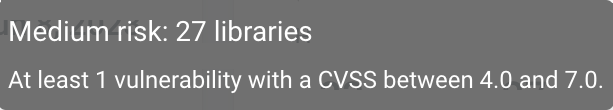
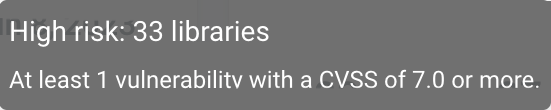
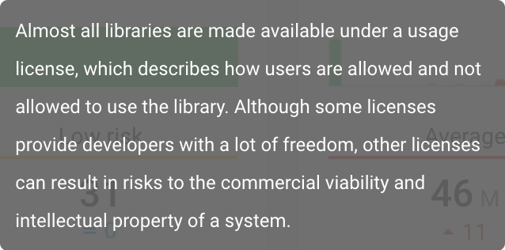

# System-level Open Source Health (OSH)
Sigrid runs a comprehensive analysis of open source software that is used in the source code. These are known here as *third party libraries*. 

## Reaching the OSH page
You can reach the Open Source Health information via the top menu if you are in System view already:

Or you can click a capability on Portfolio *Overview* page, clicking on a system from the Portfolio Open Source Health view. See [the system-level Overview page](system-overview.md#navigating-to-capabilities), [navigating from the portfolio-level Overview page](portfolio-overview.md#navigating-to-capabilities) or [navigating from the portfolio security view](portfolio-open-source-health.md#moving-from-portfolio-level-to-system-level).

## Navigating the overview page
The system level overview lists the third party libraries used in this system, categorized per risk area (columns on the right). 
On the top left, the tile shows ratings based on the Open Source Health Quality Model, then a trend line is shown counting changes over time. 
A summary of counts, changes and identified risks are shown in four panels next to the ratings. These (change) counts depend on the period that you have chosen in the top right corner. If only 1 snapshot is available, only the latest count will be provided.

### Open Source Health scans for six different risk areas

*Open Source Health* scans for six different risk areas: 

 **Known vulnerabilities:** publicly known and categorized vulnerabilities in a third-party dependency.

  **Freshness:** a measure of versioning compared to official/available versions. The count is the time difference with the date of the latest (publicly) available version. 

  **Activity:** an estimation of (the degree of) community activity, measured as the time that has lapsed since the last published release. 

  **Stability:** an estimate of stability by identifying seemingly unfinished versions such as alpha/beta/rc/0.x versions.

  **Management:** possible risk originating from dependencies in binaries (e.g. JARs for Java) instead of configurations in package managers.

  **Legal licenses:** third-party dependencies may have restricted licenses, that restrict how you can use it or e.g. obliges you to publish certain source code. This should always trigger a check by a legal expert. 

### Navigating the top tiles in the overview page 
The default views shows the Open Source Health Quality Model ratings first:

You might notice that the tile does not include Stability, as this metric is not used to the purpose of rating calculations.

Then, a tile shows the total number of dependencies for that system, and the latest scan date:

Then, a vulnerability count:

The counts refer to number of findings in that category, and below the change in that count. An increase is shown in red, a decrease in green, and no change in blue.

All bar charts allow mouseovers that show the exact counts. For example, for vulnerabilities:

or 

In this tile, different categories can be chosen by clicking on the bottom icons. In this case, *"Legal"* (the orange gavel) has been clicked and is therefore highlighted in higher contrast and a indicative dot. 

 The help button in the right corner shows mouseovers for the respective categories.

If you change the category, the help mouseover will also change and provide you a relevant explanation. For example, for legal risks:

## Filtering internal dependencies
Internal dependencies can be filtered manually, such that they will not be resolved with the Open Source Health APIs that Sigrid uses.
[Please see the Open Source Health paragraph in our scope configuration document](../reference/analysis-scope-configuration.md#open-source-health) or [this related question in the FAQ](../capabilities/faq-security.md#does-sig-filter-when-resolving-our-systems-dependencies).

## Attacking the findings list
Since there is a plausible possibility that open source vulnerabilities are actually exploitable problems, this is the place to start as a security fix backlog. Of course, context matters. And not every update is of equal difficulty. See [the prioritization section on the security page](system-security.md#filtering-results-for-false-positives-starting-with-open-source-vulnerabilities) for more considerations.
