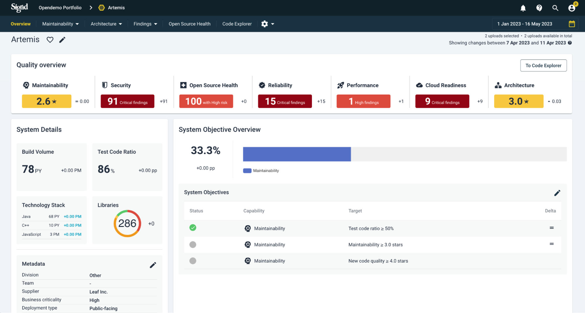
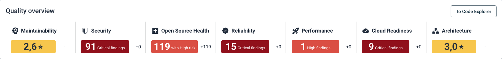
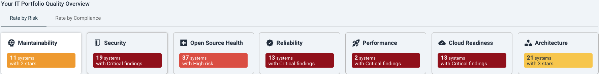

# System-level overview

This section describes the main functionalities and typical uses/analysis questions on the system level, looking at details and root causes of system quality findings. 

For the portfolio-level view, see [the portfolio-level overview](portfolio-overview.md).

## System quality overview
Quality goals can be assessed in the Overview tab. You can reach this either by starting with a portfolio view and then selecting a system from the system list. Or start at the system view and move to the Overview tab.

The status of quality goals are shown in the System Objective Overview on the right (see also [Objectives](objectives.md)). This is binary: either the objective is met or not. 

Since a period of time has been selected, the change within this period is shown. On the right side (Delta) a change will be noted by an equal sign, upward arrow, or downward arrow. Details of changes in objectives are shown in the Quality Overview bar on the top. 

On the left, system details can be edited. Clicking on the edit button will bring you to the [metadata](../organization-integration/metadata.md) page. This will allow, and influence, filtering on these metadata fields, such as "Division" or "Business criticality". For all possible metadata options, see also the [Sigrid API metadata end point page](../integrations/sigrid-api-documentation.md#system-metadata).

## Objectives

The system-level overview page also displays the current state of all objectives that have been defined for your system. Please see [Objectives](objectives.md) for more information on how to use this section of the overview page.

## Analysis questions for system development progress/planning views
To gauge development progress and expected remaining work to be done, you are interested in indications of how predictable code development is. For viewing progress and predicting planning, example analysis questions are:

* For a particular system, where are technical debt and code quality moving towards? Is that what we are expecting?
* If we extrapolate progress, does it seem likely that we can meet (planning) objectives? How much (unforeseen) technical renovations will we need to take into account?

## Analysis questions for system detail views
Moving deeper into code details, to know what to focus development efforts on, example analysis questions are:

* Does the code show our craftsmanship? Can we explain why code changes are hard when the business asks us for faster delivery?
* In terms of technical debt, are we reaching quality goals? What should be prioritized on the backlog?
* How well are we generally doing securing our systems? Where is this concerning? Are we actually exposed? Are there accepted risks that we accept as a business or false positive findings that we may ignore?

## Navigating to capabilities

Whichever Sigrid tab you are working in now, you can use the top menu to navigate to other system-level pages for specific Sigrid capabilities.

Starting from the System Overview: to move to specific capabilities you can also use the *Quality Overview* clicking on the area of your interest.

Starting from the Portfolio *Overview*: similar to the system overview, you can click on a capability of your interest, and then select the system you want to investigate further.

These capability pages are explained specifically here:
* [System maintainability](system-maintainability.md) and [Delta quality](system-delta-quality.md)
* [System architecture quality](architecture-quality.md)
* [System security](system-security.md)
* [System Open Source Health](system-open-source-health.md)
* [Code explorer](system-code-explorer.md)