# System-level Security

System-level security is one of the detailed technical views under *Findings*. This may be available for your system. It depends on which capabilities have been activated specifically for your system or portfolio. 

## Reaching the Security page
You can reach the system-level security view in different ways: Via the top menu (the *Findings* tab), clicking a capability on the System or Portfolio *Overview* pages, or clicking on a system from the Portfolio security view. See  [the system-level Overview page](system-overview.md#navigating-to-capabilities), [navigating from the portfolio-level Overview page](portfolio-overview.md#navigating-to-capabilities) or [navigating from the portfolio security view](portfolio-security.md#moving-from-portfolio-level-to-system-level).

The tooling underlying this analysis is updated as often as possible. Therefore it may be possible that [new findings are found even when code is unchanged (link to FAQ)](faq-security.md#is-it-possible-that-sigrid-creates-new-findings-without-us-changing-the-code).

## Navigating the Security Overview
As an example, clicking on the *Findings* tab will show you a menu different capabilities (if available for your particular system). Here, with *Security* highlighted when hovering the mouse.

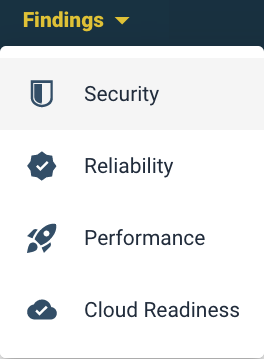

The security overview page shows a summary of findings, their change, age and estimated severity. Note that the *Findings* tab will remain highlighted in yellow.

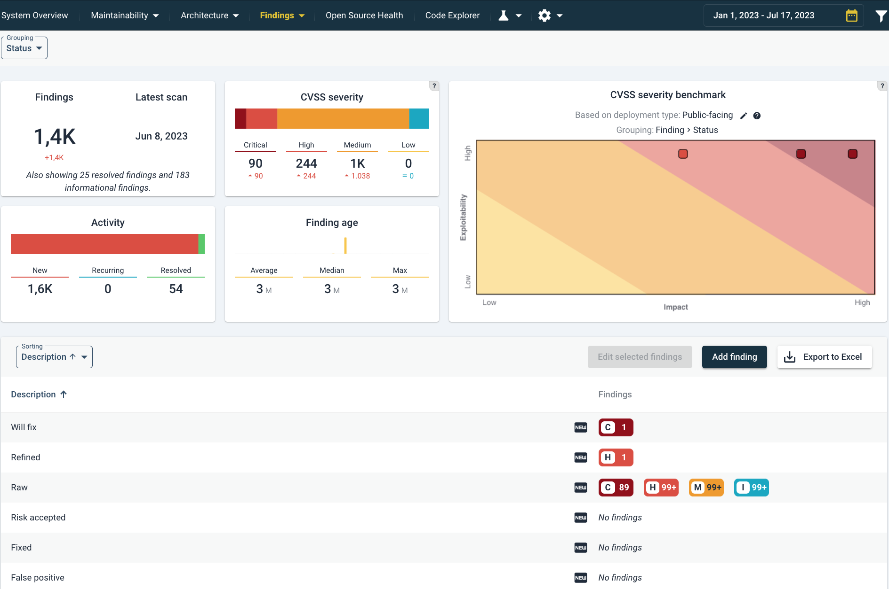

The different elements in this page are:
* *Findings* shows a count of *the current number of findings*. Below it is the number of changes, based on the source code comparison period. This range be changed in the top right as usual. The note *"Also showing ... resolved findings and ... informational findings"* means that on top of this number, more findings are shown below. This is relevant for estimating activity surrounding these findings, such as fixing security findings or marking them as *false positive*. 
* *Activity* shows a breakdown of this number. A mouseover on the *Activity* barchart will show the following:

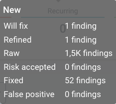

* The *Findings Age* tile gives an indication how long findings are known. 

* The *CVSS Severity* tile summarizes a breakdown of findings according to CVSS severity ratings. A mouseover on the barchart will show the exact number of findings. A mouseover on the CVSS severity barchart shows the number of findings with that CVSS severity category. 

## Context and meaning of CVSS security metrics: from asset to risk

*CVSS* (*Common Vulnerability Scoring System*) is a security-industry standard metric on a 0-10 scale, to indicate how severe a security issue *may be*. It does not signify a definite security problem, nor does lack of CVSS (or 0 score) imply security. This uncertainty is at the core of system security and mostly dependent on context. 

It is important to make some distinctions by defining the elements that are necessary to properly interpret the meaning of these numbers. To simplify matters, consider the following non-exhaustive definitions: 

* An *asset* is something of value. An asset exists in context, like the way that a system is connected to the outside world. 
* A *weakness* (or flaw) is a (security-relevant) deficiency. In our context, a weakness may be catalogued as a *CWE* [see also section on CWEs below](#cwe-and-its-link-with-cre-common-requirement-enumeration). A weakness may be exploitable or not.
* A *vulnerability* is an exploitable weakness (by a threat). In our context, a vulnerablity may be catalogued as a *CVE*. A vulnerability may be actually exploited or not.
* A *threat* is an event/condition that causes undesirable/adverse effects to something of value (often described as *assets*). A threat may manifest or not.
* A *risk* is a possibility of harm, a chance that an undesirable event may occur. Typically it is understood as a function of *probability* and *impact*. In this context it is useful to consider that *a risk involves an asset, a threat and a vulnerability*. A risk may occur or not. 

### Sigrid's CVSS score of Raw findings signify "potential severity"

We may use "risk" a lot in colloquial language, but in this context of system security, a lot has to co-occur before a risk manifests, as can be seen above. This is relevant in reading the CVSS scores in Sigrid, because without a triage and a verification context, CVSS does **not** mean *vulnerability* or *risk*. CVSS scores, even when unvalidated, are a useful indicator. Generally, triage/analyze raw security findings, you would follow the CVSS scores in descending order from "potentially most severe to - least severe".

### Sigrid's CVSS scores are based on a CWE benchmark

CVSS originates in research done by the US government's [National Infrastructure Advisory Council (NIAC)](https://www.cisa.gov/), further developed by the [Forum of Incident Response and Security Teams (FIRST)](https://www.first.org/). CVSS is strongly associated with the administrations for *CWEs* and *CVEs*. *CWEs* are part of the authoritative list of weakness types known as the *"Common Weakness Enumeration"* by MITRE [MITRE CWE website](https://cwe.mitre.org/). For *CVEs*, see the [National Vulnerability Database(NVD)](https://nvd.nist.gov/)). A CVE always contains a CWE, while the opposite is not necessarily true (e.g. a weakness that has not been shown to be exploitable). CWE has a hierarchical structure, so higher-level weaknesses implicitly contain lower-level ones. 

### Elaboration on the CWE benchmark calculation

The core idea of the CWE benchmark is that, since CWEs, CVEs and CVSSs are related, we can use CVSS data associated with CVEs to come up with a score for CWEs. A benchmarked CWE score (presented as CVSS in Sigrid) consists of the averaged CVSS scores of all linked CVEs. In this calculation process, a *weighted mean* is applied to *Impact* and *Exploitability* (these are part of the CVSS "*Core metrics*"). This configuration puts more weight on relatively infrequent, but severe vulnerabilities.  

For each CWE, we build its CWE hierarchy tree and determine their respective CVEs of the last 5 years and the CVE's typical CVSS estimations by security experts. This is a benchmark of expert judgements. Since context is a large factor in the severity of a security issue, the CVSS scores assigned to CWEs are further split by their attack vectors (this data is available since *Attack Vector [AV]* is part of the CVSS calculation). This split allows to make a mapping on this technical context, which should be administered in Sigrid as *Deployment type* metadata ([see metadata page, specifically the GUI to do this in Sigrid itself](../organization-integration/metadata.md#option-1-adding-metadata-in-sigrid)). This metadata emulates CVSS' "*Environmental metric group*" and provides important context to interpret its scores. If this metadata has *not* been set, Sigrid conservatively assumes "public-facing", hence the most exposed type of deployment.

### CVSS scores in Sigrid

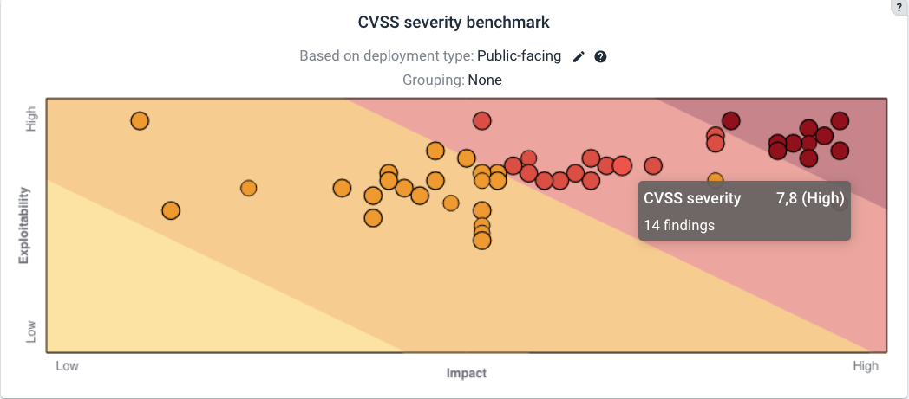

 The CVSS map adjusts to the filter that you may have used.

Based on the CVSS score of findings, they are marked and colored ranging from "Information", "Low", "Medium", "High", "Critical".

 *Information*: a CVSS score of "0". These include anti-patterns that may not have a direct security impact but can still be significant. 

 *Low*: CVSS score between 0 and 3.9.

 *Medium*: CVSS score between 4 and 6.9.

 *High*: CVSS score >between 7 and 8.9. 

 *Critical*: CVSS score 9 or higher. 

To have an idea of what a certain CVSS score approximates, see [NIST's current 3.1 calculator](https://nvd.nist.gov/vuln-metrics/cvss/v3-calculator/) or a [calculation preview of the to-be-released CVSS 4.0](https://www.first.org/cvss/calculator/4.0/)). Note that an earlier CVSS version 2 did not include a *"Critical"* vulnerability category.

## Different statuses of security findings

These are the different statutes of findings. The status *"Fixed"* will be applied automatically if a finding is resolved. See [FAQ:Fixed issues are auto-detected](faq-security.md#how-does-the-automatic-detection-of-fixed-findings-work). The other statuses can be set. They are similar to those used for [system maintainability refactoring candidates](system-maintainability.md#refactoring-candidates). 
* *"Raw"* means "not yet verified" where *"Refined"* ones mark that a finding has been confirmed manually. Inversely, a finding can be set as *"False positive"*. 
* *"Will fix"* signals the intention to fix it, while *"Risk Accepted"* does not.

## Different possible grouping of security findings
Different views can be selected in the left menu. security models. The menu selector on the left you to easily toggle between the different models in one view. 

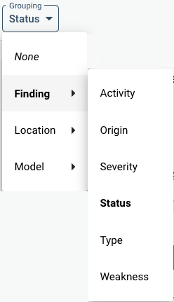

Note that here, the menu's category in bold is the currently chosen grouping. Therefore, below, under the column *"Description"*, different statuses are shown. Because *"Grouping"* means that Sigrid will show you a summary, the number of findings are shown on the right column under *"Findings"*, such as [C]1, [H]1, [M]99+ and [I]99+. These abbreviate the severity of the findings based on their CVSS score, and their count. You can click on those for a listing of the detailed findings. See also the [CVSS elaboration above](#the-scoring-system-with-cvss).

In the Grouping menu in the top left under *"Finding"*, the following types of grouping can be set:

* *"Activity"* groups according to *"New"*, *"Recurring"* or *"Resolved"*.
* *"Origin"* refers to the originating tool of the finding.
* *"Severity"* orders on level of severity (based on CVSS).
* *"Status"* lists the statuses as [mentioned above](#different-statuses-of-security-findings).
* *"Type"* shows a specific list of vulnerabilities. This is especially useful for technical analysis, since sometimes, a whole category/type of findings may be set to *"False positive"*. 
* *"Weakness"* orders on type of weaknesse (based on [MITRE's *CWE* database](https://cwe.mitre.org/)). Weaknesses are defined somewhat higher level than *"Type"*. 

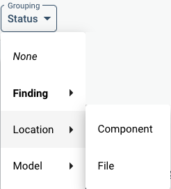

In *"Location"*, either *"Component"* or *"File"* grouping can be chosen. The Component group follows the maintainability grouping in components. Findings may fall outside of that grouping because of exclusions. Then they will show under the *"Other"* component. Examples might be binaries or package manager configuration files, which would be excluded for maintainability analysis and therefore not fall into a component for the purpose of maintainability calculations. 

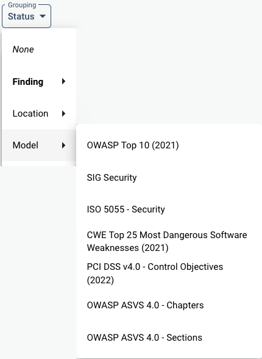

Under *"Model"*, different Models can be used to map findings on. This is in practice mostly a matter of preference or specific auditing requirements. Next to popular security models, SIG has developed its own model based on the ISO 25010 standard, which can also be chosen. These are based on the [SIG Evalution Criteria Security][https://www.softwareimprovementgroup.com/wp-content/uploads/SIG-Evaluation-Criteria-Security.pdf].

### A note on seeing the same file/finding multiple times
* **A specific finding** is counted once, but it may be visible in multiple views. This could be because e.g. there is certain overlap in classification of the model that you have chosen as a view. 
* **A specific line** may be counted multiple times if it refers to multiple *CWEs*: a count is applied for each possible security risk. See also [security FAQ elaboration on multiple views of the same finding](faq-security.md#why-does-the-finding-list-count-certain-findings-twice).  

## Analyzing security findings
You can group and sort the detailed view of security findings. The sorting offers you the following.  

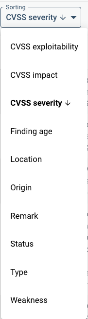

Below an example of a list of detailed findings. 

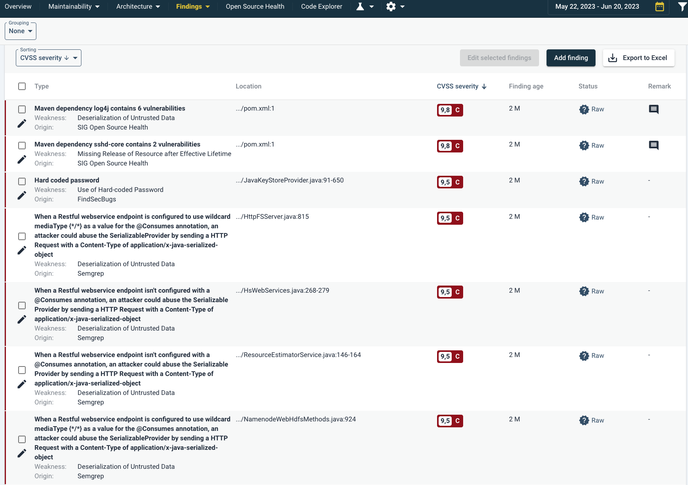

In the top left you can see that the findings are not grouped. Therefore each finding is shown individually. Below, the *"Grouping"* menu under *"Sorting"*, sorting is set to CVSS severity. Therefore the highest risk findings are shown above. Note that for example the first two findings are Maven dependencies. These originate from [Open Source Health](system-open-source-health.md). 

If Remarks have been registered, they can be seen in the far right column with a mouseover or clicking on the text balloon. An example of a mouseover is shown here. 

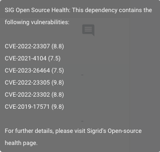

If you click on the finding, the source code of the finding will be shown with its details. Details such as Status, finding age, Origin (scanning tool), File location, Remarks (if available) or audit trail are all viewable here.

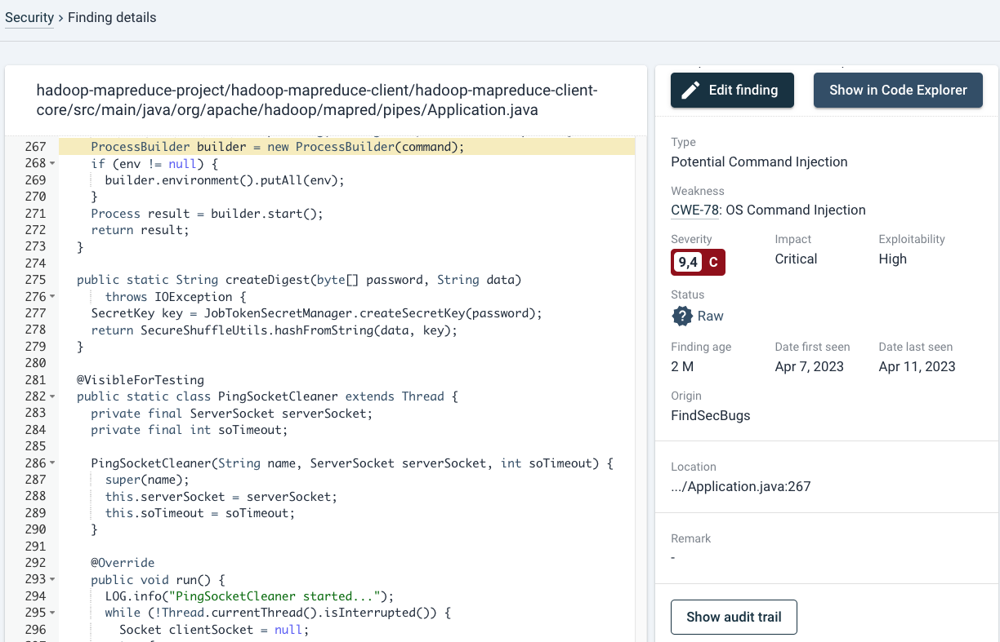

In the left panel, the specific line is highlighted in yellow, where a possible vulnerability may exist (in this case, OS injection). For details on e.g. the right panel, see [Open Source Health-analysis section](system-open-source-health.md#analyzing-security-findings-open-source-health-example). Extra information such 

## Analyzing security findings: Dependency example (based on Open Source Health)
As above, starting from the findings overview: if you click on the finding, the source code of the finding will be shown with its details. 

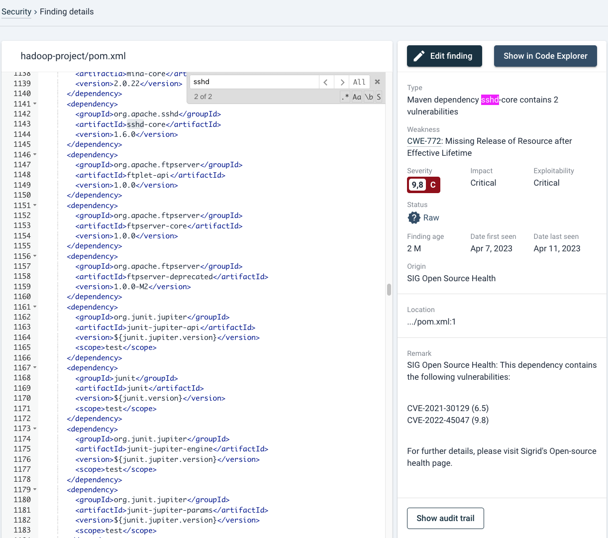

In case that the relevant line is not highlighted in yellow (this sometimes occurs in package management files), you can search within the file with cmd+f/ctrl+f. By default your browser takes precedence for this shortcut and therefore will try to search the page. You therefore need to move mouse focus to the left pane by clicking on the source code area or tabbing to the element first. You can use regular expressions if you wish so. 

On the right side of the page, all details surrounding the finding are shown. 

## Changing a finding's status and audit trail

 In the top right, the *Edit Finding* button allows you to change e.g. its Status and Severity 

In this case, because this is an automatically scanned dependency by [Open Source Health](system-open-source-health.md), e.g. changing its status to "false positive" will not necessarily remove the finding indefinitely. As long as the OSH tooling finds the same result, it will return. See also [this specific case in the Security FAQ](faq-security.md#i-previously-marked-a-security-finding-in-an-open-source-library-as-a-false-positive-but-now-it-is-back). The same holds for the *"Remark"*. Findings by *Open Source Healt*h* automatically add the type of vulnerability and vulnerability (CVE) reference. Remarks can also be adjusted manually. Any user can edit remarks or other characteristics. This could also be a SIG consultant, depending on your specific Sigrid agreement. 

An audit trail can be seen when clicking the *"Show Audit Trail"* button. In case of changes, multiple entries will be shown with their respective usernames and dates.

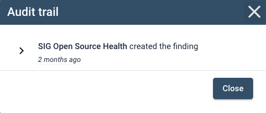

## CWE and its link with CRE (Common Requirement Enumeration)
If available, the relevant *CWE* will be shown. The *CWE* link in the security finding will refer you to the [OWASP Common Requirement Enumeration (CRE) page](https://www.opencre.org/). This will show the CWE in context. SIG has been an active and proud contributor to this project in close collaboration with the world's application security authority [*OWASP* (Open Worldwide Application Security Project)](https://owasp.org/). *CRE* is an open source security reference knowledge base, [a nexus between *OWASP's* initiatives](https://owasp.org/projects/#owasp-projects-the-sdlc-and-the-security-wayfinder) and relevant, authoritative security reference documents originating in [MITRE](https://www.mitre.org/), [NIST](https://www.nist.gov/) and [ISO](https://www.iso.org/). 

An example of openCRE is shown below.

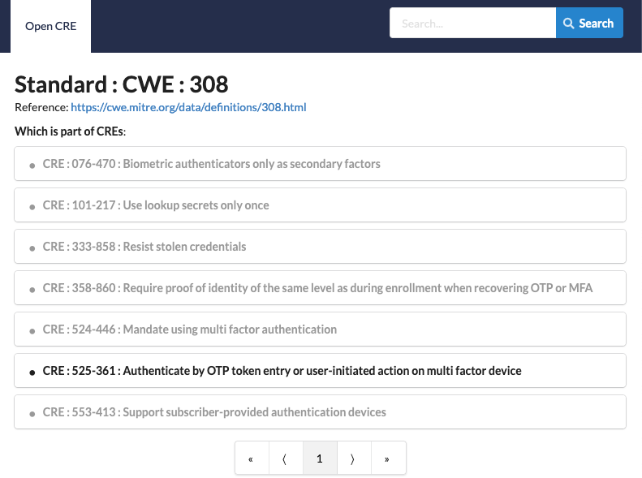

## Linking to Code Explorer
On the top right you can show the code in the *"Code Explorer"*, which will show you the code's context and related findings. See also [Code Explorer](system-code-explorer.md). 

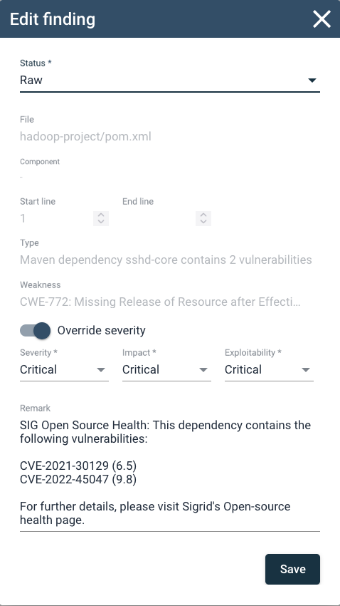

## A general, typical strategy for processing security findings

Especially when *Security* is enabled in Sigrid for the first time in your system, the number of findings may seem overwhelming. Therefore, filtering out false positives is your first concern. That will give you a more accurate view of the system's risk exposure. And then you may set priorities, and writing explanations or recommendations for findings that need attention. 

### Threat modeling as a requisite for interpreting security findings
The absolutely most solid way to approach security is to start by threat modeling. This takes you a step back of all the technical findings. A threat modeling effort should involve brainstorms, whiteboarding and *Data Flow Diagrams* to reach a basic system *threat model* and its associated security risks. 

There is wide availability of training and instruction regarding threat modeling [e.g. OWASP's Threat Modeling Cheat Sheet](https://cheatsheetseries.owasp.org/cheatsheets/Threat_Modeling_Cheat_Sheet.html) or [the Threat model Wikipedia page](https://en.wikipedia.org/wiki/Threat_model), where the *Threat Modeling* book by Adam Shostack is probably considered one of the fundamentals. 

As a simplification of a whole field of expertise, please do keep in mind:
1. **Start small**. Do not strive for completeness on the first try.
2. **Assign ownership and repeat**. Threat models are never finished and need a maintenance rhythm. 

SIG can help with such threat analysis efforts as custom consultancy services. Please reach out to your account contact if you have questions.

### Filtering results for false positives
* **Starting with *Open Source Health*:** Assuming that Open Source Health is enabled together with Security, you probably want to start there. Vulnerable dependencies are regularly high-risk and urgent, yet relatively easy to solve (not when it concerns major framework updates for example). Generally, updating libraries has a high return on your efforts. Also, grouping the same libraries/frameworks may be favorable because you only need to go through release notes once. This might be harder if you need to cross teams to do that.
  * **Note on legal risks in dependencies:** Any occurring *possible legal risks* (e.g. GPL) are important to discuss with your legal department. These legal license risks tend to apply only in specific cases, e.g. when you have modified the source code. SIG explicitly cannot help you with legal advice on this. 

* **Filtering test/functional domains by sorting on code location:** To get an overview and to be able to make quick exclusions of false positives, it may be useful to order security findings by *component/file* [see above](#different-grouping-of-security-findings). A file-view may expose e.g. test-code, and a component-view may show that many files may lay in a certain functional domain> As an example, deployment configurations may exist in a context of which you know that they are protected from certain security risks. This may lead to a lot of exclusions and a cleaner overview of security findings. 
  * **Deeper analysis in the File view:** In the *File view* you can export those findings as a spreadsheet. In case of very large lists of findings it may be advantageous to browse and filter in a spreadsheet editor, and then go back and exclude them (by groups). 

### Prioritizing security findings
  * **Sprint approaches:** A tactic during sprints is to use a kind of *Boy Scout* approach, where you compare findings for files while you are modifying them. This tends to be efficient because you are already working in/analyzing the code. Consider making this part of the *Definition of Done*. See also [the agile development workflow](../workflows/agile-development-process.md#for-maintainability-focus-on-technical-debt-that-is-affecting-you-right-now).
    * Please see the [Agile workflow page regarding refinement/planning](../workflows/agile-development-process.md#triage-security-and-osh-findings) for a further discussion on processing security findings in an Agile workflow. 
* *Prioritizing by severity* is the typical approach, and this is faithful to agile practices (assuming you choose the action with the highest return first). This way you move from urgent to less urgent findings.
* Prioritizing based on grouping by patterns means that you may exclude or solve many findings in one go. There are indeed cases when a whole class of findings can be excluded because for some reason the findings are not applicable or can be resolved in one place.

## SIG may offer consultancy services to help you with security
Depending on your agreement with SIG, security expertise consultancy may be available. Or this can be offered as a separate consultancy effort. See also [this question in the security FAQ](faq-security.md#to-what-extent-does-sig-provide-consultancy-for-security-findings).

