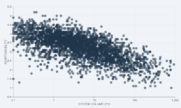

# Our approach to software maintainability: benchmarked code metrics offer perspective

## What is high quality software?

Finding an objective measure of software quality is tough. High quality software behaves the way you expect it to, can withstand unforeseen situations, is secure against abuse, and complies with requirements.

What all these have in common is the need for maintenance. This is the honorable task of developers and the roles surrounding them. Efficient, effective, workable code, *easy to read* even. That is, easy for the developers that come after you. When we talk about technical debt, it is easy to imagine its compounding effects, where over time it gathers interest over the original debt, the technical imperfections of code. The metaphor does not stretch limitlessly, since not all debt must necessarily be recovered (this is essentially a business trade-off). But it is well-understood ("*cruft*" never quite made it past developer argot). Technical debt might be just harmless unrealized potential, but we often see that at a certain point, teams get stuck in a vicious cycle. Then, code/software quality becomes very noticeable to developers, clients and the business. See also our discussion on [technical debt in an agile development process](../workflows/agile-development-process.md#technical-debt). Essentially, *bad code is bad for business*. The inverse is not necessarily always true, but it is certain that you need to have a grip on quality to deliver business value in a predictable and efficient way.

## Setting a quality benchmark

Generally, to assess the quality of something, you need a sense of context. Each piece of software may have a widely different context. To put objective thresholds on code quality, at SIG we use technology-independent code measurements and compare those to a benchmark. A benchmark on quality is meaningful because it provides an unbiased norm of how well you are doing. The context for this benchmark is "the current state of the software development market". This means that you can compare your source code to the code that others are maintaining. 

To compare different programming technologies with each other, the metrics represent a type of abstractions that occur universally, like the volume of pieces of code and the complexity of decision paths within. In this way, system size can be normalized to "*person-months*" or "*person-years*", which indicate of amount of developer work done per time period. Those numbers are again based on benchmarks.  

Below a short video introduction of this approach. 

<iframe width="560" height="315" src="https://www.youtube.com/embed/D_5SN4Q8cGI" title="YouTube video player" frameborder="0" allow="accelerometer; autoplay; clipboard-write; encrypted-media; gyroscope; picture-in-picture; web-share" allowfullscreen></iframe>

Summarizing, Sigrid compares analysis results for your system against a benchmark of 10,000+ industry systems. This benchmark set is selected and calibrated (rebalanced) yearly to keep up with *the current state* of software development. "Balanced" here can be understood as a representative spread of the "system population". This includes anything in between old and new technologies, from anything legacy to modern JavaScript frameworks. In terms of technologies this is skewed towards programming languages that are now most common, because that best represents this *current state*. The metrics underlying the benchmark approach a normal distribution. This offers a sanity check of being a fair representation and allows statistical inferences on "the population" of software systems.

## Benchmarking maintainability from 1 to 5 stars

The code quality score compared to this benchmark is expressed in a star rating on a scale from 1 to 5 stars. It follows a 5%-30%-30%-30%-5% distribution. Technically, its metrics range from 0.5 to 5.5 stars. This is a matter of convention, but it also avoids a "*0*" rating score because 0 is not a meaningful end on a quality scale. The middle 30% exists between 2.5 and 3.5, with all scores within this range rated as 3 stars, representing the market average. 

Even though 50% of systems necessarily score below average (3.0), 35% of systems will score below the 3-star threshold (below 2.5), and 35% will score above the 3-star threshold (above 3.5). To avoid a suggestion of extreme precision, it is helpful to think about these stars as ranges, such that 3.4 star would be considered "within the expected range of market average, on the higher end". Note that calculation rounding tolerances are always downwards, with a maximum of 2 decimals of precision. So, a score of 1.49 stars will be rounded down to 1 star.

## The system cloud: maintainability and system volume
One of the findings that the SIG maintainability benchmark consistently confirms is that system volume correlates negatively with maintainability. This generally applies to all sectors and technologies: large systems tend to be harder to maintain than smaller systems. This holds even when we account for SIG model bias, where a higher system volume scores lower on maintainability because of e.g. increasing analysis/coordination efforts. From our experience we know that large systems can still score very well on a "code unit level" (the smallest unit of programming logic), but complexity increases quickly on an architectual level. As an illustration, a simplified visualization of what is commonly known as the "SIG cloud" is shown below. The X-axis is a logarithmic scale of system volume (in person-years) and the Y-axis represents the maintainability scale from 0.5 to 5.5 stars. 

## Star ratings are predictive of speed and costs

Based on experience with its datasets of systems, SIG has found a strong correlation and cause-effect relationship between star ratings and development speed/system maintenance costs. For example, maintenance/ownership costs for 4-star systems are two times lower than for 2-star systems, and their development speed is up to four times faster.  See the graph below:

## Further reading and interpreting metrics

* **Approach and metric details**: To read on further about maintainability metrics and the benchmark approach, see the [Reference page on our quality models](../reference/sig-quality-models.md), specifically the [Maintainability Guidance for Producers (on the SIG website)](https://softwareimprovementgroup.com/wp-content/uploads/SIG-TUViT-Evaluation-Criteria-Trusted-Product-Maintainability-Guidance-for-producers.pdf).

* **Metrics in context**: Generally, whether a lower maintainability score such as a 2-star rating is an actual problem, depends on context. Considerations might include the balance between the system’s code change capacity (how easy it is to make changes) and the expected business change demand (how much and how fast you need to change to succeed). To aid you in setting this context, you can use Sigrid to set such metadata ([see the Metadata documentation page](../organization-integration/metadata.md)) and set specific system/portfolio quality objectives ([see the Objectives documentation page](../capabilities/objectives.md)). For aid in the area of development processes, see the "*Workflows*" documentation pages, [such as using Sigrid within an Agile development process](../workflows/agile-development-process.md). 

* **Navigating and analyzing code quality**: Sigrid will help you navigate and analyze all types of code quality findings. On a portfolio level, the place to start is the "*Portfolio Overview*" ([see Portfolio Overview documentation page](../capabilities/portfolio-overview.md)). Similarly, for each system there is the "*System Overview*" ([see System Overview documentation page](../capabilities/system-overview.md)), specifically the Maintainability pages ([see Maintainability documentation page](../capabilities/system-maintainability.md)) and its sections on analyzing metrics ([e.g. its paragraph on analyzing metrics](../capabilities/system-maintainability.md#investigating-system-maintainability-rating-state-and--changes)).  

