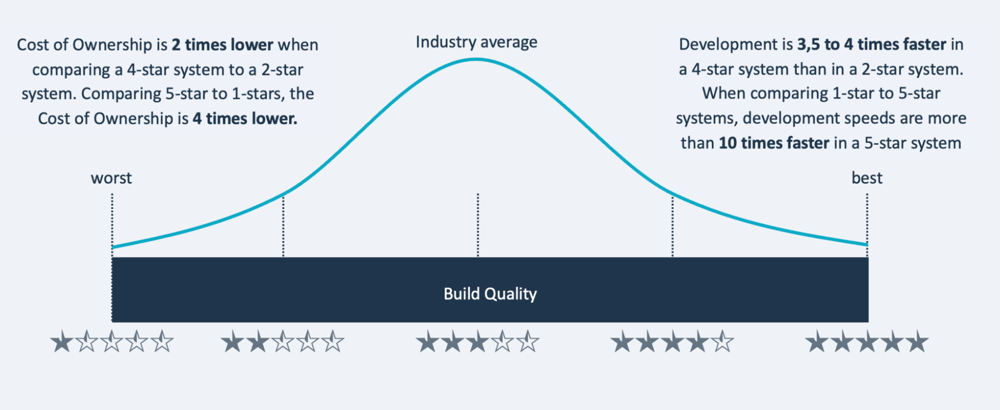

# Our approach on maintainability: benchmarked code metrics offer perspective

A benchmark on quality is meaningful because it shows you an unbiased norm of how well you are doing. For source code, this means that you can compare it to the code that others are producing and maintaining.

<iframe width="560" height="315" src="https://www.youtube.com/embed/D_5SN4Q8cGI" title="YouTube video player" frameborder="0" allow="accelerometer; autoplay; clipboard-write; encrypted-media; gyroscope; picture-in-picture; web-share" allowfullscreen></iframe>

Sigrid compares analysis results for your system against a benchmark of 10,000+ industry systems, to give you that perspective. 

This benchmark set is selected and calibrated yearly to give a balanced view of the *current state of software development*. "Balanced" here can be understood as a representative spread of the "system population". This will include anything in between old and new technologies. In terms of technologies this is skewed towards programming languages that are now most common. The metrics underlying the benchmark approach a normal distribution.

## Benchmarking from 1 to 5 stars

The code quality score compared to this benchmark is expressed in star ratings, on a scale from 1 to 5 stars. It follows a 5%-30%-30%-30%-5% distribution. Technically, its metrics range from 0.5-5.5 stars. So the middle 30% exists between 2.5 - 3.5 and is scored as 3 stars, market average. 

So even though 50% necessarily is below average (3.0), 35% of systems will score below the 3-star threshold (below 2.5). And 35% of systems will score above the 3-star threshold (above 3.5). 

## Star ratings are predictive of speed and costs

By experience with its datasets of systems, SIG has gathered that there is a strong correlation, and cause-effect relationship, between this  star rating and development speed/system maintenance costs. For example, maintenance/ownership costs for 4-star systems are 2 times lower than for 2-star systems, and their development speed is up to 4 times faster.  See the graph below:

## Interpreting metrics depends on context

Whether a lower score, such as below a 3-star rating, is an actual problem, depends on context. Considerations might for example be the balance between the system’s code change capacity (how easy you can make changes) and the expected business change demand (how much and how fast you need to change to get by).
