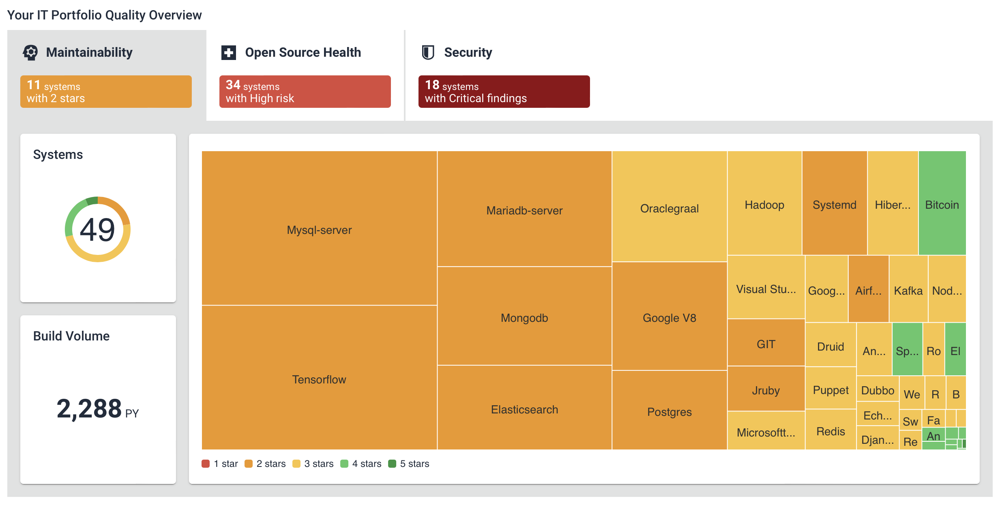
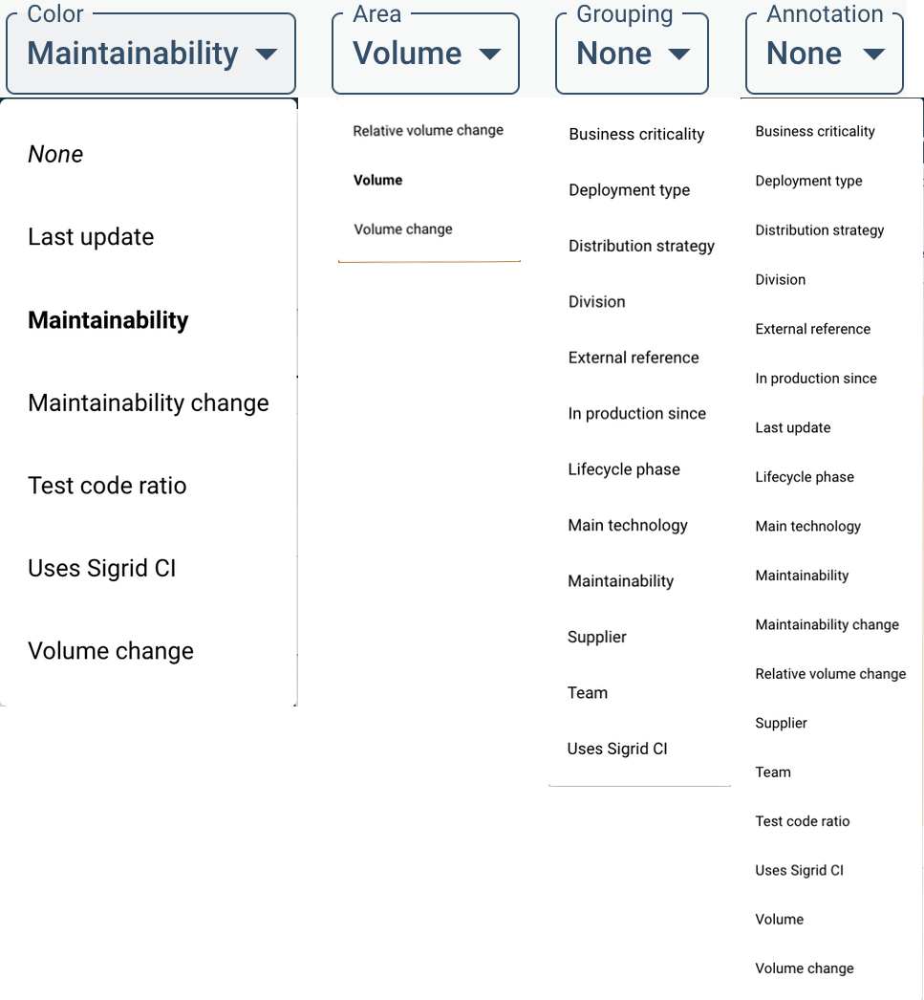
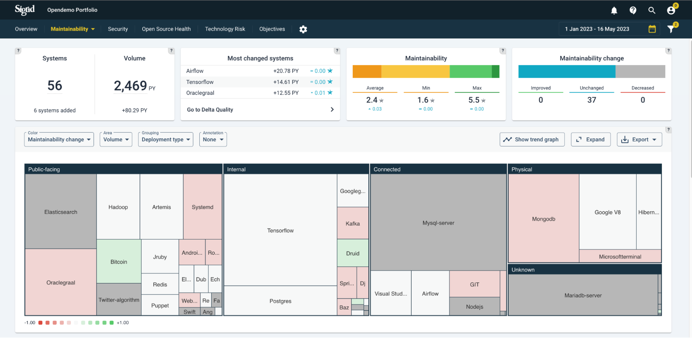

# Uses
## Portfolio/trend views
Example analysis questions:

* Is the portfolio balanced with business objectives and (enterprise) architecture roadmaps? 
* Do some systems appear to be in trouble while they should have a long life ahead of them? Are quality trends heading in the right direction? 
* Which direction is technical debt moving? Does this impede developers to support the business with sufficient speed and quality?

To answer such questions, start in the portfolio view > tab *Overview*. Sigrid shows a dashboard with a quality overview of your entire portfolio, combining all quality characteristics. Based on the systems’ information, you can filter/zoom your portfolio into views that help you understand the details. 

Below, systems are grouped by lifecycle phase. A lifecycle phase is an indication of a system’s maturity and “adaptability needs”, their expected path of continuation. They range from: Initial development > Evolution > Servicing & maintenance > End-of-life. You will generally expect to see a higher maintainability for younger systems (Initial development and Evolution), because they have a long time of changes ahead of them. Lower code quality early on in a system’s life will hurt more over the long term than it would for a system that is already considered “end-of-life”. 
Setting this lifecycle metadata is discussed in the [metadata page](../organization-integration/metadata.md). The help buttons  explain the meaning of the different types of settings.

The maintainability ratings expressed in (rounded) stars are distinguished by "traffic light colors", ranging from red (1 star) to green (5 stars). 

Note that the snapshots dates in the top-right corner always imply a period, but it will assume the last date as a state, unless you select a viewing option that shows change, such as "Maintainability change". 

You can create different by system characteristics. The characteristics under **Grouping** and **Area** will change the ordering and size of the systems within the treemap. **Color** and **Annotation** will add extra information on top, as a color scheme or annotation. A complete menu of viewing options is shown below.

Here, "Maintainability change" is chosen as the meaning of the color scheme. The relative changes are colored as white (neutral) up to green (improving) and red (deteriorating), based on the period selected above (in this example, Year-To-Date/YTD). This can be useful as trend analysis, comparing to expectations. Generally, you would expect public-facing systems to be more actively maintained because outside users tend to come up with new requests, bug reports, and requirements for e.g. stability. As a simplification, you would expect actively maintained systems to not (or very little) deteriorate in code quality. Switching between views of "maintainability change" in different grouping will give you and idea of the balance between expected- and actual trends.  

You can filter per division/team/supplier on different quality aspects, and track the trends of each. 

Whether quality trends are heading in the right direction does depend on context/goals. The expected quality direction is not necessarily only upwards, but could be: restrict deterioration, stabilization, or cutting volume as a priority.

The visibility of system-/portfolio quality overviews and their standing on [quality objectives](../getting-started/objectives.md) helps getting a shared understanding and commitment towards quality of systems and the portfolio.

# System/detailed views