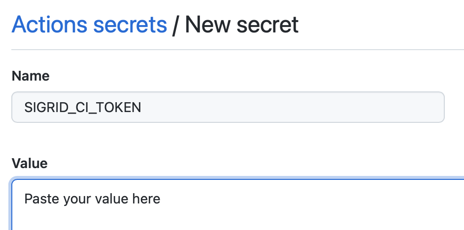
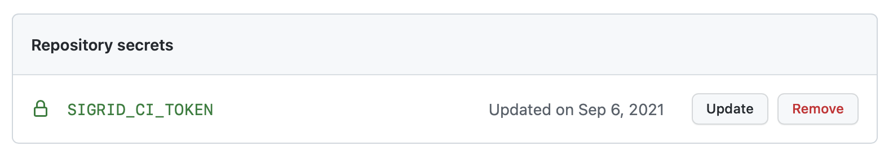
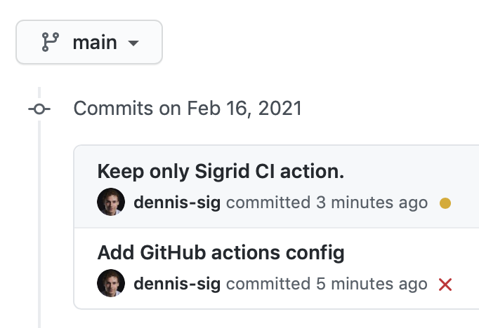
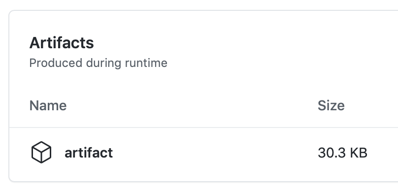
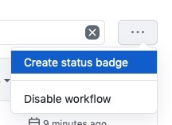

Integrating Sigrid CI with GitHub Actions
=========================================

## Prerequisites

- You have a [Sigrid](https://sigrid-says.com) user account. 
- You have created an [authentication token for using Sigrid CI](authentication-tokens.md).

## On-boarding your system to Sigrid

On-boarding is done automatically when you first run Sigrid CI. As long as you have a valid token, and that token is authorized to on-board systems, you will receive the message *system has been on-boarded to Sigrid*. Subsequent runs will then be visible in both your CI environment and [sigrid-says.com](https://sigrid-says.com). 

## Configuration

### Step 1: Configure Sigrid credentials to environment variables

Sigrid CI reads your Sigrid account credentials from an environment variable called `SIGRID_CI_TOKEN`. You can make this environment variable available to GitHub Actions by creating "secrets" in your GitHub repository:

- Open your project settings in GitHub
- Select "Secrets" in the menu on the left
- Select "Actions" in the sub-menu that appears below "Secrets"
- Use the "New repository secret" button
- Create a secret named `SIGRID_CI_TOKEN` and use your [Sigrid authentication token](authentication-tokens.md) as value



Your repository secret should now look like this:



This example explained how to add secrets for a single repository. However, if you have a GitHub organization with many repositories it can be cumbersome to repeat these steps for every repository. You can solve this by adding secrets to your GitHub organization. The process is the same as explained above, though you should access the "secrets" menu for your GitHub organization instead of the "secrets" page for the repository.


The organization-level secret.

### Step 2: Create a GitHub Actions workflow for Sigrid CI

Sigrid CI consists of a number of Python-based client scripts, that interact with Sigrid in order to analyze your project's source code and provide feedback based on the results. These client scripts need to be available to the CI environment, in order to call the scripts *from* the CI pipeline. You can configure your GitHub Actions to both download the Sigrid CI client scripts and then run Sigrid CI. 

We will create two GitHub Action workflows: the first will publish the main/master branch to [sigrid-says.com](https://sigrid-says.com) after every commit. In your GitHub repository, create a file `.github/workflows/sigrid-publish.yml` and give it the following contents:

```
name: sigrid-publish
on:
  push:
    branches:
      - "main"
jobs:
  sigridci:
    runs-on: ubuntu-latest
    steps:
      - name: Check out repository
        uses: actions/checkout@v2
      - run: "git clone https://github.com/Software-Improvement-Group/sigridci.git sigridci"
      - name: "Run Sigrid CI" 
        env:
          SIGRID_CI_TOKEN: "${{ secrets.SIGRID_CI_TOKEN }}"
        run: "./sigridci/sigridci/sigridci.py --customer examplecustomername --system examplesystemname --source . --targetquality 3.0 --publish" 
      - name: "Save Sigrid CI results"
        if: ${{ success() || failure() }}
        uses: actions/upload-artifact@v2
        with:
          path: "sigrid-ci-output/**"
          retention-days: 7
          if-no-files-found: ignore
```

Note the name of the branch, which is `main` in the example but might be different for your repository. In general, most older GitHub projects will use `master` as their main branch, while more recent GitHub projects will use `main`. 

Next, we create a separate workflow for the pull request integration. This will compare the contents of the pull request against the main/master branch from the previous step. In your GitHub repository, create a file `.github/workflows/sigrid-pullrequest.yml` and give it the following contents:

```
name: sigrid-pullrequest
on: [pull_request]
jobs:
  sigridci:
    runs-on: ubuntu-latest
    steps:
      - name: Check out repository
        uses: actions/checkout@v2
      - run: "git clone https://github.com/Software-Improvement-Group/sigridci.git sigridci"
      - name: "Run Sigrid CI" 
        env:
          SIGRID_CI_TOKEN: "${{ secrets.SIGRID_CI_TOKEN }}"
        run: "./sigridci/sigridci/sigridci.py --customer examplecustomername --system examplesystemname --source . --targetquality 3.5"
      - name: "Save Sigrid CI results"
        if: ${{ success() || failure() }}
        uses: actions/upload-artifact@v2
        with:
          path: "sigrid-ci-output/**"
          retention-days: 7
          if-no-files-found: ignore
```

This example assumes you're using the repository-level secrets. If you want to use the organization-level secrets instead, you can change the following lines:

```
SIGRID_CI_TOKEN: "${{ secrets.SIGRID_CI_ORG_TOKEN }}"
```

**Security note:** This example downloads the Sigrid CI client scripts directly from GitHub. That might be acceptable for some projects, and is in fact increasingly common. However, some projects might not allow this as part of their security policy. In those cases, you can simply download the `sigridci` directory in this repository, and make it available to your runners (either by placing the scripts in a known location, or packaging them into a Docker container). 

The example YAML file will trigger a Sigrid CI analysis on every pull request. It is also possible to limit Sigrid CI to specific branches, or trigger Sigrid CI after every push. The [GitHub Actions documentation](https://docs.github.com/en/actions/reference/workflow-syntax-for-github-actions) explains how to configure those scenarios in the YAML file.

The relevant command that starts Sigrid CI is the call to the `sigridci.py` script, which starts the Sigrid CI analysis. The scripts supports a number of arguments that you can use to configure your Sigrid CI run. The scripts and its command line interface are explained in [using the Sigrid CI client script](client-script-usage.md).

Finally, note that you need to perform this step for every project where you wish to use Sigrid CI. Be aware that you can set a project-specific target quality, you don't necessarily have to use the same target for every project.

## Optional: change the analysis scope configuration

Sigrid will try to automatically detect the technologies you use, the component structure, and files/directories that should be excluded from the analysis. You can override the default configuration by creating a file called `sigrid.yaml` and adding it to the root of your repository. You can read more about the various options for custom configuration in the [configuration file documentation](analysis-scope-configuration.md).

## Usage

To view all Sigrid CI results, check the "Actions" tab in your GitHub repository. Select "Sigrid CI" from the available actions in the menu on the left. This will give you a central overview of all Sigrid CI analyses:


The check will succeed if the code quality meets the specified target, and will fail otherwise. In addition to this central overview, you can also find the Sigrid CI indicator next to all commits:



Clicking the small indicator will show a pop-up with some more information:


Select "Details" to see the output from the Sigrid CI check:

Sigrid CI provides multiple levels of feedback. The first and fastest type of feedback is directly produced in the CI output, as shown in the following screenshot:


The output consists of the following:

- A list of refactoring candidates that were introduced in your merge request. This allows you to understand what quality issues you caused, which in turn allows you to fix them quickly. Note that quality is obviously important, but you are not expected to always fix every single issue. As long as you meet the target, it's fine.
- An overview of all ratings, compared against the system as a whole. This allows you to check if your changes improved the system, or accidentally made things worse.
- The final conclusion on whether your changes and merge request meet the quality target.

In addition to the textual output, Sigrid CI also generates a static HTML file that shows the results in a more graphical form. This is similar to test coverage tools, which also tend to produce a HTML report. You can download this HTML report from the "artifacts" section in the GitHub Actions page:



The information in the HTML report is based on the aforementioned list, though it includes slightly more detail.


Finally, if you want to have more information on the system as a whole, you can also access [Sigrid](http://sigrid-says.com/), which gives you more information on the overall quality of the system, its architecture, and more.

### Adding a Sigrid CI badge to your repository

Once you have used Sigrid CI for the first time, GitHub allows you to create a badge showing the current status. You can create the badge using the following steps:

- Click on "Actions" in your repository
- Select Sigrid CI in the menu on the left
- Use the "..." menu on the top right
- Select "Create status badge"



- Copy the Markdown code, and add it to your repository's README file


Your Sigrid CI badge will now appear in your project's home page.


## Contact and support

Feel free to contact [SIG's support department](mailto:support@softwareimprovementgroup.com) for any questions or issues you may have after reading this document, or when using Sigrid or Sigrid CI. Users in Europe can also contact us by phone at +31 20 314 0953.
