# Sigrid extension for JetBrains IDEs

The JetBrains plugin is another Sigrid IDE extension, alongside the [Sigrid extension for VS Code](vscode-extension.md), that helps you work on Sigrid findings without leaving your IDE. You can browse findings, triage them, and navigate straight to the relevant code. The plugin works across all JetBrains platforms, including IntelliJ, Rider, and any other JetBrains IDE you use.

The plugin is available on the [JetBrains Marketplace](https://plugins.jetbrains.com/plugin/32479-sigrid).

If you're looking for AI coding assistant integration instead, check out the [Sigrid MCP](integration-sigrid-mcp.md). This plugin is for developers who want to work with findings themselves.

What you can do with it:

- Browse Maintainability, Security, and Open Source Health findings directly in your IDE
- Filter by risk level or status, or search across all findings
- See only the findings for the file you're currently editing
- Triage findings — update status and add remarks — without opening Sigrid in your browser
- Double-click a finding to jump straight to the relevant line of code
- Open the full finding detail page in Sigrid when you need more context
- Create Jira or Azure DevOps issues directly from one or more findings, via a unified "Create Issue" button

## Requirements

The plugin works with the following JetBrains IDEs, version **2026.1 or later**:

IntelliJ IDEA (Community & Ultimate), PyCharm (Community & Professional), WebStorm, GoLand, PhpStorm, RubyMine, CLion, Rider, Android Studio, and Aquua.

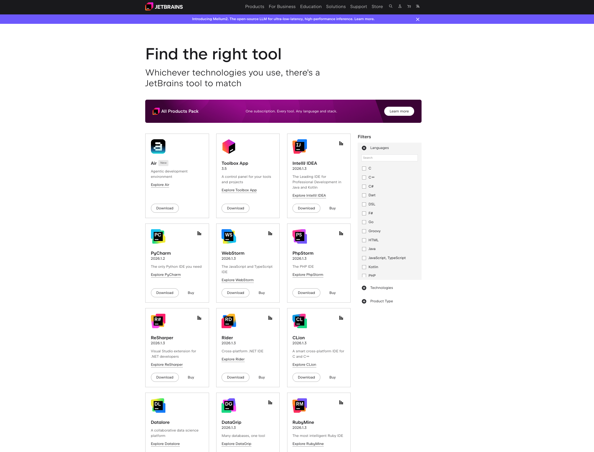

You'll also need a Sigrid account with API access.

## Installing the plugin

 To install it you can he plugin you can download it from the [JetBrains Marketplace](https://plugins.jetbrains.com/plugin/32479-sigrid) or in the IDE by searching Sigrid plugin. 

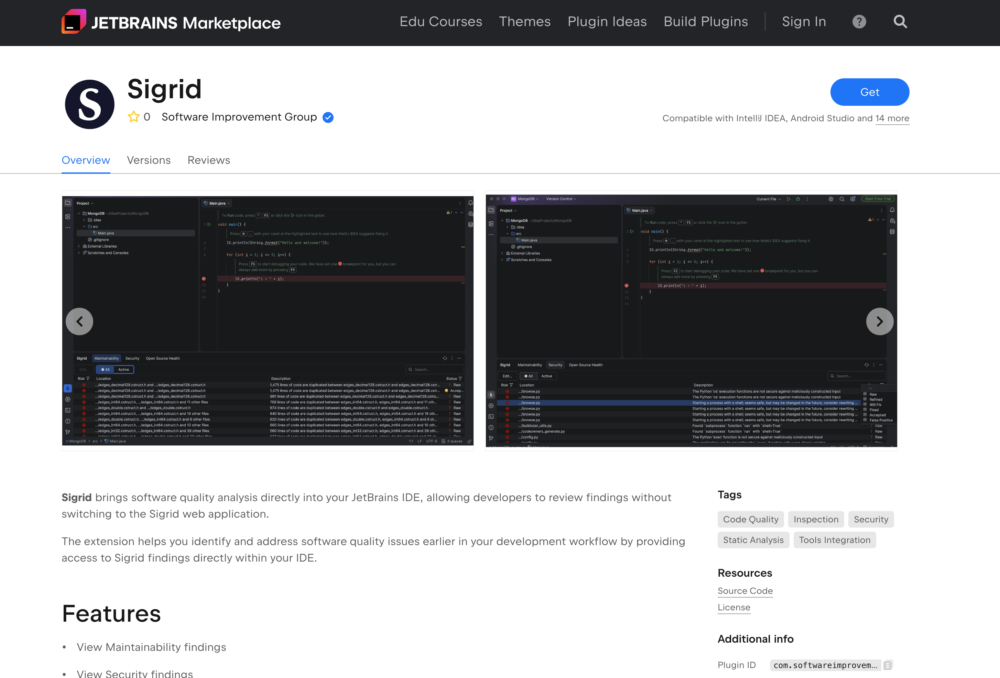
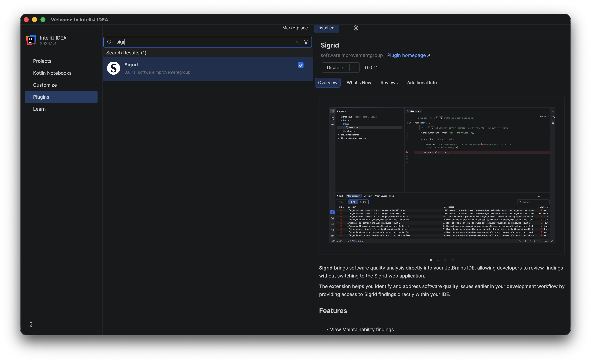

1. Open your JetBrains IDE and go to **Settings → Plugins**
2. Click the gear icon (⚙️) and choose **Install Plugin from Disk**
3. Select the ZIP file you downloaded and restart the IDE

## Setting it up

Most settings are global, configured once and shared across all your projects. Go to **Settings → Tools → Sigrid** and fill in your **API Key** and **Portfolio Name**. If you're on a self-hosted Sigrid instance, add your URL there too — otherwise leave it blank and it'll default to `https://sigrid-says.com`.

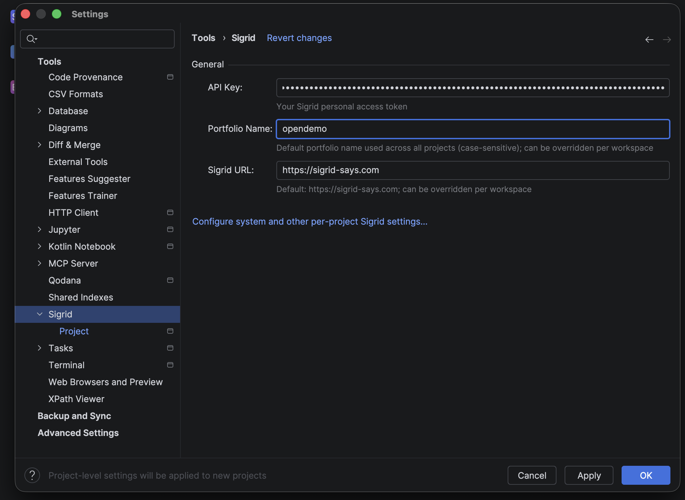

At the project level (**Settings → Tools → Sigrid → Project**), you need to fill in the **System** field — this is required, and tells the plugin which codebase to load findings for. If it's left blank, no findings will load. **Subsystem** is optional, only needed if you want to narrow things down further.

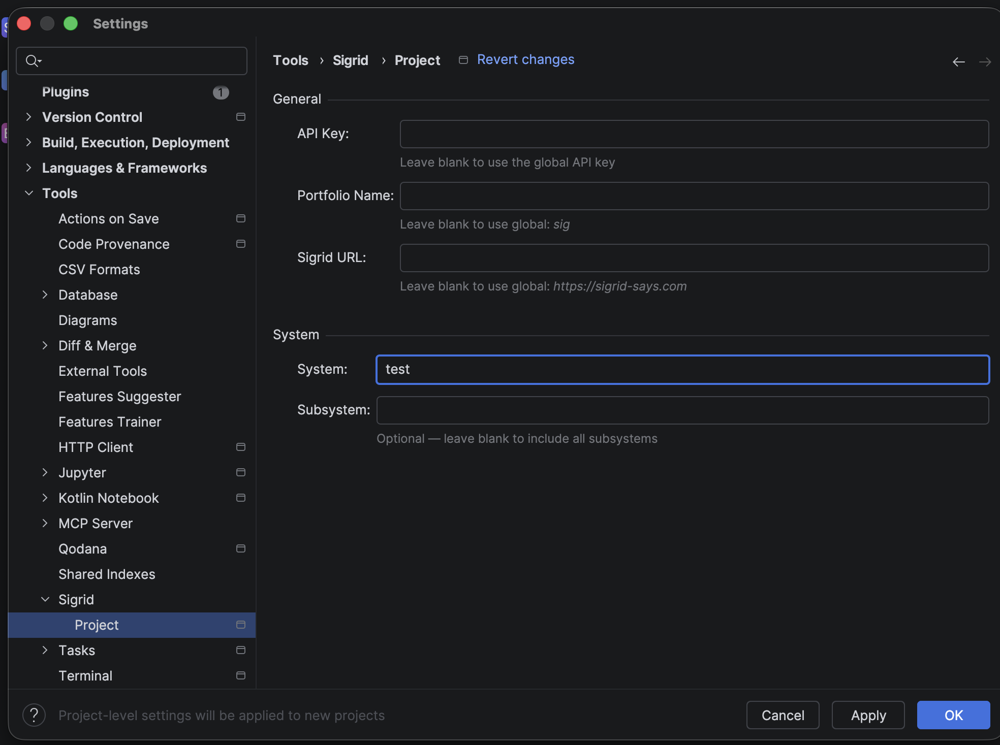

You can leave **API Key**, **Portfolio Name**, and **Sigrid URL** blank at the project level — the plugin automatically falls back to your global settings, so you don't have to repeat them for every project. You'd only override them here if you have a separate Sigrid account for this specific project, which is rare.

## Opening the plugin

Once configured, look for the **Sigrid** tab at the bottom of your IDE. If you don't see it, you can open it from **View → Tool Windows → Sigrid**, or press `Cmd+Shift+A` (Mac) / `Ctrl+Shift+A` (Windows/Linux) and search for "Sigrid Tool Window".

The panel has three tabs — **Maintainability**, **Security**, and **Open Source Health** — each showing the findings Sigrid has for your system.

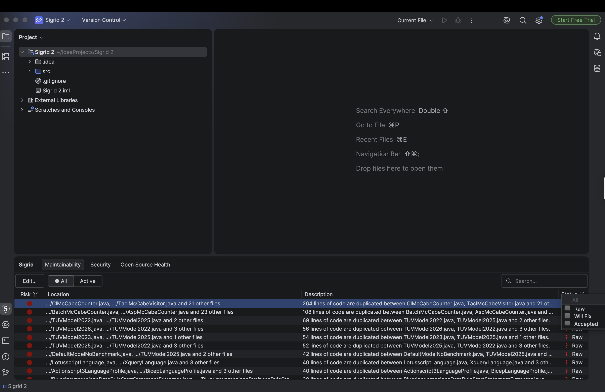

## Navigating findings

Double-click any finding to jump to the exact file and line. If a finding has multiple locations, a picker appears so you can choose which one to go to. The icon on the right side of each row opens the full finding detail page in Sigrid in your browser.

## Filtering and searching findings

When working with a large number of findings it can be hard to focus on what matters most. You can narrow down the findings list using the filter controls and the search bar at the top of the panel.

**To show only findings for the file you're currently editing**, toggle the **Active** button in the toolbar. Only findings related to the open file are shown. The filter state is remembered per tab.

**To filter by risk level**, click the filter icon (▽) next to the **Risk** column header. A dropdown appears with the risk levels available in your current findings — for example Very High, High, or Medium. Only options that exist in the active findings table are shown. Select one or more risk levels to show only findings that match. Deselect to remove the filter.

**To filter by status**, click the filter icon (▽) next to the **Status** column header. A dropdown appears with the available statuses, such as Raw, Accepted, and False Positive.

**To search across all findings**, use the search bar in the top-right corner of the panel. The list updates in real time as you type.

You can combine the active file filter, risk, status, and search filters at the same time.

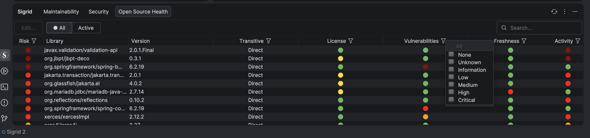

## Editing findings

You can update a finding's status and add a remark directly from the findings panel, without opening Sigrid in your browser.

To edit a finding, select one or more rows and do one of the following:

- Press **F2**
- Click the edit button in the toolbar
- Right-click and choose **Edit…** from the context menu

Batch edits are supported for up to 25 findings at a time.

## Creating issues from findings

You can turn one or more findings into a Jira issue or an Azure DevOps work item without leaving your IDE. Once at least one tracker is configured, a **Create Issue** button appears in the toolbar above the findings list. If you've configured both Jira and Azure DevOps, the button becomes a split button: clicking it directly creates an issue in whichever tracker you configured first, and the dropdown arrow next to it lets you pick the other tracker, or jump straight to **Issue Tracker Settings**.

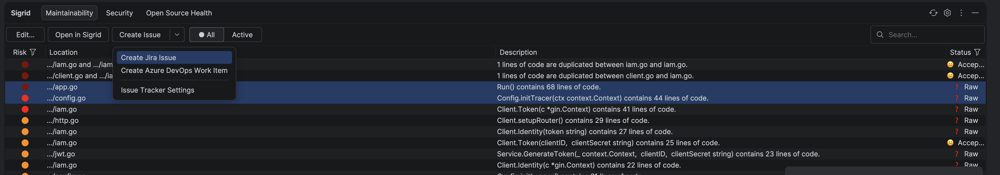

### Setting up Jira

Go to **Settings → Tools → Sigrid → Jira** (this is a project-level setting) and fill in:

- **Base URL** — your Jira site, e.g. `https://yourcompany.atlassian.net`
- **User** — the email or username for the Jira account the plugin should act as
- **Token** — a Jira personal access token, generated from your Atlassian account at **id.atlassian.com → Security → API tokens**. Don't use your Jira password here.
- **Project Key** — the short, uppercase code Jira uses to prefix issue IDs in the target project (for example, the key for issue `SCRUM-1` is `SCRUM`). You can find it in the project's issue IDs or in its URL.

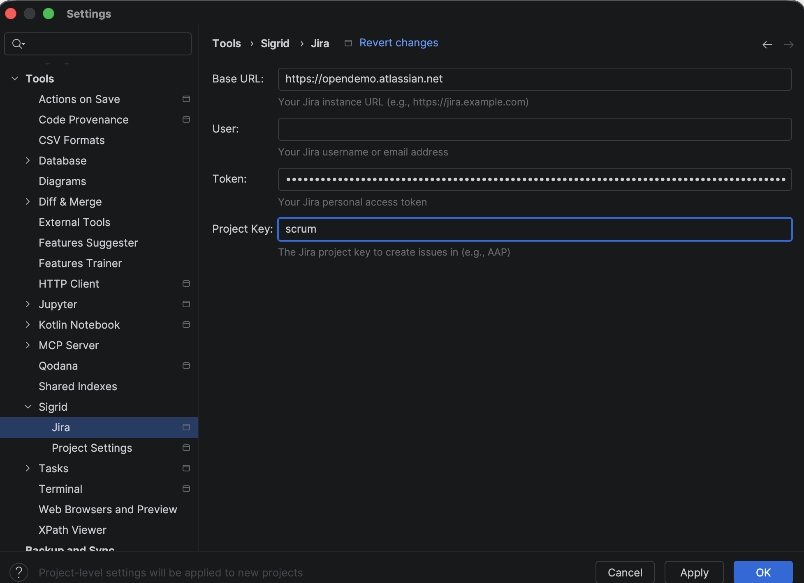

### Creating a Jira issue

To create an issue, select one or more findings in the Maintainability, Security, or Open Source Health panel, then click **Create Issue** in the toolbar (or pick **Jira** from the dropdown if Azure DevOps is also configured).

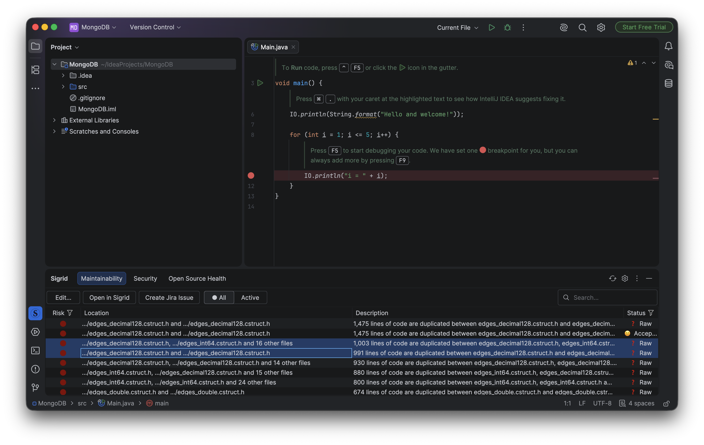

A dialog opens where you can edit the issue title and preview the auto-generated description, which lists each finding's title, severity, and file locations, before submitting.

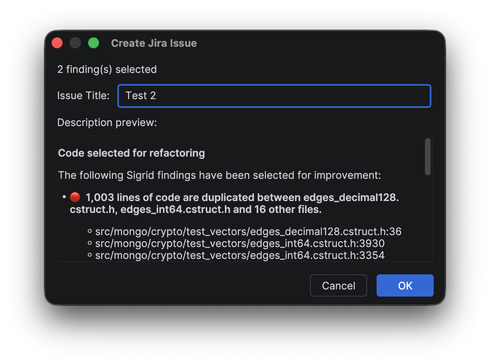

Once created, a notification confirms the new issue and links straight to it in Jira.

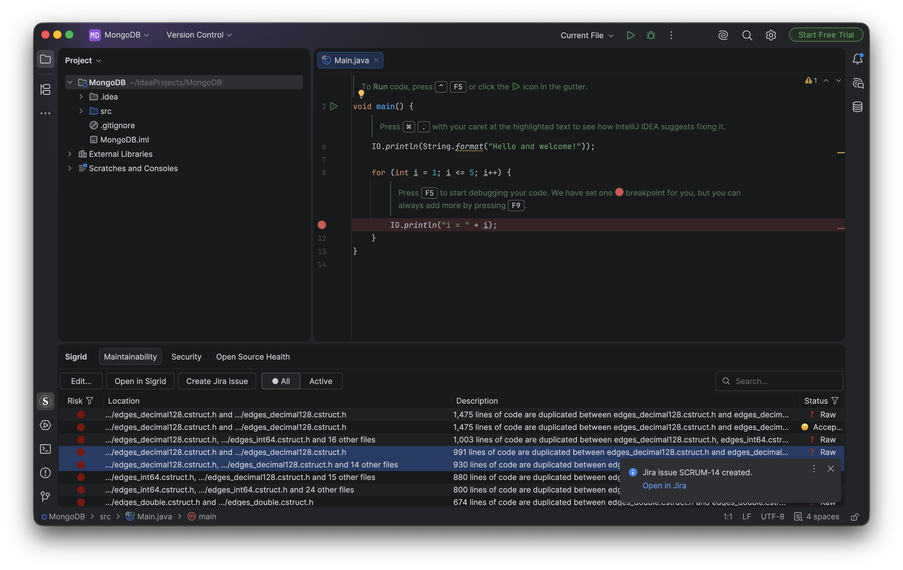

The issue itself carries over the same finding details from the description preview, so anyone picking it up in Jira has the full context without needing to open Sigrid.

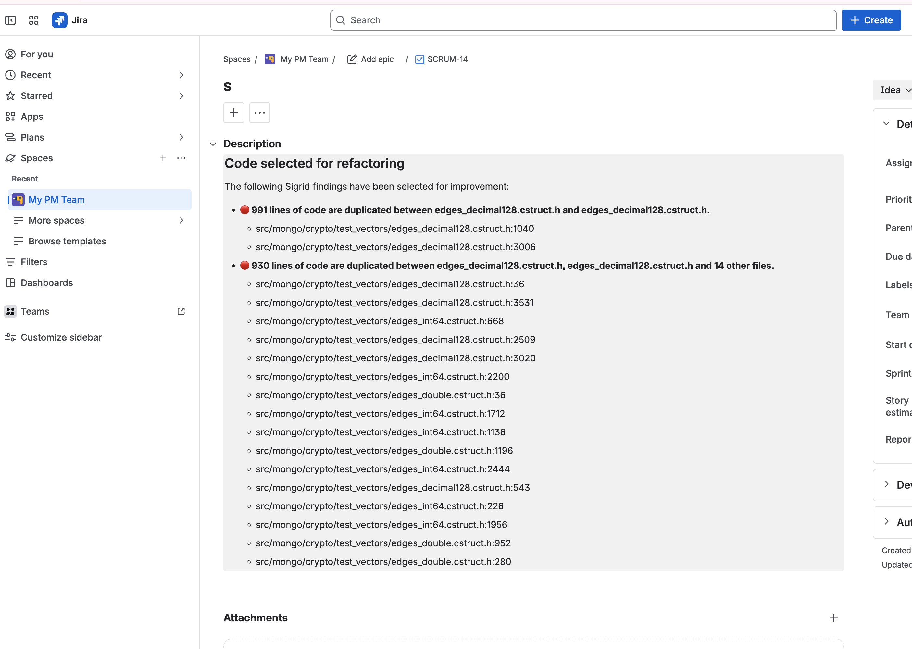

If issue creation fails, Jira usually reports this as a generic permission error even when the real cause is different. Check, in order:

1. The **Project Key** matches exactly what's shown in Jira (case-sensitive)
2. The **Base URL** points to the correct Jira site
3. The Jira account behind your token has permission to create issues in that specific project
4. The **User** matches the account that generated the token

### Setting up Azure DevOps

Azure DevOps settings are split across two pages. Go to **Settings → Tools → Sigrid → Issue Trackers → Azure DevOps** (a global setting, shared across all your projects) and fill in:

- **Organization URL** — your Azure DevOps organization, e.g. `https://dev.azure.com/yourorganization`
- **Personal Access Token** — a token with **Work Items (Read & write)** scope, generated from **User settings → Personal access tokens → New Token** in Azure DevOps

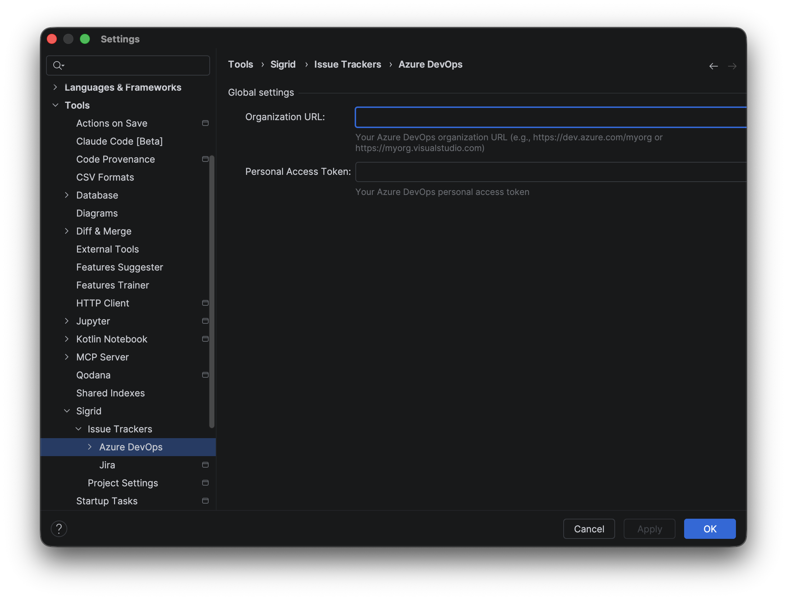

**Project Name** is set per-project rather than globally, since each IntelliJ project you work in will typically map to a different Azure DevOps project. Go to **Settings → Tools → Sigrid → Issue Trackers → Azure DevOps → Project Settings** and fill in:

- **Project Name** — the Azure DevOps project where work items will be created, e.g. `SigridTest`. This field is required.
- **Organization URL** — leave blank to use the global Organization URL
- **Personal Access Token** — leave blank to use the global PAT

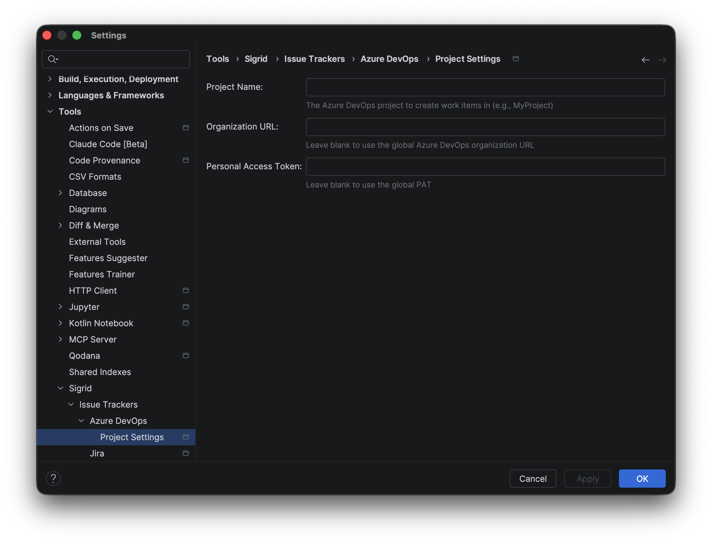

### Creating an Azure DevOps work item

Select one or more findings the same way you would for a Jira issue, then click **Create Issue** in the toolbar (or pick **Azure DevOps** from the dropdown if Jira is also configured).

A dialog opens where you can enter a title and choose the **work item type** from a dropdown — the available types are loaded directly from your Azure DevOps project, so they'll match whatever process template it uses (for example, a Scrum project offers Task, Bug, Feature, Impediment, and Product Backlog Item). The dialog also lets you preview the auto-generated description, which lists each finding's title, severity, and file locations, before submitting.

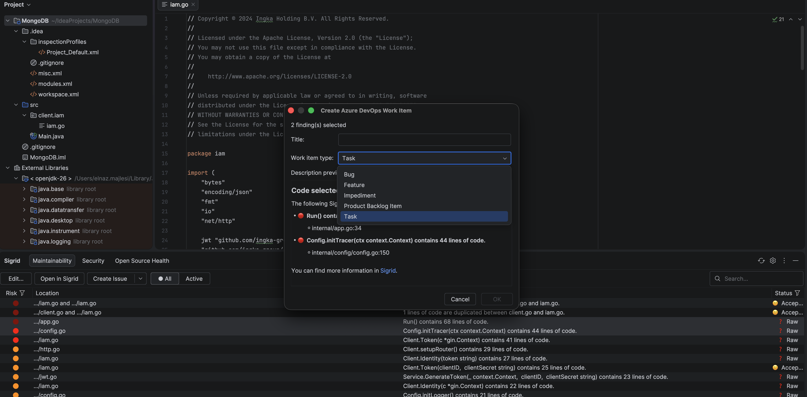
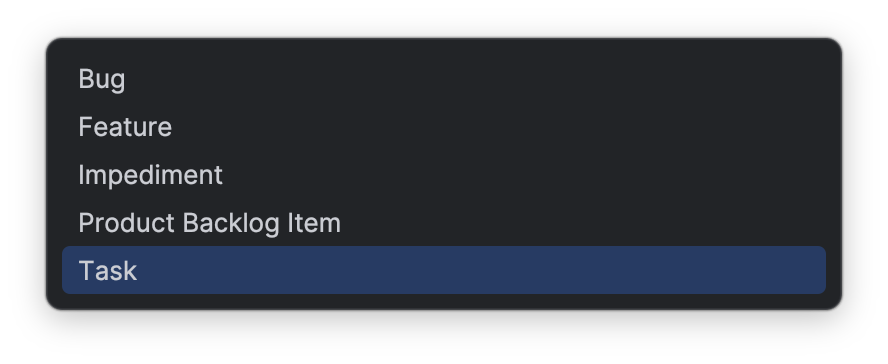

Click **Create**. A success notification appears showing the work item number, with an **Open in Browser** link to view it directly in Azure DevOps.

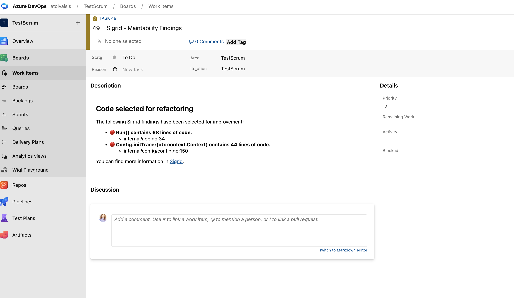

## Contact and support

Feel free to contact [SIG's support team](mailto:support@softwareimprovementgroup.com) for any questions or issues you may have after reading this documentation or when using Sigrid.
