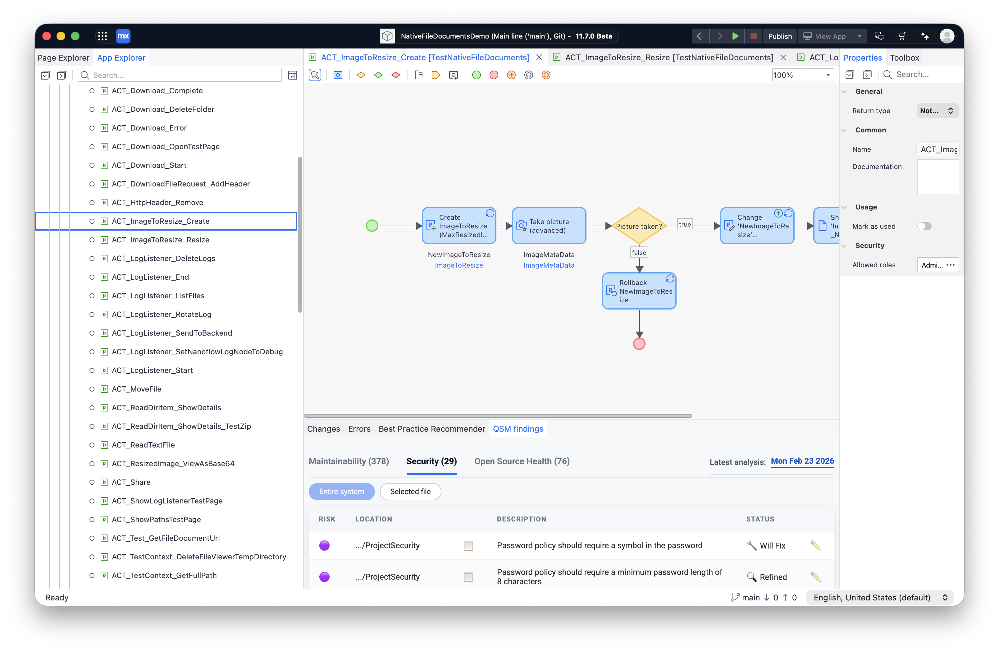
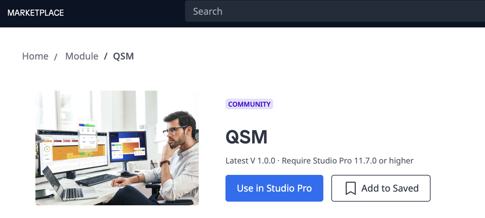

QSM extension for Mendix Studio Pro
===================================

This extension lets you view and manage findings in [Mendix Studio Pro](https://marketplace.mendix.com/link/studiopro).
It focuses on viewing and managing QSM findings from within your IDE. In particular, it lets you do the following:

- **Navigate QSM findings in your IDE.** This allows for faster and more familiar code navigation than having to
  navigate your code and findings in QSM itself.
- **Show QSM findings for the code you're currently working on.** This makes it easier to take those findings
  into consideration and apply [the boy scout rule](https://deviq.com/principles/boy-scout-rule/) when working on
  those files.
- **Triage findings.** Changing a finding's status and adding remarks directly from your IDE makes it faster and
  more convenient when you need quickly triage large numbers of findings.
- **Jump back-and-forth between QSM and your IDE.** When needed, you can quickly jump from the finding information
  in your IDE to viewing the finding details in QSM.

The Mendix Studio Pro extension requires Studio Pro version 11.7 or newer. It is unfortunately not possible to
support older versions.
{: .warning }

## Installing the extension

You can find the QSM extension for Mendix Studio Pro in the
[Mendix Marketplace](https://marketplace.mendix.com/link/component/260132). You can use the blue "Use in Studio Pro"
button to install it.

## Configuring the extension

Before you can use the extension, you will first need to provide your QSM credentials.

- Open Mendix Studio Pro.
- In the top menu, select "extensions".
- Select "QSM".
- Select "QSM settings".
- Enter your QSM customer name and system name.
- You will also need to add your [authentication token](../organization-integration/authentication-tokens.md).

## Using the extension

The QSM extension is not visible by default. You can open it using the following steps:

- In the top menu, select "extensions".
- Select "QSM".
- Select "Show QSM findings".

When opened, the QSM extension contains multiple tabs, one for each QSM capability.

- Double-clicking on a finding will navigate you to the location of that finding in the code.
- Using the "open" icon in the right-hand side will open the corresponding QSM finding detail page in your
  default browser.
- The pencil icon allows you to edit a finding's status and add remarks.

## Contributing to the extension

The QSM extension for Mendix Studio Pro is open source. The
[GitHub project](https://github.com/Software-Improvement-Group/QSM-mendix-studio-pro) contains information on how
you can build and install the extension locally.

## Contact and support

Feel free to contact [SIG's support team](mailto:support@softwareimprovementgroup.com) for any questions or issues
you may have after reading this documentation or when using QSM.
