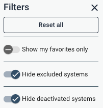

Sigrid API documentation
========================

In addition to [Sigrid CI](../README.md), Sigrid also provides a more general-purpose REST API that you can use to obtain analysis results from Sigrid. This allows you to integrate data from Sigrid into your workflow. 

## General usage

- The Sigrid API base URL is `https://sigrid-says.com/rest/analysis-results/api/v1`. 
- Authentication for the Sigrid API uses the same [authentication tokens](../organization-integration/authentication-tokens.md) that are used by Sigrid CI. Your token's permissions are based on your user account, so the token can access the same systems that you can. 
- You need to pass the authentication token to each request in the HTTP header `Authorization: Bearer {SIGRID_CI_TOKEN}`.
- All requests to Sigrid are rate-limited: at present **2500 per 5 minutes, per source IP address** are allowed. Requests that bring the total request count of the last 5 minutes over this limit will not be handled and get an HTTP 429 response.
- All **Sigrid CI analysis requests** are rate-limited as well. As analysis jobs typically take several minutes up to several hours, another type of rate limiting applies here. For every system, **initially (and maximum) 15 "tokens" are available**, each request consumes 1 token, and **once per 5 minutes new token is made available**. Analysis requests made when no tokens are available for the respective system will not be handled and get an HTTP 429 response.
- All end points will return HTTP status 401 if the token is invalid, or if the token is not authorized to access the portfolio and/or system.
- All end points return JSON and therefore return a Content-Type of `application/json`.
- Please use lower case when you format your api calls.


The following example shows how to call the Sigrid API using `curl`:

```
curl -H 'Authorization: Bearer {SIGRID_CI_TOKEN}' https://sigrid-says.com/rest/analysis-results/api/v1/maintainability/{customer}
```

In the example, `{customer}` refers to your company's Sigrid account name (lower case), and `{SIGRID_CI_TOKEN}` refers to your authentication token.

### Including deactivated and/or excluded systems

In Sigrid's web-based user interface, several portfolio (customer) level dashboards by default 
hides deactivated systems and excluded systems. The filter panel on the right hand side provides 
two toggles to override this behavior:



A system can be deactivated, or excluded from dashboards, in the metadata settings page:


Sigrid's REST API mimics this behavior, as follows:
* All portfolio-level endpoints by default do not include deactivated nor excluded systems in 
  their responses.
* Deactivated systems can be included in the response by adding a boolean query parameter 
  `hideDeactivatedSystems` and set it to `false`, `no`, or `0`. For instance, `GET 
  /api/v1/maintainability/{customer}?hideDeactivatedSystems=false` includes deactivated systems 
  in the response.
* Excluded systems can be included in the response by adding a boolean query parameter
  `hideExcludedSystems` and set it to `false`, `no`, or `0`. For instance, `GET
  /api/v1/maintainability/{customer}?hideExcludedSystems=false` includes development-only systems
  in the response.

## Available end points

### Maintainability ratings

Maintainability ratings for a given customer are available via three endpoints:
- `GET https://sigrid-says.com/rest/analysis-results/api/v1/maintainability/{customer}`: system-level maintainability ratings for all systems of the given customer the current user has access to.
- `GET https://sigrid-says.com/rest/analysis-results/api/v1/maintainability/{customer}/{system}`: system-level maintainability ratings for the given system of the given customer.
- `GET https://sigrid-says.com/rest/analysis-results/api/v1/maintainability/{customer}/{system}?technologyStats=true`: adds per-technology information in addition to the overall system information.
- `GET https://sigrid-says.com/rest/analysis-results/api/v1/maintainability/{customer}/{system}/components`: component-level maintainability ratings for the given system of the given customer.

The parameter `{customer}` refers to your Sigrid account name. 

<details markdown="1">
  <summary>Example response</summary>

```json
{
    "customer": "my-sigrid-account-name",
    "systems": [
        {
            "system": "my-system-name",
            "customer": "my-sigrid-account-name",
            "maintainability": 5.24,
            "maintainabilityDate": "2022-02-08",
            "allRatings": [
                {
                    "maintainability": 4.96,
                    "maintainabilityDate": "2022-02-06",
                    "componentIndependence": 2.922191130049036,
                    "componentEntanglement": 3.185432066401412,
                    "duplication": 3.8219019076088467,
                    "moduleCoupling": 3.7576658516974955,
                    "testCodeRatio": 1.3420540223995314,
                    "unitComplexity": 4.611590984421209,
                    "unitInterfacing": 2.139146638028358,
                    "unitSize": 3.9657948540316688,
                    "volumeInPersonMonths": 91.54868594563312,
                    "volumeInLoc": 68305
                }
            ]
        }
    ]
}
```

</details>

The top-level `maintainability` and `maintainabilityDate` refer to the *current* state of each system. The `allRatings` array contains a list of all *historic* measurements, which can be used for reporting or trend information.

### Maintainability data

For reporting purposes, using the available [end points for maintainability ratings](#maintainability-ratings) is usually sufficient. However, some advanced use cases require the full Maintainability data, beyond just the ratings.

The end point `GET https://sigrid-says.com/rest/analysis-results/api/v1/maintainability/{customer}/{system}/raw?snapshotDate={snapshotDate}` will generate the *full* Maintainability analysis results, in JSON format. The `snapshotDate` query parameter is optional; it specifies the date of analysis to retrieve the latest maintainability results for the selected `{system}` (in the format of a localDate, e.g. "2025-01-01"). If no `snpshotDate` is supplied, the endpoint will return the latest/most recent maintainability analysis results for the given `{system}`. 

This end point is intended for system-to-system integration, where one of your own systems needs to process this data without relying on the Sigrid user interface.

### Security and reliability findings

Sigrid's REST API provides two endpoints to get all open security or reliability findings for a system:
* Security findings: `GET https://sigrid-says.com/rest/analysis-results/api/v1/security-findings/{customer}/{system}?model={modelName}`
* Reliability findings: `GET https://sigrid-says.com/rest/analysis-results/api/v1/reliability-findings/{customer}/{system}?model={modelName}`

The path parameters `{customer}` and `{system}` refer to your Sigrid account name and system ID respectively. The `modelName` query parameter is optional;
it specifies the model used to determine the category or categories of each finding. If no `modelName` is given, the default model is used (that is: the OWASP
Top-10 for security, and the SIG Code Reliability Top-10 for reliability). 

Valid model names are:
- For security: `ow10` (OWASP Top-10, the default), `sigsec` (SIG Security), `5055sec` (ISO 5055 - Security), `c25` (CWE Top-25), `pci4` (PCI-DSS v4.0), `owasvs4c` (OWASP ASVS 4.0 Chapters), `owasvs4s` (OWASP ASVS 4.0 Sections), `lcnc10` (OWASP Low-Code/No-Code Top-10).
- For reliability: `sigrel` (SIG Code Reliability Top-10, the default) and `5055rel` (ISO 5055 - Reliability).

<details markdown="1">
  <summary>Example response</summary>

```json
[
    {
        "id": "00000000-0000-0000-0000-0000005d9c1e",
        "href": "https://sigrid-says.com/my-sigrid-account/my-system/-/sigrid-security/00000000-0000-0000-0000-0000005d9c1e",
        "firstSeenAnalysisDate": "2019-09-18",
        "lastSeenAnalysisDate": "2019-09-18",
        "firstSeenSnapshotDate": "2019-05-04",
        "lastSeenSnapshotDate": "2019-05-04",
        "filePath": "helloworld.py",
        "startLine": 12,
        "endLine": 23,
        "component": "frontend",
        "type": "",
        "cweId": "CWE-12345",
        "severity": "LOW",
        "impact": "LOW",
        "exploitability": "LOW",
        "severityScore": 2.0,
        "impactScore": 1.2,
        "exploitabilityScore": 0.8,
        "status": "FALSE_POSITIVE",
        "remark": "Test test test",
        "toolName": null,
        "isManualFinding": true,
        "isSeverityOverridden": true,
        "weaknessIds": [
            "CWE-12345"
        ],
        "categories": [
            "A1 Broken Access Control"
        ]
    }
]
```

</details>

### Open Source Health findings and ratings
A list of all third-party open source dependencies is available using the following endpoints:
- `GET https://sigrid-says.com/rest/analysis-results/api/v1/osh-findings/{customer}` for your full portfolio of applications;
- `GET https://sigrid-says.com/rest/analysis-results/api/v1/osh-findings/{customer}/{system}` for a single application.  

The endpoints will include [Open Source Health Quality Model](../reference/quality-model-documents/open-source-health.html) ratings where available. 
The path parameter `{customer}` and `{system}` refer to your Sigrid account name and system ID respectively.

The response format is based on the CycloneDX (version 1.6) format for an [SBOM (software bill of materials)](https://en.wikipedia.org/wiki/Software_bill_of_materials). 

<details markdown="1">
  <summary>Example response for a single system</summary>

Mimetype: `application/vnd.cyclonedx+json`

```json
{
    "bomFormat": "CycloneDX",
    "specVersion": "1.6",
    "version": 1,
    "metadata": {
        "timestamp": "2022-03-17T09:58:34Z",
        "tools": [
            {
                "vendor": "Software Improvement Group",
                "name": "Sigrid",
                "externalReferences": [
                    {
                        "type": "other",
                        "url": "https://sigrid-says.com/my-sigrid-account-name/my-system-id/-/open-source-health"
                    }
                ]
            }
        ],
        "properties" : [
          {
            "name" : "sigrid:ratings:system",
            "value" : "3.89"
          },
          {
            "name" : "sigrid:ratings:vulnerability",
            "value" : "3.2976190476190474"
          },
          {
            "name" : "sigrid:ratings:licenses",
            "value" : "5.5"
          },
          {
            "name" : "sigrid:ratings:freshness",
            "value" : "1.4174311926605505"
          },
          {
            "name" : "sigrid:ratings:management",
            "value" : "3.189908256880734"
          },
          {
            "name" : "sigrid:ratings:activity",
            "value" : "1.3944954128440368"
          }
        ]
    },
    "components": [
        {
            "group": "",
            "name": "yui",
            "version": "2.8.0r4",
            "purl": "pkg:npm/yui@2.8.0r4",
            "properties" : [
                {
                    "name" : "sigrid:risk:freshness",
                    "value" : "HIGH"
                }
            ],
            "type": "library",
            "bom-ref": "pkg:npm/yui@2.8.0r4",
            "evidence" : {
                "occurrences" : [
                    {
                        "location" : "foo/package.json"
                    }
                ]
            }
        }
    ],
    "vulnerabilities": [
        {
            "id": "CVE-2010-4710",
            "ratings": [
                {
                    "score": 4.3,
                    "severity": "medium",
                    "method": "CVSSv2"
                }
            ],
            "description": "Cross-site Scripting",
            "affects" : [
                {
                    "ref" : "pkg:npm/yui@2.8.0r4"
                }
            ]
        }
    ]
}
```
</details>

The `properties` of the root is an array of name/value pairs.
It contains up to 6 items, as detailed in the table below. Note that the value of 
a property can never be `null` according to the CycloneDX specification. Consequently, 
if Sigrid cannot determine the value of a property for whatever reason, it is simply 
missing from the `properties` array.

| Name                           | Description                                              |
|--------------------------------|----------------------------------------------------------|
| `sigrid:ratings:system`        | System Open Source Health Quality model rating           |
| `sigrid:ratings:vulnerability` | Vulnerability Open Source Health Quality model rating    |
| `sigrid:ratings:licenses`      | Licenses Open Source Health Quality model rating         |
| `sigrid:ratings:freshness`     | Freshness Open Source Health Quality model rating        |        
| `sigrid:ratings:management`    | Management Open Source Health Quality model rating       |
| `sigrid:ratings:activity`      | Activity Open Source Health Quality model rating         |


#### Vulnerable libraries in Open Source Health

Additionally, it is possible to filter only vulnerable/non vulnerable dependencies using the aforementioned endpoint as such:
- `GET https://sigrid-says.com/rest/analysis-results/api/v1/osh-findings/{customer}?vulnerable=<choose one of true or false according to the explanation below>`: get all third-party libraries for all systems the current user has access to for the given customer.
- `GET https://sigrid-says.com/rest/analysis-results/api/v1/osh-findings/{customer}/{system}?vulnerable=<choose one of true or false according to the explanation below>`: get all third-party libraries for the given system and customer.

The `vulnerable` URL query parameter is optional and defaults to `false`. The meaning is as follows:
- `?vulnerable=false` or no query parameter: the endpoint returns the full list of third-party libraries detected by Sigrid for the given customer/system(s), including lists of known vulnerabilities per library if any. 
- `?vulnerable=true`: the endpoint returns only those third-party libraries detected by Sigrid for the given customer/system(s) that have at least one known vulnerability. 

The endpoint that returns third-party vulnerabilities for all systems for the given customer returns an array of SBOMs, one for each system as follows:

```
{
    "customer" : "sig",
    "exportDate" : "2022-07-12",
    "systems" : [ {
        "customerName" : "sig",
        "systemName" : "bch",
        "sbom" : {
            ...                   // Same as the response format in the single-system case
        }
    ]
}
```

The `properties` member of elements of the `components` array is an array of name/value pairs. Currently, this array
may have up to 12 items, as detailed in the table below. Similar to above, if Sigrid cannot determine
the value of a property it will be missing from the array.

| Name                        | Description                                                                      |
|-----------------------------|----------------------------------------------------------------------------------|
| `sigrid:risk:vulnerability` | Vulnerability risk (one of `NONE`, `LOW`, `MEDIUM`, `HIGH`, `CRITICAL`)          |
| `sigrid:risk:legal`         | Legal (license) risk (one of `NONE`, `LOW`, `MEDIUM`, `HIGH`, `CRITICAL`)        |
| `sigrid:risk:freshness`     | Freshness risk (one of `NONE`, `LOW`, `MEDIUM`, `HIGH`, `CRITICAL`)              |
| `sigrid:risk:activity`      | Activity risk (one of `NONE`, `LOW`, `MEDIUM`, `HIGH`, `CRITICAL`)               |        
| `sigrid:risk:stability`     | Stability risk (one of `NONE`, `LOW`, `MEDIUM`, `HIGH`)                          |
| `sigrid:risk:management`    | Dependency management risk (one of `NONE`, `LOW`, `MEDIUM`, `HIGH`)              |
| `sigrid:releaseDate`        | Release date of the detected version (ISO 8601: YYYY-MM-DD)                      |
| `sigrid:next:version`       | Version number of the next version                                               |
| `sigrid:next:releaseDate`   | Release date of the next version (ISO 8601: YYYY-MM-DD)                          |
| `sigrid:latest:version`     | Version number of the latest version                                             |
| `sigrid:latest:releaseDate` | Release date of the latest version (ISO 8601: YYYY-MM-DD)                        |
| `sigrid:transitive`         | Indicates whether the dependency is transitive or not (`TRANSITIVE` or `DIRECT`) |

More information on the SBOM format and the various fields is available from the [CycloneDX SBOM specification](https://github.com/CycloneDX/specification).

### Architecture Quality ratings

Arcitecture quality ratings for a given customer are available via two endpoints:
- `GET https://sigrid-says.com/rest/analysis-results/api/v1/architecture-quality/{customer}`: get architecture quality ratings for all systems of the given customer the current user has access to.
- `GET https://sigrid-says.com/rest/analysis-results/api/v1/architecture-quality/{customer}/{system}`: get architecture quality ratings of the given system of the given customer.

The path parameters `{customer}` and `{system}` refer to your Sigrid account name and system ID respectively.

<details markdown="1">
  <summary>Example system-level response format</summary>

The response format of the system-level endpoint is as follows:

```json
{
  "customer" : "my-sigrid-account-name",
  "system" : "my-system-name",
  "snapshotDate" : "2022-01-31",
  "analysisDate" : "2022-02-28",
  "modelVersion" : "1.4",
  "ratings" : {
    "architecture" : 3.84,
    "subcharacteristics" : {
      "dataAccess" : 3.5,
      "technologyStack" : 4.18,
      "evolution" : 3.71,
      "communication" : 3.83,
      "structure" : 4.07,
      "knowledge" : 3.74
    },
    "systemProperties" : {
      "componentCoupling" : 2.86,
      "codeReuse" : 5.38,
      "knowledgeDistribution" : 3.24,
      "boundedEvolution" : 4.21,
      "componentFreshness" : 4.23,
      "communicationCentralization" : 3.18,
      "technologyPrevalence" : 4.18,
      "codeBreakdown" : 3.27,
      "componentCohesion" : 4.46,
      "dataCoupling" : 3.5
    }
  }
}
```
</details>

The customer-level endpoint retuns an array with each element identical to the system-level response.

### Architecture Quality data

For reporting purposes, using the [end point for architecture quality ratings](#architecture-quality-ratings) is usually sufficient. However, some advanced use cases require the full Architecture Quality data, beyond just the ratings.

The end point `GET https://sigrid-says.com/rest/analysis-results/api/v1/architecture-quality/{customer}/{system}/raw` will generate the *full* Architecture Quality analysis results, in JSON format. This end point is intended for system-to-system integration, where one of your own systems needs to process this data without relying on the Sigrid user interface. 

This end point will return the "raw" architecture graph, which is documented in the [Architecture Quality documentation](../reference/aq-json-export-format.md).

### System metadata

System metadata can be viewed and updated using the following three endpoints:
- `GET https://sigrid-says.com/rest/analysis-results/api/v1/system-metadata/{customer}/{system}`: get metadata of the given system of the given customer.
- `GET https://sigrid-says.com/rest/analysis-results/api/v1/system-metadata/{customer}`: get metadata of all systems of the given customer.
- `PATCH https://sigrid-says.com/rest/analysis-results/api/v1/system-metadata/{customer}/{system}`: update metadata of the given system of the given customer.

The path parameters `{customer}` and `{system}` refer to your Sigrid account name and system ID respectively.

<details markdown="1">
  <summary>Example system-level `GET` and `PATCH` response format</summary>

The response format of both system-level endpoints (`GET` and `PATCH`) is as follows:

```json
{
  "displayName" : "User-friendly system name",
  "divisionName" : "Division name",
  "teamNames" : [ "My Team" ],
  "supplierNames" : [ "Supplier 1", "Supplier 2" ],
  "lifecyclePhase" : "EOL",
  "inProductionSince" : 2012,
  "businessCriticality" : "HIGH",
  "targetIndustry" : "ICD9530",
  "deploymentType" : "PUBLIC_FACING",
  "applicationType" : "ANALYTICAL",
  "softwareDistributionStrategy": "DISTRIBUTED",
  "remark" : "A remark",
  "externalID" : "ab12345",
  "isDevelopmentOnly" : false,
  "technologyCategory": "MODERN_GENERAL_PURPOSE"
}
```

</details>

<details markdown="1">
  <summary>Example customer-level response</summary>

The response format of the customer-level endpoint (`GET https://sigrid-says.com/rest/analysis-results/api/v1/system-metadata/{customer}`) is as follows:

```json
[
  {
    "customerName": "foo",
    "systemName": "bar",
    "displayName" : "User-friendly system name",
    "divisionName" : "Division name",
    "teamNames" : [ "My Team" ],
    "supplierNames" : [ "Supplier 1", "Supplier 2" ],
    "lifecyclePhase" : "EOL",
    "inProductionSince" : 2012,
    "businessCriticality" : "HIGH",
    "targetIndustry" : "ICD9530",
    "deploymentType" : "PUBLIC_FACING",
    "applicationType" : "ANALYTICAL",
    "softwareDistributionStrategy": "DISTRIBUTED",
    "remark" : "A remark",
    "externalID" : "ab12345",
    "isDevelopmentOnly" : false,
    "technologyCategory": "MODERN_GENERAL_PURPOSE"
  }
]
```

</details>

All properties can be null except for `supplierNames` and `teamNames` (which are always an array, but possibly empty), and `isDevelopmentOnly` (which is always true or false).

For the `PATCH` endpoint, please take the following into account:
- Only users with admin rights are allowed to change metadata.
- A `PATCH` endpoint requires a body as well as a `Content-Type` header. This is best illustrated with the example below.
- The `Content-Type` header needs to be set to `application/merge-patch+json` or `application/json`. The former is the official one, the latter behaves exactly the same. 

```shell
$ curl 'https://sigrid-says.com/rest/analysis-results/api/v1/system-metadata/{customer}/{system}' -X PATCH \
    -H 'Content-Type: application/merge-patch+json' \
    -H 'Authorization: Bearer {SIGRID_CI_TOKEN}' \
    -d '{
  "supplierNames" : [ "Supplier 1" ],
  "remark" : null,
}'
```

This example request _replaces_ the list of supplier names with the list consisting of one single supplier name (`Supplier 1`). It also _removes_ the remark. Next to this, it
leaves all metadata as-is. For instance, if the external ID before executing this request is `ab12345`, after this request it still is. 

### Metadata fields

The metadata fields are described by the following table. Note that the setting for `deploymentType` is used to assess impact of security findings.

|Path                          |Type     |Description                                                                                                                               |
|------------------------------|---------|------------------------------------------------------------------------------------------------------------------------------------------|
|`displayName`                 |`String` |The display name of the system. Must be between 0 and 60 characters. Can contain blanks: true|
|`externalDisplayName`         |`String` |The external display name of the system. Must be between 0 and 60 characters. Can contain blanks: true|
|`divisionName`                |`String` |The name of the division this system belongs to. Must be between 0 and 60 characters. Can contain blanks: true|
|`supplierNames`               |`Array`  |Array of the names of the suppliers for this system|
|`teamNames`                   |`Array`  |Array of the names of the teams maintaining this system|
|`inProductionSince`           |`Number` |The year the system went into production. Cannot be later than the current year, must be at least 1960|
|`businessCriticality`         |`String` |Importance of the system in terms of the effects of it not being available on the user's business. Must match any of the following values (case-sensitive): CRITICAL, HIGH, MEDIUM, LOW|
|`lifecyclePhase`              |`String` |The phase of its lifecycle the system is in. Must be an industry identifier from the table of lifecycle phase identifiers below (case-sensitive)|
|`targetIndustry`              |`String` |The industry in which the system is normally used. Must be an industry identifier from the table of target industry identifiers below (case-sensitive)|
|`deploymentType`              |`String` |The way in which the system is typically deployed. Must be an industry identifier from the table of deployment types below (case-sensitive)|
|`applicationType`             |`String` |The type of the system. Must be an industry identifier from the table of application types below (case-sensitive)|
|`softwareDistributionStrategy`|`String` |The type of the software distribution strategy. Must be one of the distribution strategy identifiers from the table below (case-sensitive)|
|`isDevelopmentOnly`           |`Boolean`|If true, the system is not shown as part of customer's portfolio, in the UI this is known as the "Excluded from dashboards" toggle|
|`remark`                      |`String` |Remark(s) about the system as (possibly empty) free-format text. Must be between 0 and 300 characters. Can contain blanks: true|
|`externalID`                  |`String` |Allow customers to record an external identifier for a system. free-format text. Must be between 0 and 60 characters. Can contain blanks: true|

The specific set of values that are allowed for each field can be found in the respective section on the [system metadata fields and allowed values](../organization-integration/metadata.md#system-metadata-fields-and-corresponding-allowed-values) on the system metadata page.

### System lifecycle management

Sigrid allows you to deactivate a given system.

The endpoint that enables such deactivation is:

`PATCH https://sigrid-says.com/rest/analysis-results/api/v1/systems/{customer}/{system}`: enables setting the deactivation date for a system as the instant when this endpoint was called.

The request format is:

```json
{"deactivateNow": <deactivate_now>}
```

where the placeholder, `<deactivate_now>` can assume the following values:

`{"deactivateNow": false}` : when setting the boolean value `deactivateNow` to false, the system will be viewed by Sigrid as being active, so, setting this value to false effectively marks a system as active and re-activates a previously deactivated system;

`{"deactivateNow": true}` : when this value is true, the deactivation date for the system will be set using `Instant.now()` representing the current instant when the endpoint was called. This effectively deactivates a system from the moment the endpoint was called;

The response format on a successful request is, as an example, for SIG's `bch` system:

```json
{
    "name": "bch",
    "deactivationDate": "2017-12-03T00:00:00Z"
}
```

If the request body is not in the expected format, the returned response status will be: `400 BAD REQUEST`.

### System and portfolio objectives

Sigrid allows you to define quality objectives: either per system, or as 
portfolio-wide objectives that apply to all systems that match certain conditions.
Defining quality objectives helps to set some realistic and feasible expectations, 
considering both the system's business context and its current technical state. 
For instance, typically business-critical systems using modern technologies require more ambitious 
targets than legacy systems.


Once you have defined quality objectives in Sigrid, you can [use these targets in Sigrid CI](../reference/client-script-usage.md#defining-quality-targets). 

In addition to Sigrid and Sigrid CI, you can also use the API to retrieve objectives.

#### Retrieving portfolio objectives

    GET https://sigrid-says.com/rest/analysis-results/api/v1/objectives/{customer}
    
This returns a response containing the portfolio-level objectives defined
for the given portfolio, including their conditions. The response looks like the following:

<details markdown="1">
  <summary>Example portfolio-level objectives response</summary>

The response format of the portfolio-level endpoint (`GET https://sigrid-says.
com/rest/analysis-results/api/v1/objectives/{customer}`) is as follows:

```json
{
  "objectives": [
    {
      "id": 5,
      "conditions": {
        "businessCriticality": [
          "LOW", "MEDIUM"
        ],
        "deploymentType": [
          "INTERNAL"
        ]
      },
      "objective": {
        "target": 0.5,
        "level": "PORTFOLIO",
        "type": "TEST_CODE_RATIO",
        "feature": "MAINTAINABILITY"
      },
      "remark": "Test code ratio is 50% - this is acceptable for low or medium-criticality,internal systems."
    }
  ]
}
```

</details>

#### Retrieving objectives for a system

    GET https://sigrid-says.com/rest/analysis-results/api/v1/objectives/{customer}/{system}/config
    
This end point returns the following response structure:

    {
      "MAINTAINABILITY": 4.0,
      "NEW_CODE_QUALITY": 3.5,
      "OSH_MAX_SEVERITY": "LOW",
      "TEST_CODE_RATIO": 0.8
    }

Systems always have a single target per objective type. If you define multiple overlapping objectives, 
precedence rules are applied to determine which objective "wins" and gets to decide the target for
that system:

- System-level objectives have precedence over portfolio-level objectives.
- If the metadata of a system matches more than one portfolio objective of the same type, the portfolio objective with the strictest target "wins". 

This particular endpoint returns the target based on these precedence rules. The endpoint does not
explain *why* that target exists. Use the [objectives status end point](#retrieving-objectives-status)
to obtain more information on which objectives are applied to a system.

#### Defining and editing system objectives

    PUT https://sigrid-says.com/rest/analysis-results/api/v1/objectives/{customer}/{system}
    
The `PUT` endpoint can be used to create a new system-level objective, or edit an existing one. 
It takes a request body with the following structure:

```json
{
  "type": "TEST_CODE_RATIO",
  "target": 0.7
}
```

| Type                     | Description                                       | Allowed target values                                         |
|--------------------------|---------------------------------------------------|---------------------------------------------------------------|
| MAINTAINABILITY          | Overall maintainability rating                    | Decimal number between 0.5 and 5.5, inclusive                 |
| TEST_CODE_RATIO          | Test code ratio                                   | Positive decimal number, e.g. 0.7 sets a target of 70%        |
| ARCHITECTURE_QUALITY     | Decimal number between 0.5 and 5.5, inclusive     | Decimal number between 0.5 and 5.5, inclusive                 |
| OSH_MAX_SEVERITY         | Highest allowed severity of known vulnerabilities | One of: `"NONE"`, `"LOW"`, `"MEDIUM"`, `"HIGH"`, `"CRITICAL"` |
| OSH_MAX_FRESHNESS_RISK   | Highest allowed freshness risk                    | One of: `"NONE"`, `"LOW"`, `"MEDIUM"`, `"HIGH"`, `"CRITICAL"` | 
| OSH_MAX_LICENSE_RISK     | Highest allowed license risk                      | One of: `"NONE"`, `"LOW"`, `"MEDIUM"`, `"HIGH"`, `"CRITICAL"` |
| SECURITY_MAX_SEVERITY    | Highest allowed severity of security findings     | One of: `"NONE"`, `"LOW"`, `"MEDIUM"`, `"HIGH"`, `"CRITICAL"` |
| RELIABILITY_MAX_SEVERITY | Highest allowed severity of reliability findings  | One of: `"NONE"`, `"LOW"`, `"MEDIUM"`, `"HIGH"`, `"CRITICAL"` | 

The endpoint returns the objective that was just created or modified.

#### Deleting system objectives

    DELETE https://sigrid-says.com/rest/analysis-results/api/v1/objectives/{customer}/{system}/{type}
    
This will delete the _system_ objective of the given type, using the type names 
from the above table. For instance:

```
DELETE https://sigrid-says.com/rest/analysis-results/api/v1/objectives/{customer}/{system}
/TEST_CODE_RATIO
```

This would delete the system-level test code ratio objective, if it exists at the system level, and 
return 204. In case the objective does not exist at the system level, the endpoint returns 404. 

#### Retrieving objectives status

    GET https://sigrid-says.com/rest/analysis-results/api/v1/objectives-evaluation/{customer}?startDate={start}&endDate={end}
    
This will return the current objectives status and delta for all systems in your portfolio, for the specified time period. The `startDate` and `endDate` parameters accept dates in [ISO 8601 format](https://en.wikipedia.org/wiki/ISO_8601), for example 2024-05-17. 

This end point returns the following response:

<details markdown="1">
  <summary>Example objectives status response</summary>

```json
{
  "systems": [
    "systemName": "my-example-system",
      "objectives": [
        {
          "type": "OSH_MAX_LICENSE_RISK",
          "feature": "OPEN_SOURCE_HEALTH",
          "target": "LOW",
          "targetMetAtStart": "NOT_MET",
          "targetMetAtEnd": "NOT_MET",
          "delta": "SIMILAR",
          "stateAtEnd": "MEDIUM",
          "level": "PORTFOLIO",
          "parentId": 16
        },
        {
          "type": "ARCHITECTURE_QUALITY",
          "feature": "ARCHITECTURE_QUALITY",
          "target": 4.0,
          "targetMetAtStart": "NOT_MET",
          "targetMetAtEnd": "NOT_MET",
          "delta": "DETERIORATING",
          "stateAtEnd": 3.68909,
          "level": "SYSTEM"
        }
      ]
    ]
  }
}
```

</details>

The response contains every system in your portfolio, with each system containing all objectives that apply to that system. The objectives follow the same precedence rules as in Sigrid, so only objectives with conditions that match the metadata of the system are included in the result.

Within each objective, the `parentId` refers to the ID of a portfolio objective, which you can obtain with the [portfolio objectives end point](#retrieving-portfolio-objectives). If the objective does not have a `parentId`, it means it's a system objective.

- Possible values for the `level` field are `PORTFOLIO` or `SYSTEM`.
- Possible values for the `targetMetAtStart` and `targetMetAtEnd` fields are `MET`, `UNMET`, and `UNKNOWN`.
- Possible values for the `delta` field are `IMPROVING`, `DETERIORATING`, `SIMILAR`, and `null` (if there is no delta).

For advanced reporting use cases, you can combine the information from this end point with other end points: Combining the objective status with the [portfolio objectives](#retrieving-portfolio-objectives) allows you to replicate Sigrid's objectives dashboard in your report. You can also combine this with [metadata](#system-metadata) to provide additional drill-down information, for example for specific teams or divisions.

### Removing subsystems

The Sigrid CI script only adds subsystems, they will never disappear by themselves. If you want to remove a subsystem, users with the administrator or maintainer role can do so via the API.

```
POST https://sigrid-says.com/rest/inboundresults/sig/{customer}/{system}/ci/subsystems:batch-delete/v1
```

The body of the request is a list of Unix paths that you want to remove from the system.

```json
    {"names": ["path1", "path2"]}
```

The following example shows a complete `curl` commmand that will remove the two sub-systems:

```bash
curl --header 'Authorization: Bearer ${SIGRID_PERSONAL_TOKEN}' -X POST https://sigrid-says.com/rest/inboundresults/sig/{customer}/{system}/ci/subsystems:batch-delete/v1 -H 'Content-Type: application/json' --data '{ "names" : ["path1", "path2"] }'
```

A new analysis will run for your system and the results will be available in the Sigrid UI and API once the analysis is complete.

## Managing user permissions via API

In addition to the general usage of the Sigrid API, users also can also perform user management tasks via the API as an alternative to doing these tasks within the web-based user interface of Sigrid itself. This also allows Sigrid administrators to better construct automated processes for managing the access to systems for their users.

* The Sigrid UM API base URL is `https://sigrid-says.com/rest/auth/api`.
* Authentication for the Sigrid API uses the same [authentication tokens](../organization-integration/authentication-tokens.md) that are used by Sigrid CI.
* You need to pass the authentication token to each request in the HTTP header: `Authorization: Bearer {SIGRID_PERSONAL_TOKEN}`.
* All end points will return HTTP status 401 if the token is invalid, expired or revoked.
* All end points will return HTTP status 403 if the token belongs to an non-admin user.
* All end points return JSON and therefore return a Content-Type of `application/json`.

The following example shows how to call the User Management API via `curl`:

```shell
curl -H 'Authorization: Bearer {SIGRID_PERSONAL_TOKEN}' https://sigrid-says.com/rest/auth/api/user-management/{customer}/users
```

### Managing individual user permissions

A number of endpoints are available that make managing existing users within the portfolio easier:

- `GET https://sigrid-says.com/rest/auth/api/user-management/{customer}/users`: Returns a list all users within a portfolio
- `GET https://sigrid-says.com/rest/auth/api/user-management/{customer}/users/{userId}`: Returns a user based on their unique identifier
- `PUT https://sigrid-says.com/rest/auth/api/user-management/{customer}/users/{userID}/permissions`: Updates the permissions granted to a specific user

The path parameters `{customer}` and `{userID}` refer to your Sigrid account name and a unique user ID respectively.

The response format upon successful request of a single user looks like the following:

```json
{
  "id": "3fa85f64-5717-4562-b3fc-2c963f66afa6",
  "firstName": "string",
  "lastName": "string",
  "email": "string",
  "isAdmin": true,
    "accessToAll": true,
    "systems": [
      {
        "systemName": "string"
      }
    ],
  "lastLoginAt": "2024-03-07T16:54:33.438Z"
}
```

Of particular interest is the `systems` field in the response, which contains the set of systems that the user can access from the portfolio. Each systems is denoted by a `string` that relates to the name of the system when it was onboarded in Sigrid. 
- __NOTE:__ This name can be different from the display name seen in Sigrid, be sure to use the name the sytem was attributed during onboarding. 
- __NOTE:__ This does not include the permissions inherited from user groups.

When leveraging the `PUT https://sigrid-says.com/rest/auth/api/user-management/{customer}/users/{userID}/permissions` endpoint, the user must include in the request body the permissions to be updated. 

An example request could be the following:

```shell
$ curl 'https://sigrid-says.com/rest/auth/api/user-management/{customer}/users/{userID}/permissions' -X PATCH \
  -H 'Content-Type: application/json' \
  -H 'Authorization: Bearer {SIGRID_PERSONAL_TOKEN}' \
  -d '{
    "accessToAll": false,
    "systems": [ 
      {
        "systemName": "system-a"
      },
      {
        "systemName": "system-b"
      },
      {
        "systemName": "system-c"
      }
    ]
  }'
```

This request will _replace_ the set of system permissions granted to the specified user with the set provided in the request body consisting of 3 systems - system-a, system-b and system-c. No other change is made, so user details such as firstName / lastName / email all will remain as-is upon successful request of this endpoint.

Upon succesful request of the above endpoint for a user with id `d987c69d-464f-4276-bea8-5780cc782b97`, the response format for `GET https://sigrid-says.com/rest/auth/api/user-management/{customer}/users/d987c69d-464f-4276-bea8-5780cc782b97` :

```json
{
  "id": "d987c69d-464f-4276-bea8-5780cc782b97",
  "firstName": "string",
  "lastName": "string",
  "email": "string",
  "isAdmin": false,
  "accessToAll": false,
  "systems": [
	  {
      "systemName": "system-a"
    },
    {
      "systemName": "system-b"
    },
    {
      "systemName": "system-c"
    }
  ],
  "lastLoginAt": "2024-03-07T16:54:33.438Z"
}
```

Related to this is the `accessToAll` boolean field, which indicates if a user has the explicit right to access every system in the portfolio, both for systems that are currently onboarded and those that will be onboarded in the future. This permission is typically reserved for administrators of the Sigrid account, however this option can be applied to all users within a portfolio. 

For more information, see the detailed section on [user management in Sigrid.](../organization-integration/usermanagement.md)

### Managing authorization group permissions

In addition to managing individual user permissions within the portfolio, authorization group permissions can also be managed via the API. This allows for bulk editing of permissions users inherit based on their authorization group membership, as well as the set of users that are part of a specified group. 

Administrators have the ability to Create and Delete user groups via the following endpoints:
- `POST https://sigrid-says.com/rest/auth/api/user-management/{customer}/groups`: Creates a new user group within the specified customer portfolio
- `DELETE https://sigrid-says.com/rest/auth/api/user-management/{customer}/groups/{groupID}`: Removes the authorization group based on their unique identifier

The path parameters `{customer}` and `{groupID}` refer to your Sigrid account name and a unique authorization group ID respectively.

For creating groups, the request format is:

```json
{
  "name": "string",
  "description": "string",
  "users": [
    "string($uuid)"
  ],
  "systems": [
    {
      "systemName": "string"
    }
  ]
}
```

Users can provide a number of fields when creating groups.
- The `name` field is simply whatever name the administrator chooses for the group. We recommend a descriptive name either based on which team, division, or responsibility scope this group relates to within your own organization.
- The `description` field is then the description of the group for traceability purposes. We recommend descriptions that describe the group's intended responsibility and/or scope of the portfolio they will manage in Sigrid.
- The `users` field contains the set of users that are members of the authorization group and will inherit the permissions granted to the group. A user is denoted by a UUID representing their unique identifier hash.
- The `systems`field contains the set of systems authorized to be accessible by the group, similar to how it is defined for an individual user. System are denoted by their system name when onboarded in sigrid. 
    - __NOTE:__ This name can be different from the display name seen in Sigrid, be sure to use the name the sytem was attributed during onboarding. 

A typical response upon group creation has the following format:

```json
{
  "id": "string($uuid)",
  "name": "string",
  "description": "string",
  "users": [
    "string($uuid)"
  ],
  "systems": [
    {
      "systemName": "string"
    }
  ],
  "updatedAt": "2025-03-26T16:54:22.440Z",
  "updatedByUser": "string($uuid)"
}
```

Additional available endpoints include for managing permissions on groups:
- `GET https://sigrid-says.com/rest/auth/api/user-management/{customer}/groups`: Returns a list all authorization groups defined within a portfolio
- `GET https://sigrid-says.com/rest/auth/api/user-management/{customer}/groups/{groupID}`: Returns an authorization group based on their unique identifier
- `PUT https://sigrid-says.com/rest/auth/api/user-management/{customer}/groups/{groupID}/permissions`: Updates the permissions granted to the authorization group, with all users within the group inheriting the updated permissions
- `PUT https://sigrid-says.com/rest/auth/api/user-management/{customer}/groups/{groupID}/members`: Updates the set of users that are part of the authorization group

The response format upon successful request of a single authorization group looks like the following:

```json
{
  "id": "string($uuid)",
  "name": "string",
  "description": "string",
  "users": [
      "string($uuid)"
    ],
  "systems": [
      {
      "systemName": "string"
      }
  ],
  "updatedAt": "2024-03-07T17:41:59.278Z",
  "updatedByUser": "string($uuid)"
}
```

When leveraging the `PUT https://sigrid-says.com/rest/auth/api/user-management/{customer}/groups/{groupID}/permissions` endpoint, the user must include in the request body the permissions to be updated. 

An example request could be the following:

```shell
$ curl 'https://sigrid-says.com/rest/auth/api/user-management/{customer}/groups/{groupID}/permissions' -X PATCH \
  -H 'Content-Type: application/json' \
  -H 'Authorization: Bearer {SIGRID_PERSONAL_TOKEN}' \
  -d '{
  "systems": [ 
    {
      "systemName": "system-x"
    },
    {
      "systemName": "system-y"
    },
    {
      "systemName": "system-z"
    }
  ]
}'
```

This request will _replace_ the set of system permissions granted to the specified authorization group with the set provided in the request body consisting of 3 systems - system-x, system-y and system-z.

Upon succesful request of the above endpoint for a group with id `f4a702ac-b998-44e1-a271-840a3f75e6d2`, the response format for `GET https://sigrid-says.com/rest/auth/api/user-management/{customer}/groups/f4a702ac-b998-44e1-a271-840a3f75e6d2` :

```json
{
  "id": "f4a702ac-b998-44e1-a271-840a3f75e6d2",
  "name": "string",
  "description": "string",
  "users": [
    "string($uuid)"
    ],
  "systems": [
    {
      "systemName": "system-x"
    },
    {
      "systemName": "system-y"
    },
    {
      "systemName": "system-z"
    }
  ],
  "updatedAt": "2024-03-07T17:41:59.278Z",
  "updatedByUser": "string($uuid)"
}
```

The process for updating membership to a group is done in a very similar manner when leveraing the `PUT https://sigrid-says.com/rest/auth/api/user-management/{customer}/groups/{groupID}/permissions`endpoint. Again the request body is required and must contain valid unique IDs for the users to be assigned to the group.

An example request on the same group could be the following:

```shell
$ curl 'https://sigrid-says.com/rest/auth/api/user-management/{customer}/groups/f4a702ac-b998-44e1-a271-840a3f75e6d2/members' -X PATCH \
  -H 'Content-Type: application/json' \
  -H 'Authorization: Bearer {SIGRID_PERSONAL_TOKEN}' \
  -d '{
    "users": [ 
      "d987c69d-464f-4276-bea8-5780cc782b97",
      "3fa85f64-5717-4562-b3fc-2c963f66afa6" 
    ]
  }'
```

Successful response format of this request would look like the following, with the updated members now inheriting the permissions assigned in the previous example:

```json
{
  "id": "f4a702ac-b998-44e1-a271-840a3f75e6d2",
  "name": "string",
  "description": "string",
  "users": [
      "d987c69d-464f-4276-bea8-5780cc782b97",
      "3fa85f64-5717-4562-b3fc-2c963f66afa6" 
    ],
    "systems": [
    {
      "systemName": "system-x"
    },
    {
      "systemName": "system-y"
    },
    {
      "systemName": "system-z"
    }
  ],
  "updatedAt": "2024-03-07T17:41:59.278Z",
  "updatedByUser": "3fa85f64-5717-4562-b3fc-2c963f66afa6"	
}
```

## Contact and support

Feel free to contact [SIG's support department](mailto:support@softwareimprovementgroup.com) for any questions or issues you may have after reading this document, or when using Sigrid or Sigrid CI. Users in Europe can also contact us by phone at +31 20 314 0953.
