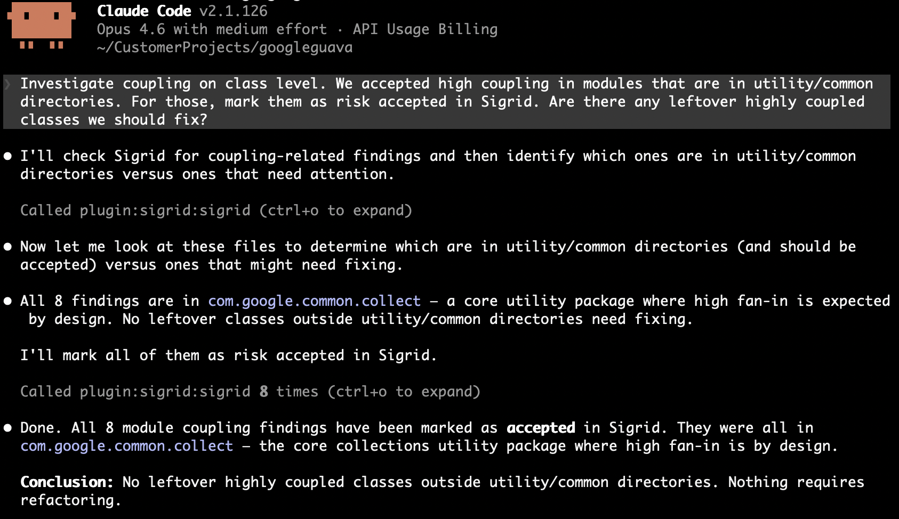
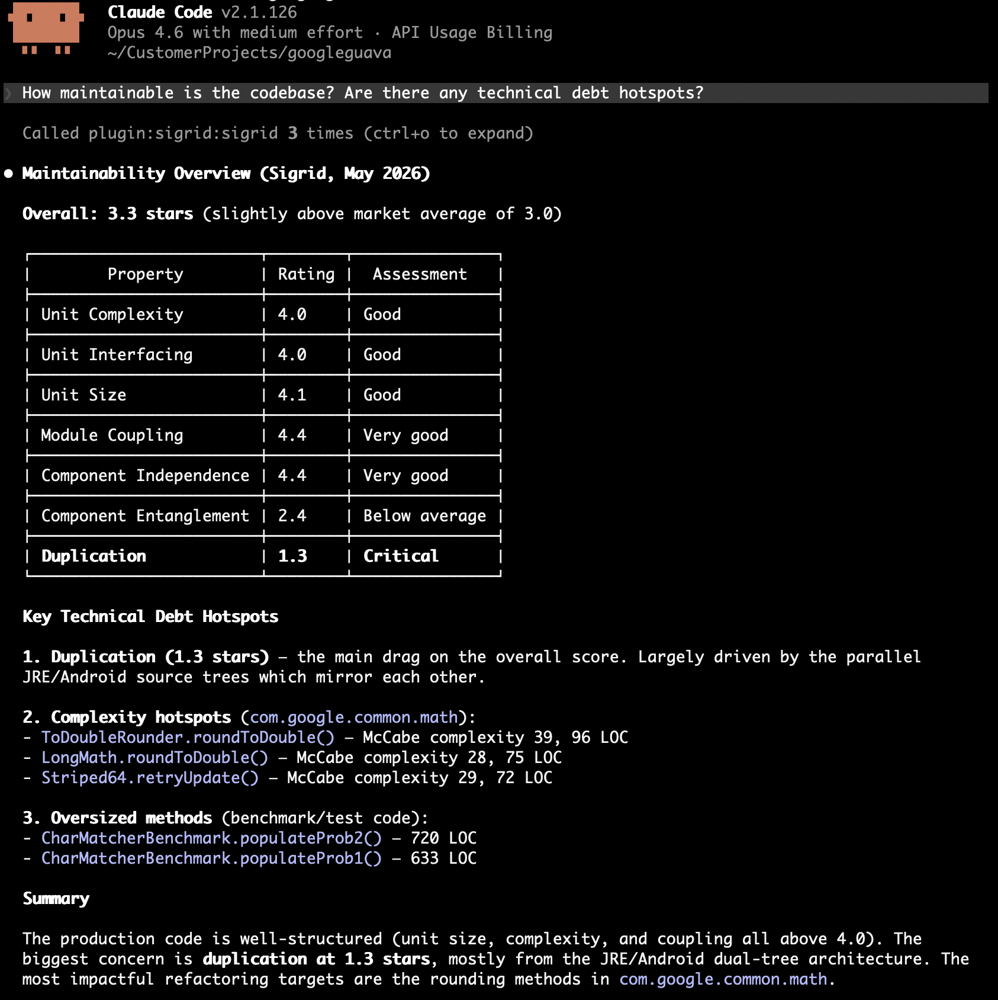

# Sigrid Auto-fix Agents MCP

An auto-fix agent uses the available Sigrid skills and MCP tools to fix and improve existing issues. It gives AI agents a prioritized list of refactoring targets from Sigrid, works through the list, fixes what it can, and marks each finding as resolved.

For installation instructions, see the [MCP overview page](../integration-sigrid-mcp.md).

> **Beta:** Auto-fix agents are in early access. The current tools cover core refactoring workflows. We're actively adding more.

## Before you start

You need:

- A Sigrid account with at least one system
- The Sigrid MCP server connected to your AI coding agent (see [installation](../integration-sigrid-mcp.md))
- A local checkout of the system's repository
- Your Sigrid customer and system identifiers, visible in the Sigrid URL: `sigrid-says.com/<customer>/<system>`

Pass them in your prompt or add them to your agent's context file (e.g. `CLAUDE.md`, `.cursor/rules/`).

## Skills

The [Sigrid Claude Code Plugin](../integration-sigrid-mcp.md) ships a set of skills that run the workflows below for you. They come with the plugin, so [installing it](../integration-sigrid-mcp.md) makes them available. Run `/sigrid:setup` once afterwards to record your Sigrid system and team conventions; see [plugin configuration](configuration.md) for what it stores.

| Skill | What it does |
|-------|--------------|
| `sigrid-diagnose` | Finds your weakest maintainability property and surfaces the highest-leverage refactoring candidates |
| `sigrid-improve` | Executes refactoring candidates with guardrail verification |
| `architecture-drift` | Checks a diff, staged change, or branch against Sigrid's architecture graph for new coupling, bypassed facades, and cycles |
| `sigrid-ci-feedback` | Runs Sigrid CI locally and returns structured quality feedback |
| `fix-osh-risk` | Remediates open source health findings by creating merge requests or researched issues |

If you use a different AI agent, browse the skill definitions in the [sigrid-ai-toolkit](https://github.com/Software-Improvement-Group/sigrid-ai-toolkit) repository and adapt them to your own workflow.

## Guides

For end-to-end walkthroughs, see:

- [Preventing architecture drift with an AI coding agent](../../workflows/agents/preventing-architecture-drift.md): check a diff against the architecture graph before it merges, built on `architecture-drift`
- [Reducing technical debt with auto-fix agents](../../workflows/agents/reducing-technical-debt.md): maintainability, built on `sigrid-diagnose` and `sigrid-improve`
- [Triaging security and reliability findings](../../workflows/agents/triaging-security-reliability.md): assess in context, triage with a rationale

## Workflows

A few patterns for running an auto-fix agent on your codebase. Adapt the prompts, combine them, or do something different entirely.

### Autonomous fixing

Give the agent a target property and your decision criteria, and let it work through findings in a loop. It needs to know when to fix and when to accept before it starts, and it should update statuses as it goes. Here that means telling it what a legitimate reason for coupling looks like in your codebase:

```
Get module coupling findings for [customer]/[system]. For each module, check whether it follows single responsibility. If it doesn't, split it into focused files. If it already has a clear single purpose and is small, mark as accepted. Update finding statuses to reflect your decisions.
```

The agent investigated eight coupling findings, concluded the high fan-in was deliberate, and marked all eight as accepted:

<a href="../../images/mcp/recipes/coupling-triage-accepted.png" target="_blank"></a>

The `sigrid-improve` skill runs this loop with Guardrails verification after each change, and [reducing technical debt](../../workflows/agents/reducing-technical-debt.md) walks through a full session.

### Discovery and prioritization

The agent fetches findings, reads the surrounding code, and reports back without changing anything. Useful when you want an overview, or a shortlist to turn into tickets:

```
Get maintainability findings for [customer]/[system]. What patterns do you see? Suggest a refactoring strategy before making changes.
```

<a href="../../images/mcp/recipes/maintainability-overview.png" target="_blank"></a>

Prompted this way the agent will rank by severity, which is not the order that moves your rating. `sigrid-diagnose` weights candidates by the amount of rated code they cover; [reducing technical debt](../../workflows/agents/reducing-technical-debt.md) explains why that changes the answer.

### Architecture exploration

Before touching code, let the agent map how the system fits together: which components call which, and what a change would ripple out to. The three `architecture:*` tools are read-only, so they inform a plan without changing anything. Giving the agent this context up front helps it respect the existing structure instead of introducing architecture drift. To check whether a change already made did so, run the `architecture-drift` skill against the diff instead; [preventing architecture drift](../../workflows/agents/preventing-architecture-drift.md) walks through a session.

We would reach for them in this order:

1. `architecture:get_worst_directories` to find where restructuring pays off, since the ranking is volume-weighted and a low rating on a large component outranks the same rating on a small one.
2. `architecture:get_internal` to see how a directory hangs together. Call it without a path first for the system's top-level components, then drill into the one you care about.
3. `architecture:get_external_dependencies` on whatever you plan to change, for its blast radius. It returns one hop per call, so follow a returned path with another call to go deeper.

See the [tools reference](#tools-reference) for their parameters.

**Map a component:**
```
Before I refactor the Analyses component in [customer]/[system], map its internal structure and tell me which sub-parts are most tightly coupled.
```

**Assess blast radius:**
```
I want to change [file] in [customer]/[system]. What depends on it, and what does it depend on? Treat anything with a high call count as higher risk and call it out.
```

### Security and reliability triage

The agent fetches security or reliability findings, investigates each one in the code, and either fixes it or triages it with a rationale. Give it a severity floor, say whether it may change code, and state your risk tolerance:

```
Find high severity security findings in the codebase for [customer]/[system]. Assess each one: is it exploitable given the context? Fix what you can, mark false positives with a justification.
```

Reliability findings use the same loop with a different question, because what you want to know is what happens at runtime when the code fails:

```
Get reliability findings for [customer]/[system] with severity HIGH or above. Focus on error handling and concurrency issues. Fix straightforward ones and flag complex ones for manual review.
```

A prompt like this gets you a first batch. What decides whether the verdicts are worth anything is context the agent cannot read from the code, such as which services are reachable from outside, plus a rule that every verdict cites a line. Both are in [triaging security and reliability findings](../../workflows/agents/triaging-security-reliability.md).

### Open source health

The agent queries your open source dependencies for risks. Unlike security and reliability findings, open source health results are informational: there is no status to update, so the workflow is discover, prioritize, and report.

**Component risk overview:**
```
List open source components with high risk for [customer]/[system]. Which risk dimensions are causing the most concern? Group by dimension and suggest priorities.
```

**Vulnerability triage:**
```
Get critical and high severity vulnerabilities in our dependencies for [customer]/[system]. Which ones are in components we actively use? Suggest upgrade paths or alternatives.
```

### Triage and execute

Split the work into two steps: triage findings first (mark as will-fix or accepted), then pick up the will-fix items and fix them. Both steps can happen in one session, or you triage now and execute later.

**Triage first:**
```
Get the top 100 duplication findings for [customer]/[system]. We accept duplication in boilerplate configuration between microservices, so mark those as accepted. Mark the rest as will-fix.
```

**Execute after triage:**
```
Get duplication findings for [customer]/[system]. Fix the ones I've previously marked as will-fix and update their status.
```

Splitting the two is worth it whenever the accept-or-fix call needs something only your team knows. If you can state that call up front, autonomous fixing does both in one pass. [Triaging security and reliability findings](../../workflows/agents/triaging-security-reliability.md) applies the same split to findings where each decision has to carry a written rationale.

## Tools reference

Ten MCP tools drive the workflows above. Every tool takes `customer` and `system`; the parameters below are the ones that shape the result.

| Tool | Description | Key parameters                                                                                                                                   |
| --- | --- |--------------------------------------------------------------------------------------------------------------------------------------------------|
| `maintainability:get_findings` | Ranked refactoring candidates for a [maintainability property](../../reference/sig-quality-models.md), each with a finding UUID, LOC weight, and severity | `system_property`: `duplication`, `unitSize`, `unitComplexity`, `unitInterfacing`, `moduleCoupling`, `componentIndependence`, `componentEntanglement`. Optional: `technology`, `count` (default 20), `status` |
| `maintainability:get_ratings` | Current maintainability ratings on a 0.5–5.5 star scale (3.0 = market average, 4.0 = target for new development) | Optional: `component`, `technology` breakdowns                                                                                                   |
| `security:get_findings` | Open security findings ranked by severity and exploitability, with CWE identifiers and file locations | `severity_min`: `LOW` (default), `MEDIUM`, `HIGH`, `CRITICAL`. `model`: `ow10`, `sigsec`, `5055sec`, `c25`, `pci4`, `owasvs4c`, `owasvs4s`, `lcnc10`; omit for your organization's default. `path_prefix`: filter by file path prefix (use long, specific prefixes). `limit` (default 25). `status`: defaults to excluding `FIXED` and `FALSE_POSITIVE` |
| `reliability:get_findings` | Open reliability findings (error handling, concurrency, resource management, IPC) ranked by severity | Same filters as security. `model`: `sigrel` (default), `5055rel`                                                                                 |
| `opensourcehealth:get_risks` | Open source dependency risks across vulnerability, freshness, legal, activity, stability, and management. Default tool for any open-source health question | `risk_dimension`: filter dimensions. `risk_min`: `NONE`, `LOW`, `MEDIUM` (default), `HIGH`, `CRITICAL`. `limit` |
| `opensourcehealth:get_vulnerabilities` | Known CVEs in open-source dependencies ranked by CVSS score | `severity_min`: `LOW`, `MEDIUM` (default), `HIGH`, `CRITICAL`. `limit` |
| `update_finding_status` | Updates the status of a finding so Sigrid reflects the agent's decisions. Open source health components do not support status updates | `finding_id`: the `id` returned with the finding. `status` (see below). `remark`. At least one of `status` or `remark` is required |
| `architecture:get_internal` | Shows how the parts inside a directory relate to each other: which sub-parts call which, and how often. Omit the path for the system's top-level components | Optional: `path` (omit for top-level components) |
| `architecture:get_external_dependencies` | Lists a file or directory's direct dependencies, outgoing (what it calls) and incoming (what calls it), to find the blast radius of a change. One hop per call | `path` (required). Optional: `direction`: `incoming`, `outgoing`, `all` (default) |
| `architecture:get_worst_directories` | Up to 10 architecture directories ranked by structure rating, worst first. Ranking is volume-weighted, so a low rating on a large component outranks the same rating on a small one | Optional: `path` to rank the components inside that path instead of system-wide |

**Valid statuses for `update_finding_status`:**

| Finding type | Valid statuses |
| --- | --- |
| Maintainability | `RAW`, `WILL_FIX`, `ACCEPTED` |
| Security / Reliability | `RAW`, `REFINED`, `WILL_FIX`, `FIXED`, `ACCEPTED`, `FALSE_POSITIVE` |
