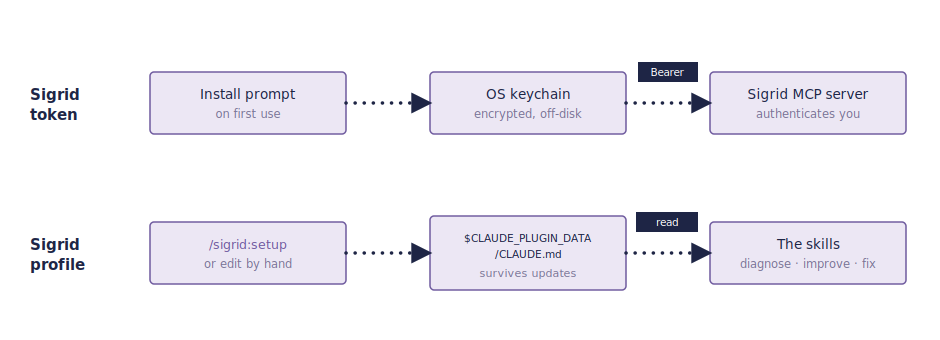

# Configuring the Sigrid Claude Code Plugin

The [Sigrid Claude Code Plugin](https://github.com/Software-Improvement-Group/sigrid-ai-toolkit) ships the [Guardrails](guardrails.md) and [Auto-fix Agents](autofix-agents.md) MCP together with a set of skills. It reads two kinds of configuration: a **token** that authenticates you to Sigrid, and a **profile** that tells the skills which Sigrid systems you work with and how your team works. The two are set up separately and stored in different places.

| Configuration | What it holds | Stored in | Survives updates |
| --- | --- | --- | --- |
| **Token** | Your Sigrid API token | Operating system keychain | Yes |
| **Profile** | Your systems and team conventions | `$CLAUDE_PLUGIN_DATA/CLAUDE.md` | Yes |



If you expect a tool to ship a `config.yaml` with a fixed schema, the profile will look unfamiliar. It is a Markdown file, not a validated config format, because the skills are driven by a language model that reads the file as context instead of parsing it. There is a structure the skills look for (the sections described below), but nothing enforces it, and you normally generate the file with `/sigrid:setup` rather than writing it by hand. The token stays out of this file. Claude Code handles it as a secret and keeps it in the keychain.

Your token never goes in the profile, and the profile never contains a secret. You can safely read, edit, and share the profile.
{: .attention }

## The Sigrid token

The plugin connects to the Sigrid MCP server, and that connection is authenticated with your Sigrid API token. When you install the plugin, Claude Code prompts you for the token once and stores it in your operating system's keychain. It is never written to a file in your repository or to the profile.

To get a token, see [authentication tokens](../../organization-integration/authentication-tokens.md). To change it or enter it later, run `/plugin`, open **Installed → sigrid → Configure options**, type the token, and run `/reload-plugins`. Use the same steps if the installer never prompted you for one.

## The Sigrid profile

The profile gives the skills the context they need to answer for your situation instead of in general terms: which Sigrid system a repository belongs to, which branch Sigrid analyses, and how your team handles branches, reviews, and change requests. Skills such as `sigrid-diagnose`, `sigrid-improve`, and `fix-osh-risk` read it at the start of a run.

### Where it lives

The profile is a `CLAUDE.md` file in the plugin's persistent data directory, which Claude Code exposes as `$CLAUDE_PLUGIN_DATA`:

```
$CLAUDE_PLUGIN_DATA/CLAUDE.md
```

For this plugin that path resolves to:

```
~/.claude/plugins/data/sigrid-sigrid-ai-toolkit/CLAUDE.md
```

This directory sits outside the versioned plugin cache that Claude Code replaces whenever the plugin updates, so your profile survives `/plugin update`. The plugin also ships a `CLAUDE.md` at its own root, but that copy is only a template and is overwritten on every update. Do not put your settings there.

### Creating and editing it

Run `/sigrid:setup`. It asks about your systems and conventions and writes the file for you. Run it again whenever you add a system or change a convention. You can also open the file and edit it directly, since it is ordinary Markdown.

You do not have to fill in everything up front. When a skill needs a value the profile does not have, it asks you in an interactive session, or stops when it is running autonomously. Once you answer, it writes the value back to the profile, so the next run finds it and does not ask again.
