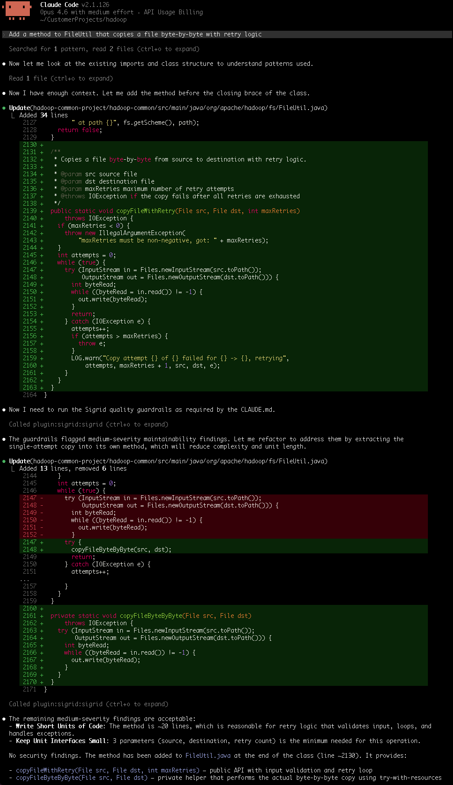

# Sigrid Guardrails MCP

Guardrails gives your AI coding assistant access to Sigrid's code analysis during generation. The agent checks its own output as it works — security vulnerabilities and quality issues get caught before they land in a commit.

For installation instructions, see the [MCP overview page](../integration-sigrid-mcp.md).

## Supported technologies

Currently supported:

- Java
- Python
- C/C++
- C#
- JavaScript
- TypeScript
- Kotlin
- Progress ABL
- PHP

Visit the [Technology Support](../../reference/technology-support.md#list-of-supported-technologies) page for more details on supported technologies.

## Using Sigrid Quality Gates with AI Coding Agents

AI-generated code quality varies significantly based on the instructions given. The Sigrid MCP provides guardrails that notify agents when code doesn't meet quality standards without requiring the system to be published to Sigrid first.

The prompt below combines two elements: brief **code principles** that guide the agent upfront, and a mandatory **quality gate** using Sigrid before completing any task.

### Recommended prompt

Add this to your agent instructions (see [where to place these instructions](#where-to-place-these-instructions)):

```
## Code Principles

Write maintainable, self-documenting code: single responsibility, small focused
functions, clear naming, avoid duplication, simple control flow.

## MANDATORY: Quality Gate

Before reporting ANY task as complete:

1. Run the Sigrid guardrails:quality_check MCP tool on all files you changed
2. Maintainability findings: fix every finding in files you touched, new or
   pre-existing, judged against the principles above. Leave one only if the code
   already honors the principles, or the fix cascades outside task scope
   (don't get stuck). Say which, and why.
3. Security findings: fix if contained, otherwise flag to user

Only skip if the tool is unavailable and say so if you do.
```

> The quality gate applies the [Boy Scout Rule](https://www.oreilly.com/library/view/97-things-every/9780596809515/ch08.html) — leaving each file touched cleaner than it was found.

**Adapting the code principles**: if your codebase follows specific design patterns (e.g., hexagonal architecture, Redux patterns), add them to the Code Principles section. When the agent makes recurring mistakes, add a principle that addresses the pattern.

### Where to place these instructions

Most AI coding agents respect instruction files in your repository. Refer to your agent's documentation for specifics.

| File | Supported by |
|------|--------------|
| `.cursor/rules/` | Cursor |
| `.github/copilot-instructions.md` | GitHub Copilot |
| `global_rules.md` | Devin Desktop |
| `CLAUDE.md` | Claude Code |
| `AGENTS.md` | OpenCode, emerging convention (check agent support) |

For tools that support both global and project-level rules, prefer project-level to keep instructions versioned with your code.

### Other adjustments

- **Check frequency**: You may prefer to run the quality gate only before commits rather than after every task.
- **Direct invocation**: You can also ask the agent directly: "Run Sigrid on these files: ..."

Pair the MCP with Sigrid CI to also catch architecture issues, vulnerable dependencies, and cross-file metrics.

## Example in action

The following screenshot shows Claude Code implementing a new method, then running the Sigrid quality guardrails automatically. The guardrails flag maintainability issues, and the agent refactors in response — extracting a helper method to reduce complexity and unit length:

<a href="../../images/mcp/guardrails/guardrails-refactoring-loop.png" target="_blank"></a>
