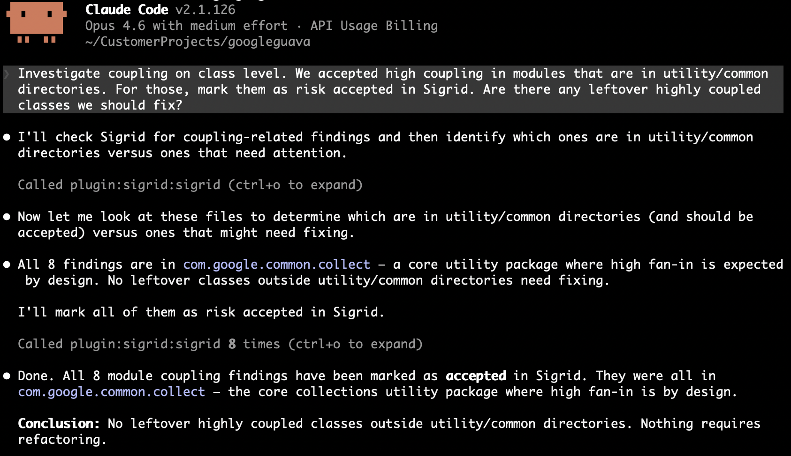
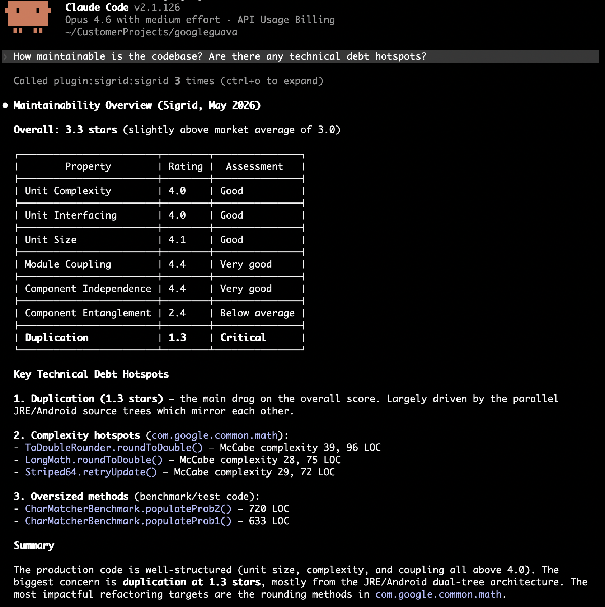
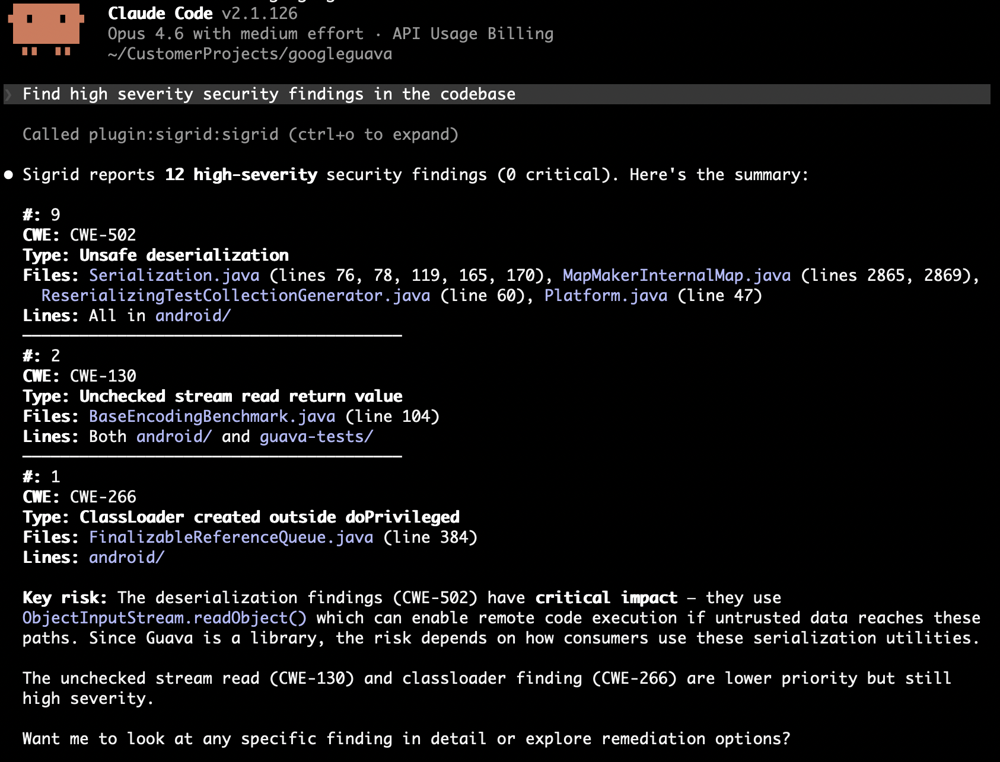

# Sigrid Modernization Recipes MCP

Modernization Recipes gives AI agents a prioritized list of refactoring targets from Sigrid. The agent works through the list, fixes what it can, and marks each finding as resolved.

For installation instructions, see the [MCP overview page](../integration-sigrid-mcp.md).

## Before you start

You need:

- A Sigrid account with at least one system that has maintainability results
- The Sigrid MCP server connected to your AI coding agent (see [installation](../integration-sigrid-mcp.md))
- A local checkout of the system's repository
- Your Sigrid customer and system identifiers — these are visible in the Sigrid URL: `sigrid-says.com/<customer>/<system>`

Pass them in your prompt or add them to your agent's context file (e.g. `CLAUDE.md`, `.cursor/rules/`).

## Workflows

A few patterns for using Recipes with your AI agent. Adapt the prompts to your codebase, combine them, or do something different entirely.

### Autonomous fixing

Give the agent a target property and your decision criteria, and let it work through findings in a loop. Works best when you can spell out what "good" looks like before it starts.

What to include in your prompt:
- Which maintainability property and technology to target
- Your coding principles and framework conventions (e.g. "methods should have a single responsibility", "we use the repository pattern for data access")
- When to fix vs. when to accept (e.g. "if the module is small and follows single responsibility, mark as accepted")
- That it should update finding statuses as it goes

**Example — direct fix:**
```
Get unit size findings for [customer]/[system] in Java. Refactor the longest methods. Update each finding status when done.
```

**Example — architectural refactoring:**
```
Get module coupling findings for [customer]/[system]. For each module, check whether it follows single responsibility. If it doesn't, split it into focused files. If it already has a clear single purpose and is small, mark as accepted. Update finding statuses to reflect your decisions.
```



### Discovery and prioritization

The agent fetches findings, reads the surrounding code, and reports back without changing anything. Useful when you want an overview or a shortlist for ticket creation.

What to include in your prompt:
- Which property to analyze
- What you're looking for (worst offenders, clusters of related issues, recurring patterns)
- How to present the results (ranked list, grouped by module, suggested next steps)

**Example — maintainability overview:**
```
How maintainable is the codebase? Are there any technical debt hotspots?
```

**Example — refactoring strategy:**
```
Get maintainability findings for [customer]/[system]. What patterns do you see? Suggest a refactoring strategy before making changes.
```



### Security and reliability triage

The agent fetches security or reliability findings, investigates each one in the code, and either fixes it or triages it with a rationale.

What to include in your prompt:
- Minimum severity level to focus on
- Your risk tolerance (e.g. "fix all HIGH and CRITICAL, triage MEDIUM on a case-by-case basis")
- Whether to fix in place or just triage and report

**Example — security findings:**
```
Find high severity security findings in the codebase for [customer]/[system]. Assess each one: is it exploitable given the context? Fix what you can, mark false positives with a justification.
```

**Example — reliability risks:**
```
Get reliability findings for [customer]/[system] with severity HIGH or above. Focus on error handling and concurrency issues. Fix straightforward ones and flag complex ones for manual review.
```



### Triage and execute

Split the work into two steps: triage findings first (mark as will-fix or accepted), then pick up the will-fix items and fix them. Both steps can happen in one session, or you triage now and execute later.

**Example — triage:**
```
Get the top 100 duplication findings for [customer]/[system]. We accept duplication in boilerplate configuration between microservices — mark those as accepted. Mark the rest as will-fix.
```

**Example — execute after triage:**
```
Get duplication findings for [customer]/[system]. Fix the ones I've previously marked as will-fix and update their status.
```

Note: the `refactoring_candidates` tool returns all findings regardless of status. The agent filters by status after retrieving results.

These compose: run discovery first, triage the results, then execute on the will-fix items. Or skip to autonomous fixing if you trust the criteria.

> **Beta:** Modernization Recipes is in early access. The current tools cover the core refactoring workflow. We're actively adding more.

## Tools reference

Five MCP tools drive the workflows above.

**`refactoring_candidates`** retrieves a ranked list of refactoring candidates from Sigrid for a given [maintainability property](../../reference/sig-quality-models.md). Available properties: `duplication`, `unitSize`, `unitComplexity`, `unitInterfacing`, `moduleCoupling`, `componentIndependence`, `componentEntanglement`. You can filter by technology and limit the number of results.

**`maintainability_ratings`** returns the current maintainability ratings for a system on a 0.5–5.5 star scale (3.0 = market average, 4.0 = target for new development). Optionally returns per-component or per-technology breakdowns.

**`list_security_findings`** returns open security findings for a system, ranked by severity and exploitability. Findings include CWE identifiers and affected file locations. You can filter by minimum severity (LOW, MEDIUM, HIGH, CRITICAL) and triage status. An optional `model` parameter selects the security model — valid values include `ow10` (OWASP Top-10, default), `sigsec`, `5055sec`, `c25`, `pci4`, `owasvs4c`, `owasvs4s`, `lcnc10`.

**`list_reliability_findings`** returns open reliability findings for a system, ranked by severity and exploitability. Covers issues like error handling, concurrency, resource management, and inter-process communication risks. Same filtering options as security findings. An optional `model` parameter selects the reliability model — valid values: `sigrel` (SIG Code Reliability Top-10, default), `5055rel`.

**`edit_finding_status`** updates the status of a finding. Use it to mark findings as planned for fixing, accepted as-is, or resolved, so Sigrid reflects the decisions the agent made. Valid statuses depend on finding type:

- Maintainability findings: `RAW`, `WILL_FIX`, `ACCEPTED`
- Security/reliability findings: `RAW`, `REFINED`, `WILL_FIX`, `FIXED`, `ACCEPTED`, `FALSE_POSITIVE`

You can also attach a remark explaining the rationale.
