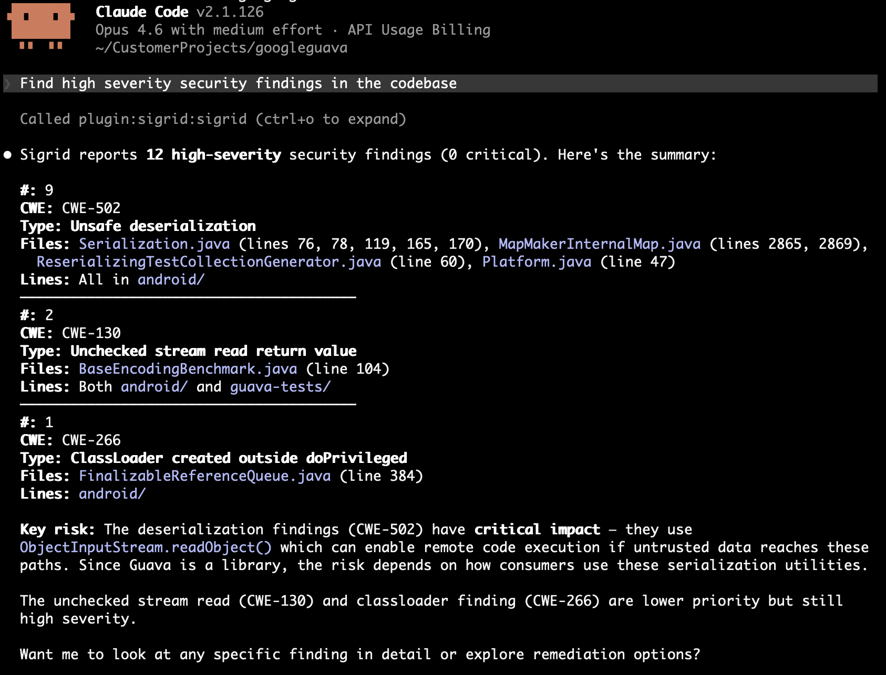

# Triaging security and reliability findings with auto-fix agents

An [auto-fix agent](autofix-agents.md) can work through a backlog of security and reliability findings: it fetches the findings, reads the code around each one, and records a decision with a rationale.

This guide covers triage and reporting. It stops short of letting the agent fix things autonomously, which is the main way it differs from [reducing technical debt](reducing-technical-debt.md).

Everything here applies to any agentic CLI. The worked configuration uses Claude Code, since that is the only CLI we ship a plugin for.

## When you'd do this, and who's at the keyboard

A developer or a security champion who owns the finding list and has to get through it. You are at the keyboard for the whole run. The agent's output is a set of assessments you accept, reject, or escalate, and you make every call it records.

Use it when:

- You have a finding backlog large enough that the reason it is untouched is volume rather than difficulty.
- You want each finding assessed in context, considering whether the input is actually reachable and whether something upstream already validated it, instead of by severity label alone.
- You need the reasoning written down: for an audit, for the next person, or so nobody re-triages the same finding in six months.

Do not point this at a fresh critical vulnerability. A single urgent finding does not need a triage loop. It needs you, now.

The default is to change nothing. Ask for triage first, and pick up fixes as separate, deliberate work.

## Why the agent needs help here

A security finding is a hypothesis: this code pattern may be exploitable. Confirming or dismissing it takes context that is not at the finding's location, such as where the data comes from, what validated it earlier, and whether the endpoint is reachable from outside. That work gets skipped when a list is long, and an agent is good at it, because tracing a value back through call sites is mechanical.

Two things go wrong if you leave the agent to it.

- **It has no reachability model of your system.** It cannot know that a service is internal-only, that a gateway strips a header, or that a queue is only ever fed by another service you own. Handed a finding it cannot resolve, it guesses, and it guesses in whichever direction your prompt leaned. Prompt for false positives and you will get false positives.
- **Security code is where confident-and-wrong is most expensive.** An agent that rewrites an authorization check, an escaping routine, or a crypto call and reports success has produced a change that looks correct, passes the tests, and may be a vulnerability. A maintainability refactor that goes wrong shows up as a failing test. This does not.

So Sigrid supplies the finding list, ranked, with locations, CWE identifiers, and severity. The agent supplies the tracing work. You supply the reachability facts and the verdict. That division is what makes the loop trustworthy, and it is why triage and fixing stay separate.

## Setup

The four primitives again:



### 1. Tool access

```
/plugin marketplace add Software-Improvement-Group/sigrid-ai-toolkit
/plugin install sigrid@sigrid-ai-toolkit
/sigrid:setup
```

On another CLI, configure the MCP server with the [installation instructions](../integration-sigrid-mcp.md#manual-configuration-other-ides) and put your customer and system in your context file. This guide uses the `security:get_findings`, `reliability:get_findings`, and `update_finding_status` tools.

Which security model you triage against matters, because it changes the finding list. `security:get_findings` uses your organisation's default model, which is OWASP Top 10 unless you changed it. Pass `model` for `sigsec`, `pci4`, `c25`, or one of the ASVS variants. Reliability defaults to the SIG Code Reliability Top 10 (`sigrel`). The [tools reference](autofix-agents.md#tools-reference) has the full list.

Each finding comes back with its file and line, a severity, an impact and exploitability score, a CWE identifier, the model categories it falls under, its current triage status, and a UUID. The agent needs that UUID to record a decision later, so keep the findings and the decisions in the same session.

### 2. Write down your reachability facts

This step decides whether the run is worth anything. Everything the agent cannot derive from the code goes in your context file, once:

```
## Security context

- `internal-api/` is not reachable from the internet. The gateway terminates TLS
  and strips client-supplied headers.
- All external input arrives through `api/controllers/` and is validated by
  `RequestValidator` before reaching a service.
- `tools/` and `scripts/` are developer tooling, not deployed. Injection findings
  there are low priority, not false positives.
- We treat any finding in code that handles authentication or authorization as
  HIGH regardless of the reported severity.
```

Without this, the agent re-derives your architecture from scratch every session, badly. With it, you get assessments that reason about your deployment instead of about the abstract pattern.

### 3. Set the triage rules

Name the statuses and require a rationale for each one:

```
## Security triage rules

- Assess only. Do not change code unless I ask in that session.
- Every status change needs a remark saying why, with the file and line that
  justifies it.
- FALSE_POSITIVE only when you can point to the code that makes it unreachable
  or already-mitigated. If the reasoning depends on an assumption about
  deployment, it is not a false positive. Flag it for me.
- ACCEPTED for real-but-tolerated risk, with the reason recorded.
- WILL_FIX for anything real that should be fixed. Do not fix it now.
- When you are unsure, say unsure. An unsure finding stays RAW.
```

The last two lines carry most of the value. An agent that has to justify a false positive with a code reference cannot dismiss a finding by rewording it, and an agent that is allowed to say "unsure" stops manufacturing confidence.

Valid statuses for security and reliability findings are `RAW`, `REFINED`, `WILL_FIX`, `FIXED`, `ACCEPTED`, and `FALSE_POSITIVE`. See the [status reference](autofix-agents.md#tools-reference).

## The session, walked through

Start narrow: one severity, one area, enough findings to calibrate on and few enough to check by hand.

```
Get HIGH and CRITICAL security findings for acme/payment-platform under
api/controllers/. For each one: trace where the input comes from and what
validates it, then tell me whether it is exploitable given our security
context. Don't update anything yet. Show me your assessment first.
```

What comes back, per finding:

1. **The finding**, with CWE, location, and reported severity.
2. **The trace.** Where the value enters the system, what touched it on the way, and whether anything validated it. This is the part you read.
3. **A verdict with a reason:** exploitable, mitigated, or unsure, pointing at the code that decides it.

<a href="../../images/mcp/recipes/security-findings-triage.png" target="_blank"></a>

Check that batch yourself, finding by finding. You are testing whether the traces are real and whether the verdicts follow from them. When they do, let it record:

```
Update the statuses for the findings we agreed on, with the rationale as the
remark. Leave the two you were unsure about as RAW.
```

Then widen a batch at a time, by severity, by path, or by model.

Reliability findings use the same loop with a different question. Instead of asking whether an attacker can reach the code, you ask what happens when it fails: swallowed exceptions, resources that leak on the error path, races under concurrency.

```
Get reliability findings for acme/payment-platform with severity HIGH or above.
Focus on error handling and resource management. For each one, tell me what
happens at runtime when the failure occurs, and whether we notice.
```

"Whether we notice" is the useful part. A caught-and-ignored exception in a nightly batch job that reports nothing is worse than its severity suggests.

### If you do want fixes

Two rules: fix in a separate session from triage, and take the `WILL_FIX` list one finding at a time.

```
Fix the finding at PaymentController.java:142 that we marked WILL_FIX.
Show me the diff and explain why the fix closes the vulnerability. Do not
touch anything else.
```

Then review it as a security change. Does the fix address the mechanism, or only the symptom the scanner matched on? Do not batch these, and do not let a security fix ride along in a feature branch. The [triage and execute](autofix-agents.md#triage-and-execute) pattern generalises this split.

## What good looks like, and how you verify it in the session

**Every verdict cites code.** "Not exploitable, input is validated" is not an assessment. "Not exploitable, because `RequestValidator.validateAmount` rejects non-numeric input at `RequestValidator.java:88`, before this line runs" is. Anything that cannot point at a line is unsure, whatever it is labelled.

**The false-positive rate is plausible.** If the agent dismissed most of a HIGH-severity batch, something is wrong: either your prompt leaned that way, or it is reasoning from an assumption it has not stated. Spot-check three of them properly. This is the most common failure of the whole loop.

**Unsure findings exist.** A run that resolved every finding confidently is a run that guessed somewhere. Ask directly:

```
Which of these did you have to make an assumption about, and what was it?
```

**The remarks will make sense in six months.** The remark is the artefact. If it says "reviewed, not an issue", the next person redoes the work.

**Statuses match what you agreed.** Check the recorded statuses against your decisions, not against the agent's summary of them.

## When it goes wrong, and the recovery move

| What you see | What is happening | What to do |
|---|---|---|
| Everything is a false positive | The prompt leaned that way, or the burden of proof is missing | Re-run the batch with the code-reference requirement. Manually check three dismissals, and reset those findings to `RAW` if they do not hold |
| Verdicts with no code reference | It is reasoning from the pattern, not from your codebase | Reject them. Require file and line per verdict |
| It contradicts your security context | Reachability facts are missing from the context file, or are ambiguous | Put them in the file, in specific terms. "Internal" means nothing. "Not reachable from the internet, gateway strips client headers" does |
| It fixed code you asked it to triage | The assess-only rule is missing or too soft | Revert. Put "Assess only. Do not change code" in the context file, not only in the prompt |
| A fix looks right but you cannot tell | Security fixes are where this is most dangerous | Do not merge on the agent's confidence. Ask it to explain the exploit the fix prevents, and get a second pair of human eyes |
| Findings you already triaged reappear | Statuses were not updated, or a new analysis has run | Check that the statuses landed. Recorded decisions persist, session decisions do not |
| Findings for code that no longer exists | Sigrid analysed an older branch | Check which branch is analysed in [configuration](configuration.md) |
| No findings at all | The model filter, path prefix, or severity floor is too narrow | Lower `severity_min`, drop `path_prefix`, and confirm the [model](autofix-agents.md#tools-reference) you are querying. Findings you already marked `FIXED` or `FALSE_POSITIVE` are excluded by default |

## Habits worth keeping

- **Triage and fix in separate sessions.** Mixing them is how an unreviewed security change reaches a branch.
- **Demand a code reference for every dismissal.** This one rule prevents most bad triage.
- **Work in small batches.** Ten findings you actually read beat a hundred you skimmed.
- **Keep reachability facts in the context file.** They are the same every session, and re-deriving them is where the agent goes wrong.
- **Let the agent be unsure.** An honest `RAW` costs one more look, and a confident false positive can cost you an incident.
- **Prevent while you triage.** [Guardrails](building-with-guardrails.md) flags security issues in code as it is written, which keeps this backlog from refilling behind you.

## Next

- [Remediating open source risk](remediating-open-source-risk.md) for the dependency half of the same problem
- [Reducing technical debt with auto-fix agents](reducing-technical-debt.md) for maintainability, where autonomous fixing is safer
- [Auto-fix agents MCP reference](autofix-agents.md) for tools, models, and statuses
